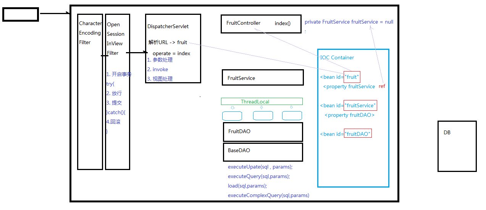

# filter


## demo01filter

```java
package com.Novice.filter;

import javax.servlet.*;
import javax.servlet.annotation.WebFilter;
import java.io.IOException; 

// @WebFilter("/demo01.do")

@WebFilter("*.do") //*.d前面不用加/
public class demo01filter implements Filter {
    @Override
    public void init(FilterConfig filterConfig) throws ServletException {

    }

    @Override
    public void doFilter(ServletRequest servletRequest, ServletResponse servletResponse, FilterChain filterChain) throws IOException, ServletException {
        System.out.println("hello1");
        filterChain.doFilter(servletRequest,servletResponse);//放行
        System.out.println("hello1");
    }

    @Override
    public void destroy() {

    }
}
```

## demo01Servlet

```java
package com.Novice.servlet;

import javax.servlet.ServletException;
import javax.servlet.annotation.WebServlet;
import javax.servlet.http.HttpServlet;
import javax.servlet.http.HttpServletRequest;
import javax.servlet.http.HttpServletResponse;
import java.io.IOException;

@WebServlet("/demo01.do")
public class demo01Servlet extends HttpServlet {

    @Override
    protected void service(HttpServletRequest req, HttpServletResponse resp) throws ServletException, IOException {
        System.out.println("demo01.Service......");
        req.getRequestDispatcher("succ.html").forward(req,resp);


    }
}
```

## web.xml

```html
<web-app xmlns="http://xmlns.jcp.org/xml/ns/javaee"
         xmlns:xsi="http://www.w3.org/2001/XMLSchema-instance"
         xsi:schemaLocation="http://xmlns.jcp.org/xml/ns/javaee http://xmlns.jcp.org/xml/ns/javaee/web-app_4_0.xsd"
         version="4.0">


<filter>
    <filter-name>Demo01filter</filter-name>
    <filter-class>com.Novice.filter.demo01filter</filter-class>
</filter>
<filter-mapping>
    <filter-name>Demo01filter</filter-name>
    <url-pattern>*.do</url-pattern>
</filter-mapping>


</web-app>
```


## CharacterEncodingFilter

```java

package com.Novice.myssm.filter;

import com.Novice.myssm.util.StringUtils;

import javax.servlet.*;
import javax.servlet.annotation.WebFilter;
import javax.servlet.annotation.WebInitParam;
import javax.servlet.http.HttpServletRequest;
import java.io.IOException;

@WebFilter(urlPatterns = {"*.do"},initParams = {@WebInitParam(name = "encoding",value ="utf8" )})

public class CharacterEncodingFilter implements Filter {


    private String encoding = "utf8";
    @Override
    public void init(FilterConfig filterConfig) throws ServletException {
        String encodingStr = filterConfig.getInitParameter("encoding");
        if(StringUtils.isNotEmpty(encodingStr)){
            encoding=encodingStr;
        }

    }

    @Override
    public void doFilter(ServletRequest servletRequest, ServletResponse servletResponse, FilterChain filterChain) throws IOException, ServletException {
        ((HttpServletRequest)servletRequest).setCharacterEncoding(encoding);
        
         filterChain.doFilter(servletRequest,servletResponse);//放行
    }

    @Override
    public void destroy() {

    }
}

```

# 事务管理前置知识


# OpenSessionInViewFilter-事务管理的实现

## OpenSessionInViewFilter

```java 
@WebFilter("*do")
public class OpenSessionInViewFilter implements Filter {
    @Override
    public void init(FilterConfig filterConfig) throws ServletException {

    }

    @Override
    public void doFilter(ServletRequest servletRequest, ServletResponse servletResponse, FilterChain filterChain) throws IOException, ServletException {
        try {
            TransactionManager.beginTrans();

            filterChain.doFilter(servletRequest,servletResponse);

            TransactionManager.commit();
        } catch (SQLException e) {
            try {
                TransactionManager.rollback();
            } catch (SQLException ex) {
                throw new RuntimeException(ex);
            }
        }
    }

    @Override
    public void destroy() {

    }
}
```


## TransactionManager

事务管理

```java
package com.Novice.myssm.trans;

import com.Novice.myssm.basedao.ConnUtils;

import java.sql.SQLException;

public class TransactionManager {

    public static void beginTrans() throws SQLException {
        ConnUtils.getConn().setAutoCommit(false);

    }

    public static void commit() throws SQLException {
        ConnUtils.getConn().commit();
        ConnUtils.closeConn();


    }

    public static void rollback() throws SQLException {
        ConnUtils.getConn().rollback();
        ConnUtils.closeConn();

    }


}

```

## ConnUtils

```java
package com.Novice.myssm.basedao;

import java.sql.Connection;
import java.sql.DriverManager;
import java.sql.SQLException;

public class ConnUtils {
    public static ThreadLocal<Connection> threadLocal = new ThreadLocal<>();

    public static String DRIVER = "com.mysql.jdbc.Driver" ;
    public static String URL = "jdbc:mysql://localhost:3306/fruitdb?useUnicode=true&characterEncoding=utf-8&useSSL=false";
    public static String USER = "root";
    public static String PWD = "abcd" ;

    public static Connection createConn(){
        try {
            //1.加载驱动
            Class.forName(DRIVER);
            //2.通过驱动管理器获取连接对象
            return DriverManager.getConnection(URL, USER, PWD);
        } catch (ClassNotFoundException | SQLException e) {
            e.printStackTrace();
        }
        return null ;

    }

    public static Connection getConn(){
        Connection connection = threadLocal.get();
        //这里的thiread local 应该是在调用的时候就已经确定了，所以在传入get时。可以直接使用this
        if (connection==null){
            connection = createConn();
            threadLocal.set(connection);
        }
        return threadLocal.get();
    }

    public static void closeConn() throws SQLException {
        Connection connection = threadLocal.get();
        if (connection==null){
            return;
        } else if (!connection.isClosed()) {
            connection.close();
            threadLocal.set(null);
        }


    }


}

```


## 

##dispatcherServlet

```java 
@WebServlet("*.do") // 此处使用了通配符，表明只要是以.do结尾就可以，拦截所有以.do结尾的请求
public class dispatcherServlet extends ViewBaseServlet {
    // 因为需要接收并处controller返回的字符串，有些情况需要调用ViewBaseServlet的方法，所以此处继承了ViewBaseServlet类

    HashMap<String, Object> beanMap = new HashMap<>(); // 保证存储在beanMap中的元素对，id对应的是实例对象

    public dispatcherServlet() { // 构造器里面不能用this，还没有实例化  因为先实例化再初始化

    }


    @Override
    // public void init(ServletConfig servletConfig){
    public void init() throws ServletException {

        super.init();

        try {

            InputStream inputStream = getClass().getClassLoader().getResourceAsStream("applicationContext.xml");
            // 1.创建DocumentBuilderFactory
            DocumentBuilderFactory documentBuilderFactory = DocumentBuilderFactory.newInstance();
            // 2.创建DocumentBuilder对象
            DocumentBuilder documentBuilder = documentBuilderFactory.newDocumentBuilder();
            // 3.创建Document对象
            Document document = documentBuilder.parse(inputStream);
            // 4.获取所有的bean节点
            NodeList beanNodeList = document.getElementsByTagName("bean");


            for (int i = 0; i < beanNodeList.getLength(); i++) {

                Node beanNode = beanNodeList.item(i); // 节点类型等于元素节点

                if (beanNode.getNodeType() == Node.ELEMENT_NODE) {
                    Element beanElement = (Element) beanNode;
                    String id = beanElement.getAttribute("id");
                    String className = beanElement.getAttribute("class");

                    Class controllerBeanClass = Class.forName(className);
                    Object beanObj = controllerBeanClass.newInstance();

                    beanMap.put(id, beanObj);


                }
            }

        } catch (ParserConfigurationException e) {
            throw new RuntimeException(e);
        } catch (IOException e) {
            throw new RuntimeException(e);
        } catch (SAXException e) {
            throw new RuntimeException(e);
        } catch (ClassNotFoundException e) {
            throw new RuntimeException(e);
        } catch (InstantiationException e) {
            throw new RuntimeException(e);
        } catch (IllegalAccessException e) {
            throw new RuntimeException(e);
        }

    }


    @Override
    protected void service(HttpServletRequest request, HttpServletResponse response) throws ServletException, IOException {
        // 设置编码
        request.setCharacterEncoding("UTF-8");
        // 假设url是：  http://localhost:8080/pro15/hello.do

        // 那么servletPath是：    /hello.do
        String servletPath = request.getServletPath();


        // 思路是：
        // 第1步： /hello.do 通过字符串截取->   hello   (或者  /fruit.do  -> fruit)
        servletPath = servletPath.substring(1);
        int i = servletPath.lastIndexOf(".do");
        servletPath = servletPath.substring(0, i);

        // 第2步： hello -> HelloController 或者 fruit -> FruitController
        // 即通过截取得到的字符串与上一个方法得到的Map合作得到对应的对应的controller对象
        Object conrtollerBeanObj = beanMap.get(servletPath);


        String operate = request.getParameter("operate");
        if (StringUtils.isEmpty(operate)) {
            operate = "index";
        }

        try {

            Method[] Methods = conrtollerBeanObj.getClass().getDeclaredMethods();
            for (Method method : Methods) {
                if (operate.equals(method.getName())) {
                    //1.统一获取请求参数

                    //1-1.获取当前方法的参数，返回  参数数组   Parameter-参数
                    // 反射中Method的getParameters()方法获取真实参数名
                    Parameter[] parameters = method.getParameters();

                    //1-2.parameterValues 用来承载参数的值
                    Object[] parameterValues = new Object[parameters.length];

                    for (int j = 0; j < parameters.length; j++) {

                        //获取变量名
                        Parameter parameter = parameters[j];
                        String parameterName = parameter.getName();

                        if ("request".equals(parameterName)) {
                            parameterValues[j] = request;//这里传入的都是上面的参数
                        } else if ("response".equals(parameterName)) {
                            parameterValues[j] = response; // 常见错误： IllegalArgumentException: argument type mismatch
                        } else if ("session".equals(parameterName)) {
                            parameterValues[j] = request.getSession();

                        } else {

                            //获取变量类型
                            String typename = parameters[j].getType().getName();
                            //从请求中获取参数值，如果参数名不是特殊的，那么就用该参数名再获取参数值，并传递给参数
                            String parameterValue = request.getParameter(parameterName);

                            Object parmenterObj = parameterValue;//这里采用Object可以接受各种类型的参数 // 常见错误： IllegalArgumentException: argument type mismatch
                            if (parameterValue != null) {
                                if ("java.lang.Integer".equals(typename)) {
                                    parmenterObj = Integer.parseInt(parameterValue);
                                }
                            }

                            parameterValues[j] = parmenterObj;
                        }


                    }

                    // 2. conrtoller组件中的方法调用
                    method.setAccessible(true);// 如果不为true那么没有调用该方法的权限
                    Object returnObj = method.invoke(conrtollerBeanObj, parameterValues); //.invoke()方法返回的是obj类型

                    // 3. 视图处理
                    String methodReturnObj = (String) returnObj;
                    if (methodReturnObj.startsWith("redirect:")) {   // 比如: “redirect:fruit.do”
                        String refirectStr = methodReturnObj.substring("redirect:".length());
                        response.sendRedirect(refirectStr);
                    } else {
                        super.processTemplate(methodReturnObj, request, response); // 比如: “edit”
                    }

                }
            }


        } catch (Exception ex) {
            throw new DispatcherServletException("DispatcherServlet in error");

            // }else{
            //         throw new RuntimeException("operate不合法!");
            //     }

        }


    }


}


// 常见错误： IllegalArgumentException: argument type mismatch
```

## DispatcherServletException

```java 
package com.Novice.myssm.myspringmvc;

public class DispatcherServletException extends RuntimeException{
    public DispatcherServletException(String msg){
        super(msg);
    }
}

```


## furitController

```java
package com.Novice.fruit.controllers;

import com.Novice.fruit.pojo.Fruit;
import com.Novice.fruit.service.impl.fruitServiceImp;
import com.Novice.myssm.util.StringUtils;

import javax.servlet.ServletException;
import javax.servlet.http.HttpServletRequest;
import javax.servlet.http.HttpSession;
import java.util.List;


public class furitController  {

    //此时fruitcontriller已经越来越接近一个普通的类了，但是此时这还不能算是一个普通的类，因为还是和serbvletAPI有一定的关系

    fruitServiceImp fruitServiceImp = new fruitServiceImp();


    //提取资源跳转之后，方法就只用关心数据的处理，只用在处理后return一个字符串
    //并不需要关系资源的额跳转重定向，以及资源的处理

    private String updte(Integer fid,String fname,Integer price,Integer fcount,String remark) throws ServletException{


        //执行更新
        fruitServiceImp.updateFruit(new Fruit(fid,fname,price,fcount,remark));

        //资源的跳转

        // resp.sendRedirect("fruit.do");

        //对资源重定向进行抽取
        return "redirect:fruit.do";
        //此处是谁调用的这个方法，就将这里的数据返回给谁
        //（这里是中央控制器调用的该方法，那么就将其返回给中央控制器）

    }


    private String add(String fname, Integer price,Integer fcount, String remark) {


        fruitServiceImp.addFruit(new Fruit(0,fname,price,fcount,remark));

        // resp.sendRedirect("fruit.do");

        return "redirect:fruit.do";

    }


    private String del(Integer fid){


        if (fid!=null){

            fruitServiceImp.delFruit(fid);

            // response.sendRedirect("fruit.do");

            return "redirect:fruit.do";
        }
        return "error";
    }


    private String edit(Integer fid, HttpServletRequest request) {


        if (fid != null){

            Fruit fruit = fruitServiceImp.getFruitByFid(fid);
            request.setAttribute("fruit",fruit); //这里有一个request作用域

            // super.processTemplate("edit",request,response);

            return "edit";
        }
        return "error";
    }


    private String index(String oper,String keyword,Integer pageNo,HttpServletRequest request){


        HttpSession session = request.getSession();


        if(pageNo==null){
            pageNo = 1;
        }


        if (StringUtils.isNotEmpty(oper) && "search".equals(oper)) {

            pageNo=1; //新的查询，页面应该在第一页开始

            if (StringUtils.isEmpty(keyword)) {
                keyword="";
            }
            session.setAttribute("keyword", keyword);


        } else {

            Object keywordObj = session.getAttribute("keyword");
            if (keywordObj!=null) {
                keyword = (String) keywordObj;
            }else {
                keyword="";
            }
        }


        int pagecount = fruitServiceImp.getFruitNum(keyword);
        // int pagecount = (fruitNum + 5 - 1) / 5;
        session.setAttribute("pagecount", pagecount);


        // 1. 获取到对应页码的全部的数据
        session.setAttribute("pageNo", pageNo);
        List<Fruit> fruitList = fruitServiceImp.getFruitList(keyword, pageNo);

        // 2. 保存到session作用域
        session.setAttribute("fruitList", fruitList);


        return "index";
    }


}
```

## fruitServiceImp

```java 

public class fruitServiceImp implements fruitService {

    private FruitDAO fruitDAO = null;

    @Override
    public List<Fruit> getFruitList(String keyword, Integer pageNo) {
        return fruitDAO.getFruitList(keyword,pageNo);
    }

    @Override
    public void addFruit(Fruit fruit) {
        fruitDAO.addFruit(fruit);

    }

    @Override
    public Fruit getFruitByFid(Integer fid) {
        return fruitDAO.getFruitByFid(fid);
    }

    @Override
    public void delFruit(Integer id) {
        fruitDAO.delFruit(id);
    }

    @Override
    public Integer getFruitNum(String keyword) {
        // return getFruitNum(keyword);
        return (getFruitNum(keyword) + 5 - 1) / 5;
    }

    @Override
    public void updateFruit(Fruit fruit) {
        updateFruit(fruit);
    }
}

```

## FruitDAOImpl

```java 
package com.Novice.fruit.dao.impl;

import com.Novice.fruit.dao.FruitDAO;
import com.Novice.fruit.pojo.Fruit;
import com.Novice.myssm.basedao.BaseDAO;

import java.util.List;

public class FruitDAOImpl extends BaseDAO<Fruit> implements FruitDAO {
    @Override
    public List<Fruit> getFruitList(String keyword, Integer pageNo) {
        // return super.executeQuery("select * from t_fruit where fname like ? or remark like ? limit ?,5",keyword, keyword,(pageNo-1)*5);
        return super.executeQuery("select * from t_fruit where fname like ? or remark like ? limit ? , 5" ,"%"+keyword+"%","%"+keyword+"%", (pageNo-1)*5);
    }

    @Override
    public Fruit getFruitByFid(Integer fid) {
        return super.load("select * from t_fruit where fid = ?", fid);
    }

    @Override
    public void updateFruit(Fruit fruit) {
        String sql = "update t_fruit set fname=? ,price=?,fcount=?,remark=? where fid =?";
        super.executeUpdate(sql, fruit.getFname(), fruit.getPrice(), fruit.getFcount(), fruit.getRemark(), fruit.getFid());
    }

    @Override
    public void delFruit(Integer fid) {
        super.executeUpdate("delete from t_fruit where fid = ?",fid);
    }

    @Override
    public void addFruit(Fruit fruit) {
        String sql = "insert into t_fruit values (0,?,?,?,?)";
        super.executeUpdate(sql,fruit.getFname(),fruit.getPrice(),fruit.getFcount(),fruit.getRemark());
    }

    @Override
    public int getFruitNum(String keyword) {

        return ((Long)super.executeComplexQuery("select count(*) from t_fruit where fname like ? or remark like ?" , "%"+keyword+"%","%"+keyword+"%")[0]).intValue();

        //转型为long类型时，需要使用(Long)
        // return ((long)super.executeComplexQuery("select count(*) from t_fruit")[0]).intValue();
    }
}

```

## BaseDAO

```java 
package com.Novice.myssm.basedao;

import java.lang.reflect.Field;
import java.lang.reflect.ParameterizedType;
import java.lang.reflect.Type;
import java.sql.*;
import java.util.ArrayList;
import java.util.List;

public abstract class BaseDAO<T> {
    // public final String DRIVER = "com.mysql.jdbc.Driver" ;
    // public final String URL = "jdbc:mysql://localhost:3306/fruitdb?useUnicode=true&characterEncoding=utf-8&useSSL=false";
    // public final String USER = "root";
    // public final String PWD = "abcd" ;

    protected Connection conn ;
    protected PreparedStatement psmt ;
    protected ResultSet rs ;

    //T的Class对象
    private Class entityClass ;

    public BaseDAO()  {
        //getClass() 获取Class对象，当前我们执行的是new FruitDAOImpl() , 创建的是FruitDAOImpl的实例
        //那么子类构造方法内部首先会调用父类（BaseDAO）的无参构造方法
        //因此此处的getClass()会被执行，但是getClass获取的是FruitDAOImpl的Class
        //所以getGenericSuperclass()获取到的是BaseDAO的Class
        Type genericType = getClass().getGenericSuperclass();
        //ParameterizedType 参数化类型
        Type[] actualTypeArguments = ((ParameterizedType) genericType).getActualTypeArguments();
        //获取到的<T>中的T的真实的类型
        Type actualType = actualTypeArguments[0];

        try {
            entityClass = Class.forName(actualType.getTypeName());
        } catch (ClassNotFoundException e) {
            throw new DAOException("BaseDAO structure in error");
        }

    }

    protected Connection getConn(){
        // try {
        //     //1.加载驱动
        //     Class.forName(DRIVER);
        //     //2.通过驱动管理器获取连接对象
        //     return DriverManager.getConnection(URL, USER, PWD);
        // } catch (ClassNotFoundException | SQLException e) {
        //     e.printStackTrace();
        // }
        // return null ;
        Connection conn = ConnUtils.getConn();
        return conn;
    }

    protected void close(ResultSet rs , PreparedStatement psmt , Connection conn){
        // try {
        //     if (rs != null) {
        //         rs.close();
        //     }
        //     if(psmt!=null){
        //         psmt.close();
        //     }
        //     if(conn!=null && !conn.isClosed()){
        //         conn.close();
        //     }
        // } catch (SQLException e) {
        //     e.printStackTrace();
        // }
    }

    //给预处理命令对象设置参数
    private void setParams(PreparedStatement psmt , Object... params) throws SQLException {
        if(params!=null && params.length>0){
            for (int i = 0; i < params.length; i++) {
                psmt.setObject(i+1,params[i]);
            }
        }
    }

    //执行更新，返回影响行数
    protected int executeUpdate(String sql , Object... params){
        boolean insertFlag = false ;
        insertFlag = sql.trim().toUpperCase().startsWith("INSERT");

        conn = getConn();
        try {
            if(insertFlag){
                psmt = conn.prepareStatement(sql,Statement.RETURN_GENERATED_KEYS);
            }else {
                psmt = conn.prepareStatement(sql);
            }
            setParams(psmt,params);
            int count = psmt.executeUpdate() ;

            if(insertFlag){
                rs = psmt.getGeneratedKeys();
                if(rs.next()){
                    return ((Long)rs.getLong(1)).intValue();
                }
            }

            return 0 ;
        } catch (SQLException e) {
            throw new DAOException(" BaseDAO executeUpdate出错了");
        }


    }

    //通过反射技术给obj对象的property属性赋propertyValue值
    private void setValue(Object obj ,  String property , Object propertyValue){
        Class clazz = obj.getClass();
        try {
            //获取property这个字符串对应的属性名 ， 比如 "fid"  去找 obj对象中的 fid 属性
            Field field = clazz.getDeclaredField(property);
            if(field!=null){
                field.setAccessible(true);
                field.set(obj,propertyValue);
            }
        } catch (NoSuchFieldException | IllegalAccessException e) {
           throw new DAOException("BaseDAO setValue出错了");
        }
    }

    //执行复杂查询，返回例如统计结果
    protected Object[] executeComplexQuery(String sql , Object... params){
        try {
            conn = getConn() ;
            psmt = conn.prepareStatement(sql);
            setParams(psmt,params);
            rs = psmt.executeQuery();

            //通过rs可以获取结果集的元数据
            //元数据：描述结果集数据的数据 , 简单讲，就是这个结果集有哪些列，什么类型等等

            ResultSetMetaData rsmd = rs.getMetaData();
            //获取结果集的列数
            int columnCount = rsmd.getColumnCount();
            Object[] columnValueArr = new Object[columnCount];
            //6.解析rs
            if(rs.next()){
                for(int i = 0 ; i<columnCount;i++){
                    Object columnValue = rs.getObject(i+1);     //33    苹果      5
                    columnValueArr[i]=columnValue;
                }
                return columnValueArr ;
            }
        } catch (SQLException e) {
            e.printStackTrace();
            throw new DAOException("BaseDAO executeComplexQuery出错了");
        }
        return null ;
    }

    //执行查询，返回单个实体对象
    protected T load(String sql , Object... params){
        try {
            conn = getConn() ;
            psmt = conn.prepareStatement(sql);
            setParams(psmt,params);
            rs = psmt.executeQuery();

            //通过rs可以获取结果集的元数据
            //元数据：描述结果集数据的数据 , 简单讲，就是这个结果集有哪些列，什么类型等等

            ResultSetMetaData rsmd = rs.getMetaData();
            //获取结果集的列数
            int columnCount = rsmd.getColumnCount();
            //6.解析rs
            if(rs.next()){
                T entity = (T)entityClass.newInstance();

                for(int i = 0 ; i<columnCount;i++){
                    String columnName = rsmd.getColumnName(i+1);            //fid   fname   price
                    Object columnValue = rs.getObject(i+1);     //33    苹果      5
                    setValue(entity,columnName,columnValue);
                }
                return entity ;
            }
        } catch (Exception e) {
            e.printStackTrace();
            throw new DAOException("BaseDAO load出错了");
        }
        return null ;
    }


    //执行查询，返回List
    protected List<T> executeQuery(String sql , Object... params){
        List<T> list = new ArrayList<>();
        try {
            conn = getConn() ;
            psmt = conn.prepareStatement(sql);
            setParams(psmt,params);
            rs = psmt.executeQuery();

            //通过rs可以获取结果集的元数据
            //元数据：描述结果集数据的数据 , 简单讲，就是这个结果集有哪些列，什么类型等等

            ResultSetMetaData rsmd = rs.getMetaData();
            //获取结果集的列数
            int columnCount = rsmd.getColumnCount();
            //6.解析rs
            while(rs.next()){
                T entity = (T)entityClass.newInstance();

                for(int i = 0 ; i<columnCount;i++){
                    String columnName = rsmd.getColumnName(i+1);            //fid   fname   price
                    Object columnValue = rs.getObject(i+1);     //33    苹果      5
                    setValue(entity,columnName,columnValue);
                }
                list.add(entity);
            }
        } catch (Exception e) {
            e.printStackTrace();
            throw new DAOException("BaseDAO load出错了");
        }
        return list ;
    }
}

```

## DAOException

```java 
package com.Novice.myssm.basedao;

public class DAOException extends RuntimeException {

    public DAOException(String msg){
        super(msg);
    }

}

```

## 

## 总结

本节主要进行了两处操作

1. 创建了Filter 类，该是根据最终catch到的结果来决定是否进行commit或者rollback的一个总的控制开关

   下一层是 TransactionManager类主要实现了设置事务自动提交false ，提交事务与回滚事务的逻辑方法

   再下一层是对BaseDAO 中connection的创建与关闭方法的提取，并实现了将方法提取后，将connection放入到threadlocal

2. 然后是关于BaseDAO 异常的处理，初识版本是直接在内部打印，并没有抛出处理，这样即便内部出错了，也不会抛出被OpenSessionInViewFilter捕获，错误的事务依旧会被提交，所以修改的方法是自己创建一个BaseDAO的运行时异常，并在BaseDAO中将捕获到的异常抛出，最终该异常被设计由dispatcherServlet中央控制器捕获并再次抛出最终由OpenSessionInViewFilter捕获并决定是否进行提交或回滚。


# ThreadLocal中的get 和set源码分析


一个请求对应一个线程;一个线程对应一个threadlocalMap,对应多个threadlocal;一个threadlocal对应一个值.

通过当前线程获取ThreadLocalMap，再通过threadLocal对象获取/存储 数据，存进ThreadLocalMap中，key为ThreadLocal对象

## set( )源码

```java
    public void set(T value) {
        Thread t = Thread.currentThread();
        ThreadLocalMap map = getMap(t);
        if (map != null) {
            map.set(this, value);
        } else {
            createMap(t, value);
        }
    }

```

```java
    void createMap(Thread t, T firstValue) {
        t.threadLocals = new ThreadLocalMap(this, firstValue);
    }
```

## get( )源码

```java
    public T get() {
        Thread t = Thread.currentThread();
        ThreadLocalMap map = getMap(t);
        if (map != null) {
            ThreadLocalMap.Entry e = map.getEntry(this);
            if (e != null) {
                @SuppressWarnings("unchecked")
                T result = (T)e.value;
                return result;
            }
        }
        return setInitialValue();
    }
```

# listener学习contexloaderListener


## pro19-filter-listener

### web.xml

```xml
<?xml version="1.0" encoding="UTF-8"?>
<web-app xmlns="http://xmlns.jcp.org/xml/ns/javaee"
         xmlns:xsi="http://www.w3.org/2001/XMLSchema-instance"
         xsi:schemaLocation="http://xmlns.jcp.org/xml/ns/javaee http://xmlns.jcp.org/xml/ns/javaee/web-app_4_0.xsd"
         version="4.0">


<filter>
    <filter-name>Demo01filter</filter-name>
    <filter-class>com.Novice.filter.demo01filter</filter-class>
</filter>
<filter-mapping>
    <filter-name>Demo01filter</filter-name>
    <url-pattern>*.do</url-pattern>
</filter-mapping>

    <listener>
        <listener-class>com.Novice.listener.MyServletContextListener</listener-class>
    </listener>

</web-app>
```

### MyServletContextListener

```java
package com.Novice.listener;

import javax.servlet.ServletContextEvent;
import javax.servlet.ServletContextListener;

// @WebListener //listener不是被指定启动而是在被动情况下开启

public class MyServletContextListener implements ServletContextListener {
    @Override
    public void contextInitialized(ServletContextEvent servletContextEvent) {
        System.out.println("servlet上下文初始化被监听到");
    }

    @Override
    public void contextDestroyed(ServletContextEvent servletContextEvent) {
        System.out.println("servlet上下文销毁被监听到");
    }
}

```


## pro20-fruit2.3-mvc-transaction

### web.xml

```xml
<?xml version="1.0" encoding="UTF-8"?>
<web-app xmlns="http://xmlns.jcp.org/xml/ns/javaee"
         xmlns:xsi="http://www.w3.org/2001/XMLSchema-instance"
         xsi:schemaLocation="http://xmlns.jcp.org/xml/ns/javaee http://xmlns.jcp.org/xml/ns/javaee/web-app_4_0.xsd"
         version="4.0">


    <!-- 在上下文参数中配置视图前缀和视图后缀 -->
    <context-param>
        <param-name>view-prefix</param-name> <!--第一个上下文参数: 前缀-->
        <param-value>/</param-value> <!--此处 / 代表的是web根目录-->
    </context-param>
    <context-param>
        <param-name>view-suffix</param-name> <!--第二个上下文参数: 后缀-->
        <param-value>.html</param-value>
    </context-param>


    <context-param>
        <param-name>contextConfigLocation</param-name>
        <param-value>applicationContext.xml</param-value>
    </context-param>


</web-app>
```

### applicationContext.xml

```xml
<?xml version="1.0" encoding="utf-8"?>
<!--xml声明的固定写法-->


<beans><!--正文,此处的bean表示java对象，加上个s表示多个java对象-->


    <bean></bean>
    <bean></bean>

    <!-- 这个bean标签的作用是 将来servletpath中涉及的名字对应的是fruit，那么就要FruitController这个类来处理 -->
    <bean id="fruit" class="com.Novice.fruit.controllers.furitController"/>
    <!--此处表明id="fruit"与后面的 路径上的类相对应-->

</beans>
```

### contexloderlistener

```java
package com.Novice.myssm.listeners;


import com.Novice.myssm.ioc.beanFactory;
import com.Novice.myssm.ioc.impl.ClassPathXmlApplicationContext;

import javax.servlet.ServletContext;
import javax.servlet.ServletContextEvent;
import javax.servlet.ServletContextListener;

public class contexloderlistener implements ServletContextListener {
    @Override
    public void contextInitialized(ServletContextEvent servletContextEvent) {
        //1.获取ServletContext对象
        ServletContext application = servletContextEvent.getServletContext();
        //2.获取上下文的初始化参数
        String path = application.getInitParameter("contextConfigLocation");
        //3.创建IOC容器
        beanFactory beanFactory= new ClassPathXmlApplicationContext(path);
        //4.将IOC容器保存到application作用域
        application.setAttribute("beanFactory",beanFactory);
    }

    @Override
    public void contextDestroyed(ServletContextEvent servletContextEvent) {

    }
}
```


### ClassPathXmlApplicationContext

```java
package com.Novice.myssm.ioc.impl;

import com.Novice.myssm.ioc.beanFactory;
import com.Novice.myssm.util.StringUtils;
import org.w3c.dom.Document;
import org.w3c.dom.Element;
import org.w3c.dom.Node;
import org.w3c.dom.NodeList;
import org.xml.sax.SAXException;

import javax.xml.parsers.DocumentBuilder;
import javax.xml.parsers.DocumentBuilderFactory;
import javax.xml.parsers.ParserConfigurationException;
import java.io.IOException;
import java.io.InputStream;
import java.lang.reflect.Field;
import java.util.HashMap;

public class ClassPathXmlApplicationContext implements beanFactory {


    private HashMap<String, Object> beanMap = new HashMap<>();

    private String path = "applicationContext.xml";

    public ClassPathXmlApplicationContext(){
        this("applicationContext.xml");
    }
    public ClassPathXmlApplicationContext(String path) {


        if (StringUtils.isEmpty(path)){
            throw new RuntimeException("IOC容器的配置文件没有指定");
        }


        try {

            InputStream inputStream = getClass().getClassLoader().getResourceAsStream(path);
            // 1.创建DocumentBuilderFactory
            DocumentBuilderFactory documentBuilderFactory = DocumentBuilderFactory.newInstance();
            // 2.创建DocumentBuilder对象
            DocumentBuilder documentBuilder = documentBuilderFactory.newDocumentBuilder();
            // 3.创建Document对象
            Document document = documentBuilder.parse(inputStream);
            // 4.获取所有的bean节点
            NodeList beanNodeList = document.getElementsByTagName("bean");


            for (int i = 0; i < beanNodeList.getLength(); i++) {

                Node beanNode = beanNodeList.item(i); // 节点类型等于元素节点

                if (beanNode.getNodeType() == Node.ELEMENT_NODE) {
                    Element beanElement = (Element) beanNode;
                    String beanId = beanElement.getAttribute("id");
                    String className = beanElement.getAttribute("class");

                    Class beanClass = Class.forName(className);
                    Object beanObj = beanClass.newInstance();

                    beanMap.put(beanId, beanObj);

                }

            }


            for (int i = 0; i < beanNodeList.getLength(); i++) {
                Node beanNode = beanNodeList.item(i);

                if (beanNode.getNodeType() == Node.ELEMENT_NODE ) {
                    Element beanElement = (Element) beanNode;
                    String beanId = beanElement.getAttribute("id");
                    NodeList beanChildNodeList = beanElement.getChildNodes();

                    for (int j = 0; j < beanChildNodeList.getLength(); j++) {
                        Node beanChildNode = beanChildNodeList.item(j);
                        if (beanChildNode.getNodeType() == Node.ELEMENT_NODE
                                && "property".equals(beanChildNode.getNodeName())){
                            Element propertyElement = (Element) beanChildNode;
                            String propertyName = propertyElement.getAttribute("name");
                            String propertyRef = propertyElement.getAttribute("ref");
                            Object refObj = beanMap.get(propertyRef);
                            Object beanObj = beanMap.get(beanId);
                            Class beanClazz = beanObj.getClass();
                            Field propertyField = beanClazz.getDeclaredField(propertyName);
                            propertyField.setAccessible(true);
                            propertyField.set(beanObj, refObj);
                        }


                    }
                }

            }


        } catch (ParserConfigurationException e) {
            throw new RuntimeException(e);
        } catch (IOException e) {
            throw new RuntimeException(e);
        } catch (SAXException e) {
            throw new RuntimeException(e);
        } catch (ClassNotFoundException e) {
            throw new RuntimeException(e);
        } catch (InstantiationException e) {
            throw new RuntimeException(e);
        } catch (IllegalAccessException e) {
            throw new RuntimeException(e);
        } catch (NoSuchFieldException e) {
            throw new RuntimeException(e);
        }
    }


    @Override
    public Object getBean(String id) {
        return beanMap.get(id);
    }
}
```


### dispatcherServlet

``` java
package com.Novice.myssm.myspringmvc;

import com.Novice.myssm.ioc.beanFactory;
import com.Novice.myssm.util.StringUtils;

import javax.servlet.ServletContext;
import javax.servlet.ServletException;
import javax.servlet.annotation.WebServlet;
import javax.servlet.http.HttpServletRequest;
import javax.servlet.http.HttpServletResponse;
import java.io.IOException;
import java.lang.reflect.InvocationTargetException;
import java.lang.reflect.Method;
import java.lang.reflect.Parameter;


@WebServlet("*.do") // 此处使用了通配符，表明只要是以.do结尾就可以，拦截所有以.do结尾的请求
public class dispatcherServlet extends ViewBaseServlet {
    // 因为需要接收并处controller返回的字符串，有些情况需要调用ViewBaseServlet的方法，所以此处继承了ViewBaseServlet类

    // HashMap<String, Object> beanMap = new HashMap<>();
    private beanFactory beanfactory;

    public dispatcherServlet() { // 构造器里面不能用this，还没有实例化  因为先实例化再初始化
    }


    @Override
    // public void init(ServletConfig servletConfig){
    public void init() throws ServletException {


        super.init();
        //之前是在此处主动创建IOC容器的
        //现在优化为从application作用域去获取
        // beanfactory = new ClassPathXmlApplicationContext();


        ServletContext application = getServletContext();
        Object beanFactory = application.getAttribute("beanFactory");

        if (beanFactory!=null){
            beanFactory = (beanFactory) beanFactory;
        }else {
            throw new RuntimeException("IOC容器获取失败！");
        }


    }


    @Override
    protected void service(HttpServletRequest request, HttpServletResponse response) throws ServletException, IOException {
        // 设置编码
        request.setCharacterEncoding("UTF-8");
        // 假设url是：  http://localhost:8080/pro15/hello.do

        // 那么servletPath是：    /hello.do
        String servletPath = request.getServletPath();


        // 思路是：
        // 第1步： /hello.do 通过字符串截取->   hello   (或者  /fruit.do  -> fruit)
        servletPath = servletPath.substring(1);
        int i = servletPath.lastIndexOf(".do");
        servletPath = servletPath.substring(0, i);

        // 第2步： hello -> HelloController 或者 fruit -> FruitController
        // 即通过截取得到的字符串与上一个方法得到的Map合作得到对应的对应的controller对象
        Object conrtollerBeanObj = beanfactory.getBean(servletPath);


        String operate = request.getParameter("operate");
        if (StringUtils.isEmpty(operate)) {
            operate = "index";
        }

        try {

            Method[] Methods = conrtollerBeanObj.getClass().getDeclaredMethods();
            for (Method method : Methods) {
                if (operate.equals(method.getName())) {
                    // 1.统一获取请求参数

                    // 1-1.获取当前方法的参数，返回  参数数组   Parameter-参数
                    // 反射中Method的getParameters()方法获取真实参数名
                    Parameter[] parameters = method.getParameters();

                    // 1-2.parameterValues 用来承载参数的值
                    Object[] parameterValues = new Object[parameters.length];

                    for (int j = 0; j < parameters.length; j++) {

                        // 获取变量名
                        Parameter parameter = parameters[j];
                        String parameterName = parameter.getName();

                        if ("request".equals(parameterName)) {
                            parameterValues[j] = request;// 这里传入的都是上面的参数
                        } else if ("response".equals(parameterName)) {
                            parameterValues[j] = response; // 常见错误： IllegalArgumentException: argument type mismatch
                        } else if ("session".equals(parameterName)) {
                            parameterValues[j] = request.getSession();

                        } else {

                            // 获取变量类型
                            String typename = parameters[j].getType().getName();
                            // 从请求中获取参数值，如果参数名不是特殊的，那么就用该参数名再获取参数值，并传递给参数
                            String parameterValue = request.getParameter(parameterName);

                            Object parmenterObj = parameterValue;// 这里采用Object可以接受各种类型的参数 // 常见错误： IllegalArgumentException: argument type mismatch
                            if (parameterValue != null) {
                                if ("java.lang.Integer".equals(typename)) {
                                    parmenterObj = Integer.parseInt(parameterValue);
                                }
                            }

                            parameterValues[j] = parmenterObj;
                        }


                    }

                    // 2. conrtoller组件中的方法调用
                    method.setAccessible(true);// 如果不为true那么没有调用该方法的权限
                    Object returnObj = method.invoke(conrtollerBeanObj, parameterValues); //.invoke()方法返回的是obj类型

                    // 3. 视图处理
                    String methodReturnObj = (String) returnObj;
                    if (methodReturnObj.startsWith("redirect:")) {   // 比如: “redirect:fruit.do”
                        String refirectStr = methodReturnObj.substring("redirect:".length());
                        response.sendRedirect(refirectStr);
                    } else {
                        super.processTemplate(methodReturnObj, request, response); // 比如: “edit”
                    }

                }
            }


        } catch (InvocationTargetException e) {
            throw new RuntimeException(e);
        } catch (IllegalAccessException e) {
            throw new RuntimeException(e);
            // }else{
            //         throw new RuntimeException("operate不合法!");
            //     }

        }


    }


}


// 常见错误： IllegalArgumentException: argument type mismatch
```

## 总结

在web.xml(servlet上下文)中保存了beanFactory配置文件所保存的位置，在contexloderlistener工作时，会先读取servlet启动时，在其重写的第一个方法中读取servlet上下文，然后得到beanFactory的配置文件存放的位置，然后通过ClassPathXmlApplicationContext与配置文件中得到的参数，构建beanFactory对象，然后dispatcherServlet在运行时，直接获取map对象即可。


# mvc review

[更详细内容见p55](https://www.bilibili.com/video/BV1AS4y177xJ?p=55&vd_source=c223d308d149539fcaf99e27fd12d493)




## 内容：

```
1. 过滤器Filter
2. 事务管理(TransactionManager、ThreadLocal、OpenSessionInViewFilter)
3. 监听器(Listener , ContextLoaderListener)
```


### 过滤器Filter

1) Filter也属于Servlet规范
2) Filter开发步骤：新建类实现Filter接口，然后实现其中的三个方法：init、doFilter、destroy
   配置Filter，可以用注解@WebFilter，也可以使用xml文件 <filter> <filter-mapping>
3) Filter在配置时，和servlet一样，也可以配置通配符，例如 @WebFilter("*.do")表示拦截所有以.do结尾的请求
4) 过滤器链
   1）执行的顺序依次是： A B C demo03 C2 B2 A2
   2）如果采取的是注解的方式进行配置，那么过滤器链的拦截顺序是按照全类名的先后顺序排序的
   3）如果采取的是xml的方式进行配置，那么按照配置的先后顺序进行排序

### 事务管理

1) 涉及到的组件：
  - OpenSessionInViewFilter
  - TransactionManager
  - ThreadLocal
  - ConnUtil
  - BaseDAO

2) ThreadLocal
  - get() , set(obj)
  - ThreadLocal称之为本地线程 。 我们可以通过set方法在当前线程上存储数据、通过get方法在当前线程上获取数据
  - set方法源码分析：
    public void set(T value) {
      Thread t = Thread.currentThread(); //获取当前的线程
      ThreadLocalMap map = getMap(t);    //每一个线程都维护各自的一个容器（ThreadLocalMap）
      if (map != null)
          map.set(this, value);          //这里的key对应的是ThreadLocal，因为我们的组件中需要传输（共享）的对象可能会有多个（不止Connection）
      else
          createMap(t, value);           //默认情况下map是没有初始化的，那么第一次往其中添加数据时，会去初始化
    }
    -get方法源码分析：
    public T get() {
      Thread t = Thread.currentThread(); //获取当前的线程
      ThreadLocalMap map = getMap(t);    //获取和这个线程（企业）相关的ThreadLocalMap（也就是工作纽带的集合）
      if (map != null) {
          ThreadLocalMap.Entry e = map.getEntry(this);   //this指的是ThreadLocal对象，通过它才能知道是哪一个工作纽带
          if (e != null) {
              @SuppressWarnings("unchecked")
              T result = (T)e.value;     //entry.value就可以获取到工具箱了
              return result;
          }
      }
      return setInitialValue();
    }

### 监听器

1) ServletContextListener - 监听ServletContext对象的创建和销毁的过程
2) HttpSessionListener - 监听HttpSession对象的创建和销毁的过程
3) ServletRequestListener - 监听ServletRequest对象的创建和销毁的过程

4) ServletContextAttributeListener - 监听ServletContext的保存作用域的改动(add,remove,replace)
    5) HttpSessionAttributeListener - 监听HttpSession的保存作用域的改动(add,remove,replace)
    6) ServletRequestAttributeListener - 监听ServletRequest的保存作用域的改动(add,remove,replace)

    7) HttpSessionBindingListener - 监听某个对象在Session域中的创建与移除
    8) HttpSessionActivationListener - 监听某个对象在Session域中的序列化和反序列化

ServletContextListener的应用 - ContextLoaderListener
