# git与github初体验


## 1.github上建一个仓库

### 图

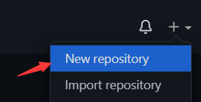

## 2.git 与仓库ssh连接

### 1.密钥问题

#### git上新建ssh密钥

```apl
ssh-keygen -o
```

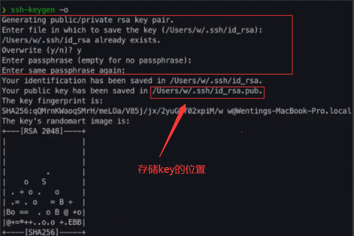

#### 获取到密钥

```apl
cat 存储key的位置
```

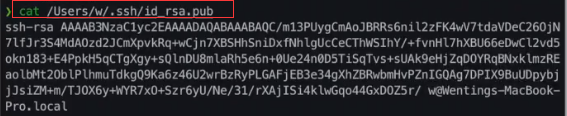

#### 密钥复制到github

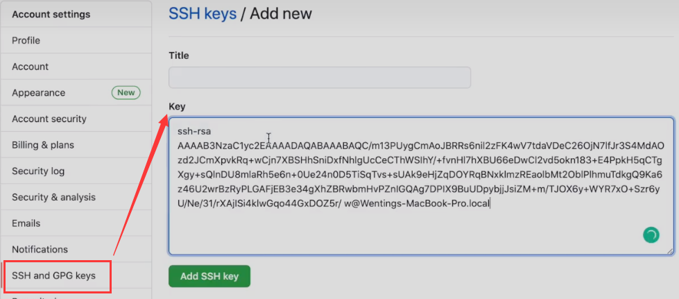


### 2.仓库克隆到本地文件夹中

 (**首先寻找并建立合适的文件夹**)


#### 复制仓库链接

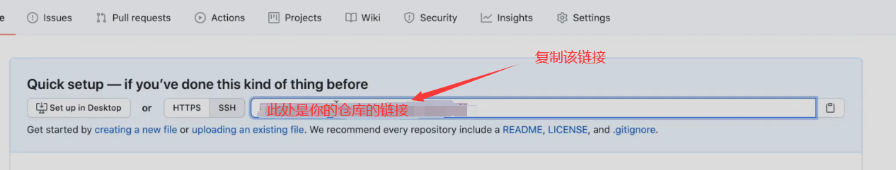


#### 克隆该仓库到本地


```apl
git clone + 链接
```

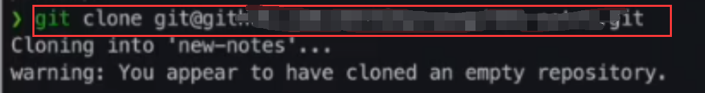


## 3.版本控制


### 在文件夹中 新建/修改 内容

```apl
新建文件夹'mkdir A'
新建文本文件'touch file.md'
将该文件夹直接拖入typora编辑器
```


### 1.新文件添加到暂存区

```apl
git add .
```

### 2.将暂存区内容加到本地仓库

```apl
git commit -m"add all"
```

### 3.从将本地的分支版本上传到远程并合并

```apl
git push
```


***


# 初体验代码详解


## 1. git add

```apl
git add 命令可将该文件添加到暂存区。

文件修改后，我们一般都需要进行 git add 操作，从而保存历史版本。
```


### 三个常用命令

#### git add [file1] [file2] ...

```apl
git add [file1] [file2] ...
#添加一个或多个文件到暂存区：
```

#### git add [dir]

```apl
git add [dir]
#添加指定目录到暂存区，包括子目录：
```

#### git add  .

```apl
git add .
#添加当前目录下的所有文件到暂存区：
```

### 实例一：添加两个文件：

#### 创建两个文件

```apl
$ touch README                # 创建文件
$ touch hello.php             # 创建文件

$ ls
README        hello.php

$ git status -s
?? README
?? hello.php
$ 
```

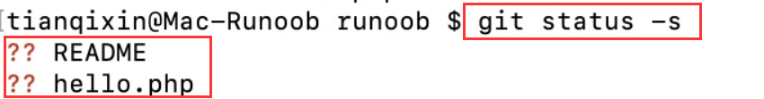

**git status 命令用于查看项目的当前状态。**


#### 执行 git add 命令来添加文件：

```apl
$ git add README hello.php 
```


#### 再执行 git status查看项目状态

```apl
$ git status -s
A  README
A  hello.php #可以看到这两个文件已经加上去了
$ 
```


### 实例二：介绍 [git add . ]

```apl
#新项目中，添加所有文件很普遍，我们可以使用 git add . 命令来添加当前项目的所有文件。
```


#### 修改 README 文件：

```apl
$ vim README
```

在 README 添加以下内容：**# Runoob Git 测试**，然后保存退出。

#### 再执行 git status：

```apl
$ git status -s
AM README # AM 状态的意思是这个文件在我们将它添加到缓存之后又有改动。
A  hello.php
```

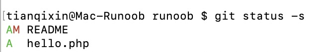

#### 再执行 **git add .** 将其添加到缓存中：

```apl
$ git add .

$ git status -s
A  README #可以看到这两个文件已经加上去了
A  hello.php
```


## 2. git commit

```apl
前面章节我们使用 git add 命令将内容写入暂存区。

git commit 命令将暂存区内容添加到本地仓库中。
```


### 三个延伸命令

#### git commit -m [message]

```apl
git commit -m [message] # [message] 可以是一些备注信息。
# 提交暂存区到本地仓库中:
```


#### $ git commit [file1] [file2] ... -m [message]

```apl
$ git commit [file1] [file2] ... -m [message]
# 提交暂存区的指定文件到仓库区：
```


#### $ git commit -a

```apl
$ git commit -a
# -a参数设置修改文件后不需要执行 git add 命令，直接来提交
```


### 设置git用户的信息

```apl
# 开始前我们需要先设置提交的用户信息，包括用户名和邮箱：
$ git config --global user.name 'runoob'
$ git config --global user.email test@runoob.com

# 如果去掉 --global 参数只对当前仓库有效。
```


### 提交修改

#### 1. 普通提交

接下来我们就可以对 hello.php 的所有改动从暂存区内容添加到本地仓库中。

以下实例，我们使用 -m 选项以在命令行中提供提交注释。l

```apl
$ git add hello.php

$ git status -s
A  README
A  hello.php

$ git commit -m '第一次版本提交'
[master (root-commit) d32cf1f] 第一次版本提交
 2 files changed, 4 insertions(+)
 create mode 100644 README
 create mode 100644 hello.php
```


现在我们已经记录了快照。如果我们再执行 git status:

```apl
$ git status # On branch master
nothing to commit (working directory clean)

# 以上输出说明我们在最近一次提交之后，没有做任何改动，
# 是一个 "working directory clean"，翻译过来就是干净的工作目录。
```


#### 2. 没有设置 -m" "

```apl
如果你没有设置 -m 选项，Git 会尝试为你打开一个编辑器以填写提交信息。 
如果 Git 在你对它的配置中找不到相关信息，默认会打开 vim。
屏幕会像这样：
```

```apl
# Please enter the commit message for your changes. Lines starting
# with '#' will be ignored, and an empty message aborts the commit.
# On branch master
# Changes to be committed:
#   (use "git reset HEAD <file>..." to unstage)
#
# modified:   hello.php
#
~
~
".git/COMMIT_EDITMSG" 9L, 257C
```


#### 3. git add 简化

```apl
# 如果你觉得 git add 提交缓存的流程太过繁琐，Git 也允许你用 -a 选项跳过这一步。命令格式如下：
git commit -a
```

```apl
# 我们先修改 hello.php 文件为以下内容：
<?php
echo '菜鸟教程：www.runoob.com';
echo '菜鸟教程：www.runoob.com';
?>
```


```apl
# 再执行以下命令：
$ git commit -am '修改 hello.php 文件'
[master 71ee2cb] 修改 hello.php 文件
 1 file changed, 1 insertion(+)
```


## 3. git push

```apl
git push 命令用于从将本地的分支版本上传到远程并合并。
```

### 1. 命令格式：

```apl
git push <远程主机名> <本地分支名>:<远程分支名>

# 如果本地分支名与远程分支名相同，则可以省略冒号：
git push <远程主机名> <本地分支名> #本地主机名字貌似也可以不加？
```

### 2. 实例

#### 代码样本

##### 1. 普通使用

```apl
# 以下命令将本地的 master 分支推送到 origin 主机的 master 分支。
$ git push origin master

# 相等于：
$ git push origin master : master
```

##### 2. 强制推送版本

```apl
# 如果本地版本与远程版本有差异，但又要强制推送可以使用 --force 参数：
git push --force origin master
```

##### 3. 删除主机分支

```apl
# 删除主机的分支可以使用 --delete 参数，以下命令表示删除 origin 主机的 master 分支：
git push origin --delete master
```


#### 实践

以我的 https://github.com/tianqixin/runoob-git-test 为例，本地添加文件：

```apl
$ touch runoob-test.txt    # 添加文件

$ git add runoob-test.txt  #添加到缓存

$ git commit -m "添加到远程"
master 69e702d] 添加到远程
 1 file changed, 0 insertions(+), 0 deletions(-)
 create mode 100644 runoob-test.txt

$ git push origin master    # 推送到 Github
```

将本地的 master 分支推送到 origin 主机的 master 分支。

重新回到我们的 Github 仓库，可以看到文件已经提交上来了：

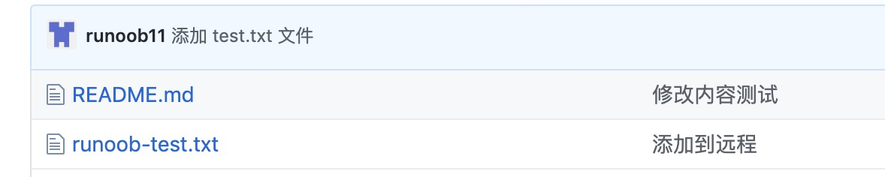


## 4. git status 

```apl
命令用于显示工作目录和暂存区的状态。 使用此命令能看到那些修改被暂存到了, 哪些没有, 哪些文件没有被Git tracked到
```


***


# git无法连接github

## 方法一：修改host

### 修改用户权限

了解到Win11 hosts文件目录位置，在：【C：Windows\ System32\ drivers\ etc】中。

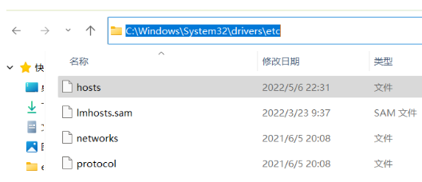

选中【hosts文件】进行右键点击，然后选择属性功能。

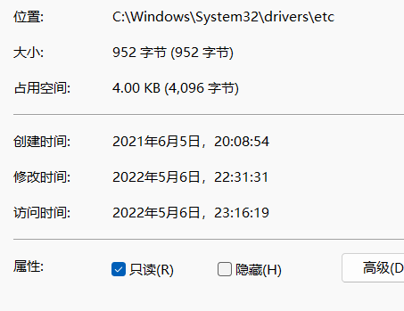

在打开的页面中可以看到，默认权限为只读状态，点击将其【取消勾选】。

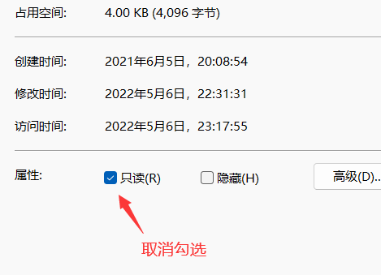

在上方栏目中切换到【安全】选项卡，然后点击右侧的【编辑】。

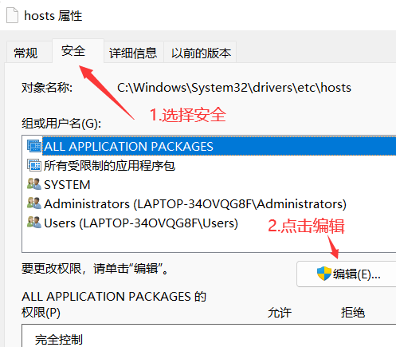

然后在打开的hosts 的权限窗口，然后将允许下方栏目中的【修改】以及【读取写入】进行勾选。

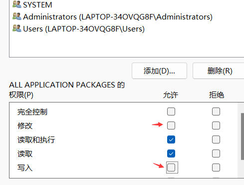

然后点击下方栏目的【确定】进行设置的保存。

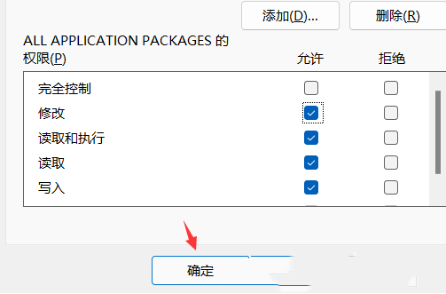

Windows 安全中心提示，你将要更改系统文件夹的权限设置，然后点击【是】

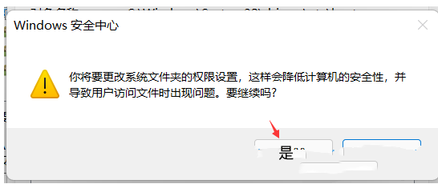

将host文件复制一份到桌面

将ip 与 对应域名复制进桌面的host

将桌面的host文件放入源文件夹取代原来的host


### 寻找合适的ip

```apl
需要将github的连接良好的ip，写入到host文件中
```

#### 解决方法

首先打开[DNS查询工具](https://tools.ipip.net/dns.php), [IPAddress](https://github.com.ipaddress.com/)，依次输入 [github.com](http://github.com/)，github.global.ssl.fastly.net， [assets-cdn.github.com](http://assets-cdn.github.com/) 查询。 

选取解析响应时间最短的DNS-IP，然后复制到hosts里面，如下：

```apl
205.251.197.3 github.com
199.232.69i.194 github.global.ssl.fastly.net
185.199.108.153 assets-cdn.github.com
185.199.108.133 avatars0.githubusercontent.com
```

## 方法二：使用网络代理

```apl
# 网络代理解决 git 命令行访问 GitHub 失败的问题
```


### 使用代理：

**假设你的代理本地端口为 1080，那么需要在命令行执行下面的命令：**

**(输入时以实际代理端口值为准)**

#### 1. socks形式

```apl
git config --global http.proxy 'socks5://127.0.0.1:1080'
git config --global https.proxy 'socks5://127.0.0.1:1080'
```

#### 2.http://形式

```apl
git config --global http.proxy http://127.0.0.1:1086
git config --global https.proxy http://127.0.0.1:1086
```

**再进行 clone、pull 之类的 git 操作，就不会报错了，问题解决！**


### 取消代理：

```apl
# 代理网络出现问题，这时候就需要取消 git 的代理：
git config --global --unset http.proxy
git config --global --unset https.proxy
```


1. github建立一个仓库

   

   

2. 本地建立一个仓库

   ```apl
   git init name
   ```

   

3. 将两个仓库联系起来

   建立一次联系之后就不用每一次都重复这一段代码了

   ```apl
   git remote add <github上的某一个仓库名> <该仓库的网址 -> url>
   ```

4. 修改/添加仓库文件

5. 版本控制

   ```apl
   git add.
   ```

   ```apl
   git commit -m"add all"
   ```

   ```apl
   git push
   ```

   

6. 。。。。。


# Git SSH密钥删除与创建


**Git为了保证安全并没有重新修改密码的功能**

1。查看本地是否有.ssh文件

```apl
找到 Git Bash 打开后 运行 cd ~/.ssh 查看是否有该文件
如果本地有ssh密钥的话会有id_rsa、id_rsa.pub、known_hosts等文件。
如果没有的话运行上步骤命令就会找不到文件的提示
```

2、删除ssh

```apl
复制并运行 rm -rf ~/.ssh/* 把现有的ssh key都删掉，这句命令行如果你多打一个空格，可能就要重装系统了，建议复制运行。
```

3、运行 ssh-keygen -t rsa -b 4096 -C “你的邮箱”  (注意填写你的真实邮箱)
4、按回车三次
5、运行 cat ~/.ssh/id_rsa.pub ，得到ssh密钥，完整复制
6、打开GitHub->点击头像->setting->SSH adn GPG keys->New SSh key
7、输入你的title、把刚才复制的那段粘贴到key中保存
8、运行 ssh -T git@github.com ，你可能会看到这样的提示。
9、输入yes
10、

```apl
1. 然后如果你看到 Permission denied (publickey). 就说明你失败了，请回到第 1 步重来；

2. 如果你看到 Hi FrankFang! You’ve successfully authenticated, but GitHub does not provide shell access.
那就说明你成功了
```

原文链接：https://blog.csdn.net/stormyk/article/details/89362078


# 查看本机 ssh 公钥&生成公钥


## 什么是公钥

- 1.很多服务器都是需要认证的，ssh认证是其中的一种。
- * 在客户端生成公钥，把生成的公钥添加到服务器，你以后连接服务器就不用每次都输入用户名和密码了。

- 2.很多git服务器都是用ssh认证方式，你需要把你生成的公钥发送给代码仓库管理员，
- * 让他给你添加到服务器上，你就可以通过ssh自由地拉取和提交代码了。


## 查看 ssh 公钥3个方法：


### 1.通过命令窗口

```apl
打开'git bash' 窗口

'cd ~/.ssh' 
# 进入到 .ssh 目录

'ls'
# 找到 'id_rsa.pub' 文件

'cat id_rsa.pub' 或'vim id_rsa.pub'
# 查看公钥
```

如图：

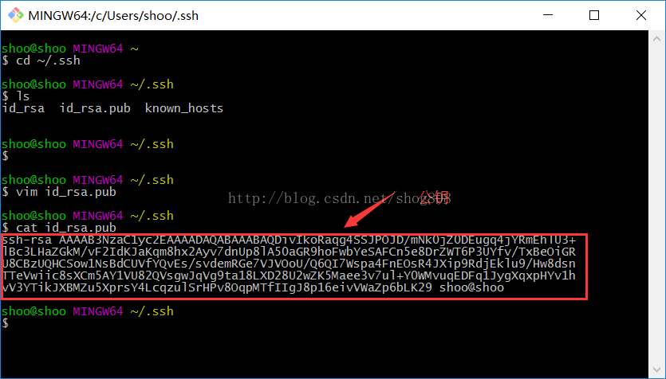

### 2.使用命令 ：**cat ~/.ssh/id_rsa.pub**

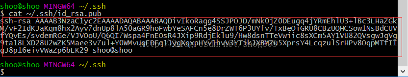

### 3.打开用户下.ssh 文件夹里的 id_rsa.pub 

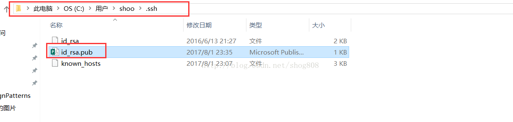


## 生成公钥

- 1.如果通过上面的方式找不到公钥，你就需要先生成公钥了：ssh-keygen
- 2.接着会确认存放公钥的地址，默认就是上面说的路径，直接enter键确认
- 3.接着会要求输入密码和确认密码，如果不想设置密码直接不输入内容 按enter键

如图：

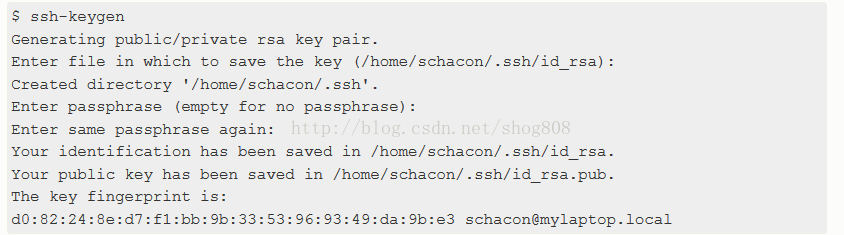

> 原文链接：https://blog.csdn.net/shog808/article/details/76563136


