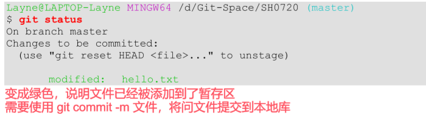
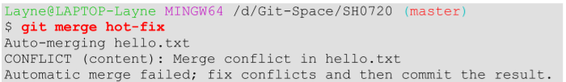
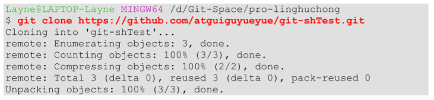
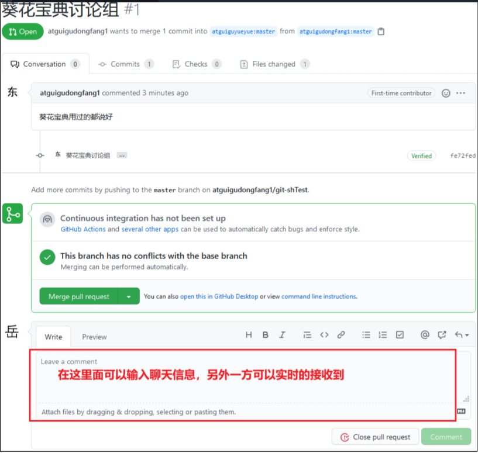
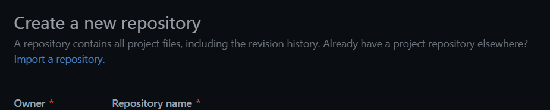

# 第1章 Git 概述

 

```apl
Git 是一个免费的、开源的分布式版本控制系统，可以快速高效地处理从小型到大型的各种项目。

Git 易于学习，占地面积小，性能极快。 它具有廉价的本地库，方便的暂存区域和多个工作流分支等特性。

其性能优于 Subversion、CVS、Perforce 和 ClearCase 等版本控制工具。
```


## 1.什么是版本控制

```apl
版本控制是一种记录文件内容变化，以便将来查阅特定版本修订情况的系统。

版本控制其实最重要的是可以记录文件修改历史记录，从而让用户能够查看历史版本， 方便版本切换。
```

​									


## 2.为什么需要版本控制

```apl
个人开发过渡到团队协作。
```


 

## 3.版本控制工具


###  集中式版本控制工具

 

CVS、SVN(Subversion)、VSS……

```apl
集中化的版本控制系统诸如 CVS、SVN 等，都有一个单一的集中管理的服务器，保存所有文件的修订版本，

而协同工作的人们都通过客户端连到这台服务器，取出最新的文件或者提交更新。

多年以来，这已成为版本控制系统的标准做法。

这种做法带来了许多好处，每个人都可以在一定程度上看到项目中的其他人正在做些什么。而管理员也可以轻松掌控每个开发者的权限，并且管理一个集中化的版本控制系统，要远比在各个客户端上维护本地数据库来得轻松容易。

事分两面，有好有坏。

这么做显而易见的缺点是中央服务器的单点故障。如果服务器宕机一小时，那么在这一小时内，谁都无法提交更新，也就无法协同工作。
```


```apl
集中式版本控制系统的缺陷:

\1.  服务器断网的情况下也可以进行开发（因为版本控制是在本地进行的）

\2.  每个客户端保存的也都是整个完整的项目（包含历史记录，更加安全）
```


### 分布式版本控制工具

Git、Mercurial、Bazaar、Darcs……

```apl
像 Git 这种分布式版本控制工具，客户端提取的不是最新版本的文件快照，而是把代码仓库完整地镜像下来（本地库）。

这样任何一处协同工作用的文件发生故障，事后都可以用其他客户端的本地仓库进行恢复。

因为每个客户端的每一次文件提取操作，实际上都是一次对整个文件仓库的完整备份。
```

```apl
分布式版本控制优点：

\1.  服务器断网的情况下也可以进行开发（因为版本控制是在本地进行的）

\2.  每个客户端保存的也都是整个完整的项目（包含历史记录，更加安全）
```

 


 

## 4.Git 简史

 


**1.5** **Git** **工作机制**


 

## 5.Git 和代码托管中心

代码托管中心是基于网络服务器的远程代码仓库，一般我们简单称为远程库。

 

### 局域网

 GitLab

### 互联网

 GitHub（外网）

 Gitee 码云（国内网站）

 

 

# 第2章 Git 安装

官网地址： https://git-scm.com/

 

查看GNU 协议，可以直接点击下一步。


选择Git 安装位置，要求是非中文并且没有空格的目录，然后下一步。


Git 安装目录名，不用修改，直接点击下一步。


 Git 的默认编辑器，建议使用默认的 Vim编辑器，然后点击下一步


默认分支名设置，选择让Git 决定，分支名默认为 master，下一步。


修改Git 的环境变量，选第一个，不修改环境变量，只在Git Bash 里使用Git。

​										 


选择后台客户端连接协议，选默认值 OpenSSL，然后下一步。


配置 Git 文件的行末换行符，Windows 使用 CRLF，Linux 使用 LF，选择第一个自动 转换，然后继续下一步。


 

 

 

选择Git 终端类型，选择默认的Git Bash 终端，然后继续下一步。


 

选择Git pull 合并的模式，选择默认，然后下一步。


选择Git 的凭据管理器，选择默认的跨平台的凭据管理器，然后下一步。


 

其他配置，选择默认设置，然后下一步。


实验室功能，技术还不成熟，有已知的 bug，不要勾选，然后点击右下角的 Install按钮，开始安装Git。

 


点击 Finsh 按钮，Git 安装成功！


 

 


右键任意位置，在右键菜单里选择Git Bash Here 即可打开 Git Bash 命令行终端。


在 Git Bash 终端里输入 git --version 查看 git 版本，如图所示，说明Git 安装成功。


 

# 第 3 章 Git 常用命令

 

| **命令名称**                          | **作用**       |
| ------------------------------------- | -------------- |
| git  config --global user.name 用户名 | 设置用户签名   |
| git config --global user.email 邮箱   | 设置用户签名   |
| git init                              | 初始化本地库   |
| git status                            | 查看本地库状态 |
| git add 文件名                        | 添加到暂存区   |
| git commit  -m "日志信息" 文件名      | 提交到本地库   |
| git reflog                            | 查看历史记录   |
| git reset --hard 版本号               | 版本穿梭       |


## 1.设置用户签名

### 1）基本语法

```apl
git config --global user.name  用户名

git config --global user.email 邮箱
```

### 2）案例实操

全局范围的签名设置：

                      


```apl
说明：

签名的作用是区分不同操作者身份。用户的签名信息在每一个版本的提交信息中能够看到，以此确认本次提交是谁做的。
Git 首次安装必须设置一下用户签名，否则无法提交代码。

注意：这里设置用户签名和将来登录 GitHub（或其他代码托管中心）的账号没有任何关系。
```


## 2.初始化本地库

### 1）基本语法 

```apl
git init
```

### 2）案例实操


### 3）结果查看


```apl
该文件在git操作框被隐藏，如果要使用就输入ll -a
如果想看，也可以进入.git输入cd .git
```


 

 

## 3.查看本地库状态

### 1）基本语法

```apl
git status 
```

###  2）案例实操

####  首次查看

（工作区没有任何文件）


#### 编写代码并保存


#### 再次查看

（检测到未追踪的文件）


##  4.添加到暂存区

**将工作区的文件添加到暂存区**


### 1）基本语法

```apl
git add 文件名
```

### 2）案例实操


###  查看状态

（检测到暂存区有新文件）

 


## 5.提交到本地仓库

**将暂存区的文件提交到本地库**

### 1） 基本语法

 

```apl
git commit -m "说明信息" 文件名
```

 

### 2）案例实操

#### 提交代码


#### 查看状态

（没有文件需要提交）


### 3）查看版本信息

#### 1）基本语法

```apl
git reflog
```


## 6.修改文件（hello.txt）

###  修改操作


### 查看改后状态

（检测到工作区有文件被修改）


### 将改的文件添加暂存区

 


###   查看状态

(工作区的修改添加到了暂存区)

 




## 7.历史版本

### 查看历史版本

#### 1）基本语法

```apl
 git reflog  -- 查看版本信息

 git log     -- 查看版本详细信息
```

#### 2）案例实操


 

 

 

### 历史版本穿梭

#### 1） 基本语法

 

```apl
git reset --hard 版本号
```

 

#### 2）案例实操              

#### 				      


 

```apl
精简查询，查找的是前七位的精简版本号
```


```apl
.git 目录下面
HEAD 文件 ：里面记录了指针指向了哪一个分支
refs目录 下的 heads文件下的master文件里面的内容记录了当前之怎指向的版本号
refs目录的 heads文件下的文件都是不同的分支，每个分支文件，里面存储的都是不同分支下的当前版本号
```

```apl
使用版本穿梭，可以让文件版本在不同的文件之间，来回的穿梭
```


Git 切换版本，底层其实是移动的 HEAD 指针，具体原理如下图所示。

 


版本回退


# 第 4 章 Git 分支操作

 


 

## 1.什么是分支

 

```apl
在版本控制过程中，同时推进多个任务，为每个任务，我们就可以创建每个任务的单独分支。

使用分支意味着程序员可以把自己的工作从开发主线上分离开来，开发自己分支的时候，不会影响主线分支的运行。

对于初学者而言，分支可以简单理解为副本，一个分支就是一个单独的副本。（分支底层其实也是指针的引用）
```


```apl
合并分支
指的是将其他的分支合并到当前分支上
```


## 2.分支的好处

```apl
# 同时并行推进多个功能开发，提高开发效率。

# 各个分支在开发过程中，如果某一个分支开发失败，不会对其他分支有任何影响。失败的分支删除重新开始即可。
```


## 3. 分支的操作

 

| **命令名称**        | **作用**                     |
| ------------------- | ---------------------------- |
| git branch 分支名   | 创建分支                     |
| git branch -v       | 查看分支                     |
| git checkout 分支名 | 切换分支                     |
| git merge 分支名    | 把指定的分支合并到当前分支上 |


### 查看分支

#### 1）基本语法 

```apl
git branch -v
```


#### 2）案例实操


 

### 创建分支

#### 1） 基本语法

```apl
git branch 分支名
```

 

#### 2）  案例实操


### 修改分支


 

### 切换分支

#### 1） 基本语法

```apl
git checkout 分支名
```

 

#### 2）  案例实操


###  合并分支

#### 1） 基本语法

```apl
git merge 分支名
```

 

#### 2）  案例实操 

在 master 分支上合并 hot-fix 分支




```apl
先在master分支对hello.txt进行修改，然后添加，并提交到master分支的版本库
然后切换回hot-fix分支对hello.txt进行修改，然后添加，并提交到hot-fix分支的版本库
然后再返回master分支，将hot-fix分支合并到master分支
```

```apl
不在同一行做修改应该是可以自动合并成功的
```


### 产生冲突

```apl
冲突产生的表现：后面状态为 MERGING
```


​							                                      

 

```apl
此时需要手动合并，
首先，手动打开文件 vim hello.txt
会发现下面文件中，将需要修改的内容给罗列了出来
```


```apl
# 冲突产生的原因： 
  
  合并分支时，两个分支在同一个文件的同一个位置有两套完全不同的修改。
  Git 无法替我们决定使用哪一个。必须人为决定新代码内容。
```


 

 

### 解决冲突

#### 1） 编辑冲突的文件

删除特殊符号，决定要使用的内容

```apl
特殊符号：

    <<<<<<< HEAD    
    	当前分支的代码    
    =======     
    	合并过来的代码 
    >>>>>>> hot-fix
```


```apl
然后，文件里面的内容都可以修改，最好保持最后的行数一致
修改过后wq保存并退出
```

```apl
此时使用 git status 查看本地状态，依然是，合并冲突的状态
然后使用过 git add git commit -m进行提交到本地仓库
```


```apl
但是此时的git commit -m 后面不能加上文件名，如果加上文件名，那么会报错无法修改
合并成功过后，只是会修改当前分支的内容，被合并的分支的内容还是原来的样子
```


```apl
10分10秒的演示说的是分支的切换，不是合并，合并是master指针指向hot-fix版本，老师演示的head头指针指向的是hot-fix分支指针，这个叫做切换分支。@尚硅谷
```

```apl
head指针指向的是具体的分支，不同的分支指向的是具体版本
分支合并，是当前的分支，指向被合并分支指向的版本
如果发生版本冲突，就是在当前分支指向的版本上进行修改，然后，当前分支指向的依然是当前版本
被合并分支指向的版本呢并没有发生变化
```


#### 2） 添加到暂存区


#### 3） 执行提交

（注意：此时使用 git commit 命令时**不能带文件名**）


## 4.创建分支和切换分支图解


 

 

master、hot-fix 其实都是指向具体版本记录的指针。当前所在的分支，其实是由 HEAD

 

决定的。所以创建分支的本质就是多创建一个指针。

 

HEAD 如果指向 master，那么我们现在就在master 分支上。

 

HEAD 如果执行 hotfix，那么我们现在就在hotfix 分支上。


所以切换分支的本质就是移动HEAD 指针。

 

# 第 5 章 Git 团队协作机制

 

## 1.团队内协作


 

## 2. 跨团队协作


# 第 6 章 GitHub 操作

 

| 账号               | 姓名     | 验证邮箱                                                     |
| ------------------ | -------- | ------------------------------------------------------------ |
| atguiguyueyue      | 岳不群   | [atguiguyueyue@aliyun.com](mailto:atguiguyueyue@aliyun.com)  |
| atguigulinghuchong | 令狐冲   | [atguigulinghuchong@163.com](mailto:atguigulinghuchong@163.com) |
| atguigudongfang1   | 东方不败 | [atguigudongfang@163.com](mailto:atguigudongfang@163.com)    |

注:此三个账号为讲师使用账号，同学请自行注册，然后三个同学为一组进行团队协作！

 

## 1 .创建远程仓库

 

  

 

## 2. 远程仓库操作

 

| **命令名称**                       | **作用**                                                   |
| ---------------------------------- | ---------------------------------------------------------- |
| git remote -v                      | 查看当前所有远程地址别名                                   |
| git remote add 别名 远程地址       | 起别名                                                     |
| git push 别名 分支                 | 推送本地分支上的内容到远程仓库                             |
| git clone 远程地址                 | 将远程仓库的内容克隆到本地                                 |
| git pull 远程库地址别名 远程分支名 | 将远程仓库对于分支最新内容拉下来后与  当前本地分支直接合并 |

 

### 创建远程仓库别名

#### 1）基本语法

```apl
 git remote -v 查看当前所有远程地址别名
 git remote add 别名 远程地址
```


```apl
克隆别人的代码到本地之后，会初始化一个新的仓库，然后自动为远程仓库起一个叫origin的别名
```


#### 2）案例实操


 


```apl
 git remote add 别名 远程地址

这个地址在创建完远程仓库后生成的连接，如图所示红框中
```

 

###  拉取远程库内容

#### 1） 基本语法

 

```apl
git pull 远程库地址别名 远程分支名
```

 

#### 2） 案例实操


###    推送本地分支到远程仓库

#### 1） 基本语法

 

```apl
git push 别名 分支名
```

 

#### 2）案例实操


此时发现已将我们master 分支上的内容推送到GitHub 创建的远程仓库。

 


### 克隆远程仓库到本地

#### 1）基本语法

 

```apl
git clone 远程地址
```

 

#### 2) 案例实操



https://github.com/atguiguyueyue/git-shTest.git

这个地址为远程仓库地址，克隆结果：初始化本地仓库


```apl
小结：clone 会做如下操作。1、拉取代码。2、初始化本地仓库。3、创建别名
```


## 3.邀请加入团队

### 1） 选择邀请合作者


### 2） 填入想要合作的人

 


 

### 3 ） 复制并发送地址

```apl
复 制 地 址 并 通 过 微 信 钉 钉 等 方 式 发 送 给 该 用 户 ， 复 制 内 容 如 下 ：

https://github.com/atguiguyueyue/git-shTest/invitations
```


 

### 4） 在github接收邀请

在 atguigulinghuchong 这个账号中的地址栏复制收到邀请的链接，点击接受邀请。


 

### 5） 查看远程仓库

成功之后可以在 atguigulinghuchong 这个账号上看到 git-Test 的远程仓库。


### 6）修改仓库代码

令狐冲可以修改内容并 push 到远程仓库


 

### 7） 查看提交

回到 atguiguyueyue 的 GitHub 远程仓库中可以看到，最后一次是 lhc 提交的。


 


###  8）拉取远程库内容

#### 1） 基本语法

 

```apl
git pull 远程库地址别名 远程分支名
```

 

#### 2） 案例实操


## 4.跨团队协作

#### 1）获取仓库URL

将远程仓库的地址复制发给邀请跨团队协作的人，比如东方不败。


 


 

#### 2）Fork项目

在东方不败的 GitHub 账号里的地址栏复制收到的链接，然后点击 Fork 将项目叉到自己的本地仓库。

 


 

##### 叉入中…


 

叉成功后可以看到当前仓库信息。


 

#### 3）GitHub在线编辑

东方不败就可以在线编辑叉取过来的文件。


#### 4）提交代码

 编辑完毕后，填写描述信息并点击左下角绿色按钮提交。


 

#### 5）发送请求

 接下来点击上方的 Pull 请求，并创建一个新的请求。

 


 


 


**6）** **回到岳岳** **GitHub** **账号可以看到有一个** **Pull request** **请求。**


 

#### 6）进入到聊天室

可以讨论代码相关内容。




 


 

**7）** **如果代码没有问题，可以点击** **Merge pull reque** **合并代码。**


 


 

##  .SSH 免密登录

### 发现

我们可以看到远程仓库中还有一个 SSH 的地址，因此我们也可以使用 SSH 进行访问。


### 具体操作

```apl
家目录，(用户) 下面有一个.ssh文件，里面分别记录了公钥和私钥
```


复制 id_rsa.pub 文件内容，登录GitHub，点击用户头像→Settings→SSH and GPG keys


```apl
在github上设置好ssh之后
使用
git pull ssh master
就可以免密拉取代码
```

接下来再往远程仓库push 东西的时候使用 SSH 连接就不需要登录了。


# 补充内容

## 1.vim基本操作

```apl
退出vi(末行模式（last line mode）)

建议在退出vi前，先按ESC键，以确保当前vi的状态为命令方式，然后再键入“：”(冒号)，输入下列命令，退出vi。

(1) :w
    将编辑缓冲区的内容写入文件，则新的内容就替代了原始文件。这时并没有退出vi，必须进一步输入下述命令才能退出vi：

    :w filename(存入指定文件)

    :q 普通退出

(2) :wq
    即将上面的两步操作可以合成一步来完成，先执行w，后执行q。

(3) :x和ZZ(注意： ZZ前面没有“:”)
    功能与(2)等价。

(4) :q!(或:quit)
    强行退出vi，使被更新的内容不写回文件中。仅键入命令:q时，如vi发现文本内容已被更改，将提示用户使用“:quit”命令退出。
```

 

```apl
1. 创建文件
   vim 文件名.txt
	
2. 查看文件内容
   cat 文件名.txt
	
3. 查看文件最后一行
   tail -n 1 文件名.txt
```

## 2.remote操作

```apl
在新版 Git 中可以用 git remote rename 命令修改某个远程仓库在本地的简称，比如想把 pb 改成paul，可以这么运行：

$ git remote rename pb paul
$ git remote
origin
paul
注意，对远程仓库的重命名，也会使对应的分支名称发生变化，原来的 pb/master 分支现在成了paul/master。

碰到远端仓库服务器迁移，或者原来的克隆镜像不再使用，又或者某个参与者不再贡献代码，那么需要移除对应的远端仓库，可以运行 git remote rm 命令：

$ git remote rm paul
$ git remote
origin
```


## 3.github令牌登录


### github上的操作

#### 1.创建仓库



#### 2.复制仓库地址


### 本地git操作

#### 1.创建仓库

```apl
git init
```


#### 2.查看提交情况

```apl
git status
```


#### 3.文件全部加入暂存区

```apl
git add .
```


#### 4.全部提交到本地仓库

```apl
git commit -m "first" .
```


### github与本地仓库连接

#### 1.本地存储远程仓库链接

```apl
git remote add 远程仓库在本地的称呼 远程仓库网址
```


#### 2.查看是否添加完毕

```apl
git remote -v
```


#### 3.将本地代码推送到远程仓库

```apl
git push 远程仓库在本地的称呼 要被提交的分支名
```


#### 4.输入对应仓库用户名


#### 5.输入对应仓库设置的令牌


## 4.git常规命令补充


```apl
1. 查看git配置信息：git config --list
2. 查看用户名：git config user.name
3. 查看邮箱：git config user.email
4. 设置全局用户名：git config --global user.name "xxx"(输入你的用户名)
5. 设置全局邮箱：git config --global user.email "xxx"(输入你的邮箱)
```


