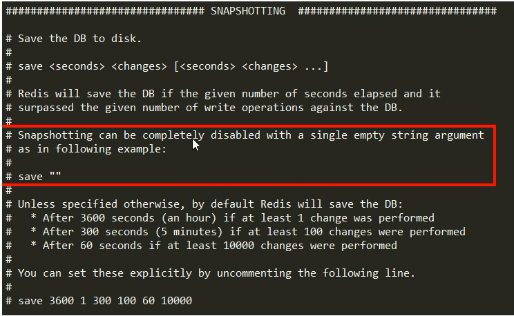
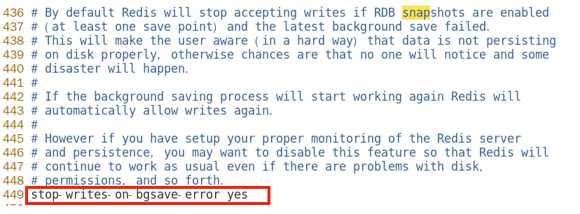
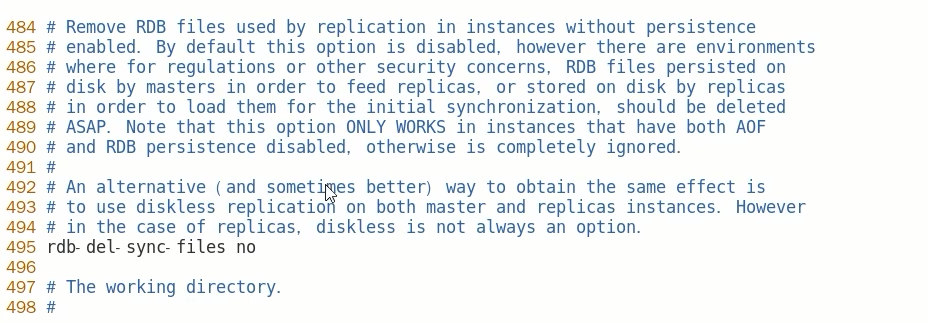

# RDB快照文件.md

### rdb文件破损情况

> 存储一个键值对，但是存储的数据还没有写完，结果发生了数据库宕机
>
> 数据库启动了数据备份，没有写完的数据(损毁数据)也被写入了数据库
>
> 那么可能会导致数据库内存储的文件损毁，进而无法读取

> 所以需要一种方式，检查并修复破损的rdb文件


### 如何检查修复dump.rdb文件？

进入到redis安装目录

执行命令：

```shell
redis-check-rdb
```

例如：

```shell
redis-check-rdb ./redisconfig/dump.rdb 
```

> 如果命令执行成功，损毁的文件会被修复
>
> 如果没有，那么数据就会丢失，或通过其他途径找回数据

### 哪些情况会触发RDB快照

1. 自动触发：配置文件中默认的快照配置
2. 手动触发：save/bgsave命令
3. 执行flushdb/fulshall命令也会产生dump.rdb文件
   - 但是也会将命令记录到dump.rdb文件中，恢复后依旧是空，无意义
4. 执行shutdown且没有设置开启AOF持久化
5. 主从复制时，主节点自动触发

### 如何禁用快照

> 禁用快照的原因：
>
> > 有的系统只使用AOF，或者有的系统因为fock进程开销过大

> 禁用方法：
>
> 1. 动态所有停止RDB保存规则的方法：redis-cli config set value ""
>
> 2. 手动修改配置文件
>
>    

### RDB优化配置项详解

配置文件SNAPSHOTTING模块

- save \<seconds> \<changes>：配置快照保存条件

- dir：配置快照保存目录地址

- dbfilename：配置快照的文件名

- stop-writes-on-bgsave-error：

  

  默认yes，如果配置成no，表示不在乎数据不一致或者有其他的手段发现和控制这种不一致，那么在快照写入失败时，也能确保redis继续接受新的请求

- rdbcompression：

  

  默认yes，对于存储到磁盘中的快照，可以设置是否进行压缩存储。如果是的话，Redis会采用LZF算法进行压缩。如果你不想消耗CPU来进行压缩的话，可以设置为关闭此功能

- rdbchecksum：

  

  默认yes，在存储快照后，还可以让redis使用CRC64算法来进行数据校验，但是这样做会增加大约10%的性能消耗，如果希望获取到最大的性能提升，可以关闭此功能

- rdb-del-sync-files：



在没有持久化的情况下删除复制中使用的RDB文件。默认情况下no，此选项是禁用的。

小总结：


