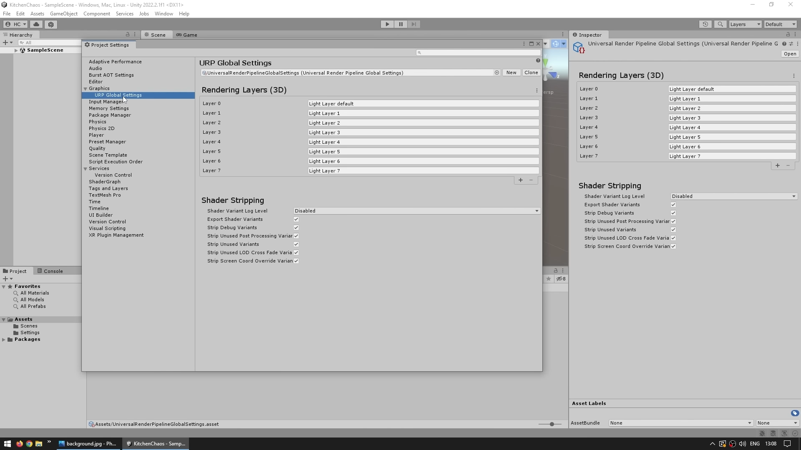
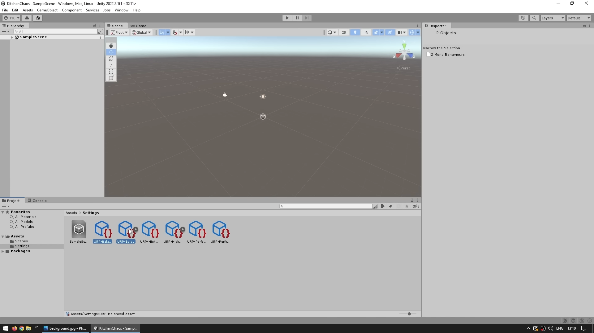

# Create Project

[20:32](https://www.youtube.com/watch?v=AmGSEH7QcDg&list=PLzDRvYVwl53vxdAPq8OznBAdjf0eeiipT&t=1233s&type=snipo)
实际上我们正在构建我们的游戏，所以让我们创建一个「变色龙2」的项目，并从头开始构建。

## 1.首先我们需要安装Unity

## 2. 选择一个Unity版本

- 现在Unity建议您使用LTS版本或长期支持版本
  
    
    

[21:52](https://www.youtube.com/watch?v=AmGSEH7QcDg&list=PLzDRvYVwl53vxdAPq8OznBAdjf0eeiipT&t=1313s&type=snipo)

## 3. 进入“项目”选项卡，创建新项目。

- 首先，在这里确保选择正确的版本。再次强调，我将使用22.2版本。
  
    
    
- 需选择3D URP模板即可。
    - 这里的URP代表通用渲染管线
    - 这意味着我们的游戏可以在任何平台上运行
    
    
    
- 下载template，填写项目名与位置
  
    
    

## 4.项目设置(最简化资源的使用)

- 在左上角进入编辑，然后进入项目设置
  
    
    
- 在图形选项卡中，确认URP High Fidelity资源是否已默认分配
    - 如果没有分配，可以点击圆形图标进行分配
    
    
    
- 在URP移动设置中，应该默认设置正确
  
    
    
- 在质量选项卡中，确保选择了高保真度选项
    - 上面的2个选项可以删除，如下
    
    
    
    
    

## 5.设置项目文件夹

- 在设置文件夹中选择URP平衡（URP Balance）
- 选择高保真度（High Fidelity）和性能（Performance）的两个资源
- 删除其他资源
  
    
    
    
    
- 如果不小心删除了某些内容
    - 可以在项目窗口的加号图标处创建新的URP资源，选择Universe Personal Render复原
    
    
    

## 6.总结

[24:56](https://www.youtube.com/watch?v=AmGSEH7QcDg&list=PLzDRvYVwl53vxdAPq8OznBAdjf0eeiipT&t=1496s&type=snipo)

1. 安装Unity并选择一个版本，建议使用LTS版本。
2. 在“项目”选项卡中创建新项目，选择3D URP模板，填写项目名和位置。
3. 确认URP High Fidelity资源已默认分配。
4. 确保URP移动设置默认设置正确。
5. 选择高保真度选项。
6. 在设置文件夹中选择URP平衡，选择高保真度和性能的两个资源，删除其他资源。
7. 只设置一个质量设置，即高保真度，质量设置使用的是此随机管道资产，该资产也使用了此渲染器。