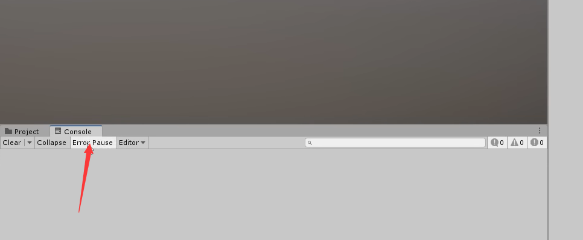

# Unity Layout

## 1. 视频概述：

- 如何自定义Unity的布局。
- 为什么要确保你熟悉布局。
- 确保你已经观看了作者之前的Unity基础知识视频。

---

- 1.1 检查器（Inspector）
    - 解释：检查器是Unity界面的一个部分，位于界面的右侧。它用于显示和编辑当前选定游戏对象的所有属性和组件。例如，当你在层级窗口中选中一个游戏对象时，检查器会显示该对象的所有属性和组件，你可以在这里修改它们的值。
    - 示例：如果你选中了一个立方体游戏对象，检查器中会显示该立方体的变换组件（Transform），包括它的位置（Position）、旋转（Rotation）和缩放（Scale）。你可以在这里修改这些值来改变立方体在游戏世界中的位置、角度和大小。
- 1.2 游戏对象（Game Object）
    - 解释：游戏对象是Unity中的基本元素，它代表了游戏世界中的一个实体，可以包含多个组件，以实现不同的功能。游戏对象可以是可见的3D模型、2D图像，也可以是不可见的逻辑实体。
    - 示例：一个立方体、一个球、一个音频源、一个光源都可以是游戏对象。它们可以通过添加不同的组件来实现不同的功能，如渲染、物理模拟、音频播放等。
- 1.3 变换（Transform）
    - 解释：变换是Unity中的一个组件，用于控制游戏对象的位置、旋转和缩放。每个游戏对象都有一个变换组件，它定义了游戏对象在游戏世界中的位置和朝向。
    - 示例：你可以在变换组件的位置属性中输入(1,2,3)，那么这个游戏对象将会被移动到游戏世界中坐标为(1,2,3)的位置。同样，你也可以修改旋转和缩放属性来改变游戏对象的朝向和大小。
- 1.4 控制台（Console）
    - 解释：控制台是Unity界面的一部分，位于界面的下方。它用于显示游戏运行时的日志、警告和错误信息。开发者可以使用控制台来调试游戏，查看游戏运行时的输出信息。
    - 示例：如果游戏中有一段代码使用了Debug.Log()函数输出了一条日志信息，那么这条日志信息将会在控制台中显示。如果游戏运行时出现了错误，错误信息也会在控制台中显示，方便开发者快速定位和解决问题。
- 1.5 层级（Hierarchy）
    - 解释：层级是Unity界面的一部分，位于界面的左侧。它用于显示和管理游戏场景中的所有游戏对象，使我们能够轻松地组织和管理游戏元素。
    - 示例：在层级窗口中，你可以看到游戏场景中的所有游戏对象，它们按照父子关系组织在一起。你可以通过拖拽游戏对象来调整它们的父子关系，这样就可以轻松地管理游戏世界中的各个元素。

## 2. 布局设置：

- 将“检查器（Inspector）”放在右侧，以便能轻松查看选定对象属性和组件。

    

- 将“层级（Hierarchy）”放在左侧底部，因为我们不需要让它占用太多空间。

    

- 将“项目文件（Project Files）”放在“层级”旁边，便于浏览文件。

    

- 将“控制台（Console）”放在Project Files旁边标签上，便于在游戏运行时切换查看。

    

- 将“场景视图（Scene View）”放在中心，将“游戏视图（Game View）”放在其旁边。

## 3. 项目窗口（Project Window）设置：

[26:53](https://www.youtube.com/watch?v=AmGSEH7QcDg&list=PLzDRvYVwl53vxdAPq8OznBAdjf0eeiipT&t=1614s&type=snipo)

- 默认情况下显示为两列布局，可以切换为一列布局。
    - 解释：Unity的项目窗口有两种布局方式，分别是两列布局和一列布局。两列布局显示的信息更为详细，便于查看和管理项目中的资源。而一列布局则更为简洁，便于快速浏览和查找资源。用户可以根据自己的需求，选择合适的布局方式。
      
        
    
- 可以根据需要调整缩略图的大小。
    - 解释：在项目窗口中，资源的缩略图可以帮助用户更直观地识别和查找资源。用户可以根据自己的需要，调整缩略图的大小，以便更容易地识别和查找资源。
      
        
    
- 通过点击“眼睛”图标，可以切换是否显示内部组件。
    - 解释：在项目窗口中，资源可能会包含内部组件，通过点击“眼睛”图标，用户可以选择是否显示这些内部组件，以便更容易地管理和查找资源。
        - tangle modle
            - 点击后会折叠文件夹，只显示一些重要文件
            
            
            
        - untangle modle
            - 没有点击是，可以显示文件夹中更多的源码文件等
            
            
            

## 4. 控制台窗口（Console Window）设置：

[27:48](https://www.youtube.com/watch?v=AmGSEH7QcDg&list=PLzDRvYVwl53vxdAPq8OznBAdjf0eeiipT&t=1669s&type=snipo)

- 选择“一行（One Line）”使控制台更加紧凑。
    - 这可以让控制台显示更多的信息，方便开发者查看和分析。
      
        
    
- 可以选择显示时间戳、使用等宽字体等。
    - 显示时间戳可以帮助开发者更好地了解日志信息的产生顺序，从而更容易跟踪问题的发生。
      
        
        
    - 使用等宽字体可以使控制台的文本更加整齐，提高可读性。
      
        
    
- 3个不同按钮可以显示不同等级的console信息
    - 确保选中了显示常规消息、警告和错误的按钮。
    - 这可以确保控制台能够显示游戏运行时的所有重要信息，帮助开发者全面了解游戏的运行状态，及时发现并解决问题。
      
        
        
    - 让信息单条一个个出现
      
        
        
    - 让游戏报错时自动暂停
      
        
        

## 5. 游戏视图窗口（Game View Window）设置：

[29:21](https://www.youtube.com/watch?v=AmGSEH7QcDg&list=PLzDRvYVwl53vxdAPq8OznBAdjf0eeiipT&t=1761s&type=snipo)

- 选择适当的纵横比。
  
    
    
- 可以设置是否在游戏运行时最大化游戏视图窗口。
    - 实际上下面有3种选择
    
    
    
- 确保关闭垂直同步以避免GPU过载。
    - 因为选定这个之后，会使用GPU最大性能运行项目内容
    - 实际上，在早期测试阶段并不需要
    
    
    
- 确保缩放滑块设置为最左侧，以避免画面像素化。
  
    
    

## 6. 场景视图窗口（Scene View Window）设置：

[30:12](https://www.youtube.com/watch?v=AmGSEH7QcDg&list=PLzDRvYVwl53vxdAPq8OznBAdjf0eeiipT&t=1812s&type=snipo)

- 保持默认设置即可。
  
    
    
- 确保开启“灯光（Lights）”和“特效（Special Effects）”。
  
    
    
- 按需选择其他选项。
  
    
    

## 7. 保存和加载布局：

- 在完成布局设置后，可以在右上角的“默认（Default）”菜单中保存自己的布局。
  
    
    
    
    
    
    
- 在需要时，可以重新加载自己的布局或者加载默认布局。
  
    