# Visual Studio

[32:05](https://www.youtube.com/watch?v=AmGSEH7QcDg&list=PLzDRvYVwl53vxdAPq8OznBAdjf0eeiipT&index=2&t=1926s&type=snipo)  

## **一、软件设置**

### 1. **选择Visual Studio版本**：

- 使用Visual Studio 2022社区版（免费）。
- 可在官方网站下载安装程序，遵循安装向导完成安装。

### 2. **其他编辑器选项**：

- 用户可选择其他代码编辑器，如JetBrains Rider或Visual Studio Code。
- 需要在相应编辑器的官方网站下载安装程序，并跟随安装指导进行安装。

## **二、Unity集成代码工具**

### 1. **访问Unity包管理器**：

- 在Unity软件中点击“窗口”菜单，找到并打开“包管理器”界面。
  
    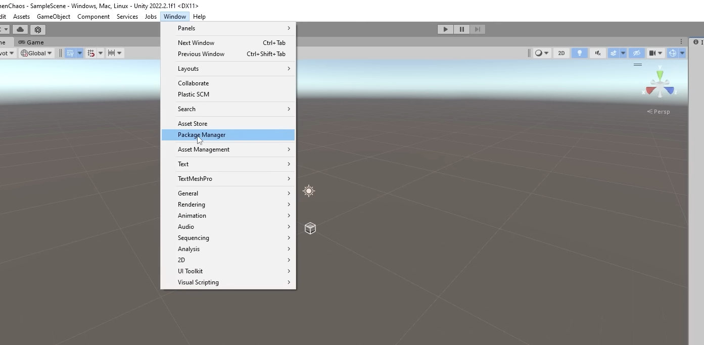
    

### 2. **安装DNT注册表的软件包**：

- 在包管理器中搜索并选择DNT注册表中的软件包，点击安装。
  
    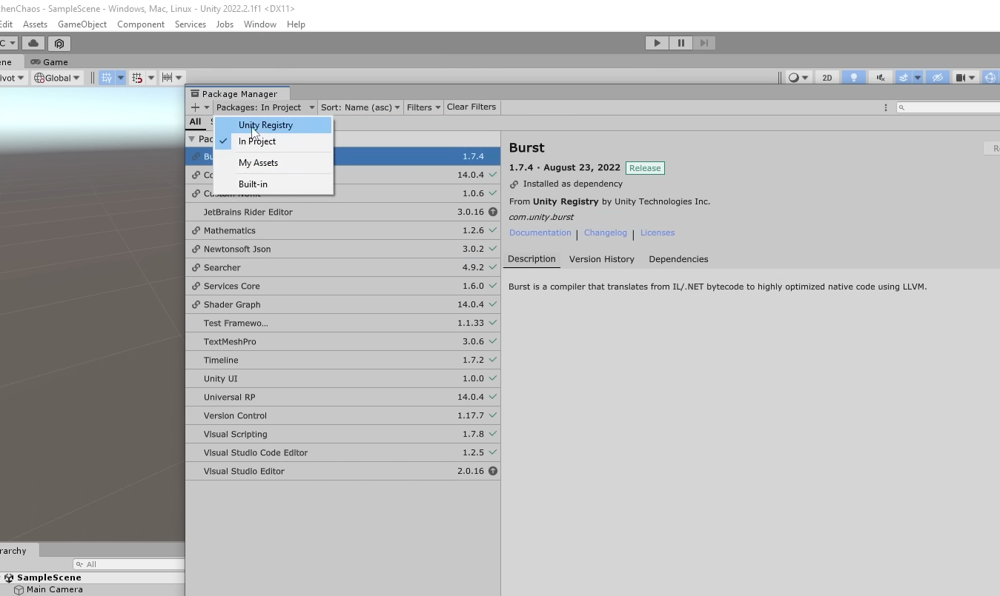
    

### 3. **集成Visual Studio**：

- 安装“Visual Studio Editor”包，它是实现Unity和Visual Studio集成的插件。
  
    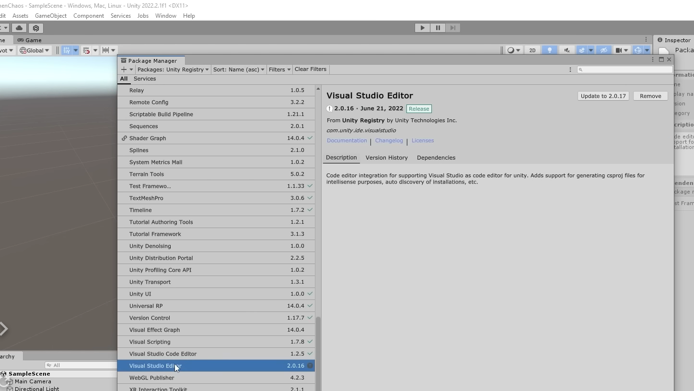
    

### 4. 如果选择**其他编辑器**

- 那么需要其他**的集成包**：
- 如选择Visual Studio Code或JetBrains Rider来写代码而不是visual studio
- 需要在Unity包管理器中找到对应的插件包并进行安装。
  
    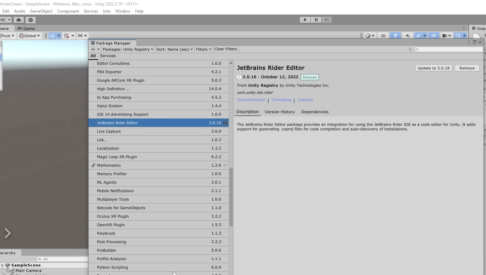
    

## **三、如果集成Visual Studio时配置**

### 1. **设置外部脚本编辑器**：

- 在Unity中点击“编辑”菜单，选择“首选项”，在弹出的窗口中选择“外部工具”。
  
    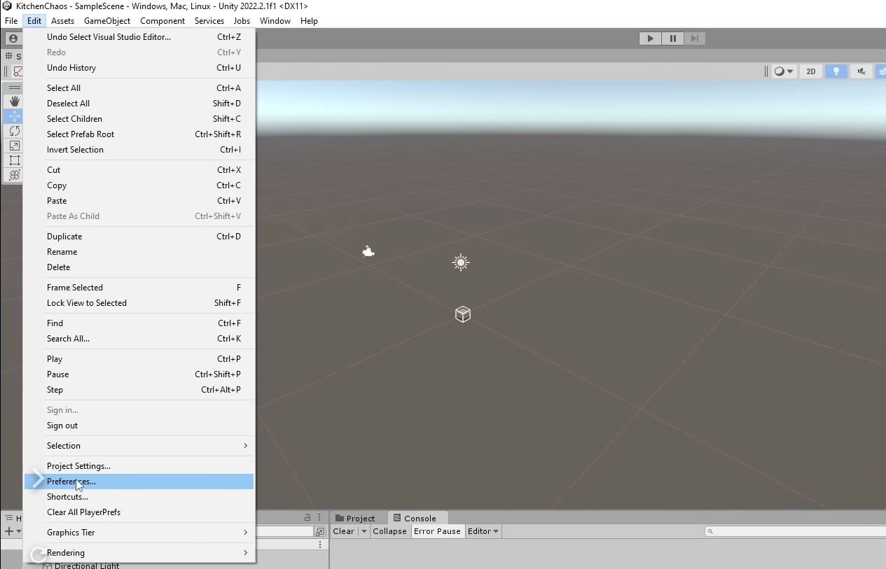
    
    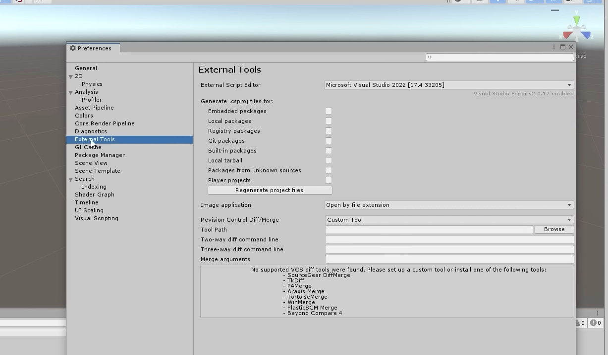
    
- 在“外部工具”选项中设置Visual Studio 2022为默认脚本编辑器。
    - 具体版本根据情况选择
    
    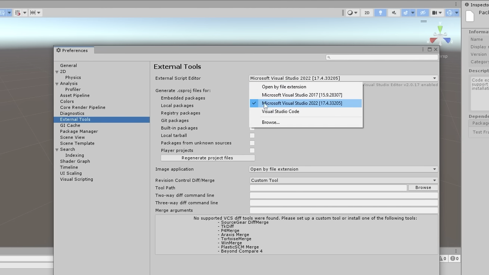
    

### 2. **外部工具选项**：

- 确保Unity中的外部脚本编辑器设置正确无误，指向Visual Studio 2022的安装路径。
- 通常情况下，不需要修改其他额外选项，除非有特殊需求。
  
    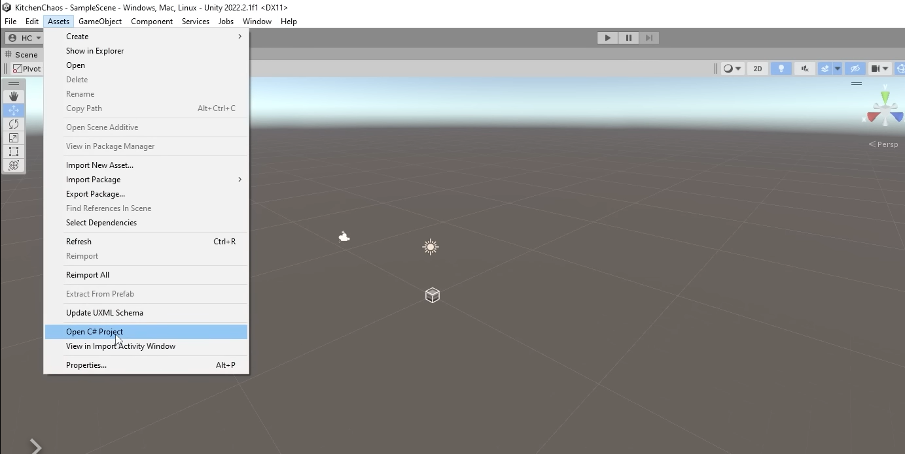
    

## **四、Visual Studio扩展和代码风格**

### 1. **安装VSColorOutput扩展**：

- 在Visual Studio中通过“扩展”菜单搜索并安装Viasfora，用于增强日志输出的可读性。
  
    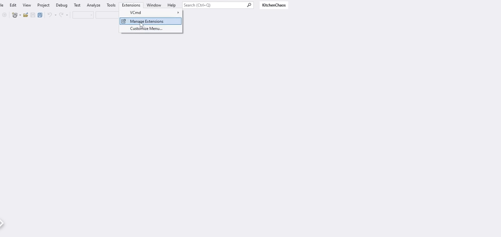
    
    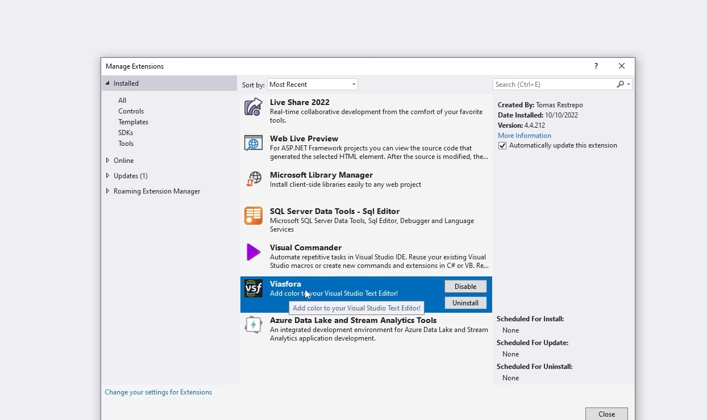
    

### 2. **设置编辑器和代码风格**：

- 在Visual Studio中通过“工具”菜单选择“选项”，进行代码编辑器的个性化设置。
  
    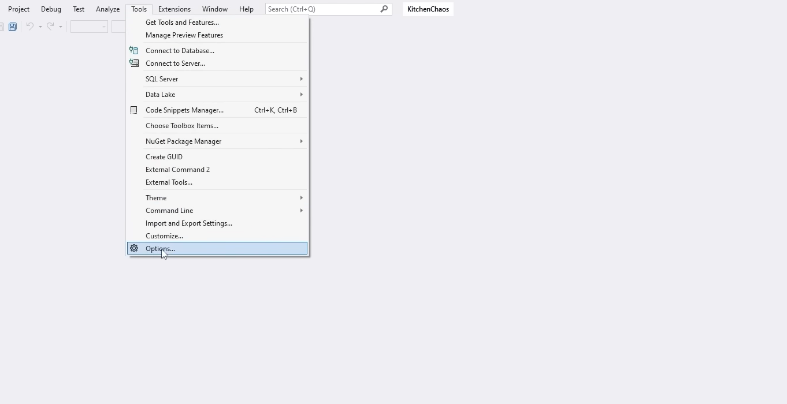
    
- 可以在“文本编辑器”部分设置字体大小、颜色主题等。
- 在C#编码规则部分，根据个人喜好设置代码样式，例如缩进大小、花括号位置等。
  
    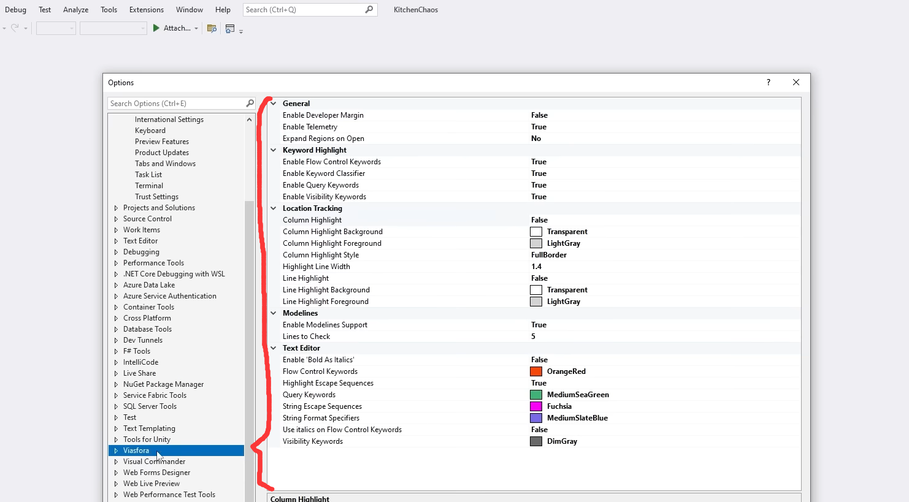
    

## **五、测试脚本创建**

### 1. **在Unity中创建C#脚本**：

- 在Unity的项目浏览器中右键新建一个C#脚本。
  
    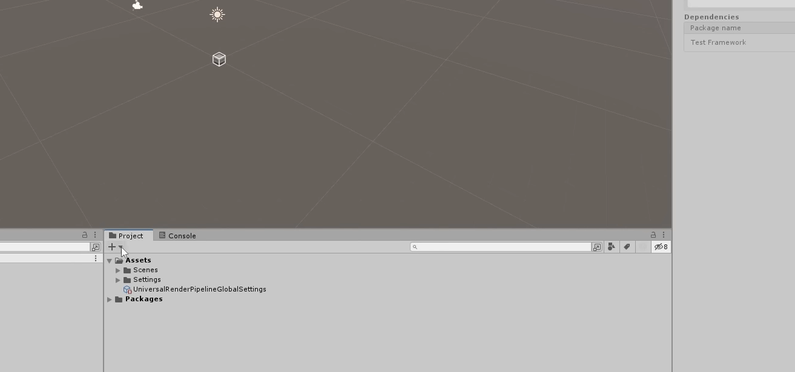
    
- 命名脚本，并等待Unity编译新脚本。
  
    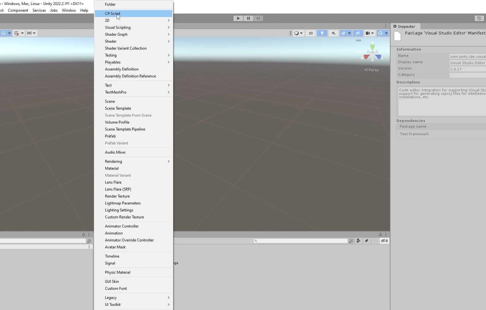
    

### 2. **使用Visual Studio编辑脚本**：

- 写完C#测试代码后，回到unity进行测试
- 双击Unity中的脚本文件，它应当自动在Visual Studio中打开。
  
    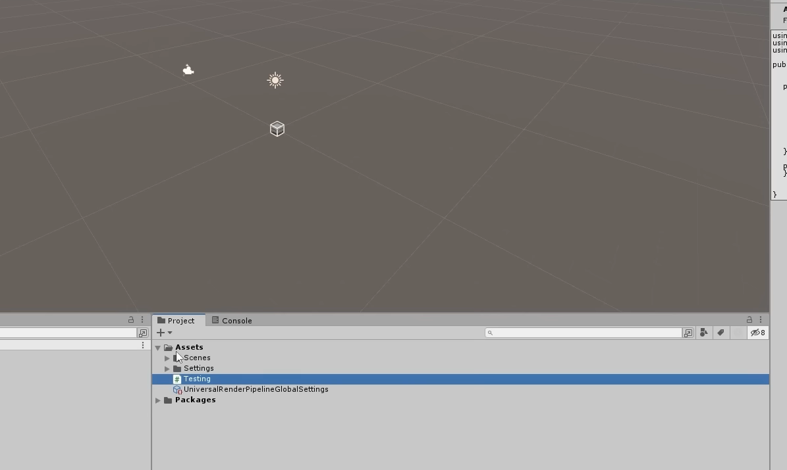
    

### 补充细节：

- 检查之前的设置是否生效，如彩虹括号、字体大小等。
- [34:51](https://www.youtube.com/watch?v=AmGSEH7QcDg&list=PLzDRvYVwl53vxdAPq8OznBAdjf0eeiipT&index=2&t=2092s&type=snipo)

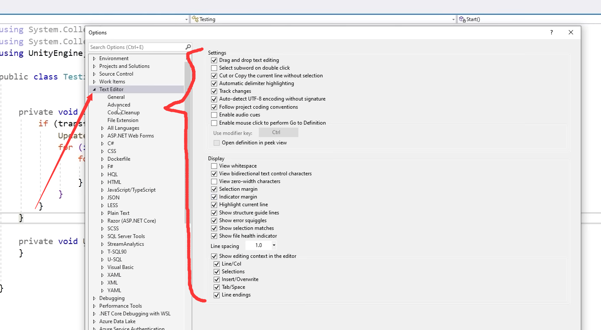

- [34:56](https://www.youtube.com/watch?v=AmGSEH7QcDg&list=PLzDRvYVwl53vxdAPq8OznBAdjf0eeiipT&index=2&t=2097s&type=snipo)

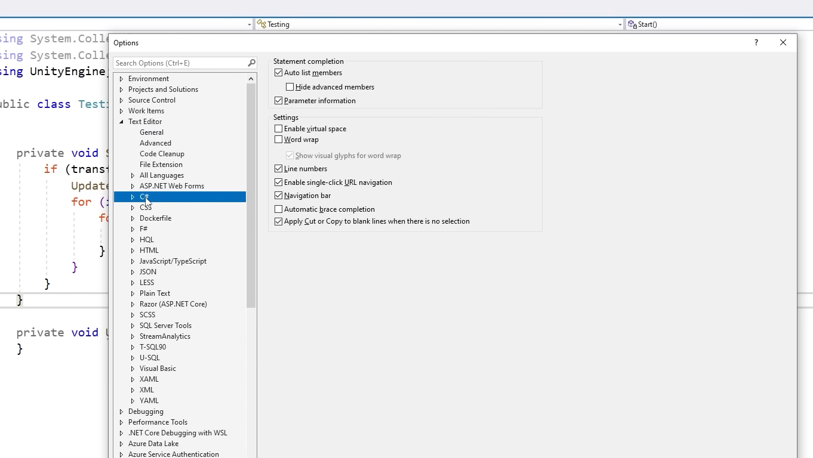

以上每一步都是确保在使用Unity和Visual Studio进行游戏开发时，开发环境是顺畅、高效且个性化的。这些步骤有助于新手理解集成过程，并且为有经验的开发者提供参考，以优化他们的工作流程。