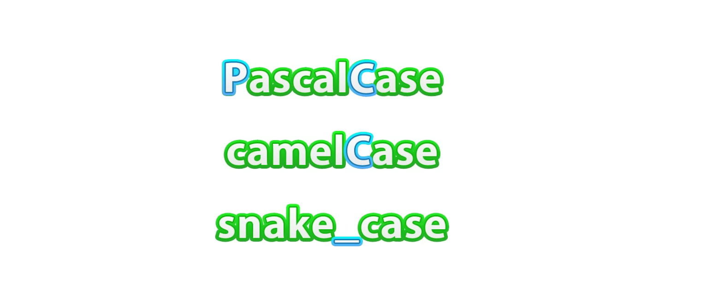
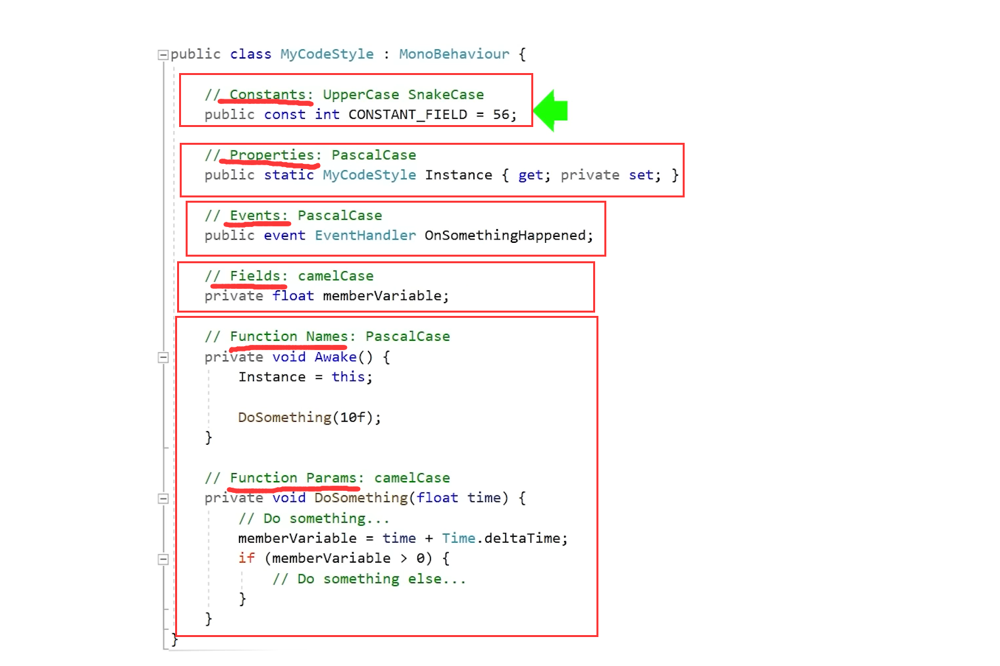

# Code Style, Naming Rules

## 1. 编程命名规则的介绍

- 强调了命名规则的重要性。
- 指出应当有一致的命名方式，避免混乱。

## 2. 命名规则的定义和例子

- 解释了命名规则是编码时遵循的规则。
- 介绍了`PascalCase`, `camelCase`和`snake_case`等不同的命名规则。
  
    
    
    - `PascalCase`（每个单词首字母大写，用于类名）
    - `camelCase`（首个单词小写，后续单词首字母大写，用于变量和函数）
    - `snake_case`（单词间以下划线连接，常用于Python变量名）
- 代码示例
  
    
    
    - 在这段代码的注释中，标注了各种变量和元素的命名风格，用中文解释如下：
        - **常量（Constants）：UpperCase SnakeCase**`public const int CONSTANT_FIELD = 56;`
        这表示常量的命名采用大写字母并且单词之间用下划线分隔的方式，例如`CONSTANT_FIELD`。
        - **属性（Properties）：PascalCase**`public static MyCodeStyle Instance { get; private set; }`
        这表示属性的命名采用首字母大写的驼峰式命名规则，每个单词的首字母都大写，例如`Instance`。
        - **事件（Events）：PascalCase**`public event EventHandler OnSomethingHappened;`
        这表示事件的命名也是采用首字母大写的驼峰式命名规则，例如`OnSomethingHappened`。
        - **字段（Fields）：camelCase**`private float memberVariable;`
        这表示非公开字段的命名采用小写字母开头的驼峰式命名规则，单词与单词之间首字母大写，例如`memberVariable`。
        - **函数名（Function Names）：PascalCase**`private void Awake() { ... }`
        这表示函数名的命名采用首字母大写的驼峰式命名规则，例如`Awake`。
        - **函数参数（Function Params）：camelCase**`private void DoSomething(float time) { ... }`
        这表示函数参数的命名采用小写字母开头的驼峰式命名规则，例如`time`。这些命名风格体现了C# 编程中常见的编码规范。
- 类比java
    - 在Java中，这些字段和元素将具有相同的含义，因为这些是编程概念而不是特定于语言的。我将用中文解释这些注释中提到的各个部分：
        - **常量（Constants）：**`public const int CONSTANT_FIELD = 56;`
        这是一个常量，其值被设置为56，并且一旦赋值后不可改变。在Java中，常量通常也是使用`public static final`修饰符声明的。
        - **属性（Properties）：**`public static MyCodeStyle Instance { get; private set; }`
        这是一个属性，提供了一个获取实例的公共方法和一个私有的设置方法。在Java中，这通常会通过公共的getter方法和私有的setter方法来实现。
        - **事件（Events）：**`public event EventHandler OnSomethingHappened;`
        这代表了一个事件，其他对象可以订阅这个事件，当事件触发时得到通知。Java中没有内置的事件处理机制，通常会用接口和监听器(listener)模式来实现这一功能。
        - **字段（Fields）：**`private float memberVariable;`
        这是一个私有的成员变量，意味着它只能在声明它的类内部被访问和修改。
        - **函数名（Function Names）：**`private void Awake() { ... }Awake`是一个私有的函数，它在某些情况下被调用（比如在Unity中，`Awake`是MonoBehaviour的一个生命周期方法，它在对象实例化后自动调用）。
        - **函数参数（Function Params）：**`private void DoSomething(float time) { ... }DoSomething`是一个私有的函数，接受一个浮点数类型的参数`time`。在函数体中，这个参数将用于一些操作。
        
        以上的元素在Java中基本上有着相同的作用和含义，尽管语法和某些特性可能有所不同。
        

## 3. 对初学者的建议

- 强调了代码的大小写敏感性。
    - 如在大小写敏感的编程语言中，大小写不一致可能会导致引用错误。
- 提醒初学者要注意代码的一致性和规范性。

## 4. 命名规则的选择和个人习惯

- 鼓励选择适合自己的命名规则。
- 分享了讲师个人十年来形成的一些命名习惯。
    - 如`PascalCase`适合类名和接口，而`camelCase`适合变量和函数。
    - 如在私有字段前使用下划线（例如`_privateVariable`）来区分公共字段

## 5. Unity和C#的标准规则

- 举例说明Unity中的`MonoBehaviours`使用的`PascalCase`规则。
    - 如接口以`I`开头（例如`IInterface`）
    - 事件使用PascalCase
- 提议函数命名可以基于Unity的规则。
    - Unity脚本编写中推荐的`PascalCase`命名规则
    - 这有助于与Unity引擎的内建方法和属性保持一致。

## 6. 代码书写风格的个人喜好

- 讲述了讲师个人对于大括号位置的偏好。
- 强调了这些都是个人风格选择，对代码运行没有影响。

## 7. 重命名和命名准则

- 强调花时间选择适当的名字的重要性。
- 提倡在类型变化时重命名变量以保持一致性。

## 8. 变量命名的例外和规则

- 指出避免使用单个字母作为变量名，除非在for循环迭代中。
    - 如在短小的for循环中使用`i`、`j`、`k`等作为迭代变量
- 建议不使用缩写，因为这可能会导致不清晰。

综上所述，讲座内容主要强调编程时命名规则的选择和一致性对于避免混乱、提高代码清晰度的重要性，并且给出了具体的规则选择和个人习惯的例子。