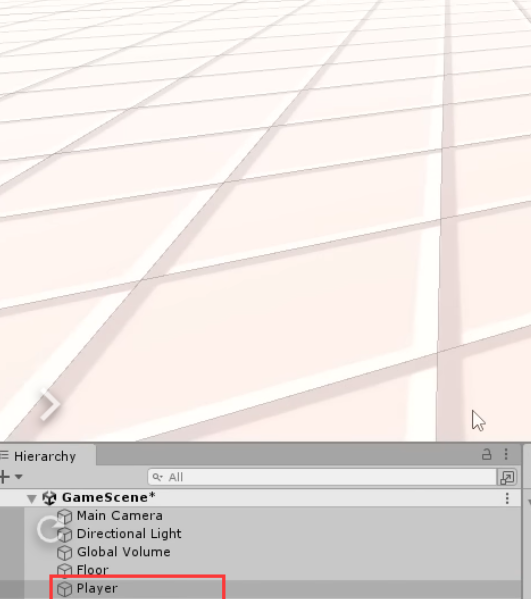

# Character Controller

[55:50](https://www.youtube.com/watch?v=AmGSEH7QcDg&list=PLzDRvYVwl53vxdAPq8OznBAdjf0eeiipT&index=2&t=3350s&type=snipo)

# 创建角色模型

## 初始化游戏对象

1. 在Unity中创建一个新的空GameObject，命名为“Player”。
    - 因为在Unity中，我们通常会把逻辑和表现分开来处理。
        - 把Player作为一个空的容器GameObject，可以在不影响逻辑的情况下
        - 自由更换角色的视觉模型。
    
    
    
    
    
    
    
2. 在Player GameObject下，创建一个Capsule GameObject作为玩家的临时视觉表现。
  
    
    
    - 这样做的好处
      
    
3. 将Capsule的缩放比例（Scale）设置为(0.7, 0.7, 0.7)。
  
    
    
    - 注意：直接在Player GameObject上调整模型的大小可能会导致一些意想不到的缩放问题，因为它们的变换(Transform)是相对于父对象的。
4. 将Capsule的位置（Position）调整为(0, 1, 0)。
    - 提醒：这是为了确保角色模型不会部分嵌入到地面中，这一步骤也强调了在Unity中处理物体的空间关系的重要性。

## 创建控制脚本

1. 在项目的Assets目录中创建一个新的文件夹，命名为“Scripts”。
  
    
    
    - 组织：保持你的项目结构清晰和有条理，将有助于长期的维护。
2. 在“Scripts”文件夹中创建一个新的C#脚本，命名为“Player”。
  
    
    
3. 将“Player”脚本拖拽到Player GameObject上。
    - 为什么这么做：在Unity中，脚本通常应该添加到控制逻辑的父GameObject上，而不是子对象，这样有助于保持代码的清晰和组织性。

## 最终C#代码

```jsx
using UnityEngine;

public class PlayerMovement : MonoBehaviour
{
    [SerializeField] 
    private float moveSpeed = 7f; // 移动速度

    // Update is called once per frame
    void Update()
    {
        Vector2 inputVector = new Vector2(0, 0); // 初始化输入向量为0

        // 获取玩家的输入，并更新输入向量
        if (Input.GetKey(KeyCode.W))
        {
            inputVector.y += 1; // 向前移动
        }
        if (Input.GetKey(KeyCode.S))
        {
            inputVector.y -= 1; // 向后移动
        }
        if (Input.GetKey(KeyCode.A))
        {
            inputVector.x -= 1; // 向左移动
        }
        if (Input.GetKey(KeyCode.D))
        {
            inputVector.x += 1; // 向右移动
        }

        // 将输入向量标准化，以防斜向移动时速度增加
        inputVector = inputVector.normalized;

        // 将2D输入向量转换为3D移动方向，其中Y轴的输入对应Z轴的移动
        Vector3 moveDir = new Vector3(inputVector.x, 0f, inputVector.y);

        // 移动玩家位置
        transform.position += moveDir * moveSpeed * Time.deltaTime; 
				// 使用deltaTime以确保帧率独立的移动

        // 输出当前的帧时间间隔，用于调试
        Debug.Log(Time.deltaTime);
    }
}
```

### 代码详解

下面是对代码每一部分的详细解释：

- 1. 私有变量与序列化：
  
    ```csharp
    [SerializeField] private float moveSpeed = 7f;
    
    ```
  
    - `[SerializeField]` 是一个Unity特有的属性，它允许私有字段在Unity编辑器的Inspector面板中显示和修改，而不需要将字段设为`public`。这样做可以保持封装性，同时允许设计师和开发者轻松调整参数。
    - `private` 关键字意味着这个变量不能被其他脚本直接访问，这是良好的面向对象编程实践。
    - `float moveSpeed = 7f;` 定义了移动速度，初始化为7。这个速度值将用来控制游戏对象每帧移动的速度。
- 2. Update方法：
  
    ```csharp
    private void Update() {
    
    ```
  
    - `Update()` 是一个Unity生命周期方法，它在每一帧都会被调用一次。用于处理输入和时间相关的更新。
- 3. 输入向量的初始化：
  
    ```csharp
    Vector2 inputVector = new Vector2(0, 0);
    
    ```
  
    - 这里创建了一个新的二维向量 `inputVector`，初始值为(0,0)。它用于累积玩家从键盘输入的方向。
- 4. 检测键盘输入：
  
    ```csharp
    if (Input.GetKey(KeyCode.W)) {
        inputVector.y = +1;
    }
    // ... 其他按键检测
    
    ```
  
    - 使用 `Input.GetKey` 方法检查玩家是否按下了特定的键。这个方法返回一个布尔值，指示玩家是否持续按下指定的键。
    - `KeyCode` 枚举包含了键盘上所有的键，例如 `KeyCode.W` 代表了W键。
    - 修改 `inputVector` 的x和y分量，以反映玩家的输入方向。
- 5. 输入向量的标准化：
  
    ```csharp
    inputVector = inputVector.normalized;
    
    ```
  
    - `.normalized` 属性创建了一个方向相同但长度为1的新向量。这样可以保证，无论玩家输入的是直线移动还是斜线移动，角色的速度都保持不变。
- 6. 二维到三维的转换：
  
    ```csharp
    Vector3 moveDir = new Vector3(inputVector.x, 0f, inputVector.y);
    
    ```
  
    - 创建了一个新的三维向量 `moveDir`，它将二维输入向量映射到三维空间中，允许角色在游戏世界中移动。Y轴的输入（上/下）被映射到Z轴上（前/后）。
- 7. 更新游戏对象位置：
  
    ```csharp
    transform.position += moveDir * moveSpeed * Time.deltaTime;
    
    ```
  
    - 这一行负责实际移动游戏对象。它将移动方向（`moveDir`）与移动速度（`moveSpeed`）和自上一帧以来的时间（`Time.deltaTime`）相乘。结果是无论帧率如何，游戏对象都会以恒定的速度移动。
- 8. 输出调试信息：
  
    ```csharp
    Debug.Log(Time.deltaTime);
    
    ```
  
    - `Debug.Log()` 方法用于将信息输出到Unity的控制台，这对于跟踪和调试游戏行为非常有用。在这里，它输出每帧的时间，这有助于开发者了解游戏运行的流畅度。

这样，通过这段代码，你能够创建一个基本的用户输入响应系统，允许玩家通过按键控制游戏中的角色或对象。每一帧都会根据玩家的输入

## 代码完善过程

### 获取用户输入

1. 要控制角色移动，我们首先需要获取用户的输入，具体来说就是检测玩家是否按下了W、A、S、D这些控制角色移动的按键。
  
    ```csharp
    Vector2 inputVector = new Vector2(0, 0);
    
    if (Input.GetKey(KeyCode.W)) {
        inputVector.y += 1;  // 向前移动
    }
    if (Input.GetKey(KeyCode.S)) {
        inputVector.y -= 1;  // 向后移动
    }
    if (Input.GetKey(KeyCode.A)) {
        inputVector.x -= 1;  // 向左移动
    }
    if (Input.GetKey(KeyCode.D)) {
        inputVector.x += 1;  // 向右移动
    }
    
    ```
    
    在Unity中，这是通过Input类的GetKey方法完成的，它会在每次调用时返回一个布尔值，表示对应的按键是否被按下。这些检测放在`Update`方法中，因为我们需要每一帧都检查按键状态。
    
2. 接着，我们将获得的输入向量标准化。这个步骤非常关键，因为它确保不管玩家以何种组合按下按键，角色的移动速度都保持恒定。
  
    ```csharp
    inputVector = inputVector.normalized;
    
    ```
    

### 让角色可以移动

现在我们有了玩家的输入，就可以用它来计算角色每一帧应该移动的方向和距离。

1. 在Unity中，2D游戏通常使用X和Y轴，而3D游戏通常在X和Z轴上移动角色。所以我们把二维输入向量的Y值（表示上和下）映射到三维向量的Z轴（表示前进和后退）。
  
    ```csharp
    Vector3 moveDir = new Vector3(inputVector.x, 0f, inputVector.y);
     // 创建3D移动方向
    
    ```
    
1. 然后，我们通过改变GameObject的`transform.position`来实际移动角色，并且乘以Time.deltaTime，确保移动是平滑并且与帧率无关的。
  
    ```csharp
    transform.position += moveDir * moveSpeed * Time.deltaTime; 
    // 使用DeltaTime确保平滑移动
    
    ```
    

### 设置移动速度

1. 为了控制角色的移动速度，我们在脚本中声明了一个叫`moveSpeed`的变量
    - 并且通过[SerializedField]属性
        - 使其在Unity编辑器中可编辑
        - 但仍然保持私有状态。
    - 这样做的好处
        - 可以防止直接在代码之外的地方修改这个值
        - 同时仍然允许我们在Unity编辑器中轻松调整速度。
    
    ```csharp
    [SerializeField] private float moveSpeed = 7f; 
    // 在Unity编辑器中可设置的私有速度变量
    
    ```
    

最后，我们在计算移动向量时使用这个速度变量，来使角色实际上按照我们设定的速度移动。

### 补充细节


- 左侧的VSync（垂直同步）选项会影响右侧Stats面板中显示的帧率数值。
- 当VSync被激活时（勾选VSync选项），Unity会尝试将游戏的帧率锁定在用户显示器的刷新率上。大多数现代显示器的刷新率是60Hz，这意味着VSync会将游戏的帧率锁定在大约60帧每秒（FPS）。这是为了防止撕裂现象——当游戏的渲染速率和显示器的刷新速率不一致时会出现的图像不连贯的问题。
- 如果关闭VSync，游戏的帧率不会被锁定，并且可以超过显示器的刷新率，这在Stats面板中的帧率数值上会得到体现。但这也可能会导致图像撕裂，并且在帧率极高时，显卡也会有过度工作的风险。
- 因此，启用VSync会使得右侧Stats面板中的帧率显示为较稳定的数值，通常是等于或少于显示器的最大刷新率。

## 测试移动

### 1. 预先准备工作

要运行这段代码，您需要遵循以下步骤

1. **创建并完成脚本后**：
    - 保存更改（通常是按下 `Ctrl + S` 或 `Command + S`）。
2. **返回Unity**：
    - 回到Unity编辑器，等待脚本编译完成。
3. **玩家对象与脚本联系**：
    - 之前的教程已经基本完成
    - 在场景中创建的玩家对象。这通常是具有 `Collider` 组件的游戏对象，如一个 `Capsule`。
    - 将 `PlayerMovement` 脚本拖动到玩家对象上，或者选中玩家对象，在 `Inspector` 面板中点击 `Add Component` 按钮，然后搜索并添加 `PlayerMovement`。
4. **设置参数**：
    - 在 `Inspector` 面板中，您会看到 `PlayerMovement` 脚本组件显示了 `moveSpeed` 变量。您可以在此设置您想要的移动速度。
5. **配置输入**：
    - 确保您的Unity项目配置了W, A, S, D作为输入键，通常这是默认设置。如果未设置，您需要在 `Edit > Project Settings > Input` 中配置它们。
6. **运行游戏**：
    - 点击Unity编辑器顶部的 `Play` 按钮来运行游戏。
    - 在游戏运行时，使用 W, A, S, D 键尝试移动玩家对象。如果一切顺利，您应该看到玩家根据您按下的键移动。

如果您遇到任何错误，请检查以下常见问题：

- 确保所有拼写都是正确的，包括大小写。
- 确保您的玩家对象在Unity中被正确设置和配置。
- 如果在控制台窗口中出现任何错误，请仔细阅读它们，它们通常会告诉您发生了什么问题。

### 2. 简单调试游戏

1. 运行游戏并测试玩家角色的移动来检查是否一切按预期工作。
2. 在必要时调整速度变量“speed”的值以获得满意的移动速度。

## 总结

- 我们使用了Unity的Legacy Input Manager来处理基础的角色移动输入。这是Unity提供的一个输入管理系统，允许开发者使用简单的API来获取键盘、鼠标或其他输入设备的状态。
- 接下来的步骤将包括重构代码以使用Unity的新输入系统（New Input System），它提供了更灵活和高级的输入管理功能。
- 同时，我们也将考虑添加更多的视觉效果和动画来提升游戏体验，例如通过动画控制器（Animator Controller）给角色添加行走和跑动的动画。

通过上述步骤和注意事项，你已经设置了一个基本的玩家角色，并且能够控制它在Unity场景中移动。记住，Unity项目的开发是一个迭代过程，你可能需要根据游戏设计的变化或玩家反馈调整角色控制的细节。继续探索Unity的其他功能，如物理（Rigidbody）、碰撞检测（Colliders）和AI（人工智能），以进一步丰富你的游戏。