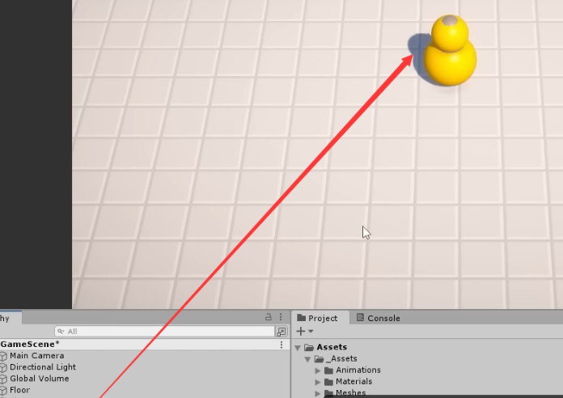
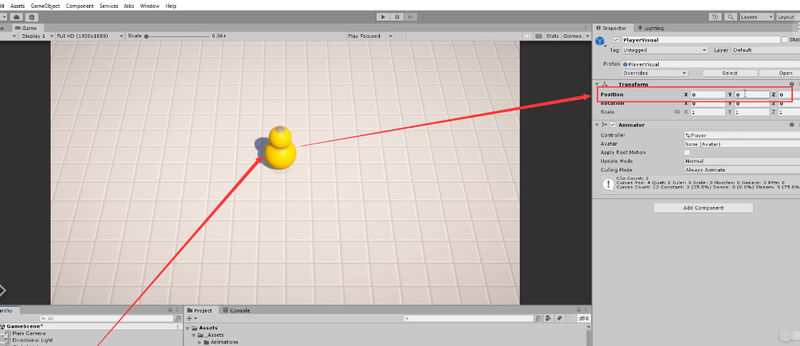
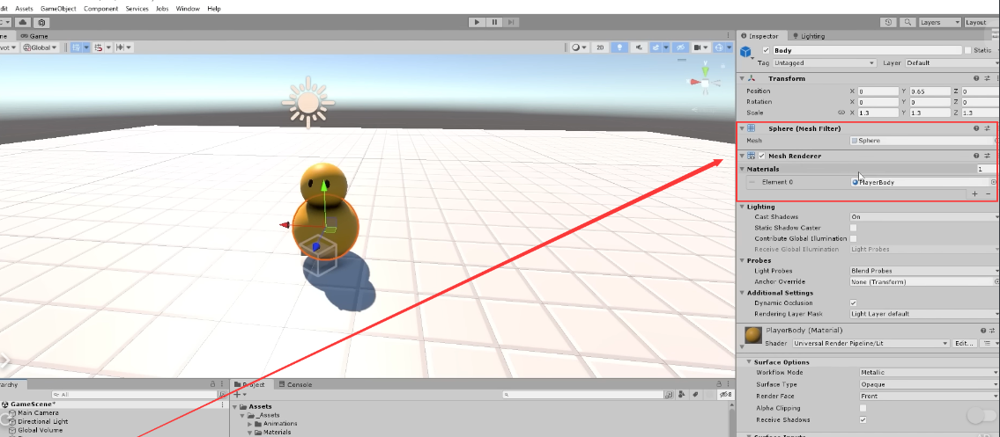
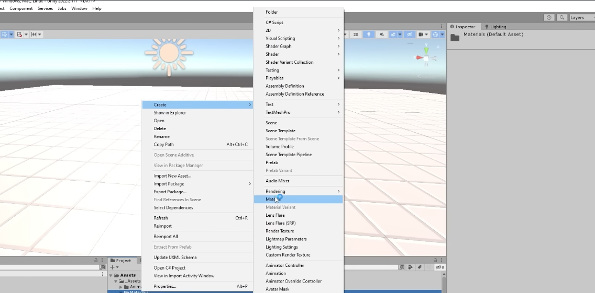
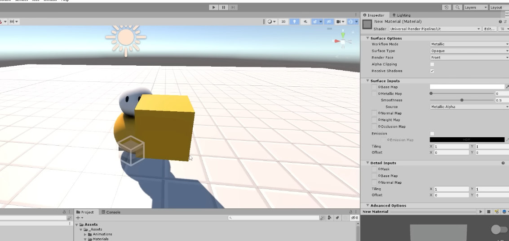

# Character Visual, Rotation

[1:15:00](https://www.youtube.com/watch?v=AmGSEH7QcDg&list=PLzDRvYVwl53vxdAPq8OznBAdjf0eeiipT&t=4501s&type=snipo)

## **引言**

- 欢迎，本节课程将教你如何替换角色的可视化模型。
- 我们将使用项目文件中的角色模型，将其放置到角色游戏对象中，实现角色可视化效果。
- 重要提示：确保可视化模型的位置在(0, 0, 0)，只有父级游戏对象应该移动，可视模型本身不应该移动。

## 一、替换角色视觉模型

### 操作步骤:

1. 将`Assets/Prefabs/Visuals`目录下的`PlayerVisual`预制体拖放到`Player`游戏对象下
    - 作为其子对象。
    
    
    
2. 确保`PlayerVisual`的坐标设置为`(0,0,0)`，以确保其位置正确相对于`Player`父游戏对象。
  
    
    
3. 移除原有的胶囊体视觉模型`Capsule`。
4. 运行测试场景，确认角色现在以球体模型呈现。

### 注意事项:

- 视觉效果应与功能逻辑相分离，替换模型时无需更改父对象的逻辑。
- 视觉模型的坐标必须设为`(0,0,0)`，确保无位置偏差。

## 二、材质相关知识点

### 1. **材质(Materials)与着色器(Shaders)基础**

- **材质**：在**`assets/material`**中，有不同颜色的**`player bodies`**材质用于表示不同玩家。
  
    
    
    
    
- **着色器**：材质使用着色器来决定如何在图形卡上渲染对象
    - 通常使用**`universal render pipeline`**（URP）下的**`standard light Shader`**。
      
        
        

### 2. **Unity中的材质操作**

- **Mesh Renderer**：**`Mesh Renderer`**组件中设置材质，决定了物体的视觉表现。
  
    
    
- **材质修改**：
    - 直接在**`Mesh Renderer`**中点击圆形图标选择材质.
    
    
    
    - 或者从项目窗口直接拖拽材质到对象上
    
    
    

### 3. **材质实例化注意事项**

- 若多个对象使用相同的材质，修改任一对象的材质属性会影响所有使用该材质的对象。
  
    
    
- 如果要单独设置，可以重新建立一个材料
  
    
    
    
    

### 4. **角色视觉调试**

- 测试角色视觉模型的移动与放置，确保一切正常。

## 三、**角色面部方向旋转**

- 让角色面部方向与自己的运动方向一致。

### 平滑**旋转实现**

- 在**`player script`**中，根据移动方向（**`move Direction`**）来调整角色的旋转。
- 旋转方法选择：通常使用**`transform.forward`**而非**`transform.rotation`**（使用四元数）或**`transform.eulerAngles`**（使用欧拉角）。
- **实现平滑旋转**：使用**`Vector3.Slerp`**方法来在旋转时添加平滑过渡效果。

### **平滑旋转代码示例**

- 在上一篇笔记后加上下面的代码。

```csharp
csharpCopy code
// 定义一个浮点数rotateSpeed，并给它赋值为10f，这个变量表示物体旋转的速度。
float rotateSpeed = 10f;

// 改变物体的前方向，使其朝向一个新的方向moveDir。
// 使用Slerp函数平滑地插值物体当前的前方向(transform.forward)和目标方向(moveDir)。
// Time.deltaTime * rotateSpeed 计算出一个根据旋转速度调整的时间因子，
// 确保无论帧率如何，旋转都能平滑进行。
transform.forward = Vector3.Slerp(transform.forward, moveDir, Time.deltaTime * rotateSpeed);
```

在上面这行代码中，**`transform.forward`** 表示物体的本地前方向，而 **`Vector3.Slerp`** 是一个在单位球面上进行球面线性插值的函数，它接收三个参数：

1. **`transform.forward`**：物体当前的前方向。
2. **`moveDir`**：目标方向，这个向量应该是一个单位向量（长度为1），表示物体希望面向的方向。
3. **`Time.deltaTime * rotateSpeed`**：插值因子，用于控制插值的速度。**`Time.deltaTime`** 表示自上一帧以来经过的时间，乘以 **`rotateSpeed`** 使得物体的转向速度与每秒的帧数无关，这样在不同性能的设备上都能有一致的旋转体验。

### **旋转效果测试**

- 测试角色移动时旋转效果，调整旋转速度以确保旋转平滑自然。