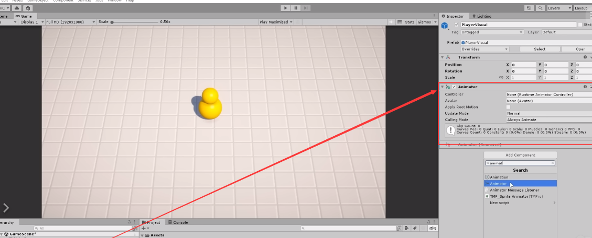
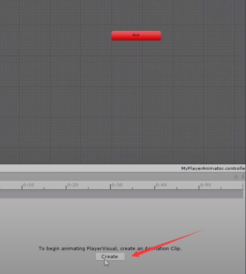
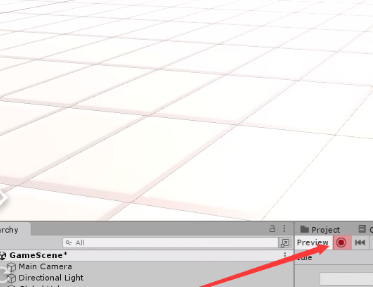
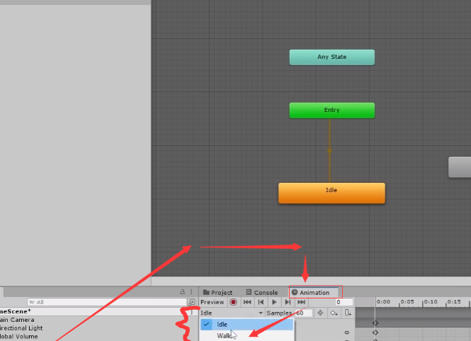
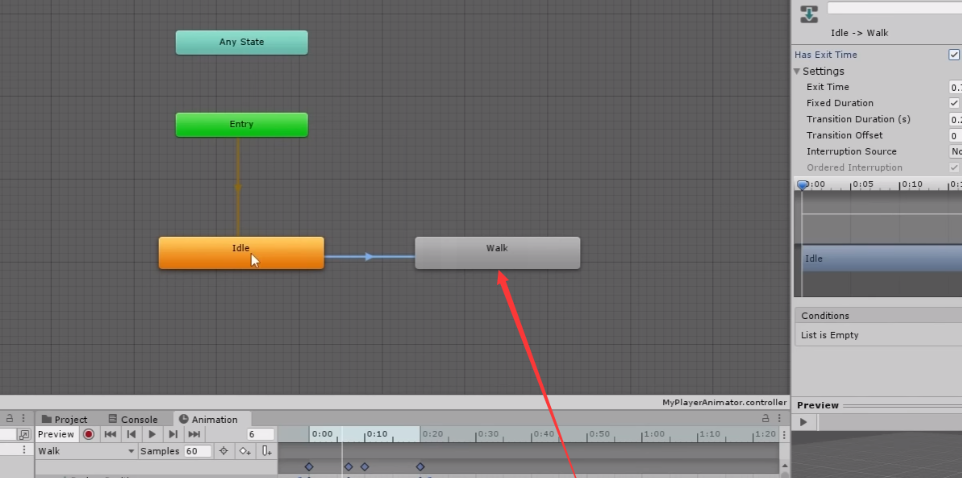

# Animations

[1:22:59](https://www.youtube.com/watch?v=AmGSEH7QcDg&list=PLzDRvYVwl53vxdAPq8OznBAdjf0eeiipT&type=snipo&t=4979s)

# 创建Animator Controller和动画状态

# 一、准备工作

1. 打开Unity项目，进入场景中的玩家角色。
2. 在玩家角色的可视对象（Visual）上添加Animator组件。
    - 先删除原来的，然后再创建新的。
    
    
    
3. 创建一个新的Animator Controller，命名为"MyPlayerAnimator"。
  
    
    
    
    
- 拖拽文件
  
    
    
1. 双击打开Animator Controller
  
    
    
2. 创建一个新的动画状态，命名为"Idle"，并将其设置为默认状态。
3. 打开Animation窗口，选择玩家角色的可视对象，创建一个新的动画Clip，命名为"Idle"。
  
    
    
- 将新出来的页面拖下来
  
    
    
- 创建idle文件
  
    
    
    
    
    
    

# 二、创建动画

## 创建第一个动画

1. 在动画Clip中设置关键帧，例如，可以让角色的头部上下移动来制作一个呼吸动画。
    - **关于帧的知识补充**
      
        在Unity中，帧（Frames）是指游戏或应用程序在一秒内更新和渲染的次数。游戏通常以每秒60帧（FPS）或每秒30帧的速度运行，但这取决于游戏的性能要求和目标平台。以下是关于帧的一些重要知识点：
        
        - 下图中表示1s有60帧
          
            
            
        1. **帧率（Frame Rate）**：帧率是指每秒渲染的帧数。例如，60 FPS表示游戏每秒更新和渲染60次。更高的帧率通常意味着更流畅的游戏体验，但也需要更多的计算资源。
        2. **固定帧率 vs. 可变帧率**：在游戏中，有时会使用固定帧率（Fixed Frame Rate）或可变帧率（Variable Frame Rate）。固定帧率意味着游戏以固定的帧率运行，通常是60 FPS。可变帧率允许游戏根据需要自动调整帧率，以适应计算机性能或节省电池寿命。
        3. **Delta Time**：在Unity中，帧之间的时间间隔通常用DeltaTime来表示。DeltaTime是以秒为单位的时间，表示上一帧和当前帧之间的时间间隔。它用于平滑动画和物理模拟，因为它使对象的移动速度与帧率无关。
        4. **Fixed Update**：在Unity中，有一个特殊的固定更新函数称为FixedUpdate。它在固定的时间间隔内运行，而不受帧率的影响。这对于处理物理和其他需要固定时间步长的任务非常有用。
        5. **性能优化**：维护稳定的帧率对于游戏性能至关重要。如果帧率太低，游戏可能会感到卡顿。为了优化性能，可以采取各种措施，例如减少渲染负载，使用级别LOD（Level of Detail），或者优化代码以提高计算效率。
    - **recording一个动画**
      
        当在Unity中进行动画制作时，"recording"（记录）是一个关键步骤，用于创建关键帧和定义物体属性随时间的变化。以下是按照文本中的操作步骤介绍如何进行记录（recording）：
        
        - 前期准备或注意事项
          
          
            1. 打开Unity并打开您的项目。
            2. 在Unity中，您通常会在"Scene"窗口中创建或选择一个场景，然后选择要制作动画的游戏对象。在这个示例中，我们将假设您已经创建了一个游戏对象，如"Player"，并且想要记录其动画。
            3. **确保已经在场景中选择了要制作动画的游戏对象**。在这个示例中，选择"PlayerVisual"对象。
            4. 打开动画窗口：
                - 在Unity中，选择顶部菜单栏中的"Window"。
                - 从"Window"菜单中选择"Animation"，然后选择"Animation"窗口。
            5. 在"Animation"窗口中，您将看到一个时间轴（Timeline）和一些控制按钮。确保时间轴显示了游戏对象的动画时间线。
            6. 启用"Recording"模式：
                - 在"Animation"窗口中，找到并点击位于顶部工具栏的"Record"按钮。
                - 启用"Recording"模式后，时间轴上会出现红色的进度条，表示您在记录动画。
                
                
            
        - recording模式下记录动画
          
          
            1. 在"Recording"模式下，您可以逐帧记录游戏对象的属性变化。
                - 例如，您可以记录位置、旋转、缩放等属性。
                    - 更改属性时，**Unity会自动在时间轴上创建关键帧**。
                - 为了创建平滑的动画过渡，您可以在时间轴上创建多个关键帧，
                    - 然后Unity将在这些关键帧之间插值属性值。
                - 可使用时间轴上的游标来导航到不同的时间点，
                    - 并在不同时间点记录不同的关键帧。
                
                
                
                - 在记录完所需的动画之后，禁用"Recording"模式。
                    - 在"Animation"窗口中，再次点击"Record"按钮以停止记录。
            2. 现在，您可以在动画窗口中预览您所创建的动画。通过点击播放按钮或拖动游标，您可以查看动画的效果。
              
                
                
            3. 最后，您可以将这个动画保存为一个动画剪辑（Animation Clip），以便在游戏中使用。在"Animation"窗口中，点击"Add Property"按钮以添加要包含在动画剪辑中的属性。
            - 补充细节: 给身体添加一个静止关键帧
              
                
                
            
    

## 创建第二个动画

### **创建walk动画**

1. 在Project窗口,选择idle动画,按快捷键Ctrl+D进行复制
    - 将复制的动画重命名为walk
2. 在Hierarchy窗口中选择PlayerVisual模型游戏对象
    - 在project文件夹下，将walk拖入动画状态机（Animator State Machine）的视图
      
        
        
    
    
    
3. 在Animation窗口中,从动画下拉列表中选择walk
  
    
    
4. 点击Record开启录制
    - 在Timeline上,选择0帧,拖动body游戏对象
        - 此处保持不动即可
    - 拖动时间线到大约30帧位置,也就是0.5秒处
        - 再次拖动body游戏对象,在该帧记录位置变化
        - 此处整个body向上移动一部分
    - 在时间线最后,
        - 让body回到原来位置
    
    
    
5. 这样就制作了一个身体上下移动的循环walk动画

### **调整walk动画**

1. 在Timeline上选择所有关键帧,拖动selection工具
2. 将所有关键帧移近,压缩在20帧内,使运动更快
3. 可以点击播放按钮预览动画效果
  
    
    
    - 补充细节：
      
        
        

# 二、为不同动画设置情景触发条件

- 当移动时，2个动画都被出发
- 当静止时，只有第一个动画被触发

## 创建Bool参数

1. 在Animator窗口,点击Parameters选项卡
2. 点击左上角的“+”号,选择创建Boolean参数
3. 参数命名为IsWalking
  
    
    

## idle到walk

1. 选择idle到walk的transition
2. 在Conditions中点击“+”号
3. 选择isWalking参数,设置条件为true
  
    
    

## walk到idle

1. 选择walk到idle的transition
2. 在Conditions中点击“+”号
3. 选择isWalking参数,设置条件为false
  
    
    

## 测试

- 没有选中IsWalking时，执行第一个头部动画
  
    
    
- 选中IsWalking后，执行Walk动画
  
    
    

# 三、新建修改脚本

## 修改Player脚本

### 新的Player脚本

```csharp
using System.Collections;
using System.Collections.Generic;
using UnityEngine;

public class Player : MonoBehaviour
{
    [SerializeField]
    private float moveSpeed = 1f; // 移动速度

    private bool isWalking;

    // Update is called once per frame
    void Update()
    {
        Vector2 inputVector = new Vector2(0, 0); // 初始化输入向量为0

        // 获取玩家的输入，并更新输入向量
        if (Input.GetKey(KeyCode.W))
        {
            inputVector.y += 1; // 向前移动
        }
        if (Input.GetKey(KeyCode.S))
        {
            inputVector.y -= 1; // 向后移动
        }
        if (Input.GetKey(KeyCode.A))
        {
            inputVector.x -= 1; // 向左移动
        }
        if (Input.GetKey(KeyCode.D))
        {
            inputVector.x += 1; // 向右移动
        }

        // 将输入向量标准化，以防斜向移动时速度增加
        inputVector = inputVector.normalized;

        // 将2D输入向量转换为3D移动方向，其中Y轴的输入对应Z轴的移动
        Vector3 moveDir = new Vector3(inputVector.x, 0f, inputVector.y);

        // 移动玩家位置
        transform.position += moveDir * moveSpeed * Time.deltaTime; // 使用deltaTime以确保帧率独立的移动

 

        float rotateSpeed = 10f;
        transform.forward = Vector3.Slerp(transform.forward, moveDir, Time.deltaTime * rotateSpeed);

    }

    public bool IsWalking()
    {
        return isWalking;
    }
}
```

### 在旧脚本基础上****************************添加的内容****************************

```csharp
private bool isWalking;   

isWalking = moveDir != Vector3.zero;    

public bool IsWalking()
    {
        return isWalking;
    } 
```

### **分析其作用**

在这段代码中，`isWalking` 是一个私有的布尔变量，它被用来跟踪玩家是否正在移动。以下是 `isWalking` 变量相关代码部分的作用分析：

1. `private bool isWalking;`
  
    这行声明了一个私有的布尔变量 `isWalking`。由于它是私有的，它只能在 `Player` 类内部被访问和修改。私有变量通常用于封装，即隐藏类的实现细节。
    
2. `isWalking = moveDir != Vector3.zero;`
  
    在 `Update` 方法的每一帧调用中，`isWalking` 被设置为 `true` 或 `false`。如果 `moveDir`（移动方向向量）不等于 `Vector3.zero`，这意味着玩家已经输入了移动指令，`isWalking` 将被设置为 `true`。如果 `moveDir` 等于 `Vector3.zero`，则没有移动发生，`isWalking` 将为 `false`。此逻辑检查玩家是否在移动中。
    
3. `public bool IsWalking() { return isWalking; }`
  
    这是一个公共的访问器方法，它允许其他类查询 `Player` 对象的移动状态。即使 `isWalking` 变量是私有的，这个公共方法仍然允许外部代码获取其值，而不允许修改它。这也是一种封装的形式，它提供了一个安全访问类内部状态的方式。
    

综上所述，`isWalking` 变量和相关的方法用于：

- 跟踪玩家是否正在移动。
- 通过 `IsWalking()` 方法提供一种方式，让其他类能够获取这个状态，但不能修改它。

例如，在 `PlayerAnimator` 类中，`player.IsWalking()` 方法的返回值用于决定是否应该播放行走动画。当 `isWalking` 为 `true` 时，动画状态机（Animator）会播放行走动画；当它为 `false` 时，则不播放。

Vector3.zero是什么含义

- 也就是该变量表示的是玩家的运动方向与速度，并不是具体的位置
- 

完全正确。在 Unity 中，`moveDir` 这个变量是用来表示玩家的运动方向和速度的向量。它不是玩家在游戏世界中的具体位置，而是从玩家当前位置出发的移动量（即速度和方向的组合）。

每帧更新玩家位置时，当前位置 `transform.position` 会根据这个 `moveDir` 向量和移动速度 `moveSpeed` 以及帧时间 `Time.deltaTime` 来计算新位置。这个过程可以理解为：

1. 计算这一帧玩家应该移动多远（`moveDir * moveSpeed * Time.deltaTime`）。
2. 把这个计算出来的移动量加到玩家当前的位置上（`transform.position += ...`）。

当 `moveDir` 等于 `Vector3.zero` 时，它表示的是一个没有方向和大小的向量，也就是说这一帧玩家不移动。因此，`transform.position` 在这一帧中保持不变，玩家保持静止。

## 创建PlayerAnimator脚本

### **脚本代码**

```csharp
using System.Collections;
using System.Collections.Generic;
using UnityEngine;

// 定义一个PlayerAnimator类，它继承自MonoBehaviour，可以附加到Unity的游戏对象上。
public class PlayerAnimator : MonoBehaviour
{

    // 定义一个常量字符串，用作Animator参数的名称。
    private const string IS_WALKING = "IsWalking";

    // 通过SerializeField特性，使得在Unity编辑器中可以设置player变量，但在其他脚本中保持私有。
    [SerializeField] private Player player;

    // 声明一个Animator类型的私有变量，用于控制动画。
    private Animator animator;

    // Awake是MonoBehaviour的一个生命周期方法，在对象初始化时被调用。
    private void Awake()
    {
        // 获取这个游戏对象上的Animator组件。
        animator = GetComponent<Animator>();
    }

    // Update是MonoBehaviour的另一个生命周期方法，在每一帧被调用。
    private void Update()
    {
        // 设置Animator的IsWalking参数，该参数决定是否应该播放行走动画。
        // player.IsWalking()的结果决定了动画的播放与否。
        animator.SetBool(IS_WALKING, player.IsWalking());
    }
}
```

### **代码解析**

在Unity中，Animator组件中的`parameters`是动画控制器（Animator Controller）使用的变量，它们用来控制动画状态机（Animator State Machine）中的状态转换。`parameters`可以是布尔值（bool）、整型（int）、浮点数（float）或触发器（trigger）。

在你提供的 `PlayerAnimator` 脚本里，`IS_WALKING` 字符串常量是对应Animator中一个名为 `"IsWalking"` 的布尔型`parameter`。你的代码通过调用 `animator.SetBool` 方法，与这个参数进行交互。

以下是详细步骤：

1. 在Animator Controller中创建一个布尔类型的Parameter，并命名为`"IsWalking"`。
2. 在 **`Awake`** 方法中，脚本通过 **`GetComponent<Animator>()`** 获得了附加在同一个游戏对象上的 **`Animator`** 组件的引用。
3. 在状态机中，你会设置一些转换条件，这些条件依赖于`"IsWalking"`参数。比如，当`"IsWalking"`为`true`时，状态机可能从“Idle”（静止）状态转换到“Walk”（行走）状态。
4. 在你的`PlayerAnimator`脚本中，你定义了一个与Animator参数名相同的字符串常量`IS_WALKING`。
5. 在每个`Update`调用中，`PlayerAnimator`脚本通过`animator.SetBool`方法设置`"IsWalking"`参数的值。脚本检查`player.IsWalking()`方法的返回值，如果玩家正在行走，它返回`true`；否则返回`false`。
6. 当`animator.SetBool(IS_WALKING, player.IsWalking())`被调用时，它实际上是告诉Animator的`"IsWalking"`参数设置为`player.IsWalking()`返回的值。

通过这种方式，`PlayerAnimator`脚本控制Animator参数`"IsWalking"`，根据玩家是否正在行走来决定是否播放行走动画。这样，Animator控制器的状态机就可以根据`"IsWalking"`参数的值，切换到合适的动画状态。

## ⭐脚本完成后重点


### 解析

根据提供的Unity编辑器的截图，可以看到`PlayerAnimator`脚本被附加到了名为“PlayerVisual”的游戏对象上，并且在`PlayerAnimator`脚本的Inspector（检视器）窗口中，已经将`Player`脚本组件拖拽到了相应的`Player`字段中。

这样做的目的是为了在`PlayerAnimator`脚本内部建立对`Player`脚本的引用。这个引用使得`PlayerAnimator`能够调用`Player`脚本中的`IsWalking()`方法来获取玩家是否在行走的状态，并据此来设置Animator中的`IsWalking`参数，控制对应的行走动画是否播放。

当你按照这样的方法设置好之后，Unity游戏运行时，`PlayerAnimator`脚本就能够依据玩家的行走状态来正确地控制动画的播放了。这是Unity编辑器提供的一种可视化操作方式，可以很直观地在游戏对象之间建立关联，而无需编写额外的代码来实现这种关系的建立。