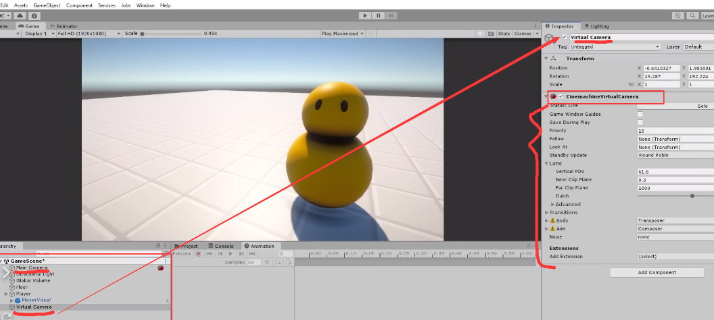
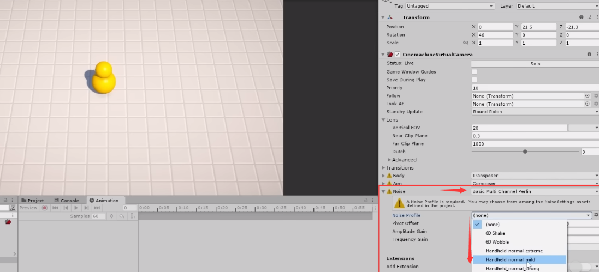

# Cinemachine

[1:42:42](https://www.youtube.com/watch?v=AmGSEH7QcDg&list=PLzDRvYVwl53vxdAPq8OznBAdjf0eeiipT&type=snipo&t=6162s)

以下是根据您提供的文本内容，用中文制作的详细教学笔记：

### 安装Cinemachine

- 打开Unity编辑器。
- 通过`窗口(Window)`菜单，打开`包管理器(Package Manager)`。
- 确保在`Unity注册表(Unity Registry)`中。
  
    
    
- 在`全部(All)`标签页下，找到并选择`Cinemachine`。
  
    
    
- 点击`安装(Install)`，安装Cinemachine包。

### Cinemachine基本使用

- Cinemachine不会移动相机，适用于固定相机视角的游戏。
- 在游戏对象(Game Object)菜单中，找到`Cinemachine`，创建一个`虚拟相机(Virtual Camera)`。
  
    
    

### Cinemachine虚拟相机

- 创建后，虚拟相机会出现在层级视图(Hierarchy)中。
- 虚拟相机有一个`Cinemachine Virtual Camera`组件。
- 主相机(Main Camera)会自动添加`Cinemachine Brain`组件。
- Cinemachine通过控制主相机来实现效果。
  
    
    

### 主相机与虚拟相机的关系

- 使用Cinemachine后，不能直接修改主相机属性。
- 必须通过虚拟相机来修改视角、位置等参数。
    - 也就意味着main Camera的调整面板失效
    - 仅可以通过Cinemachine来间接控制camera
    

### 配置虚拟相机

- 可以调整虚拟相机的`视场(Field of View)`、`位置(Position)`和`旋转(Rotation)`。
- 修改虚拟相机的属性会实时反映到主相机上。
  
    
    

### 添加动态效果

- 在`Cinemachine Virtual Camera`组件中，可以添加`Noise`噪声
    - 使相机动态地微动，增加游戏动态感。
    
    
    
- 可以实时调整噪声参数，观察效果。
  
    
    
    
    

### 跟随玩家的相机

- 本教程，使用的相机是静止不动的
- 这里仅仅演示如何创建可以跟随玩家的相机

1. **创建第二个虚拟相机**：
    - 在Unity编辑器的层级视图(Hierarchy)中创建一个新的`Cinemachine Virtual Camera`。
2. **设置虚拟相机的优先级**：
    - 在新创建的虚拟相机的`Cinemachine Virtual Camera`组件中
    - 将`Priority`（优先级）设置为比其他任何相机都高的值。
        - 例如，如果你的主虚拟相机的优先级是10
        - 那么你可以将这个新的虚拟相机的优先级设置为20。
3. **配置虚拟相机跟随玩家**：
    - 在`Cinemachine Virtual Camera`组件的`Body`选项卡中
        1. 选择`Transposer`作为跟随模式
            - buliding mode选择为work space
        2. 在`Transposer`的follow offset中设置调整偏移量
            - 设置相机在玩家上方和后方的位置。
4. **配置虚拟相机的目标**：
    - 在`Cinemachine Virtual Camera`组件
        1. 设置`Follow`属性，将Player对象拖拽到该属性框中，这样相机就会在游戏中跟随玩家
        2. 在的`Aim`选项卡中，也将玩家对象设置为目标，以确保相机始终指向玩家。
5. **测试虚拟相机的跟随效果**：
    - 进入游戏模式，观察虚拟相机是否按照预期跟随玩家。
    - 如果虚拟相机没有按预期工作，返回编辑器并调整`Body`和`Aim`设置。
6. **平滑过渡到新的虚拟相机**：
    - 如果需要在不同的虚拟相机之间进行切换，可以通过调整`Cinemachine Brain`组件上的混合设置来平滑过渡。
    - 通过启用或禁用相机的游戏对象，或者通过改变相机的优先级来控制哪个虚拟相机是活跃的。

### 简化游戏开发

- 使用Cinemachine可以极大简化相机控制的开发工作。
- 支持复杂相机逻辑的快速实现，提高开发效率。

### 下一步

- 学习如何重构代码和实现新的输入系统。