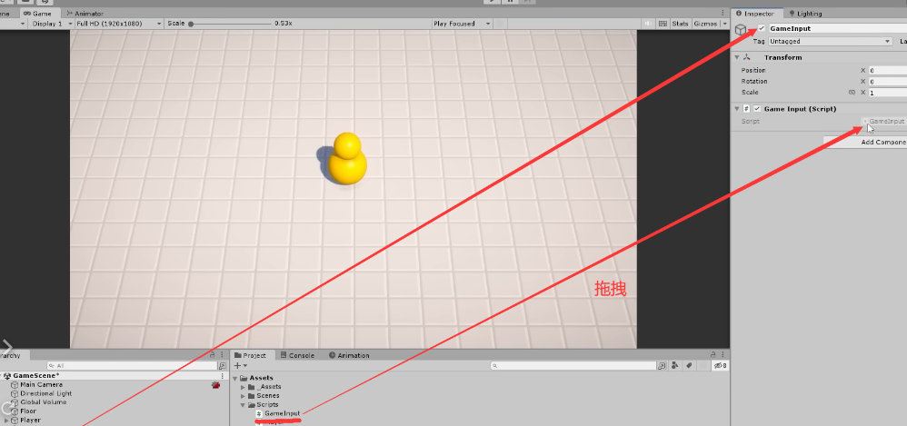
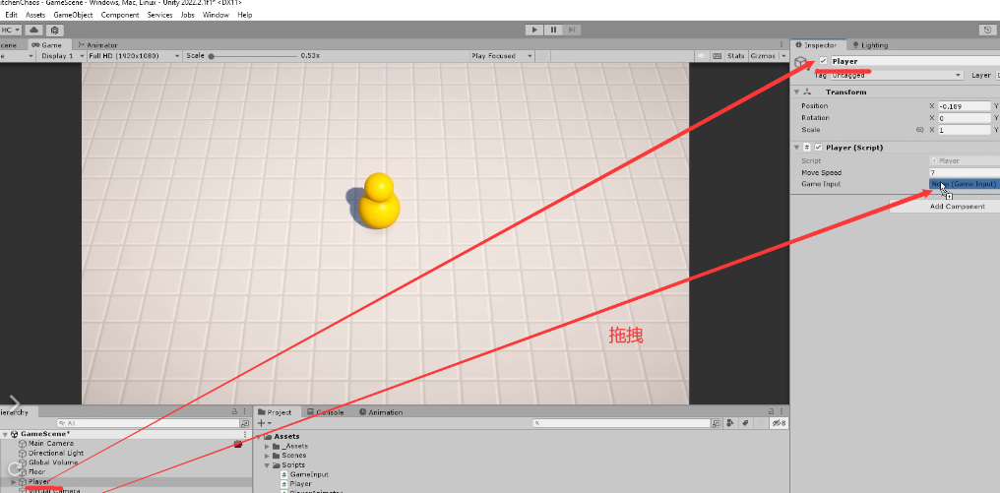
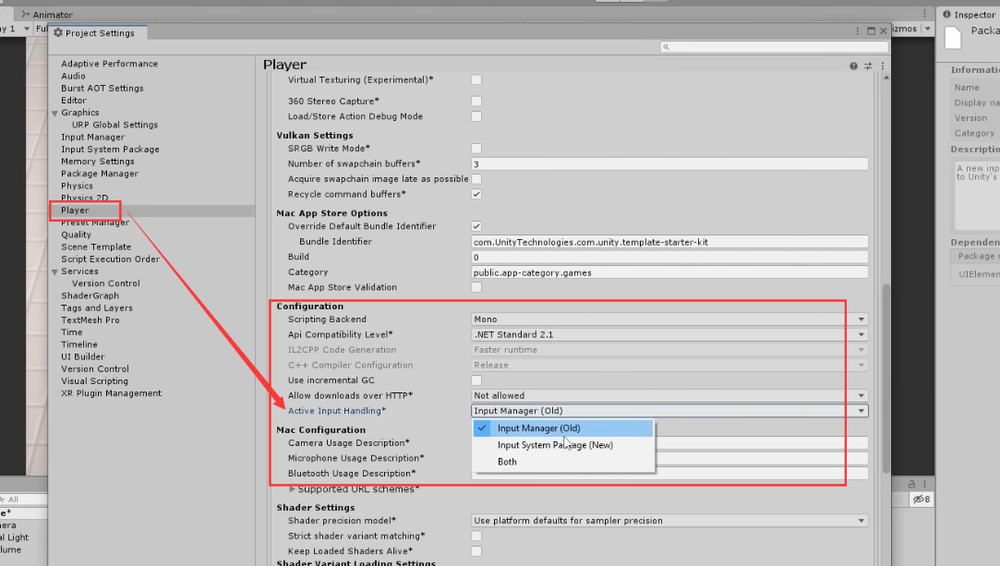
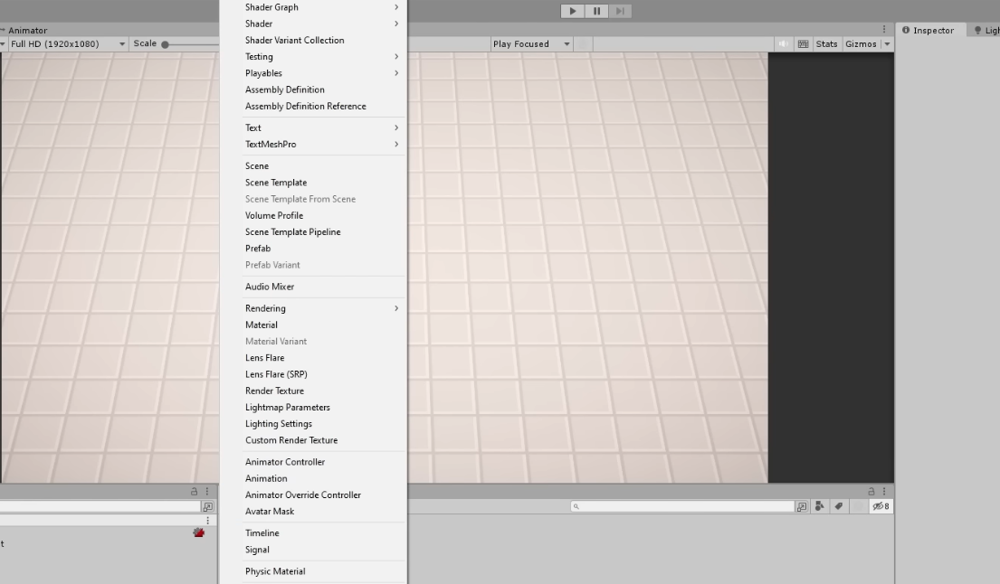
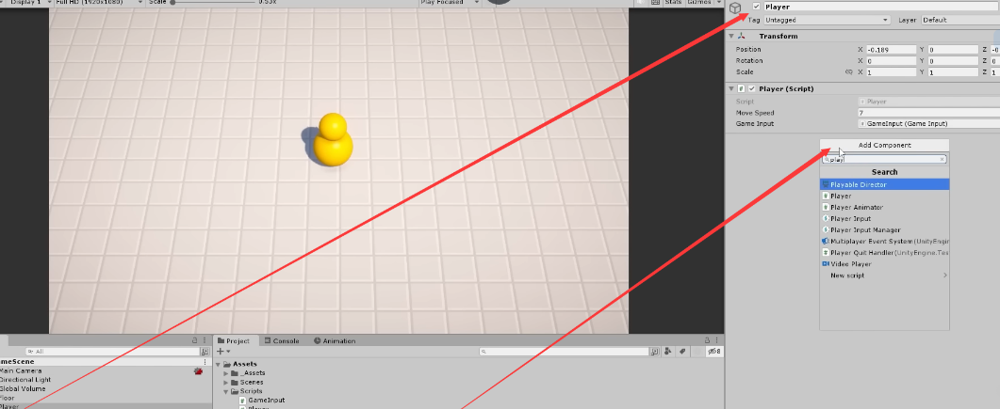
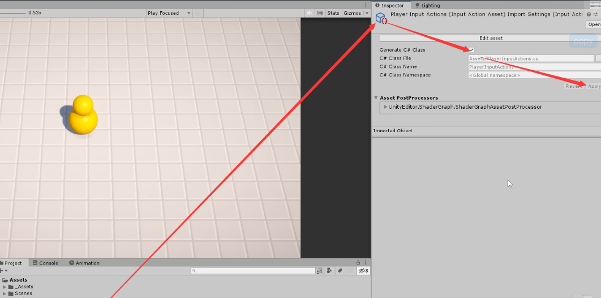
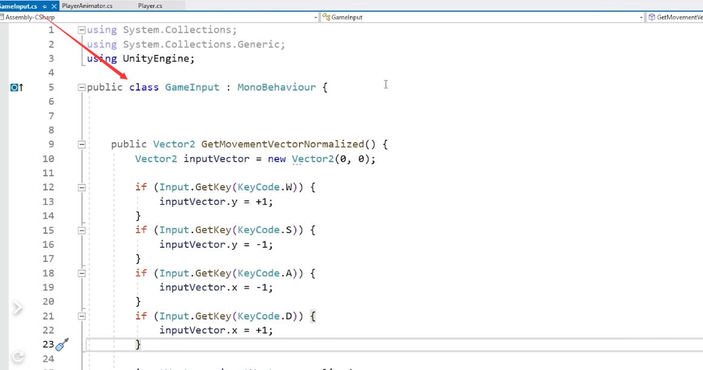

# Input System Refactor

[1:48:32](https://www.youtube.com/watch?v=AmGSEH7QcDg&list=PLzDRvYVwl53vxdAPq8OznBAdjf0eeiipT&type=snipo&t=6512s)

- Unity新输入系统重构教程详细操作笔记

## **1.** 目标：

- 将角色控制器从Legacy输入管理器迁移到新输入系统。

## 2. 创建`GameInput`脚本

- 新建C#脚本，命名为`GameInput`。
- 移动Player类中的输入处理代码到`GameInput`。
  
    ```csharp
    public class GameInput : MonoBehaviour {
        // 定义一个公共方法，返回一个Vector2类型的值，代表经过归一化处理的移动向量
        public Vector2 GetMovementVectorNormalized() {
            // 初始化一个新的二维向量inputVector为(0, 0)
            Vector2 inputVector = new Vector2(0, 0);
    
            // 检测是否按下W键，若按下则设置inputVector的y分量为1
            if (Input.GetKey(KeyCode.W)) {
                inputVector.y = +1;
            }
            // 检测是否按下S键，若按下则设置inputVector的y分量为-1
            if (Input.GetKey(KeyCode.S)) {
                inputVector.y = -1;
            }
            // 检测是否按下A键，若按下则设置inputVector的x分量为-1
            if (Input.GetKey(KeyCode.A)) {
                inputVector.x = -1;
            }
            // 检测是否按下D键，若按下则设置inputVector的x分量为1
            if (Input.GetKey(KeyCode.D)) {
                inputVector.x = +1;
            }
    
            // 将inputVector向量归一化，保持方向不变，但长度为1
            inputVector = inputVector.normalized;
    
            // 返回归一化后的移动向量
            return inputVector;
        }
    }
    
    ```
    
    - 这段代码定义了一个Unity的组件类`GameInput`
        - 其中包含一个方法`GetMovementVectorNormalized`。
        - 这个方法检测玩家是否按下了W、A、S、D这四个方向键，并据此创建一个表示方向的二维向量`inputVector`。
        - 最后，这个向量被归一化，并作为方法的返回值。归一化意味着向量的长度被调整为1，这常用于确保不同方向的移动速度相同。

## 3. 创建`GameInput`游戏对象

- 在Unity中创建空游戏对象，并命名为“GameInput”。
- 将`GameInput`C#脚本**拖拽**到这个游戏对象上。
  
    
    

## 4. 修改`Player`类

- 从`Player`类中移除输入处理代码。
- 添加`GameInput`类型的序列化私有字段。
  
    这段代码是Unity中的`Player`类，以下是对应的注释：
    
    ```csharp
    // 定义Player类，继承自MonoBehaviour，使其能够附加到Unity游戏对象上
    public class Player : MonoBehaviour {
        // 声明一个序列化的私有浮点数，表示玩家移动速度，可以在Unity编辑器中设置
        [SerializeField] private float moveSpeed = 7f;
    
        // 声明一个序列化的私有GameInput字段，允许在Unity编辑器中连接GameInput组件
        [SerializeField] private GameInput gameInput;
    
        // 私有布尔变量，用于追踪玩家是否在行走
        private bool isWalking;
    
        // Unity的Update方法，每帧调用一次
        private void Update() {
            // 调用GameInput组件的GetMovementVectorNormalized方法来获取归一化的移动向量
            Vector2 inputVector = gameInput.GetMovementVectorNormalized();
    
            // 将二维的inputVector转换为三维向量，用于玩家移动
            Vector3 moveDir = new Vector3(inputVector.x, 0f, inputVector.y);
    
            // 更新玩家位置，通过当前位置加上移动方向乘以移动速度和时间差
            transform.position += moveDir * moveSpeed * Time.deltaTime;
    
            // 设置isWalking为真当移动方向不是零向量，否则为假
            isWalking = moveDir != Vector3.zero;
    
            // 声明一个浮点数，表示旋转速度
            float rotateSpeed = 10f;
    
            // 平滑旋转玩家朝向，朝向移动方向
            transform.forward = Vector3.Slerp(transform.forward, moveDir, Time.deltaTime * rotateSpeed);
        }
    
        // 公共方法，返回玩家是否在行走的状态
        public bool IsWalking() {
            return isWalking;
        }
    }
    
    ```
    
    - 这段代码主要负责处理玩家的移动和旋转逻辑。
    - 通过序列化字段允许在Unity编辑器中调整参数，同时包含用于获取和处理玩家输入的方法
    - 每帧更新玩家的位置和朝向，并提供一个公共方法来检查玩家是否正在行走。
- 在Unity编辑器中，将**`GameInput`**游戏对象拖拽到**`Player`**类的对应字段上。
  
    
    

## 5. 安装和启用新输入系统

- 通过Unity包管理器安装新输入系统。
  
    
    
    
    
    
    
- 在项目设置中启用“Both”输入系统。
  
    
    
    
    
    这张图片看起来是Unity游戏引擎中的一部分设置界面的截图。红框标出的部分是“Active Input Handling”，它的作用是让你选择Unity项目中使用的输入系统。
    
    Unity提供了两种输入系统：
    
    1. **Input Manager (Old)**: 这是Unity早期版本的输入系统，它使用`Input`类来处理输入。这个系统在Unity中已经存在很长时间了，许多早期的教程和项目都是基于它的。它通过`Edit > Project Settings > Input`来配置，允许你设置键盘、鼠标、游戏手柄等的输入映射。
    2. **Input System Package (New)**: 这是Unity新推出的输入系统，提供了更多的灵活性和功能。它通过一个独立的包`com.unity.inputsystem`提供，可以处理更复杂的输入设备和场景。新的输入系统需要你安装Input System包，并且使用不同的API来读取输入。
    3. **Both**: 选择这个选项意味着你的项目将同时支持旧的Input Manager和新的Input System Package。这在过渡期间特别有用，比如你想要在现有使用旧输入系统的项目中逐步引入新的输入系统。但是，同时使用两种系统可能会导致冲突和预期之外的行为，因此在最终发布产品之前，推荐只选择一种输入系统。
    
    选择哪种输入系统取决于你的项目需求，以及你对哪个系统更熟悉。新的输入系统提供了更高的灵活性和更好的设备支持，但是它可能需要更多的学习和适应。旧的输入系统则更简单，对于简单的项目来说可能已经足够了。
    

## 6. 配置输入动作资产

### 6.1 创建“Input Actions”资产

- 在Unity编辑器的项目视图中，右击选择"Create"（创建）。
- 在菜单中选择"Input Actions"（输入动作）。
  
    
    
- 命名新创建的资产为`PlayerInputActions`。
  
    
    

### 6.2 配置“Input Actions”资产

- 双击`PlayerInputActions`资产，打开输入动作编辑器。
- 在"Action Maps"（动作映射）区域点击"+"号，创建新的动作映射，例如命名为"Player"。
- 添加动作
    - 在"Player"动作映射下，点击"+"号添加新动作。
    - 命名新动作，例如"Move"。
    
    
    

### 6.3 配置动作属性

- 选择"Move"动作，设置"Action Type"（动作类型）为"Value"（值）。
- 设置"Control Type"（控制类型）为"Vector2"。
  
    
    
    红框部分位于Unity的Input Actions编辑器内，这些选项用于定义一个具体的输入动作（Action）的属性。
    
    - **Action Type**: 这里指定动作的类型。对于“Value”类型，它表示这个动作是基于一个值的，比如一个轴的位置或者一个连续的输入值，而不是一个简单的按钮按下或释放。
    - **Control Type**: 这定义了期望的输入控制类型。在这个例子中，“Vector2”意味着该动作期望接收一个二维向量的输入，这通常用于处理有两个方向的输入，比如左摇杆或者WASD键盘输入。
    - **Interactions**: 这个部分允许你为动作指定额外的交互方式，例如长按、双击等。
    - **Processors**: 处理器用于在输入被最终消费之前对其进行预处理，比如标准化、去死区处理等。
    
    这些设置允许开发者详细地配置每个动作的行为，从而精确控制游戏内的输入响应方式。
    

### 6.4 添加键盘绑定


- 在"Move"动作下，点击"+"号添加新的绑定，将其名为为WASD。
  
    
    
- 选择"WASD"键或箭头键，设置适当的监听路径。
  
    
    

### 6.5 保存设置

- 确保所有设置都已正确配置。
- 保存`PlayerInputActions`资产。
  
    
    

## 7. 添加创建的输入系统

1. **利用Player Input组件**：
    - 可以将Player Input组件添加到游戏对象上。
      
      
        
        
    - 将先前创建的`PlayerInputActions`资产附加到该组件。
    - 设置不同的输入行为，如“Send Messages”，“Broadcast Events”等。
2. **使用C#脚本**：
    - 在`PlayerInputActions`资产中，启用生成C#类的选项。
      
        
        
    - 应用更改后，Unity会自动生成对应的C#脚本。
      
        
        
    - 在游戏的输入处理脚本中实例化自动生成的C#类。

## 8. 代码重构以使用新输入系统



- 重构后的代码

以下是为您提供的代码片段添加注释的示例：

```csharp
// GameInput类继承自MonoBehaviour，因此可以直接附加到Unity GameObject上。
public class GameInput : MonoBehaviour {

    // playerInputActions用于存储PlayerInputActions的实例，
    // 这是从Unity新输入系统自动生成的类。
    private PlayerInputActions playerInputActions;

    // Awake是MonoBehaviour的一个生命周期方法，
    // 它在对象实例化后立即被调用。
    private void Awake() {
        // 实例化PlayerInputActions类，以便我们能够使用它来读取玩家的输入。
        playerInputActions = new PlayerInputActions();
        // 启用PlayerInputActions中的Player动作映射，
        // 以便能够开始监听相关的输入动作。
        playerInputActions.Player.Enable();
    }

    // GetMovementVectorNormalized方法用于获取玩家的移动输入，
    // 并返回一个二维向量，该向量表示移动方向和幅度。
    public Vector2 GetMovementVectorNormalized() {
        // 从Player动作映射中读取Move动作的当前值，
        // 并将其存储在一个Vector2变量中。
        Vector2 inputVector = playerInputActions.Player.Move.ReadValue<Vector2>();

        // 将inputVector标准化，确保其长度（幅度）为1，
        // 如果输入是对角线移动，这将保证不会超过正常速度。
        inputVector = inputVector.normalized;

        // 返回标准化后的输入向量。
        return inputVector;
    }
}

```

这段代码实现了使用Unity的新输入系统来获取玩家的移动输入，并将其标准化以用于进一步处理。通过这种方式，无论玩家使用键盘、游戏手柄还是其他输入设备，都可以保持一致的移动行为。

1. **初始化输入处理类**：
    - 在`GameInput`类中，创建`PlayerInputActions`对象实例。
    - 在`Awake`方法中，构造新的`PlayerInputActions`对象。
2. **启用输入动作映射**：
    - 在`GameInput`类中的`Awake`方法，调用`playerInputActions.Player.Enable()`来启用玩家动作映射。
        - **`playerInputActions`**：这是**`PlayerInputActions`**类的一个实例，这个类是由Unity根据开发者在输入系统编辑器中定义的输入设置自动生成的。该实例包含了所有预定义的动作映射和动作。
        - **`.Player`**：这是**`playerInputActions`**中的一个动作映射。动作映射是一组相关联的动作（如“Move”或“Jump”），通常对应于游戏中的一个特定上下文（如玩家控制或菜单导航）。
        - **`.Enable()`**：这个方法用于激活动作映射，使其开始监听对应的输入设备，并根据定义的绑定响应玩家的操作。简而言之，它让这个动作映射变得“活跃”，能够接收并处理输入事件。
3. **读取输入值**：
    - 实现`GetMovementVector`方法，从`playerInputActions.Player.Move`动作读取输入值。
    - 使用`ReadValue<Vector2>()`方法获取动作的当前值。
4. **在游戏中测试输入**：
    - 运行游戏并测试是否可以通过键盘和游戏手柄控制角色。
    - 确认新输入系统的所有配置均能正确响应。


## 9. **添加额外的输入绑定**：

- 在`PlayerInputActions`编辑器中，为“Move”动作添加键盘和游戏手柄的绑定。
- 为键盘添加“WASD”和箭头键。
    - 就是监听小键盘的上下左右
      
        
        
        
    
- 为游戏手柄添加如左摇杆的绑定。
    1. 打开`PlayerInputActions`资产：这是在Unity编辑器中创建的输入配置文件，包含了游戏中所有的用户输入动作。
    2. 添加新的绑定：
        - 在`Move`动作下点击“+”号来添加一个新的绑定。这个`Move`动作通常是您在`PlayerInputActions`资产中已经定义的动作，用于控制角色或玩家对象的移动。
          
            
        
    3. 选择绑定类型：
        - 选择“Listen”模式，然后操作游戏手柄上的左摇杆。Unity将自动检测摇杆的运动并作为新的绑定路径录入。
        - 或者，您也可以手动从下拉列表中选择左摇杆的绑定路径，这通常会列出所有支持的游戏手柄按钮和轴。
    4. 保存设置：
        - 一旦绑定了左摇杆，确保保存您的`PlayerInputActions`资产以保存这些更改。
    5. 应用设置：
        - 为了让这些绑定在游戏中生效，您需要确保`PlayerInputActions`资产与游戏中处理输入的脚本相连接，并且这些脚本在运行时正确初始化并启用了这些动作映射。
    6. **保存和应用绑定设置**：
        - 确认所有绑定设置正确无误后，保存`PlayerInputActions`资产。
        - 通过自动或手动脚本编译来应用更改。

以上步骤总结了如何在Unity中利用新输入系统来重构代码，实现对玩家输入的处理，并确保能够适应多种输入设备。这些步骤旨在提高代码的灵活性和可维护性，同时也利用了Unity新输入系统提供的强大功能。