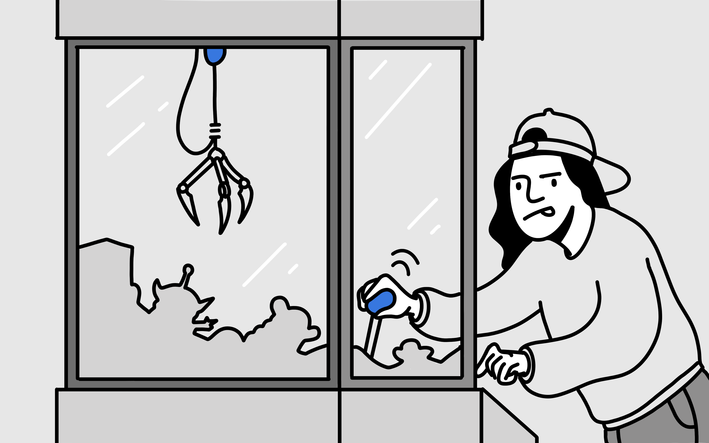
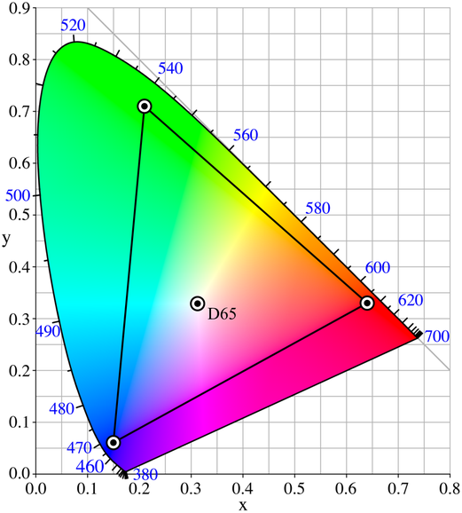
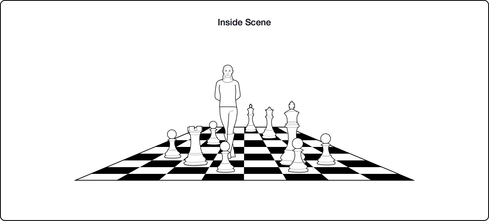

 Oculus VR 设计指南

本指南由字节跳动的四位同学共同翻译，[西瓜视频](https://www.ixigua.com/)的设计师们共同校对。

如果你对 XR 设计工作感兴趣，vivo 正在招聘 XR 方向的[人机交互设计师](https://hr.vivo.com/wt/vivo/web/templet1000/index/corpwebPosition1000vivo!gotoPostInfoForAjax?postId=143499&recruitType=2&brandCode=1)，当然如果你有其他的任何问题也欢迎和我聊聊看看。邮箱： fradser#[gmail.com](http://gmail.com/) 。

> VR 设计用户体验的最佳实践。 

# 沉浸式VR应用 

# [视觉](https://developer.oculus.com/resources/bp-vision/) 

本章节主要关于如何向用户展示你所设计的虚拟场景，由于其复杂性，我们将会提供必要的解释。 

### 利用单眼深度感知显示

无法正确地显示物体的立体感将破坏 VR 体验。立体视觉，即基于两只眼睛差异的而形成的深度感知，是最突出的深度感知，但它只是大脑处理深度信息的众多方式之一。 

大多数情况下，视觉深度感知是**单眼的**；也就是说，即使仅用一只眼睛观看物体，或者是双眼观看平面图像中的物体，它们也能有深度的感知。 

另一种深度感知是**运动视差**，或者叫做物体和不同距离时相对头部运动的不同快慢程度。 

其他深度感知还包括：**曲线透视**（直线延伸到远处时汇聚到一点）、**相对比例**（物体越远时越小）、**遮挡**（更近的物体挡住我们对更远物体的视线）、**空气透视**（远处的物体）由于大气的折射特性，看起来比近处的物体更暗）、**纹理梯度**（重复的图案在远离远处时变得更密集）和**照明**（高光和阴影帮助我们感知物体的形状和位置）。 

当前计算机的生成内容（例如在 Unreal 和 Unity 中创建的内容）利用了很多这些深度感知，我们之所以提到它们，是因为很容易忽视它们的重要性。如果实施不当，由于深度感知的冲突，体验可能会变得不舒服或难以观看。 

### 舒适的观看距离 

当眼睛聚焦在 VR 中的物体上时，以下两个问题对于理解眼睛舒适度至关重要：**调节需求**和**会聚需求**。 

调节需求是指你的眼睛必须调整晶状体保持清晰图像或随着距离变化聚焦物体的过程（这个过程称为调节）。 

会聚需求是指眼睛双眼同时向相反的方向运动，以获得或保持统一的双眼视力。当人物看一个物体时，眼睛必须围绕一个水平轴旋转，以便图像的投影在两只眼睛的视网膜中心。 

在现实世界中，这两者之间有很强的相关性；以至于我们有所谓的调节会聚反射：眼睛的会聚程度会影响眼睛晶状体的调节，反之亦然。 

VR 创造了一种不寻常的情况，将调节需求和会聚需求脱钩，用户在观看 VR 内容时，调节需求是固定的，但会聚需求可以改变的。这是因为用于创建三维物体感知的实际图像始终呈现在光学上保持相同距离的屏幕上，但是呈现给每只眼睛的不同图像仍然需要眼睛旋转，以便它们的视线会聚在各种不同的物体上，或者不同深度的平面上。 

VR 体验中不同的用户在感到不适前，调节需求和会聚需求的差异程度是不同的。为了防止眼睛疲劳，用户将长时间注视的对象（例如，菜单、环境中感兴趣的对象）应在至少 0.5 米远的地方进行渲染。许多研究表明对于用户可能会长时间关注的菜单和 GUI 来说，**1米是舒适的距离**。 

显然，一个完整的虚拟环境会渲染一些超出舒适范围的物体。只要用户不需要长时间专注于这些物体，它们就不会对大多数人造成不适。 

一些开发人员发现，用户在看东西时，**景深效果既可以让人身临其境，又可以让人感到舒适**。例如，你可能会人工地模糊用户调出的菜单后面的背景，或者模糊位于观看对象深度平面之外的对象。这不仅可以模拟你在现实世界中视觉的自然功能，还可以防止用户注意力之外的显着物体分散眼睛的注意力。 

当然，你无法控制选择不合理行为的用户——有些用户可能会站在距离物体几英寸远的地方并盯着它一整天。只要尽可能避免要求可能引起不适的场景就够了。 

### 远距离观察物体 

**在一定距离外深度感知变得不那么敏感**。近距离观察，立体视觉可以让你以**毫米**为单位分辨桌面上的两个物体中的哪一个更接近。如果距离放远就会更困难。比如你看公园对面的两棵树，它们可能是相距几米，你需要仔细观察才能准确地分辨出哪个更近或更远。在更大的尺度上，你可能无法判断山脉中的两座山中哪一座离你更近，直到差异达到千米。 

利用这种对远处深度感知的相对不敏感，通过**使用贴图代替全 3D 风景来节约计算的开销**。例如，你可以简单地将山的平面图片贴到一个平面上渲染到左右眼的图像，而不是在 3D 中渲染远处的山丘。该图像在 VR 中的视觉效果与传统 3D 游戏中的相同。 

> 注意：这些贴图的有效性将根据所涉及对象的大小、这些对象内部和周围的深度线索以及它们出现的情境而有所不同。你将需要对这些贴图的设计进行单独测试，以确保贴图看起来和感觉起来是对的。**确保贴图元素离相机足够远**以不显眼地融合在一起，并且真实场景元素和贴图元素之间的界面不会破坏沉浸感。 

### 渲染立体图像 

在现实世界中，我们经常面临每只眼睛都有不同焦点的情况，这通常没有什么问题。用一只眼睛偷看角落在 VR 中的效果与现实生活中一样。事实上，眼睛的不同焦点可能是有益的：假设你是一名特工（在现实生活或 VR 中），试图躲在高草丛中。你眼睛的不同视角使你可以“透过”草地观察周围环境，就好像草地甚至不在你面前一样。在 2D 屏幕上的视频游戏中做同样的事情可能会让世界完全被每一片草叶遮挡。 

尽管如此，VR（与任何其他立体图像一样，比如 3D 游戏）可能会产生一些让用户感到不舒服的情况。例如，渲染效果（例如失真、粒子效果或光晕）应该始终出现在双眼中并且具有正确的视差。不正确地渲染这些效果会导致闪烁/闪烁（尤其是当渲染只出现在一只眼睛中）或漂浮在错误的深度（如果视差关闭，或者后处理效果未渲染到对象相应深度时，它应该是镜面反射着色通道之类的）。除了双眼视差固有的略微不同的观看位置之外，**确保两只眼睛之间的图像没有差异是很重要**的。 

在复杂的 3D 环境中，这通常不是问题，但一定要为用户的大脑提供足够的信息以将立体图像融合在一起。构成 3D 场景的线条和边缘通常就足够了。但是，**使用大范围的重复图案或纹理时要非常小心**，这可能会导致人们以与预期不同的方式融合图像。还要注意，深度的视错觉（例如凹面看起来是凸面的[空心面具错觉](https://www.oculus.com/lynx/?u=https://en.wikipedia.org/wiki/Hollow-Face_illusion&e=AT21JCRlGyT1aPsVJsB6-5Lv1CmQC0AHSTUOxz7VTKdH-Xf02ij8SG8VOWeFSkkm9sNmZHYA2gB_mVLxYEF5cwgv0woEgzWBMDjwDygn2diFGEtt1W0n_1v_66BoCcxePbusLlffW24CThJ_K01LGUuMYNE)）有时会导致误解，特别是在单眼深度感知缺失或较少的情况。 

### 在 VR 中显示信息 

我们不鼓励使用传统的 HUD 在 VR 中显示信息。相反，将信息嵌入到环境或用户的角色上。尽管某些传统惯例可以通过深思熟虑的重新设计让 HUD 发挥作用，但简单地将 HUD 从非 VR 游戏移植到 VR 内容中会引入新问题，使它们变得不切实际甚至令人不适。 

如果你选择加入一些 HUD 元素，请注意以下问题。 

1. **不要用 HUD 遮挡场景。**这在非立体游戏中不是问题，因为用户可以很容易地假设 HUD 实际上位于其他一切事物的前面。如果场景元素比 HUD 的深度平面更接近用户，则添加双眼视差（投影到每只眼睛的图像之间的细微差异）作为深度提示可能会产生矛盾。基于遮挡，HUD 被认为比场景元素更近，因为它覆盖了后面的一切，但双眼视差表明 HUD 比它遮挡的场景元素更远。在尝试为 HUD 或环境融合图像时，这可能会导致困难和/或不适。 
2. **不要在场景中的任何东西「后面」绘制元素。**这种效果在标线、字幕和其他类型的浮动 UI 元素中非常常见。一个应该在墙“后面”（就与相机的距离而言）的对象被绘制在墙的“前面”是很常见的，因为它是作为叠加层实现的。这会发送有关这些物体深度的相互矛盾的线索，这可能会让人不舒服。 

相反，我们建议你**将信息构建到环境中**。用户可以通过移动头部以直观的方式检索信息。例如，与其在 HUD 中包含迷你地图和指南针，玩家可能会通过向下扫视虚拟角色手中或驾驶舱或显示玩家重要信息的手表中的实际地图和指南针来了解自己的方位。这不是说现实主义是必要的，敌人的健康指标可能会漂浮在他们的头上。重要的是以清晰舒适的方式呈现信息，而不会干扰玩家感知清晰、单一的环境图像或他们试图收集的信息的能力。 

瞄准标线是游戏的常见元素，也是我们可以将旧的信息范式应用于 VR 的一个很好的例子。虽然标线对于准确瞄准至关重要，但简单地将其粘贴在固定深度平面的场景上并不会产生玩家在游戏中所期望的行为。例如，如果在与眼睛汇聚的深度不同的深度处渲染分划板，则会被视为重影。为了让瞄准标线像在传统视频游戏中一样工作，它必须直接绘制在屏幕上它瞄准的对象上，大概是瞄准时用户的眼睛会聚的地方。标线本身可以是固定尺寸，随着距离的增大或变小，或者你可以对其进行编程以保持对用户的绝对尺寸；这在很大程度上是一个审美决定。 

将关键的游戏元素放置在用户的**直接视线**中。在用户沉浸式视线之外显示的 UI 或元素更有可能被错过。 

http://buildmedia.com/portfolio-items/what-are-survey-accurate-visual-simulations/ 

### 相机原点和用户视角 

你应该**考虑用户的身高或用户视角 (POV) 的高度**，因为这可能是导致不适的一个因素。用户的 POV 越低，地平面变化得越快，从而产生更强烈的光流显示。这会产生不舒服的感觉，原因与上楼梯不舒服的原因相同：这样做会在视野中产生强烈的光线比变化。 

在开发 VR 应用程序时，你可以选择将相机的原点放在人的地面上或眼睛上（分别称为“地面”和“眼睛”原点）。这两种选择都有一定的优点和缺点。 

**以现实世界的地面为原点**，会使人们的焦点与现实生活中的地面处于同一高度。将他们的虚拟焦点高度与现实世界的高度对齐可以增加沉浸感。但是，你无法控制虚拟世界中的人有多高。如果你想渲染一个虚拟的身体，你需要构建一个可以缩放到不同人身高的解决方案。 

**以VR中用户的眼睛作为相机的原点**意味着你可以在虚拟世界中控制他们的高度。这对于渲染具有特定高度的虚拟身体以及提供与人们的真实世界体验不同的视角（例如，你可以向人们展示儿童眼中的世界是什么样子）非常有用。但是，以眼点为原点，你将不再知道物理地面的位置。这使涉及低头或从地上捡东西的交互复杂化。由于你实际上并不知道用户的身高，因此你可能希望在应用程序的开头添加一个重定位步骤，以准确记录用户的真实世界身高。 

 

**词汇表** 

| **Monocular Depth Clues**                                    | 单眼深度感知显示 |
| ------------------------------------------------------------ | ---------------- |
| **Motion Parallax**                                          | 运动视差         |
| **Curvilinear Perspective**                                  | 曲线透视         |
| **accommodative demand**                                     | 调节需求         |
| **vergence demand**                                          | 会聚需求         |
| **accommodation-convergence reflex**                         | 调节会聚反射     |
| **[hollow mask illusion](https://www.oculus.com/lynx/?u=https://en.wikipedia.org/wiki/Hollow-Face_illusion&e=AT27M1C3nwAC3iUNlW75LaVyyB-QpoXcjnE_8SoGzo_zQxIGfE92tLiI16Q_yJ-I-i8wL6iNqh2CKk2ikPGeagXC-4FF7SQ3AD_dfheyP0AaLtZSIuAutDo2CMmsgoxJu0tdcFiwsmcCQf1Tm9ZP_CijxZM)** | 空心面具错觉     |

# [用户方向和位置跟踪](https://developer.oculus.com/resources/bp-orientation-tracking/) 

本节讲的是如何跟踪用户真实世界动作并将其映射到VR世界中。 

用户方向和位置跟踪仅适用于具有 **6 DoF**（6个自由度） 追踪功能的 VR 设备，例如 Rift。 

**不要禁用或修改位置跟踪。**当用户在现实世界中移动时，这一点尤其重要。现实世界中的运动与 VR 中任何明显的不对应，都会导致感官冲突，并且非常令人不适。 

允许用户设置他们的**原点**。用户可能更喜欢以某种特定的方式在现实世界中定位自己。这可能取决于他们的房间在现实世界的位置布局。你应该给应用添加指南，帮助用户将自己定位在喜欢的位置。用户在游戏过程中可能会移动他们的位置，因此应该能够随时重置原点。 

**房间缩放（Room-scale）技术**拥有巨大的潜力，同时也带来了新的挑战。首先，用户可能会离开跟踪摄像头的可视区域导致位置追踪失效。为了保持不间断的体验，Oculus 的保护系统会在用户接近摄像头跟踪范围的边缘时，在位置跟踪丢失之前向用户提出警告。他们还应该收到某种形式的反馈，帮助他们更好地将自己定位在摄像机前进行跟踪。例如，可以在VR场景中显示用户的原点，以帮助用户定位自己。你还可以查询并显示用户边界的轮廓。 

正确的位置跟踪要求人们在家中为 VR 定义一个游戏区。该区域是在首次设置时为用户创建的，与防护系统（guardian system） 一起使用以帮助保护用户。可用的跟踪空间大小因用户而异，因此很难知道他们的虚拟空间有多大。大多数人平均有四平方米的可追踪空间。如果那是个标准正方形，每条边大约有两米，但许多用户不会有一个完美的正方形区域。有些人拥有比可用空间更多的空间，但很多人拥有的空间更少。设计内容和交互时需要牢记这些空间要求。不应该在用户的保护系统配置或定义的游戏区域之外发生交互。 

查询玩家的游戏区域并在该区域渲染重要互动场景和对象，这样**Room-scale**和**追踪空间范围**都会得到方便。这可以帮助玩家保持在跟踪的范围内，并确保所有互动内容都在玩家触手可及的范围内。 

VR 独有的一个挑战是，用户现在可以将**虚拟像机**移动到以前不可能放到的位置上。例如，用户可以移动相机查看物体下方或障碍物周围，以查看传统视频游戏中隐藏起来的部分。虽然这开辟了新的交互方法——例如在真实世界里走动而在VR世界里观看风景或观察细节，但这导致用户可能会发现你在环境设计上的缺陷——这些缺陷以往是隐藏起来的。这就需要确保你搭建的场景和物体要合格，不会破坏用户在虚拟环境中的沉浸感。 

**穿模**是位置跟踪 VR 的另一个独有问题。用户使用位置跟踪时，假如靠在墙壁或物体上会穿过那些虚拟的模型。确保你的设计不允许用户足够接近“实体”对象，因为会发生“穿模”，从而导致不舒服的体验。 

**词汇表** 

| **origin point**              | 原点                                                         |
| ----------------------------- | ------------------------------------------------------------ |
| **DoF**                       | 自由度（degrees of freedom）  六自由度让头戴设备可同时追踪您的头部和身体动作，并精准真实地将动作映射到 VR 场景中。无需外部传感器。 |
| **Room-scale**                | Room-scale（通常也可写作 room scale） 是一个专门清理出来一块地方让VR映射虚拟空间的。在头戴设备内，玩家可以在这个虚拟空间里自由活动，一旦玩家太靠近现实定义的边缘，在VR里就会看见边界警示线 |
| **Guardian configuration**    | 范围监护配置  Guardian 是 Oculus 的一项安全功能，可让你在环境周围画线，作为虚拟边界并在你离边缘太近时出现在 VR 中/ |
| **tracked size space**        | 追踪空间范围                                                 |
| **Head-object intersections** | 头部-物体交叉，可以简单理解成游戏中的「穿模」，即物体超过了原本不应该超过的边界。 |

# [渲染](https://developer.oculus.com/resources/bp-rendering/) 

此部分介绍了渲染场景时你应该优化或避免的一些事情。 

在用户界面和场景元素中使用易于阅读的**文字**。以下有几种方法可以确保 VR 中文字的易读性。出于**渲染**目的，我们建议在你的应用中使用**[SDF](https://zhuanlan.zhihu.com/p/26217154)**字体**（**signed distance field font，编者语：一种矢量字体，SDF字体的储存方式**）**，这能确保了字体在放大或缩小时都能被无损地呈现。你还应该考虑你的应用支持的语言。字母组合的复杂性可能会影响易读性。例如，你可能希望使用一种能够很好地兼容东亚语言的字体。本地化也可能影响文本的**布局**，因为对于相同的内容，某些语言使用的字数比其他语言多。**字体大小和位置**在你的场景中也很重要。 对于Gear VR来说，为了确保文字的易读性，在4.5m的z轴深度距离（Unity中）使用最小为 30 pt 的文字。大于 48 pt 通常会确保舒适的阅读体验。同样的情况，对于 Rift，为了确保文本的易读性，最小的字体大小为 25 pt，大于 42 pt 通常会确保舒适的阅读体验。 

**闪烁**在眼动神经引起的晕动症中起着重要作用，闪烁通常被认为是部分或全部屏幕上明暗的快速“交替”。用户感知闪烁的程度取决于多个因素，包括：显示器在“亮”和“暗”模式之间切换的速率、“亮”阶段发射的光量、视网膜的哪些部分受到刺激，甚至处于一天中的哪个时间段和个人的疲劳程度。尽管随着时间的推移，闪烁会变得不那么明显，但它仍然会导致头痛和眼睛疲劳。有些人对闪烁极其敏感，因此会感到眼睛疲劳、疲劳或头痛，其他人甚至永远不会注意到它或有任何不良症状。 

- 首先，人们对外围的闪烁比对视觉中心的闪烁更敏感。 
- 其次，更亮的屏幕图像会产生更多的闪烁。明亮的图像——尤其是在外围（例如，站在明亮的白色房间中）可能会产生明显的显示闪烁。尽可能尝试使用较深的颜色，尤其是对于玩家视点中心以外的区域。一般来说，刷新率越高，闪烁越不易察觉。 

**不要故意创建闪烁的内容。**高对比度、闪烁（或快速交替）的刺激可能会引发某些人的光敏性癫痫发作。与这一点相关的是，高空间频率的纹理（如精细的黑白条纹）也会引发光敏性癫痫发作。国际标准组织已发布[ISO 9241-391:2016](https://www.oculus.com/lynx/?u=https://www.iso.org/standard/56350.html&e=AT3LrSA7b3s9wOCKP3GHfOQmDSzdnLvxS_7qAGjZuOEstdshAuA8mXVf94H5Q57hXZULyM97kJPdi74jeQ2Vrao0uY4WZQ4oq5Tv25H5AVroJiu9pndDr_JHAbC31Ltjpn8Cytxkig6xRJMt6nLNh8e_6tY)作为图像内容标准，以降低光敏癫痫发作的风险。该标准解决了潜在有害的闪光和图案。你必须确保你的内容符合有关图像安全的标准。 

**使用视差贴图而不是法线贴图。**法线贴图提供逼真的照明线索来传达深度和纹理，而不会增加给定 3D 模型的顶点细节。尽管在现代游戏中广泛使用，但在VR中观看时，不建议这么做。因为法线贴图不考虑双眼视差或运动视差，它产生的图像类似于绘制在对象模型上的平面纹理。视差贴图建立在法线贴图的思想之上，但考虑到了深度线索。视差映射通过使用内容创建者提供的附加高度图来移动采样表面纹理的纹理坐标。使用在着色器级别计算的每像素或每顶点视图方向应用纹理坐标偏移。 视差贴图最适合用于具有不会影响碰撞表面的精细细节的表面，例如砖墙或鹅卵石路。 

为你正在开发的平台应用适当的**畸变校正**。VR 头戴设备中的镜头会扭曲渲染图像；这种畸变通过 SDK 中的后处理步骤得到纠正。根据 SDK 指南正确完成这种畸变非常重要。不正确的畸变可以“看起来”相当正确，但仍然会让人迷失方向和不舒服，因此对细节的关注至关重要。所有的失真校正值都需要与物理设备匹配，它们都不能由用户调整。 

### 延迟和滞后 

我们将花一些时间讨论延迟和延迟对 VR 用户的影响。我们没有解决这些问题的具体建议，因为它们可能有多种原因。有关优化游戏的信息，请查看移动[测试和故障排除](https://developer.oculus.com/documentation/mobilesdk/latest/concepts/book-testing/)以及 Rift[优化你的应用程序](https://developer.oculus.com/documentation/pcsdk/latest/concepts/dg-performance/)指南。 

尽管开发人员无法控制系统延迟的许多方面（例如显示更新率和硬件延迟），但确保你的 VR 体验不会滞后或丢帧很重要。许多游戏可能会因处理大量或更复杂的元素并渲染到屏幕而变慢。虽然这在传统视频游戏中是一个比较小的烦恼，但对于 VR 中的用户来说可能会非常不舒服。 

我们将延迟定义为用户头部移动和屏幕上显示更新图像之间的总时间（从运动到显示），它包括传感器响应、合成、渲染、图像传输和显示响应的时间。 

过去关于延迟影响的研究结果有些复杂。许多专家建议尽量减少延迟以减少不适，因为头部运动和显示器上相应更新之间的滞后会导致感觉冲突和前庭眼反射错误。因此，我们鼓励尽可能减少延迟。 

值得注意的是，一些关于头戴式显示器的研究表明，无论是短至 48 毫秒还是长至 300 毫秒，固定延迟都会造成大致相同程度的不适；然而，驾驶舱和驾驶模拟器中可变且不可预测的延迟产生更多的不适感。这表明人们最终会习惯于一致且可预测的延迟，但波动的、不可预测的延迟会更让人感到不安。 

我们认为 VR 的延迟小于等于 20 毫秒的是一个临界点。在此范围之外，用户说在环境中的沉浸感和舒适度降低。当延迟超过 60 毫秒时，一个人的头部运动和虚拟世界的运动之间开始感觉不同步，导致不适和迷失方向。过久的延迟被认为是引起不适的主要原因之一。除开舒适度问题，延迟会对用户的互动和存在感造成干扰。在理想的情况下，延迟越接近 0ms 越好。如果延迟不可避免，那么它越没有规律，就会越不舒服。你的目标应该是尽可能低和最稳定的延迟。 

 

**词汇表** 

| **signed distance field font** | 利用sdf的方法来渲染这种2D图像或者文字，优势非常明显：省空间，无损放大，省性能，加效果方便，当然也存在一些问题，比如边缘的圆滑，不支持多色的问题，总体来说这个方法还是非常不错的。在Unity5.6中，集成的新的字体渲染插件就是用了这个原理。 |
| ------------------------------ | ------------------------------------------------------------ |
| **distortion correction**      | 失真校正                                                     |
| **parallax mapping**           | 视差贴图                                                     |

 

# [通用用户体验](https://developer.oculus.com/resources/bp-generalux/) 

通用用户体验的最佳做法是侧重于用户与 VR 环境之间的基本交互。 

允许用户定义自己的**体验持续时间**。VR 需要其他显示技术所不具备的物理特性，因为用户将设备戴在头上，并且经常站立的同时移动身体。开发人员应该注意用户需要从他们参与的内容中休息一下。用户应该随时可以自由地暂停他们的游戏，并且能准确地回到他们离开的地方。适时的休息建议（例如在保存点或操作中途的休息时间）对于可能会忘记时间的用户来说也是一个很好的提醒。 

将**休息姿势**纳入VR体验，可能有助于最大限度地减少用户在长时间游戏过程中可能感到的疲劳。 

用户越经常地体验VR，他们感到不适的可能性就越小。这种**习得性的舒适感**是大脑学习重新解释先前引起不适的视觉异常的结果，并且用户运动变得更加稳定和有效以减少移动带来的幻觉认知变化（[vection](https://www.cnblogs.com/mysunnytime/p/8001717.html)）。我们在本指南的[移动](https://developer.oculus.com/resources/bp-locomotion/)部分详细讨论了幻觉。 

1. 反复测试自己游戏的开发者通常比新用户更能抵抗不适。我们强烈建议始终针对对 VR 不适感具有各种敏感性的新手群体来测试应用程序，以评估广大用户的体验是否舒适。 
2. 用户不应立即陷入激烈的游戏体验中。从更稳重、节奏更慢的互动开始，让他们更轻松地融入游戏。 
3. 包含强烈虚拟体验的应用程序应该向用户提供游戏内容的警告，以便他们可以按照自己感觉最舒适的方式接受它。 

优化你的应用程序以缩短**加载时间**。在 VR 中加载屏幕或插页式广告可能是不可避免的，但用户应该在尽可能短的时间内体验它们。与传统的游戏或应用程序不同，用户可以在加载内容期间做其他事情，例如查看手机或喝水，VR 用户会被你的加载体验所吸引。当你必须显示加载屏幕时，我们建议加载立方体贴图的3D模型。这在加载过程中为用户提供了更好的体验，且所需的开发量最少。 

**词汇表** 

| **session duration** | 游戏时间（会话时间）                                         |
| -------------------- | ------------------------------------------------------------ |
| **learned comfort**  | 习得性的舒适感                                               |
| **Vection**          | Vection是VR领域的一个专有名词，可以翻译成「幻觉」，但是不够达意，其义指“在虚拟现实中给人带来'移动'(self-motion)感觉的认知因素”。 也就是说，vection就是指那些给玩家带来“我正在这个虚拟环境中移动”这种感觉的因素，比如“身边的景物正在往后移动”，“水声越来越大”等等。 |
| **Locomotion**       | 在VR中，它的指的就是玩家在虚拟环境中从一个位置移动到另一个位置，其本质是玩家视角（viewpoint）的改变：从一个视角变换到另一个视角。 |

 

# [用户输入](https://developer.oculus.com/resources/bp-userinput/) 

本节讲的是用户应如何与虚拟世界交互。 

每个 Oculus VR 设备都附带一个默认控制器或输入方式。我们强烈建议将你的VR应用或体验设计成可以使用这些输入设备。VR设备有两类，一类是与移动设备配套的控制器，如Gear VR和Go，另一类是与位置追踪配套的控制器，如Rift。 

这些平台的控制器具有不同的功能，因此具有不同的最佳实践。移动设备控制器有3个自由度，而Rift控制器有6个自由度（通常称为3 DoF和6 DoF）。3 DoF 控制器可以跟踪控制器的方向，但不跟踪控制器在空间中的位置。使用 3 DoF 控制器的移动 VR 设备仅支持一个控制器，因为 HMD（头戴设备） 无法区分多个控制器。6 DoF 控制器支持方向和位置跟踪，支持显示带有虚拟手的一对控制器，来与 Rift 等设备中的 VR 环境进行交互。 

### 一般建议 

一般来说，在设计 VR 体验时，你应该了解一些有关用户输入的知识。 

保持现实世界中用户控制器的移动与虚拟空间的移动 1:1 的比例。这包括空间中的旋转或平移。如果你选择在 VR 中夸大用户的运动，请将其夸大的足够多（例如 4 倍），这样就不会被当作成不自然的感官体验。 

为你的应用程序使用**标准按钮映射**。有经验的 VR 用户习惯于使用某些按钮或动作来执行某些操作。沿用这些映射会使你的应用程序感觉很熟悉，对于初次使用的用户也是如此。我们的[按钮映射技术说明](https://developer.oculus.com/blog/tech-note-touch-button-mapping-best-practices/)详细介绍了这些映射。 

**菜单**应该基于触摸或控制器输入，而不是基于注视。这与 Oculus 硬件的早期迭代有所不同，但提供了更具吸引力和互动性的体验。 

VR 用户可能是**左撇子或右撇子**。如果存在 2 个控制器，那么允许任何一只手进行任何交互就能容纳两组用户，如果设备支持单个控制器，则尊重系统的默认手设置。 

### 3 DoF 控制器最佳实践 

 

**手** 

如果你选择在应用程序中呈现控制器，我们不建议将控制器表示为手或类似手的对象，这意味着控制器可用于抓取或操作对象。实际上使用控制器的功能很难实现这一点。 

当指向 **UI 元素**时，3 DoF 控制器可以很好地用作指针设备。通常，用户觉得使用这些控制器指向和选择是很直观的。我们建议在场景中渲染控制器并从控制器的末端绘制一条激光射线（一直延伸到 UI元素 或在几英寸后逐渐消失），并且在控制器发射的光线和UI元素交叉的的地方渲染一个光标。Oculus Home 应用程序提供了一个你可以用来模仿的交互示例。 

如果你有一个可以翻页或平滑滚动的菜单，请使用控制器触摸板。在触摸板上滑动UI内容应该与滑动方向相同。例如，如果你有一个很长的垂直页面，向上滑动应该会将页面向上移动，以便你在页面底部看到更多内容。允许用户通过触发器或触摸板单击进行选择，除非你需要为其他操作保留某个交互方式。 

当使用控制器瞄准 VR 中的对象时（例如，对于射手），我们建议你始终保持光线指针处于打开状态。你的光线指针原点应从应用程序中渲染的虚拟控制器的末端发出。为了区分虚拟环境中交互性和非交互性的对象，指向非交互对象时光线指针是半透明状态；指向交互式对象时它变得不透明。 

与 VR 中的对象交互时呈现某种形式的视觉提示通常是个好主意，例如hover时高亮显示或使对象变得稍大。这为用户提供了两条信息：首先对象是可交互的，其次是如果采取行动，对象将会被选中。 

控制器的其他常见用途之一是在 VR 中**控制车辆**。有很多方法可以实现这一点。我们发现单手倾斜的方法既舒适又直观：向左倾斜向左转向，向右倾斜向右转向。此方法使触发器和触摸板可在车辆控制期间仍然可用。 

### 6 DoF 控制器最佳实践 

 

**手** 

好的手部配准值得花费开发时间。触摸控制器让你可以在 VR 中可以用手来操控，不仅是你能握住的工具，还有实际的手。如果操作得当，虚拟手可以让你直观地与虚拟世界互动；毕竟，你十分熟悉如何使用你的双手。如果实施不当，虚拟手会导致[“恐怖谷”](https://pansci.asia/archives/190256)效应。在极端情况下，糟糕的手部配准和跟踪会导致感到和本体不匹配，并使用户感到不舒服。获得正确的虚拟手意味着你需要良好的手部配准。 

当大脑看到虚拟手并接受它们作为物理手的呈现时，就会发生配准。为此，需要满足许多要求。最重要的是，手的位置和方向需要与用户的实际手相匹配。手部模型轻微的旋转或偏移误差导致配准不良是很常见的。 

要正确地匹配，一种方法是将控制器模型放入场景中，当你在面部附近移动控制器时，让你虚拟的控制器从HMD的底部探出头来，确保其旋转轴是正确。正确实施后，你应该会看到控制器无缝地从现实世界进入虚拟世界。从那里开始，下一步是对控制器周围的手进行建模，然后隐藏控制器模型。 

测试配准的一种简单方法是使用“手背”测试。在 VR 中将食指放在另一只手的背面，看看你感觉到的触摸是否与手部模型的位置对齐。对齐不佳的手通常会偏离得很厉害，但配准良好的虚拟手应该紧密匹配。 

我们在开发者博客上发布了[《使用 Oculus Touch 实现优质手》](https://developer.oculus.com/blog/implementing-quality-hands-with-oculus-touch/)的详细介绍，包括对 Oculus 提供的一些工具的概述。 

如果模型与他们真实世界的手不匹配，那么**肉质、逼真的手部模型会让用户感到不舒服**。允许用户自定义他们的手的外观，让他们感觉更真实（或者更不真实，如果这是他们的偏好）。虽然大脑通常会接受大手或将其他物体附着在手上（人们可以假设他们的手在这些物体“内部”），但太小的手可能会令人不安。使用半透明的空灵或机械手通常是很好的，因为它们可信地运用到广泛的用户，而不管其性别、年龄、种族或民族。 

**手-对象穿透不应导致用户的虚拟手在 VR 中停止跟踪**。你无法阻止人们将手伸入虚拟几何体，试图通过碰撞检测来防止这种情况会让人感觉手部跟踪丢失并且不舒服。如果你选择使用逼真的手，请考虑使用与世界几何体发生碰撞的物理手，然后立即显示第二组空灵或透明的手，当逼真的手卡住或碰撞时，这些手会继续跟踪玩家的运动用坚固的物体。这在视觉上表明跟踪没有丢失，手的空灵外观表明它们不能用于操纵世界。 

**避免手部动画**。手部注册要求你的大脑在某种程度上相信你的角色的手是你自己的。让双手在没有任何现实世界输入的情况下进行动画或移动可能会非常不舒服。例外似乎是用户输入预期的快速动画。例如，当用户发射虚拟枪时动画枪后坐力。 

**虚拟的前臂和肘部是很难弄好的**。不适可能是由本体感觉引起的，或者说你的大脑对你的四肢在物理空间中的位置的先天感觉，即使你没有看着它们。这种感觉系统是如此准确，以至于试图模拟虚拟肢体，如前臂和肘部，可能是困难的。你可以看到虚拟肢体，但你不能感觉到它们（在没有触觉反馈的情况下）或用本体感觉来定位它们。开发者通常会尝试将逆向运动（IK）手臂连接到追踪的控制器上，但这种解决方案往往会导致渲染的虚拟手臂位置和人的真实手臂之间的不连续性，而本体感觉可以检测到这种不连续性。有一些作品已经实现了非常可信的前臂和肘部，但这是一个设计问题，需要大量的耐心和关注。不正确的手臂比根本没有手臂更糟糕。我们一般建议不要画手腕以上的东西。 

**与虚拟世界互动** 

追踪控制器可以给你提供虚拟的手，但它们不能模拟我们在**操纵重物时感受到的扭矩或阻力**。涉及重大阻力的互动，如举起一块沉重的石头或拉动一个大的杠杆，感觉并不可信。然而，涉及到我们并不期望感受到重大物理阻力的物体的**轻量级交互**，如按下电灯开关，则很容易让人相信。在设计手部交互时，考虑人们所操纵的物体的明显重量，并寻找方法使缺乏物理阻力的情况变得可信。 

**请谨慎使用需要两只手的互动**。用两只手举起一个沉重的箱子或握住一个干草叉，很可能会感到奇怪，因为我们所期望的双手之间的刚性约束在VR中是不存在的。 

在VR中拿起一个物体的最好方法是**以它的设计方式来抓取物体**。没有人期望用枪管或咖啡杯的底座来拿起枪。当一个人试图以明显的方式拿起一个物体时，你应该把物体以正确的排列方式扣在他们的手上。他们伸手去拿枪，合上手，就像他们预期的那样，完美地握住了枪。我们不推荐需要变换握力的物体，如乒乓球拍。换手的过程会感觉不自然。当拿起和握住一个物体时，我们建议使用触摸控制器上的握持按钮。 

我们建议你**避免让用户拿起地上的物体**。传感器经常被放置在桌子上，如果用户弯腰捡起低于桌子标高的物体，可能会被遮挡住。距离抓取是一种有效的方式，允许用户与他们正常范围以外的物体进行互动。请参阅[Oculus Unity事例中的距离抓取事例](https://developer.oculus.com/blog/distance-grab-sample-now-available-in-oculus-unity-sample-framework/)，了解有关这一概念和如何实现这一方法的信息。 

**有些物体没有明显的手柄或抓手**（例如足球），应该在按下抓手触发器的那一刻就附着在手上。在这种情况下，物体与手的偏移和方向是任意的，但只要物体粘在手上，就会有可信的感觉。在这种情况下，你不应该扣住或纠正物体，只要把它粘在手掌上，不管它在调用握力时处于什么位置偏移。 

用追踪控制器可靠地**投掷物体比看上去要难**。不同的物体有不同的投掷方式。例如，扔飞盘的动作和扔纸飞机的动作完全不同。要使这两种动作都可信，需要建立每个物体的物理规则来管理投掷。在设计投掷物体的控制方案时，如果你使用握住按钮来保持/释放，请谨慎行事。考虑在需要用力的投掷互动中使用触发按钮。据了解，如果使用手柄按钮，用户会在现实世界中投掷Touch控制器。 

使用触觉来显示用户与物体的互动。这个简单的补充使与物体的互动更加可信。 

# 运动 

## [VR运动设计指南](https://developer.oculus.com/resources/bp-locomotion/) 

运动是人们在虚拟世界中移动的方式。它是任何VR应用的核心设计特征之一，因为提供一个舒适和高效的运动体验对VR项目的成功至关重要。 

即使在最简单的应用中，也会有许多令人意想不到的情况，运动会对用户体验产生重大影响。本指南旨在帮助开发者和设计者预测和规划这些挑战，同时最大限度地提高他们的运动设计系统的质量。 

### 运动设计指南概述 

本指南提供了更好地理解VR应用中的运动的基础理论，以及许多最佳实践和技术，使您能够最大限度地提高最终用户的体验并减少不适感。虽然本指南中的大部分材料都是针对构建第一人称VR应用的，但许多技术也适用于第三人称应用。以下是本指南的概述，以及开始使用的链接。 

| **主题**           | **描述**                                                     |
| ------------------ | ------------------------------------------------------------ |
| 人工运动的类型     | 人工运动描述了那些不依赖于用户在其游戏空间中实际移动的运动方法。在这一节中，我们概述了最常见的人工运动类型，如世界拉动、脚本化运动、角色运动等等。 |
| 控制人工运动       | 对驱动人工运动的许多控制器和输入方法的概述。在这一节中，我们概述了许多类型的控制杆驱动的运动，远程控制，以及对坐姿控制系统的考虑。 |
| 设计挑战           | 当设计一个VR运动系统时，有很多情况需要考虑。本指南对其中的许多情况进行了识别和指导，这些情况可以使用户攀爬、爬行、跳跃和窥视窗台。 |
| 舒适性和实用性问题 | 任何设计良好的运动系统的基础都是基于舒适性和可用性。本节讨论了我们的感官系统对VR的反应方式，提高舒适度的技术，以及其他可用性问题，如空间限制和疲劳。 |
| 最佳实践           | 本节在前几节信息的基础上，讨论了一些具体的运动技术，这些技术被发现可以有效地改善许多人的舒适性和可用性。这些技术包括。转弯和瞬移、最小化加速度、减少光流、环境考虑和感官强化技术。 |

### 虚拟运动的核心类型：物理和人工 

人们在虚拟环境中移动的方式通常被称为虚拟运动。我们在虚拟世界中移动，或者虚拟世界围绕我们移动。有时，两者同时进行。 

当摄像机与头戴设备的物理运动相匹配，并且观看者在虚拟世界中的视角与头戴设备的精确运动相匹配时，我们将其称为 物理运动 。当摄像机独立于头戴设备的位置移动时，我们将其称为 人工运动 。 

#### 物理运动 

物理运动是指在虚拟世界被你在物理世界中的运动所控制的运动。例如，你通过在现实/物理世界中的行走、转弯和移动在虚拟世界中行走、转弯或移动。在物理运动中，虚拟世界中的相机运动应该与物理头戴设备的运动完全一致。 

即使你的应用程序不是为物理运动而设计的，也要为人们在现实世界中的物理运动所发生的情况进行规划。例如，如果用户在物理空间中迈出一步，或者在坐着的时候向前倾倒，怎么办？这是否会使虚拟摄像机移动到实体几何中，如墙壁、装饰物或VR中的人物？在你设计运动系统时，对这些场景的规划将解决许多潜在的舒适性、性能和可用性的挑战。 

#### 人工运动 

人工运动是指在虚拟世界中的运动并不直接对应于物理运动。例如，当你在虚拟世界中行走、转弯或移动以响应控制器的输入，如按下控制杆。 

人工运动最常见的用途是使人们有可能在比他们的物理游戏空间更大的虚拟环境中移动；然而，还有许多其他的场景，使用人工运动是必要或有用的。例如，运动有时可以由环境控制，或对环境做出反应，如电梯或过山车。 

那些主要为物理运动而设计的游戏通常可以从支持人工运动中获益，因为这将使空间有限或行动不便的人有可能体验到游戏内容。除非物理运动是设计的核心，否则建议支持人工运动，以使应用尽可能的无障碍。 

### VR运动设计和开发的其他资源 

要开始学习VR运动设计的经验，我们建议从我们的《[人工运动的常见类型](https://bytedance.feishu.cn/docx/doxcntgbVSGRj4cNolObM5xvmjh#doxcnMoultzR5vnbZpxAOwoxXdf)》指南开始。 

一如往常，如果你想讨论本指南中涉及的任何话题，请随时在[Oculus开发者论坛](https://www.oculus.com/lynx/?u=https://forums.oculusvr.com/developer/&e=AT0nGDp60lUmunQ2qXDFmkWaJEx19eLM3dwGGozx4sI0X6349vAyOBuHgTdXw6nCnE-t9fTBgy57WcPkg1eZefjPCpfxAQrro9gJEA92BNr9X2qCgbPrP-RjfJDsa8EJ4WCae_kE9BIQZfB6DCdbCZoR5JA)中与更大的VR开发者社区进行交流。 

最后，为了开始实施你的运动系统，我们建议你查看以下任何资源。 

- [VR Accessibility Design Guide: Locomotion](https://developer.oculus.com/resources/design-accessible-vr-locomotion/) 
- [Unreal + Oculus VR Development Course: Locomotion System Setup](https://www.oculus.com/lynx/?u=https://www.unrealengine.com/en-US/onlinelearning-courses/vr-development-with-oculus-and-unreal-engine&e=AT0nGDp60lUmunQ2qXDFmkWaJEx19eLM3dwGGozx4sI0X6349vAyOBuHgTdXw6nCnE-t9fTBgy57WcPkg1eZefjPCpfxAQrro9gJEA92BNr9X2qCgbPrP-RjfJDsa8EJ4WCae_kE9BIQZfB6DCdbCZoR5JA) 
- [Oculus Sample for Unity: Locomotion Sample Scene](https://developer.oculus.com/documentation/unity/unity-sf-locomotion/) 
- [Unity + Oculus VR Development Course: Locomotion & Ergonomics](https://www.oculus.com/lynx/?u=https://learn.unity.com/tutorial/unit-4-locomotion-and-ergonomics/&e=AT0nGDp60lUmunQ2qXDFmkWaJEx19eLM3dwGGozx4sI0X6349vAyOBuHgTdXw6nCnE-t9fTBgy57WcPkg1eZefjPCpfxAQrro9gJEA92BNr9X2qCgbPrP-RjfJDsa8EJ4WCae_kE9BIQZfB6DCdbCZoR5JA) 

## 人工运动的常见类型 

下面的列表描述了摄像机运动由应用程序驱动而不是响应物理运动的常见情况。这些指的是摄像机如何以及为什么移动的更高层次的概念，而不是本指南后面描述的由控制器输入驱动的运动。 

### 角色运动 

角色运动是指体验要求你使用控制杆、按钮、头戴设备、运动控制器或游戏状态的某种组合来移动一个角色。这是当今绝大多数VR游戏所使用的运动方法。这是人们在任何第一人称游戏中的移动方式，他们在游戏中随时都可以直接控制自己的速度、移动方向和摄像机的方向。 

### 脚本式运动 

脚本式运动是指虚拟摄像机沿着预定的运动路径移动。有时，但并不总是，摄像机的方向也是这种运动的一部分。脚本运动的几个例子包括过山车、主题公园游乐设施、火车和电影摄像机的移动。 

### 转向运动 

在转向运动中，玩家控制的是人工运动，在没有连续输入的情况下继续移动，例如驾驶汽车。一般来说，这种运动有惯性和动量。与角色运动不同，转向运动可以防止立即开始、停止或改变方向。例子包括飞行模拟器和驾驶游戏。 

### 环境运动 

环境运动是指当运动发生时，作为一个人在哪里，他们在做什么，或在虚拟世界中发生的其他事情的副产品。例子包括： 

- 从壁架上掉下来 
- 移动平台或电梯 
- 爆炸或其他让玩家移动的力量 
- 被汽车推着走 
- 被一个NPC推着走 
- 沉入水中 

### 传送 

传送是一个导致用户视角突然改变的事件。传送的额外好处是，与其他类型的运动不同，它们并不总是一种连续的运动形式。这对于对移动感觉的幻觉认知副作用敏感的人来说是有帮助的，因为传送可以完全防止。 

传送可以以各种方式整合到设计中，例如： 

- 玩家控制的传送，用户在合法的游戏空间内或从预定义的目的地选择目的地。 
- 传送到由游戏机制决定的动态地点。损坏的核心》使用了这种方法，因为在地图上移动是接管附近的敌方机器人的副作用，并让摄像机转移到新的主机机器人上。 
- 由游戏逻辑控制的自动瞬移。在重大过渡或叙事事件中经常用来移动人，如果用户没有预料到，就会感到迷失方向。 

### 世界拉动 

世界拉动是指用户处于静止状态，直到他们抓住世界中的某个点并拉动或推动它。这个动作会随着世界的移动而转移视角，以跟随推或拉的动作。一些例子包括攀岩、梯子、爬墙和零重力运动。 

这些技术可以在许多流行的游戏中看到，如《[Lone Echo](https://www.oculus.com/experiences/rift/1368187813209608/)》《[The Climb](https://www.oculus.com/experiences/quest/2376737905701576/) 》和《 [POPULATION: ONE](https://www.oculus.com/experiences/quest/2564158073609422/)》。 

### 抽象和创造性的运动技术 

还有许多其他有趣的和抽象的方法可以让人们在环境中移动，这些方法不常使用，但可以作为引人注目和有趣的运动设计的基础。例如，《[看不见的外交](https://www.oculus.com/lynx/?u=https://store.steampowered.com/app/429830/Unseen_Diplomacy/&e=AT0nGDp60lUmunQ2qXDFmkWaJEx19eLM3dwGGozx4sI0X6349vAyOBuHgTdXw6nCnE-t9fTBgy57WcPkg1eZefjPCpfxAQrro9gJEA92BNr9X2qCgbPrP-RjfJDsa8EJ4WCae_kE9BIQZfB6DCdbCZoR5JA)》中的非欧几里得环境允许人们在连接的空间中移动，而这些空间在现实生活中是不存在的，因为它们会重叠。《[Sightline VR](https://www.oculus.com/lynx/?u=https://store.steampowered.com/app/412360/SightLineVR/&e=AT0nGDp60lUmunQ2qXDFmkWaJEx19eLM3dwGGozx4sI0X6349vAyOBuHgTdXw6nCnE-t9fTBgy57WcPkg1eZefjPCpfxAQrro9gJEA92BNr9X2qCgbPrP-RjfJDsa8EJ4WCae_kE9BIQZfB6DCdbCZoR5JA)》的环境变化提供了一种体验，视野之外的世界以一种引导玩家从虚空到森林，最终到城市的方式慢慢演变，而这只是在坐着不动的情况下环顾四周的结果。要想获得更多的灵感，请查看《[VR运动库](https://www.oculus.com/lynx/?u=https://locomotionvault.github.io/&e=AT0nGDp60lUmunQ2qXDFmkWaJEx19eLM3dwGGozx4sI0X6349vAyOBuHgTdXw6nCnE-t9fTBgy57WcPkg1eZefjPCpfxAQrro9gJEA92BNr9X2qCgbPrP-RjfJDsa8EJ4WCae_kE9BIQZfB6DCdbCZoR5JA)》，它保留了一个VR运动技术和相关信息的列表。 

### 下一步是什么？人工运动的控制和输入形式 

我们仍有机会发明新的运动技术，以获得新的和有趣的体验。我们邀请您发挥创造力，以发现新的和创新的技术为目标进行实验。 

要了解更多关于VR运动设计的信息，我们推荐你阅读《人工运动的控制和输入形式》指南。 

## 人工VR运动——控制和用户输入 

现在我们知道了[不同类型的人工运动](https://bytedance.feishu.cn/docx/doxcntgbVSGRj4cNolObM5xvmjh#doxcnMoultzR5vnbZpxAOwoxXdf)，让我们来讨论如何让用户在虚拟空间中控制他们的运动。任何控制系统的目的都是为了捕捉玩家的意图，而在人工运动系统中这样做也不例外。捕捉意图在VR中特别具有挑战性，因为涉及到许多变量，如头部方向、运动跟踪数据、角色的物理学和用户的物理姿态。有很多方法可以控制人工运动，下面将介绍一些比较有用的方法。 

运动可能是造成VR运动不适的一个重要因素，因此，在提供有效的运动控制的同时，最大限度地提高用户的舒适度是非常重要的。技术和最佳实践部分提供了关于如何提高下面描述的各种控制技术的舒适度的进一步细节。 

### 控制杆驱动的运动 

使用控制器的控制杆是控制运动系统的一种非常普遍的方式。然而，控制杆的控制行为通常比仅仅在摇杆的方向上移动角色要复杂得多。虽然没有任何规则规定控制杆控制应该如何表现，但已经出现了一些设计模式，人们已经开始期待某些类型的VR应用。 

### 方向映射 

当使用控制杆时，角色的移动方向取决于控制杆的方向如何被映射到虚拟空间的方向上。人们通常期望在向上推动控制杆时向前移动，但如果他们在移动时转头会发生什么？前进应该是指头戴设备所面对的新方向，还是应该保持运动开始时的方向，或者前进应该取决于控制器的方向？这是运动控制的一个方面，人们通常喜欢能够选择自己喜欢的方法。 

每种映射类型在不同的场景下都有其优点和缺点。因此，请仔细考虑用户将如何与你的体验进行互动，并明智地选择你的映射。对于可用性和防止晕动症来说，最重要的是用户能够轻松地预测摄像机将如何在虚拟环境中根据他们的头部运动和控制器输入而移动。你的经验应该让用户有机会学习和适应可用的方向映射，最好是让他们能够选择最适合自己的方向。 

在玩家运动过程中，如何计算前进方向的一些有用的变化包括。 

**头部方向控制**。在头部方向控制逻辑下，控制杆的输入是相对于用户的头部方向来处理的。向上推控制杆会使角色向用户头部所面对的任何方向移动。当控制杆被推到任何方向时，转动头部将不断改变运动方向，因此它总是相对于头戴设备所面对的方向。 

**头部初始方向控制**。在头部初始方向控制逻辑下，向前推动控制杆会使角色向用户发起运动时头戴设备所面对的方向移动。与头部相对控制不同，如果用户在按下控制杆的同时转动他们的头戴设备，移动的方向不会改变。例如，如果一个面向北方的用户将控制杆向上推，他们将向北移动，直到他们松开控制杆，他们将继续向北移动，即使他们转头看向侧面。 

**控制器控制**。在控制器控制逻辑下，向上推动控制杆会使摄像机向手控器所指向的方向移动。头戴设备的方向对用户的运动方向没有影响；它总是相对于控制器的方向。这使人们可以通过简单地转动控制器本身，同时让控制杆推到相同的方向来转向。 

**初始控制器的方向控制**。在初始控制器的方向控制逻辑中，向上推动控制杆会使角色向运动开始时的手控器指向的方向移动。与控制器控制逻辑不同的是，在推动控制杆的同时转动控制器不会改变运动的方向，这与最初的头部相对运动的行为方式类似。 

控制器相关的方向映射可能是目前最常见的方法，然而，上面的列表并不全面。有一些应用展示了这些模式的微妙但有用的变化，以努力更准确地推断出用户的意图并改善体验。对于许多设计来说，支持这些不同的控制方案可能是一个相对简单的任务，所以我们建议尽可能地提供这些选项。 

### 转向控制 

在与应用设计兼容的情况下，应该支持基于控制杆输入的人工转动。那些坐在不旋转的椅子上的人、使用轮椅的人、被固定在电脑上的人，或者只是不喜欢旋转的人，会特别偏好这种选择。 

每个人都有不同的偏好和需求，而满足这些需求可能是用户享受你的体验或完全避免它的区别。考虑到这一点，请看下面三种最常见的人工转弯控制方案。 

#### 快速转弯 

摄像机在控制杆上每拨动一下就转一个固定的角度。每次点拨动控制器的角度通常为30或45度，在100毫秒或更短的时间内发生。人们通常对如何调整这个角度有强烈的偏好，所以提供选项来调整这两个值总是一个好方法。我们的目标是使转弯的速度足够慢，以便人们能够跟踪周围的情况，但又足够快，以免引发不舒服。 

重要的是，要记录控制杆上的所有点击，以便人们能够继续提供转向输入信号，即使转向可能已经在进行中。系统不应忽视摄像机在转弯过程中发生的控制杆的拨动，而且如果所选择的方向转到另一个方向，应该立即改变方向。这使人们有机会开始转弯，并立即转回，或者如果他们确切地知道他们想转多远，就多敲几下。 

#### 极转弯 

快速转弯与速转弯相似，都是通过累积拨动控制杆来设定所需的方向，但它不是随着时间的推移平滑地转动，而是立即朝向最终方向。如果启用了任何一种过渡效果，延迟了玩家立即朝向新的方向，那么控制杆点击的累积是必要的，这样多次点击将总是导致每次点击的旋转量固定。 

当一个耗时的转动开始时，应用程序无视控制杆的拨动，这是一个常见的问题。这历来会导致界面对方向控制的反应不可预测，因为人们需要等到转弯完成后再触发另一个转弯，如果他们不这样做，输入信号就会被忽略掉。 

#### 平滑转弯 

摄像机转动的速度与控制杆向左或向右推的程度有关。这可能会让人感到不舒服，因为视野中的运动会让用户期望有相应的物理加速感，但这并没有发生，因为他们并没有在物理上转动。 

因为当拇指操纵杆离开中心位置时就开始转动，角速度将根据拇指操纵杆恰好离开中心位置的距离而变化，这往往导致进一步的不适。虽然许多人认为平滑转弯是不舒服的，但有可能改善这种行为，如下节所述。改进的平滑转弯。 

### 传送控制 

执行传送的过程是一连串的事件，通常包括激活、瞄准、可能控制着陆方向，最后是触发实际的传送。虽然通过简单的按钮或控制杆移动来触发传送是很常见的，但有些设计会将传送控制整合到游戏中，这样就有可能通过投掷弹丸来选择目的地，或其他一些应用中特有的机制。 

这里有创造的空间，但如果你想以许多VR用户熟悉的方式来实现传送，本节将介绍几种常见的方法。 

#### 控制杆触发的瞬移 

一种流行的启动传送的方法是当控制杆从中心位置移开时激活这个过程。一个瞄准的光束会出现，然后人们会把它指向所需的目的地。只要控制杆被按下，瞄准就会持续。当控制杆被释放时，玩家就会被传送到目的地。 

使用控制杆来控制这个过程，使用户有可能控制传送后所面对的方向。在瞄准目的地的时候，控制杆被用来控制传送光束末端显示的指示器的方向。当传送完成后，玩家的视角将面向指标的方向。一般来说，提供一种通过按另一个按钮或点击控制杆来取消传送的方法是很有用的，因为松开控制杆通常会触发传送。 

这种技术的棘手之处在于确保释放控制杆和触发传送的行为不会改变着陆的方向。解决这个问题的一个方法是仔细监测控制杆的输入，这样当它向中心位置移动一小段距离后，指示器的方向就会保持在最后设定的位置。 

#### 按钮触发的瞬移 

在某些情况下，主手的控制杆可能不适合或不能用来触发瞬移，在这种情况下，你可以使用控制器上的一个标准按钮来启动瞬移。当传送瞄准激活时，用户非主导手的控制杆可以用来控制着陆方向，或者在释放激活传送的按钮之前点击这个控制杆来取消传送。 

按钮触发的传送也可以使主导手的控制杆用于其他运动需要，如控制快速转弯，尽管建议在用户按控制器按钮进行传送时禁用这些快速转弯。 

### 运动追踪的运动功能 

使用运动控制器可以实现运动功能，而不需要使用控制器的按钮或拇指摇杆进行输入。这些技术通常考虑姿势、手的姿势和其他物理运动作为控制运动的信号。 

使用手部跟踪的应用（当控制器没有被握住时），可能会发现下面的例子对控制人工运动很有用。因为手部跟踪是一种相对较新的输入类型，在这个领域有很大的机会开拓新的最佳实践。 

#### 模拟活动 

模拟活动将用户的物理运动映射到一个真实世界或想象中的活动。其目的是模仿你在现实世界中进行这些活动时的身体动作。从游泳和跑步到像超级英雄一样飞行，几乎所有你能想象到的都有可能。 

跑步。检测用户的手臂是否像人们跑步时那样摆动，可以作为一个输入信号，使角色跑步。 

划水运动。追踪用户的手臂在划水运动中的动作，如推动船只。[nDreams](https://www.oculus.com/lynx/?u=https://www.ndreams.com/&e=AT27jgxYwcavZRaBX4Cu09l46JjYtyuHOyg2xu0jFiXeDMNk6SVH1brVmFtR7w1udnhmpDtHNci4cnlbrVkfrcjdDIsIdI0bULUVpzWjafSH38pLoemAgHqAM0hlb2UbjJ57aS2XTAo7Y8-pvLmxC341rmc)的《[Phantom - Covert Ops](https://www.oculus.com/experiences/quest/2302118823192509/)》是一个基于划桨运动的优秀例子。 

模拟活动是控制运动的更多沉浸式方法之一。一些最令人兴奋的惊喜和成功来自于在VR体验中复制现实世界活动的游戏。 

#### 姿势驱动的控制 

上述模拟活动要求用户按照他们在真实世界的经验中预期的方式运动，而姿势驱动控制则使用学习的姿势和抽象的手势来控制运动。姿势驱动的控制比预期的活动更抽象一些，通常需要一些训练或指导，以便人们知道什么动作会导致每种效果。这些姿势和手势可以有很多形式，一个例子是用一只手指着，用另一只手的手势启动运动。广泛采用的标准还没有出现在姿势驱动的控制上，这使得它成为一个成熟的实验空间。 

如果你正在考虑试验抽象手势，这里有几个有用的提示： 

- 确保你的应用程序每次都能可靠地检测到姿态。这一点很关键。 
- 在检测到手势时提供一致、可靠的反馈，这样用户就知道他们的意图已经被系统理解。 
- 为如何使用现有的手势提供明确的指导。 
- 保持足够简单的手势来记忆，这样用户就可以用最少的认知努力来使用它们。 
- 尽量减少支持的手势的数量，使它们更容易作为一种条件反射来使用。 

### 坐姿控制的考虑因素 

支持坐姿模式的目的是模拟坐着时的站立体验。疲劳对许多人来说是一个真正的问题。即使一个应用程序没有明确设计为坐着的体验，只要不影响体验，许多人在长时间的工作中会尽量减少运动。 

坐着的模式对无障碍性也很重要。除非设计从根本上不兼容，否则建议支持固定的坐姿，因为这将使更多的人能够体验你的内容。 

当支持坐姿时，在体验的早期（可能是在教程中）应该有一些信息，使用户能够在坐姿和站姿之间进行选择。如果是坐着，头像的高度，以及反过来摄像机的高度，应该被设置为一个高度，默认为系统报告的玩家高度。这个高度也应该可以在游戏选项中自定义。如果高度仅仅是基于头戴设备与物理地板的高度，那么头像就会变矮，用户的视角就会与他们站立时的情况不一致。 

当人们坐着的时候，可能需要额外的控制来提供VR中的全面运动，如果用户是站着在游戏空间中走动的话，就会有这种运动。支持人工转向是必要的，因为人们不会总是坐在一个可以旋转的椅子上。如果体验受益于身体上的躲避或蹲下，那么提供控制来切换蹲下，以及任何其他需要的姿势，以便像能够在游戏空间中身体移动的人一样有效地访问特定的内容，这一点很重要。 

把站立和蹲下之间的过渡看作是一种人工运动的形式是很有用的，并且要意识到像这样上下移动摄像机所带来的舒适风险。建议使摄像机升降之间的过渡尽可能简短。摄像机的移动不应该是瞬间的，因为这将导致视觉上的不连续，从而引发迷失方向。另外，人们不会瞬间蹲下，这样对观察者来说会显得更自然。如果过渡时间过长，这也会成为引发不适的原因。 

### 下一步是什么。设计挑战+可及性设计指南 

特别是在坐着的控制系统方面，无障碍设计对于运动和整个VR应用的设计至关重要。我们推荐你查看关于无障碍设计的完整指南，特别是无障碍运动设计部分。 

如果你想了解更多关于运动的更高层次的话题，我们推荐你查看以下关于运动设计挑战的部分。 

## 设计挑战 

为用户或标准的角色运动而设计的环境可能会导致有限的建筑设计，例如那些在连续的地板上或固定区域内移动的环境。与非VR游戏相比，这可能会导致设计上的局限性或受限感。常见的例子是梯子、空隙和壁架。需要特殊的逻辑和规划来支持跨越这些特征的运动。这将增加你的项目的范围，但由于增加了运动的自由度，对这些场景的正确处理将使你的设计更具创造性。 

### 测试环境的重要性 

环境的设计是很重要的，因为它可以与运动系统一起工作。每个运动系统都有其局限性，而环境的构建需要使人们能够在这些限制条件下有效地运动。在开发过程的早期，通过确定设计需要什么样的运动行为，并创建一个易于快速迭代的测试环境来测试运动系统的所有方面，对这一点很有帮助。 

测试环境的特点通常包括各种坡度和材料、门洞尺寸、台阶高度、路径障碍物、隧道、各种高度的天花板、壁架、梯子等等。您的测试环境最好包括所有可能的场景，以测试运动系统的兼容性。许多团队惊讶地发现，要保证他们的运动系统是可靠和舒适的，需要做很多工作，而简化这个迭代过程总是值得努力的。 

在以下Oculus开发者指南中了解更多关于游戏测试和提高迭代时间的方法。 

- [VR Playtesting Guide](https://developer.oculus.com/resources/playtest-guide/) 
- [Efficiency and Iteration Time Best Practices](https://developer.oculus.com/resources/maximize-efficiency-minimize-iteration-time/) 

### 超越行走：攀爬和跳跃 

在许多设计中，环境需要包括一些仅靠步行无法到达的区域。在这些区域中移动需要另一种形式的移动，例如传送、攀爬或跳跃。 

短程传送可以是一个有用的工具，用于导航环境中的不连续性，这反过来又为关卡设计者在地图布局中提供了更大的灵活性。例如，短程传送与曲率机制相结合，可以让人感觉非常像跃过一个缺口或壁架。这种机制可以成为一种有效的方式来浏览那些可能需要用户进行繁琐或不直观的操作的区域。即使游戏的大部分内容是为使用标准的角色动作而设计的，支持使用短距离传送来通过地形的某些部分也是支持环境更多样化的有效方法。 

#### 攀爬 

在VR中攀爬可能是一个特别具有挑战性的设计问题。例如，如果有人在攀爬岩壁，如果他们在物理上远离岩壁，应该发生什么？这里有一些常见的攀爬场景需要考虑。 

过渡到攀岩表面。我们很容易想象到虚拟地移动到梯子或岩壁旁边，抓住它，然后向上移动。当梯子（或其他攀爬表面）不是从正前方，或从上方接近时，这个场景就变得特别复杂。传统的平面游戏通常会从玩家手中劫持摄像机的控制权，将角色重新定位到梯子上。在VR中，由于潜在的舒适性问题，应该避免覆盖摄像机的方向和位置，但不强迫定位会导致另一系列问题，这些问题与角色如何与梯子互动以及他们如何在其他玩家面前出现有关。这些挑战与下面讨论的用户在攀爬时转身时发生的挑战密切相关。 

**攀登时转身**。如果有人转身离开梯子，无论是实际转身还是人工转身，对梯子的抓握行为可能需要断开，以使角色的视觉效果变得合理。例如，如果有人在梯子上，啪的一声转身离开90度，手应该怎么做？如果他们一直保持着抓握的姿势，角色可能会以一种不现实的姿势出现，当他们从梯子上移动时，情况会变得更糟。根据不同的设计，让他们断开连接并摔倒可能是合理的，或者要求角色保持在梯子上，并迫使方向保持在梯子的方向上。一定要认识到这些选项的舒适性风险。 例如，如果你选择强迫角色在梯子上保持朝前的方向，这将导致一种无力感，因为离开梯子的物理运动将需要人工运动来保持角色在梯子上的位置。 

有许多可能的方法来应对这些情况；然而，如果它不会对游戏性产生负面影响，通常是一个好主意，即简单地将玩家扭曲地传送到靠近攀登区域的顶部或底部的安全地点。 

攀爬时，角色经常被附在虚拟梯子或其他表面上。由于没有任何东西可以阻止某人在物理上转身或离开依附物，因此有必要决定当这种情况发生时，角色应该如何回应。在这种情况下，手臂仍然附着在梯子上，因为玩家在保持按住手柄按钮的情况下已经移开。 

**从攀登表面过渡。**当用户需要从屋顶的梯子上爬下来的时候，设计起来可能会很困难，因为角色需要继续向上移动并超过梯子的顶部，然后向前爬到平台上。这种领头的行为通常最好用一个快速的、脚本化的动作来完成，将用户过渡到附近可以使用标准运动的适当位置。 

**攀爬下来。**在VR中，当人们从梯子上爬下来时，可能很难知道何时停止。如果他们的脚已经到了地面，但他们继续往下爬会怎样？在某些时候，运动系统需要检测这种情况，并阻止进一步的向下运动。 

##### 攀爬的替代方法 

由于与攀爬有关的挑战，提供一个完全避免手并手攀爬的传送机制可能是一个好主意。例如，一种选择是使用户能够走到梯子上，并提供一些方法使用户能够传送到靠近梯子另一端的地方。 

###### 跳过空隙 

如果你有一个用户必须越过的缺口，一个带有扭曲穿梭机制的传送装置可以成为一个理想的跳跃行为。即使你打算在你的应用程序中专注于物理运动或标准角色运动，传送仍然是一个有用的机制，用于具有窗台、梯子、裂缝或任何其他用户必须跨越的间隙的环境。 

### 几何学中的相机 

在VR设计中，关于摄像机行为最重要的决定因素之一是摄像机是否会与环境发生碰撞。一般来说，实现没有碰撞的摄像机比较容易；但是，应用设计可能需要摄像机与环境发生碰撞。这两种方法都会对应用程序的可用性、设计和舒适性产生影响，这些都将在下面详细讨论。 

如果运动系统不能阻止虚拟摄像机穿过环境中的物体，如墙壁和门，请务必考虑以下挑战： 

- 你想隐藏的描述性信息可能会通过用户头戴设备的物理移动而进入一个锁定的区域而，进而变得可见。 
- 进入邻近房间的互动可能成为可能。 
- 虚拟运动跟随物理运动，设计者应该避免创建无法进入的区域，因为人们会随心所欲地移动。 

这些挑战的一些解决方案包括： 

- 启用摄像机和环境之间的碰撞。 
- 当摄像机不在有效空间内时，禁用环境的渲染。例如，把虚拟摄像机推到墙上，可能会导致显示器显示一个空白的屏幕，而不是下一个房间（或一个固定的参考框架，下面讨论）。如果有人在有效空间外走了几步，这可能会产生新的问题，因为如果他们只看到黑暗，他们可能不容易找到有效空间；然而，这可以通过激活视觉效果来解决，引导他们回到有效空间。 

#### 有碰撞的摄像机 

为了达到设计目标，摄像机的碰撞有时是必要的，但它们也会导致用户不舒服的时刻。当有人身体移动并在VR体验中发生碰撞时，摄像机需要停止，但由于没有什么能阻止用户在现实世界中的身体移动（假设他们仍然在监护空间内），当玩家试图走进墙壁时，他们会看到墙壁正在远离他们。这个例子将对用户产生潜在的不舒服的视线，如果摄像机不能穿过虚拟墙或任何其他物体，这是不可避免的。然而，通过仔细的计划，可以减少这种影响。 

当用户在虚拟环境中移动时，考虑环境中移动的物体，如摆动的门或投射物，可能会与摄像机相撞，这是非常有用的。这些碰撞是需要考虑的，一般建议不要因移动物体而移动摄像机，因为如果每个小物体都能阻挡摄像机的运动，这就会导致不可预知的矢量计算。一种方法是配置碰撞系统，使摄像机只与静止的环境物体或那些绝对必须根据其脚本要求移动的物体（如电梯）发生碰撞。当独立移动的物体，如门或投射物，与摄像机发生碰撞时，它们应该远离摄像机，或者以一种不会导致渲染伪影的方式忽略碰撞。在这两种情况下，摄像机都应该不受这些碰撞的影响。如果物体远离摄像机，这可能会导致可移动的物体被挤压在摄像机和固定世界的几何体之间的情况，这可能会导致物理模拟的不稳定。这种情况下的物体通常会通过跳出附近的某个地方来解决碰撞问题，但它们也可能被移动到有效环境之外，所以应该注意确保物体最终出现在一个合理的位置。这种情况的一个常见的解决方案是一个世界之外的位置检查，它可以摧毁物体或将其重置到一个已知的安全位置。 

### 在悬崖上窥探 

如果玩家靠近壁架或悬崖，他们自然会俯身向下看。这里的设计问题是，虚拟运动通常跟随头戴设备的物理位置。也就是说，如果头戴设备移动，角色的位置通常也会跟着头戴设备移动（取决于上面讨论的碰撞行为）。如果头戴设备移动到悬崖边上向下看，就有可能出现角色意外掉下悬崖边的情况。这个问题在角色3D对象体的半径较小的情况下最为常见。解决这个问题的一个简单方法是简单地增加角色体积的宽度，这可以减少用户意外坠落的风险。虽然这是一个快速解决问题的方法，但较大的碰撞体积可能不适合在其他环境中移动。 

当运动的3D对象体被锁定在头戴式头戴设备的位置时，俯身在壁架上往下看会导致角色掉到边缘。 

防止意外跌倒的一个更好的方法是用一个短的位置约束将角色3D对象体限制在HMD的位置上（可以把它想象成一条皮带），这样HMD基本上是在后面拉着角色3D对象体。通过这种技术，用户可以在不移动角色3D对象体的情况下移动头戴设备一小段距离，这在悬崖附近提供了更多的控制，因为HMD可以被移动到悬崖边缘而不把3D对象体拖出壁架。重要的是，HMD要有自己的碰撞形状，通常是一个球体，这样它就可以检测并应对与环境的碰撞。 

### 靠在物体上 

角色的碰撞体通常被限制在头戴设备的位置上。一般来说，这意味着当头戴设备在物理空间中移动时，碰撞体会跟随用户在虚拟环境中的移动。当碰撞体撞到什么东西，如桌子或其他高于最大台阶高度的物体时，它可以阻止虚拟摄像机向前移动。这可能会导致人们无法简单地靠在物体上的情况，因为角色的3D对象体碰撞会把这种情况当作用户走到墙上。这里的解决方案是实现上面为壁架描述的同样的位置约束行为。这将允许用户在约束限制允许的范围内俯身在物体上，而角色舱保持在物体旁边的正确位置。 

### 根据高度调整 

在一些设计中，天花板很高，所以碰撞3D对象体的高度并不重要，但重要的是要为环境中的物体低到足以与玩家的头部发生碰撞的场景进行规划。 

在应用程序中，使用具有固定高度的碰撞3D对象体的情况并不少见，内容也是针对该高度进行调整的，这样用户就可以以一致的方式在各个区域移动。这可能看起来是个好主意，但当有人比标准3D对象提高时，这就会出现问题，导致摄像机进入天花板。类似的问题也存在于比预期矮小的人身上，这可能会导致这样的情况：某人可以明显地从某物下面走过，但由于碰撞3D对象体比用户高，所以被阻止这样做。 

一个解决方案是调整头像的碰撞舱高度，以配合耳机与地面的偏差。这有一个有用的副作用，就是使用户能够在障碍物下蹲下，并防止悬垂物意外地阻止移动。根据你的应用程序的设计，可能没有必要支持这一点，然而，这对某些设计来说是有用的，因为它将使用户能够体验到需要蹲下移动通过爬行空间和其他类似区域。 

请记住，动态调整角色舱的高度可能很棘手，例如，如果有人站起来而天花板被挡住了，运动系统就需要继续以一种仍然可用和舒适的方式运行。与天花板的硬碰撞可能会导致用户在通过一个只有蹲下空间的空间时身体直立，而当他们离开这个狭窄的空间时，他们可能仍然蹲在VR中，除非系统检测到这种状态并将3D对象体恢复到理想高度。 

让摄像机在没有碰撞的情况下移动可能更简单，也可能更舒适，并以与摄像机在环境外移动时相同的方式做出反应，这一点在上面的无碰撞摄像机部分有讨论。请记住，这将影响用户的沉浸感，因为把摄像机捅进墙里，并不像被墙挡住那样真实。 

根据环境的不同，玩家用户的碰撞体可能需要缩小，以便能够进入天花板较低的区域。 

### 如何最大限度地减少瞬移的副作用 

瞬移对于观察者来说是很难跟上的，对于试图接近玩家的非玩家角色（NPC）来说也是有问题的。如果一个NPC试图进入某人的近战范围，玩家就可以在NPC到达他们面前之前简单地传送，从而破坏游戏设计。游戏以不同的方式解决了这些挑战，例如实施一个体力池来限制人们传送的频率。不幸的是，这可能会让人觉得不切实际。 

在多人游戏的体验中，环境中可能充满了其他玩家，当他们传送时，他们会在环境中不可预知地移动。用户可能会观察到其他玩家站在原地，由于身体运动而做出轻微的动作，或者在随机位置出现/再出现。所有这些活动都会使用户失去连续运动的感觉，因此，体验的沉浸感会大大降低。 

用户一般希望了解其他玩家在他们的空间内的位置，而不是他们简单地在地图上消失和重新出现。你可能会显示某种视觉效果来指示玩家的移动，这可以帮助告知观察者人们在哪里移动，这有助于多人游戏的体验，但不能解决与NPC有关的问题。 

解决这两个问题的有效办法是投影角色，传送是在第三人称项目中把用户的角色导航到一个新的位置，当位置被选中时，用户的第一人称视角会改变到这个新的位置。所有的观察者，包括人类和NPC，都能看到投射的角色，就像它在环境中自然连续运动一样。这很好地解决了与传送相关的多人游戏和NPC问题。投影角色对于提高舒适度和可用性也很有用，这一点在改进转弯和远距传输部分有讨论。 

### 下一步是什么？舒适性和可用性的考虑 

既然您已经了解了设计运动系统的许多潜在挑战，我们建议您在下面的章节中了解那些可能出现的用户舒适性和可用性问题。舒适性和可用性的考虑。这一页不仅概述了最重要的考虑因素，而且概述了您在设计运动系统时可能要利用的运动类型和技术。 

## 舒适性和易用性 

在规划你的运动系统时，考虑舒适性和可用性是很重要的。本指南讨论了使运动对您的VR应用用户来说尽可能舒适的相关技术。 

### 运动的可用性概述：挑战、运动类型和实用技术 

下面的图表列出了几个潜在的舒适性和可用性问题，以及一些可以用来改善体验的技术。 

| **舒适性风险和可用性问题** | **相关的运动类型**                       | **可用技术**                                                 |
| -------------------------- | ---------------------------------------- | ------------------------------------------------------------ |
| Vection                    | 角色运动, 脚本化运动, 世界拉动, 转向运动 | 稳定的帧率、快速转弯、快速转弯、独立视觉背景（IVB）、晕染、即时速度变化 |
| 迷失方向                   | 传送                                     | 空间声音效果，眨眼，扭曲                                     |
| 疲劳                       | 身体运动，世界牵引                       | 人工运动，支持坐着使用                                       |
| 无障碍                     | 身体物理运动                             | 人工运动，支持坐着使用                                       |
| 空间限制                   | 身体物理运动                             | 人工运动                                                     |

### 舒适性风险 

舒适的VR体验通常是通过最大限度地减少与我们现实世界经验的感觉**不匹配和不连续**，并让我们的感觉过程尽可能多地达成一致来实现的。在这一节中，我们提供了你在设计VR应用时应该考虑的关键的舒适风险，以达到最大的用户舒适度。 

#### Vection / 幻觉 

幻觉是基于与这种运动一致的视觉输入而产生的自我运动的幻觉。当使用人工运动在虚拟环境中移动或转向时，这种情况最常发生。大脑对来自视觉的输入的权衡是如此之大，你甚至会觉得自己在移动，尽管实际上是静止的。当视觉与来自前庭感觉或本体感觉的信息发生冲突时，就会产生不适感。 

#### 前庭感官 

前庭感官，通常被称为你的平衡感，是由你内耳中一组被称为前庭器官的结构检测出来的。这些器官的工作就像一个生物惯性测量单元，类似于你的耳机中的那个，用来检测重力方向和你的头部沿六个自由度运动的任何其他加速度：偏航、俯仰、滚动和X、Y、Z轴的平移。 

值得注意的是，这个感觉系统专门对头部运动矢量的任何变化做出反应，无论是旋转还是平移。这有两个重要的意义：任何方向的速度增加和减少都会刺激前庭器官的感觉感受器，当以固定速度移动时，前庭感觉不再向你的大脑发出运动信号。这是因为在以固定速度运动了足够长的时间后，耳朵的前庭器官会达到恒定的动量，不再受到刺激。这就是为什么许多人**发现VR中的匀速运动相对舒适**。 

#### 视觉-前庭的不匹配和舒适度 

视觉和前庭系统之间的不匹配会导致晕动症。如果你曾经因为在移动的车辆中看书而晕车，或者在船上看不到外面的地平线而晕船，你就经历过视觉-前庭不匹配的影响。在这些情况下，视觉告诉你的大脑你在站立或坐着不动，而你的前庭感觉告诉你的大脑你在移动。VR中的视觉会产生相反但相似的不适体验：视觉告诉你在移动，但你的前庭感觉却说你在静止。 

虽然不同的人对晕动症的敏感度不同，但在使用VR时，由于视觉和前庭的不匹配，人们普遍会有某种程度的不适，特别是当它对用户来说是一种新的体验。这可能会使他们对你的体验望而却步，甚至使他们对VR失去兴趣。因此，我们强烈建议尽可能地防止或减轻视觉-视听不匹配。 

#### 本体感官 

本体感官是指对身体及其组成部位的位置、运动和程度的感知或意识。你的大脑从关于不同肌肉如何收缩或放松、不同关节的弯曲程度以及你皮肤中的触觉感受器如何被激活或未被激活的感觉信息中计算出这种复杂的表现。本体感觉是为什么你可以，例如，闭上眼睛，触摸你的鼻子，并以其他方式知道你的身体在空间中的位置和方式。 

当我们身体的虚拟表现与我们身体的心理模型或感知不一致时，就会产生视觉与本体感觉的不匹配，这可能会让人感到不舒服，并对人的沉浸感产生负面影响。一些常见的本体感觉不匹配包括当头部或手部追踪不能可靠地发生，有太多的延迟，或不良的逆运动学（IK）导致用户的角色身体采取与他们真实身体不同的姿势。这些只是我们在VR中看到的东西可能与我们的感觉不一致的一些方式。 

#### 迷失方向 

当用户失去了他们在环境中的位置时，就会发生迷失方向的情况。这种情况最常见于摄像机视角突然发生重大变化时，需要花点时间来重新确定自己在世界中的位置。这与瞬移、急转弯以及摄像机位置或方向的任何其他不连续情况有关。 

### 可用性问题 

在构建一个运动系统时，重要的是要为将要使用它的用户、他们的需求以及其他可能影响运动系统如何为他们工作的个别因素进行规划。 

#### 空间限制 

虽然简单地要求用户使用足够大的游戏空间以适应你的虚拟环境可能很诱人，但这将极大地限制你的潜在观众。一些用户需要在固定模式下进行游戏，因为他们只要站在或坐在一个地方，就有足够的空间来使用VR。在实践中，这意味着除非应用程序被设计成可以在不转身的情况下从静止的位置进行游戏，否则它将需要支持某种人工运动或转身，以使每个人都能进入整个虚拟环境。 

#### 疲劳 

依靠物理运动在你的应用程序中移动会导致用户的疲劳。用户有时开始时有一种比较活跃的游戏风格，但随着游戏的进行，他们会转向一种比较轻松的风格。虽然为连续的身体运动而设计并不一定是一件坏事，但它应该是你的应用程序设计中的一个深思熟虑的选择，因为它可以限制游戏时间的长短。对于一些人来说，这可能决定了他们是否能够体验你的应用程序。 

#### 可访问性 

在设计任何体验时，无障碍性都是需要考虑的。有些人可能有身体上的需要，需要他们保持坐姿，而其他人可能只是喜欢在VR体验中保持坐姿。这可能会使某些物理操作变得令人沮丧，甚至无法执行。考虑用户的身体限制，因为它们与你的控制器系统有关，执行某些动作需要多大的灵活性，以及手部追踪如何为使用手部控制器有困难的人改善你的应用程序，这都是有帮助的。 

请查看完整的指南《[无障碍设计](https://developer.oculus.com/resources/design-accessible-vr-design/)》，因为这是一个影响你如何进行应用程序设计的重要话题。 

### 可预测性的重要性 

如果人们能够可靠地预测摄像机将如何在虚拟环境中移动，他们就不太可能有不适的问题。这就是为什么我们在这里强调一致的、可预测的控制方案和运动模式的原因之一。除了让用户在他们的人工运动中更有效率，体验更少的静脉，用户可以预测的视觉加速将比他们不能预测的更少的不适感。 

如果用户在虚拟环境中控制着一个可见的角色，而这个角色可以预告摄像机将如何移动，那么第一人称的体验就会更加舒适。例如，在摄像机开始移动跟随他们之前，角色可能开始向某个方向行走。当角色停下来时，摄像机就会追上来，并在不久后减速停止。角色可以在短短几百毫秒内给用户一个摄像机将做什么的信号，并充分让他们在一定程度上预测运动的变化，以利于舒适。同样，无论发生什么事，对输入的反应总是完全相同的转弯控制比那些在转弯时无视输入的控制更具可预测性。当单独考虑时，这些似乎是相对较小的功能，当所有东西都作出一致和可预测的反应时，整体体验可能对用户更舒适。 

### 下一步是什么？设计技术和最佳实践 

有了上面概述的考虑因素和挑战，以及前面关于潜在设计挑战的页面，现在是时候开始更有策略地考虑如何设计您的运动系统了。下面的指南和子章节涵盖了在VR生态系统中实施的几种设计技术和最佳实践的细节。 

## 运动设计技术和最佳实践 

在许多开发者、创新者和研究者的努力下，多年来出现了许多有用的运动技术，以改善VR的舒适性。本节介绍一些更广泛使用的技术，以最大限度地提高舒适性、可用性和可及性。 

| **设计技术**       | **包括的概念**                                               |
| ------------------ | ------------------------------------------------------------ |
| 转弯和传送         | 眨眼、急转弯、快速转弯、量化转弯、平滑转弯、位置扭曲、投影头像、传送门。 |
| 最大限度地减少加速 | 加速的持续时间和频率，量化的速度，阶梯式的平移，运动的轴，摄像机的仰角，软摄像机的碰撞。 |
| 减少光流           | 真实的行走/跑步速度，虚实结合，周围环境的遮挡，时间遮挡，周边视觉遮挡，纹理细节。 |
| 环境方面的考虑     | 在斜坡上的移动，向前移动，与墙壁的距离，电梯和楼梯的设计，斜坡和楼梯的传送。 |
| 感官强化           | 帧率和头部跟踪，独立视觉背景（IVB），模拟活动，空间声音效果。 |

### 支持多种技术的重要性 

人们有不同的生理需求、控制偏好和对不适触发的反应。尽可能多地对您的应用程序进行测试，以了解用户的期望，并确定任何可能引起不适的场景，这一点很重要。这将有助于您选择运动选项，使您的受众能够以最适合他们的方式运动。 

### 简化选择舒适选项的经验 

虽然为运动提供有用的选项很重要，但太多的选项会让用户不知所措。在首次启动应用程序时，提供推荐、舒适和高级设置之间的选择是一个好主意。 

- **推荐**。你的团队认为可以提供最好的整体体验的设置。 
- **舒适**。提供最舒适的体验的设置。用户一般都知道自己在VR中的舒适度，在这个设置和推荐设置之间做出选择对他们中的大多数人来说都是很容易的。 
- **高级**。提供全方位定制的设置。主要是为那些对如何控制他们的运动有特殊偏好的用户而设。 

用户通常对他们与虚拟环境的互动方式有强烈的偏好，如果应用程序没有提供他们喜欢的运动功能和选项，他们可能会分享负面评论。虽然在VR的运动和舒适性方面还有很多需要探索的地方，但有一些控制系统和舒适性功能是用户所期待的。因此，尽可能地支持它们是很重要的。 

### 运动转弯和远距离传输 

对于下面概述的每项技术，我们建议在应用设置中提供控制，以定制每个参数的时间和相关值。人们对感官不匹配的情况有广泛不同的反应。改善用户体验的最简单方法之一是为用户提供对这些关键变量的控制，因为它允许用户选择最适合他们的响应性和舒适性的平衡。 

#### 眨眼 

眨眼可以帮助改善传送过程中的舒适性。使用这种技术，屏幕通常会渐渐变黑，掩盖了摄像机视角的变化。这个效果的首选持续时间确实不同，所以建议你让人们选择调整这个效果的时间。 

#### 瞬间转弯 

瞬间转身通过将摄像机瞬间转过一个固定的角度距离来减少头像移动过程中的偏移。它们也经常与 眨眼 效果（可调整的持续时间）搭配，以减少（但不是消除）因视角的瞬间变化而产生的迷惑。 

如果有一个眨眼，或其他需要时间完成的过渡效果，重要的是要积累额外的转弯事件，以便用户的意图得到尊重，摄像机将定向到最终的方向。人们不应该在触发另一个转弯之前等待快速转弯的过渡完成。 

值得注意的是，快转的作用是允许用户在没有看到通常与之相关的运动的情况下旋转他们的视点，从而防止矢量。然而，如果用户能够在一秒钟内转动八次或更多，这将触发他们大脑中的运动感知，他们很有可能出现幻觉。 

 

#### 快速转弯 

摄像机在控制杆上每拨动一下就转一个固定的角度。每次点拨动控制器的角度通常为30或45度，在100毫秒或更短的时间内发生。人们通常对如何调整这个角度有强烈的偏好，所以提供选项来调整这两个值总是一个好方法。我们的目标是使转弯的速度足够慢，以便人们能够跟踪周围的情况，但又足够快，以免引发不舒服。 

重要的是，要记录控制杆上的所有点击，以便人们能够继续提供转向输入信号，即使转向可能已经在进行中。系统不应忽视摄像机在转弯过程中发生的控制杆的拨动，而且如果所选择的方向转到另一个方向，应该立即改变方向。这使人们有机会开始转弯，并立即转回，或者如果他们确切地知道他们想转多远，就多敲几下。 

#### 可用性和量化的转弯 

快速转弯和快速转弯是以不连续的增量来旋转用户的视点。虽然这可以提高舒适度，但它也降低了人们调整视角的精确性，这有可能导致挫败感。如果用户在你的虚拟环境中准确定位是很重要的，你应该提供一些手段来微调用户的方向。 

例如，如果你知道用户想在环境中采取某种位置和方向，比如直接面对虚拟屏幕，你可以为他们提供某种方式将自己固定在某个位置。虽然用户也可以通过简单地转动他们的头来精确地确定他们的观点，但一定要考虑到他们潜在的有限的运动范围，以及他们可能需要保持这样的位置多长时间。 

#### 平滑转弯设计的改进 

许多人，并不是大多数人，会发现简单的实现平滑转弯是不舒服的。尽管如此，我们还是建议你为那些对这种控制类型有强烈偏好的人提供一个平滑转向的选项。已经有很多例子表明，由于开发者希望提供最舒适的体验，所以在发货时不提供平滑转弯，只是由于客户的反馈和差评而增加了平滑转弯。 

我们还建议你要求用户有意选择这种模式，以避免有人认为体验你的应用程序需要平滑转弯（以及潜在的、相关的不适）。 

通过仔细的调整，平滑的转弯体验可以得到改善。例如，将转弯速度限制在操纵杆移动后不久就能达到的速度，将减少角加速度的持续时间。例如，当操纵杆X值在0到0.25之间时，角速度将在0到1之间，而当操纵杆X值高于0.25时，角速度将为1。 

正如[Insomniac Games](https://www.oculus.com/lynx/?u=https://insomniac.games/&e=AT3ZfPAogSKf9HwjCBhoTcM8t5cz8m-BeoMe6jKIG4hmjPnoGOydpKxzel1IibqiD26mte7V-PgI4QPq-imOrAN8pvd2zan_XkwhaBEueiD9Y_rf-VBZtHIqMx34ecqm_8x59UbMU1lzDE3ikpnJc9abkaQ)公司的《[Stormland](https://www.oculus.com/experiences/rift/1360938750683878/)》所展示的那样，只要仔细注意细节，就可以提高平稳转弯的舒适度。 

#### 位置跳跃 

当摄像机作为传送的一部分快速移动到一个新的位置时，就会出现位置扭曲的效果。它可以帮助减少迷失，因为它消除了即时传送中会出现的视觉不连续。重要的是，这种效果非常迅速，并使用固定的速度，以尽量减少视觉和前庭感觉的不匹配。这种技术与[坐姿控制问题](https://bytedance.feishu.cn/docx/doxcntgbVSGRj4cNolObM5xvmjh#doxcn5UTA4jVYbZ2n6qyI5DuzTf)中描述的相同。 

#### 用投影头像进行瞬移 

投影角色是一种技术，使用户能够在第三人称中引导他们的角色到一个新的位置。当激活时，VR中的相机视图保持静止，同时可以看到角色从当前的视角中走出来。一旦移动完成，摄像机视角就会转移到与角色的最终位置相匹配的位置。 

这种策略消除了移动角色时的视幻觉，因为摄像机没有人为的移动。它还可以帮助减少远程传输后的迷失，因为人们可以在视角转移之前看到头像移动到新的位置，并更有效地预测他们在摄像机移动后会看到什么。它还有一个额外的好处，就是消除了其他玩家和NPC的传送相关的不连续性。这对于那些如果物体不尊重物理运动规则就会破坏或被利用的应用设计来说是非常有用的，比如玩家试图躲避一个NPC。在[Gunfire Games](https://www.oculus.com/experiences/rift/1226573594029268)的《[From Other Suns](https://www.oculus.com/experiences/rift/1226573594029268)》中可以看到一个投射角色的好例子。 

#### 传送门 

这种技术在玩家身边呈现一个通往新地点的传送门或窗口，从新地点的角度展示一部分环境。传送需要几个小时才能完成，在过渡过程中，传送门只是在玩家周围扩大，这就有效地把他们放到了新的位置。这减少了与其他形式的传送相关的视觉不连续性，因为在这个过程中，当前和新的位置都是可见的，两者之间的视觉过渡不是瞬间的。 

### 最大限度地减少加速度 

当加速度在VR中发生时，我们在头盔中以视觉加速的形式体验它。因为我们不是在物理上加速，前庭感觉和本体感觉并不能提供相应的运动感。这种不匹配可能会导致不适，因此提供功能以尽量减少或消除这种差异是非常有用的。 

作为提醒，加速度是指相机/头部运动矢量的任何变化，因此包括沿偏航、俯仰、滚动或X、Y或Z轴平移的任何速度增加或减少。在这些自由度中的任何一个开始或停止旋转或平移，都是一种加速度的体验。 

#### 加速的持续时间和频率 

我们的视觉和前庭系统之间的不匹配需要时间来触发不适感。如果加速是短暂和不频繁的，就可以减少副作用。快速转弯和位置扭曲就是基于这种策略。 

#### 可量化的速度 

有时被称为阶梯式速度或固定速度，是指将虚拟运动限制在几个特定的速度。当速度在特定的速度之间瞬间变化时，只有瞬间的加速视觉指示，这使用户体验到的视觉-视听不匹配的数量降到最低。 

提供停止、行走和奔跑的速度通常是足够的，然而，包括一个非常慢的速度用于潜行可能对某些设计是有用的。实现起来通常很简单，每个速度都与操纵杆输入矢量的0到1的范围内的一个波段有关。当在不同的速度之间切换时，要确保输入在新的速度带内，以避免输入噪声造成两个相邻速度之间的震荡。另外，不同的速度可以通过结合操纵杆输入和按下按钮来触发，例如按住按钮或点击操纵杆，同时倾斜操纵杆向相应的方向冲刺，都可以确保不同速度之间的明显分离。 

#### 阶梯式转换 

通过将运动执行为一系列快速的瞬移，使用传统上用于控制运动方向的操纵杆方向映射的相同规则，是可以完全消除加速的。在这种设计下，只要操纵杆被按下，位置的变化就会以一系列小的远距传输的形式发生，它们之间的时间间隔很短。 

阶梯式平移相当于旋转中的快转，在可用性和舒适性方面也有同样的注意事项。如果瞬移总是以恒定的距离移动人们，那么就很难保持对运动的精确控制。如果传送距离是基于操纵杆被按下的距离，就会提供更多的控制。 

时机是这个技术的一个重要因素。如果操纵杆被完全推开，运动就会立即发生。如果操纵杆只被推了一个适度的量，输入逻辑将需要检测操纵杆在执行较短的运动之前已经静止了一小段时间。 

像快转一样，阶梯式翻译的作用是扰乱大脑对运动的感知。你应该确保用户不能在一秒钟内进行8次或更多的小规模远距离移动。在这个频率及以上，用户将再次感知到运动，这可能导致静脉和不适感。 

这个技术也可以作为投影头像技术的一个简单版本来实现，从其他玩家和NPC的角度来看，头像在不断地移动，而用户则通过一系列的小传送来移动，有效地追上投影头像。根据瞬移发生的频率，在控制玩家导航到新地点的一小段距离时，禁用角色的第三人称视角可能是有用的。 

#### 有限的运动轴 

许多用户报告说，他们对沿特定轴线的运动和加速度特别敏感，如横向运动，也称为扫射，和偏航旋转。限制由拇指操纵杆驱动的运动轴可以防止沿这些有问题的维度的脉动。最具限制性的方法是将操纵杆的输入限制在相对于用户所面对的方向的前后移动，这就要求人们在物理上旋转他们的头，可能还有他们的身体，以便向另一个方向移动。如果使用这种控制方案，一定要考虑你的体验所需的运动范围，这可能会对可及性和空间要求产生问题。 

将运动轴限制在15、30、45、90或180度的倍数，可以提供必要的灵活性以适应个人喜好，同时使运动更有规律和可预测。在设计你的环境和互动时，记住这些限制是很重要的。如果限制运动轴迫使用户在环境中经常采取次优的路径，做额外的矫正运动，或者比他们在更精确的运动控制下经历更多的矢量和加速度，那么你最终可能会对你的体验的舒适性和可用性产生负面影响，而不是改善它们。 

#### 限制摄像机的高度变化 

由于摄像机通常在地面上保持一个固定的距离，不平坦的斜坡只要走过就会引发垂直加速。当地面有斜坡、台阶或壁架时，只要向前倾倒就会产生类似的效果。在这些情况下，身体前倾会让人很不舒服，因为我们的头在物理上会稍微靠近地面，但虚拟摄像机实际上会上升，因为在耳机下面的位置，地面会稍微高一点。 

为了减少行走和倾斜的副作用，修改摄像机逻辑以确保视角保持在一个恒定的高度上。即使在用户穿越地形时，地面在其下方起伏，也建议这样做，直到达到一个极限，海拔才会更新以反映那一刻的海拔。这就导致了摄像机偶尔的垂直重新定位。重新定位可以通过传送来进行，这样可以消除矢量；然而，这确实会引入少量的视觉不连续。另一种方法是将摄像机快速翘起到新的高度，类似于人工蹲下应该有的表现。 

当摄像机的移动是由于物理运动时，将摄像机的人工垂直运动延迟到人工运动被触发，或者延迟到更大的、可单独调整的距离限制被满足时才会有用。这种方法允许人们在他们的游戏空间中移动，靠在物体上，并在不经常触发垂直运动的情况下进行探索。 [Myst](https://www.oculus.com/experiences/quest/2719294624823942/?locale=en_US)的开发者[Cyan](https://www.oculus.com/lynx/?u=https://cyan.com/&e=AT3ZfPAogSKf9HwjCBhoTcM8t5cz8m-BeoMe6jKIG4hmjPnoGOydpKxzel1IibqiD26mte7V-PgI4QPq-imOrAN8pvd2zan_XkwhaBEueiD9Y_rf-VBZtHIqMx34ecqm_8x59UbMU1lzDE3ikpnJc9abkaQ)在他们的《[VR舒适度动态斜率量化](https://www.oculus.com/lynx/?u=https://cyan.com/dynamic-slope-quantization/&e=AT3ZfPAogSKf9HwjCBhoTcM8t5cz8m-BeoMe6jKIG4hmjPnoGOydpKxzel1IibqiD26mte7V-PgI4QPq-imOrAN8pvd2zan_XkwhaBEueiD9Y_rf-VBZtHIqMx34ecqm_8x59UbMU1lzDE3ikpnJc9abkaQ)》博客中描述了这种技术。 

使你的观众能够调整设置，控制在摄像机被人为地移动到当前位置的正确高度之前，可以发生多少运动，包括人工和物理运动，这是非常有用的。这将允许人们通过将这些值设置为零来禁用该功能（如果他们愿意的话），和/或调整每种运动类型的最大移动距离。 

### 软摄像机碰撞 

当你的设计要求摄像机与环境发生碰撞时，这可能会导致混乱或迷失方向的体验。例如，如果用户试图实际移动到虚拟墙内的某一点，碰撞将阻止虚拟摄像机穿过墙壁。然后，当用户接近墙壁时，用户会感觉到墙壁正在远离摄像机，这可能会导致困惑或不舒服。如果碰撞是出乎意料的，这可能会特别刺耳，这在许多不规则的环境中很容易发生。这种影响可以通过将碰撞反应从硬碰撞（即阻止摄像机穿过物体的即时反应）改为软碰撞来减少。软碰撞是一种更渐进的反应，仍然会阻止摄像机通过物体，但不是在它非常接近墙壁时立即停止，而是在它到达不能再移动的点之前，在很短的距离内减缓摄像机的速度。虽然这确实引入了一个感官错位，而在硬碰撞中不会发生这种错位，但这种效果比瞬间停止更不刺耳。因此，用户可以更容易地学会检测和预测软碰撞的发生，并自我纠正他们的运动，以在未来避免它们。育碧的《[Space Junkies](https://www.oculus.com/experiences/rift/1340764792673326/)》很好地展示了这种技术。 

### 减少光流 

光流是指视觉特征的连贯运动，如环境中的边缘、纹理和颜色在视网膜上的连续运动，它向你的大脑发出信号，表明你正在环境移动。举例来说，看到一大片星星从你的视野中心向外径向扩展，可以告诉你的大脑，你正在空间中向前移动。在这个过程中你将体验到大量的幻觉，也就是产生不适的潜在原因，这与你在VR中看到的光流的数量和速度有关。本节中的技术提供了减少视线流的建议，以提高用户的舒适度。 

#### 使用真实的步行和跑步速度 

虽然控制台游戏中的角色以不切实际的高速度行走和奔跑是很常见的，但由此产生的光流比我们在现实生活中所习惯的更强烈。普通人走路的速度约为每小时3英里（每秒1.4米），而跑步的速度约为这个速度的两倍。在设计你的环境时要记住这一点。 

#### Vignettes / 隧道视野 

Vignettes，有时被称为隧道视野，当运动发生时，会使屏幕的边缘变暗或完全遮挡。它们的作用是限制可见光流的数量，这可以帮助减少加速过程中的脉冲。 

隧道视野的代价是，缩小的视野有可能使用户迷失方向或产生幽闭恐惧感。简单的实现方式也会让人感觉到机械或侵入性。更先进的晕轮系统会分析场景的几何形状，有选择地遮挡视觉场景中包含最多视流信息的部分。例如，如果你正在前进，左边是一堵有纹理的墙，右边是开放空间，晕影会遮住你的视野中包含墙的部分，那里有强烈的视流线索，但留下更多的开放空间可见，因为它在视网膜上产生的运动较少。育碧的《[Eagle Flight](https://www.oculus.com/experiences/rift/1003772722992854/)》巧妙地展示了这种技术。 

#### 周围环境的遮挡 

有些设计可能允许在环境中或在用户的视野区域内采用遮挡某些光流的几何形状。例如，车辆驾驶室、驾驶舱、头盔、头套等可以帮助用户保持一种沉浸感，同时也将可见的光流限制在窗口或空隙中。这提供了一个积极调整的隧道视野效果的好处，其中大部分的光流被遮蔽，同时仍然使人们能够看到并与由遮蔽的几何体创造的虚拟环境互动。 

这种技术也为沉浸感和减轻不适感提供了创造性的机会。例如，《[DiRT Rally](https://www.oculus.com/experiences/rift/992124094188963)》将一个稳定的摄像机放在赛车的驾驶座上。为了表示汽车在颠簸的地面上行驶，汽车的几何形状在用户周围跳跃和摇晃，但摄像机保持了一个稳定的外部环境视图，与用户的头部如何（不）移动一致。这比摄像机随着汽车晃动所产生的视觉-视听错位更少，同时还能向用户传达他们在虚拟地形上的运动信息。 

#### 临时遮挡 

临时遮挡的目的是短暂地遮挡部分显示内容，从而减少光流。这种效果只在很短的时间内可见，因此它不会干扰我们对环境的认识。有许多方法可以应用时间闭塞，例如，在隧道视野的边缘出现动态图案，或者在整个显示屏上出现纯色的色带，当快速运动时迅速消失。《[Eagle Flight](https://www.oculus.com/experiences/rift/1003772722992854/)》很好地展示了这两种效果。 

#### 周边视觉遮蔽 

在一些设计中，可能会有一些几何体变得不透明，这取决于它在任何特定时刻离视野中心有多远。当详细的环境被隐藏在相对坚实的表面后面时，这可能会导致光流的显著减少。这在车辆中特别有效，因为在车辆中，大部分的光流都发生在显示从用户身边移动的环境的窗口。在这个例子中，如果你目前正在观看的窗户总是透明的，那么你总是可以看到你想看的东西，即使车辆的其他窗户是不透明的。这提供了一个积极调整的晕轮效果的好处，其中大部分的光流被消除了，同时仍然允许人们看到并与车辆的内部互动。《[Ultrawings](https://www.oculus.com/experiences/quest/1798409083604479)》有效地展示了这种技术。 

#### 减少纹理细节 

物体表面可见的细节越多，当用户走过它们时，就会出现更多的光流。使用大量使用实体纹理的艺术风格来减少光流，并尽量减少可见边缘和噪音纹理的数量。先进的技术包括利用像素着色器来减少表面的纹理细节，这与它们在屏幕上的运动速度有关。 

### 环境方面的考虑 

环境是非常多变的，这会导致加速和幻觉的情况。本指南讨论了一些你在规划环境时可能要考虑的因素，以便你能尽可能地减少偏移。 

#### 尽量减少斜坡上的运动 

当使用物理或人工运动在虚拟地形上行走时，由于重力作用，化身通常会上下移动以跟随表面。这可能会导致垂直加速和矢量，因为行走表面的角度会变化。 

在可能的情况下，一般来说，最好是将运动限制在平坦的地形上，避免在使用斜坡和楼梯。 

#### 前进的设计 

人们在向前移动的时候是最舒服的。在向前运动时，视差导致离运动方向最近的点在视网膜上向外扩展的速度比外围的点要慢。扫射、后退、旋转和连续的转弯运动往往会引发不适感。螺旋形的楼梯是一个很好的例子，要避免。在设计允许的情况下，对环境进行规划，以尽量减少对无关运动的需求。 

#### 与墙保持一定距离 

像墙或地平面这样的纹理表面，用户走得越近，就会产生更多的光流。在可能的情况下，在不影响设计的情况下，让用户尽可能地远离大型结构和墙壁。利用开放的空间，或有障碍物的大房间，防止靠近墙壁，可以大大减少人们在你的环境中移动时的光流。 

#### 电梯和楼梯设计 

电梯和楼梯有可能使视野中充满强烈的视觉运动，例如楼梯上的台阶所产生的垂直层叠的水平边缘。在电梯、楼梯和其他环境垂直于摄像机方向移动的情况下，整个视野中的点都以大致相同的速度移动。这就形成了更强的触发矢量，因此特别容易引发不适感。摄像机视角的连续旋转也是如此。 

如果电梯是必要的，要避免会产生每层楼都与用户擦肩而过的效果的视觉设计元素，如灯光和其他细节。对于楼梯，使用平缓的坡度，使楼梯的几何形状或纹理与摄像机的距离最大化。尽量减少台阶的数量，以减少人们需要在上面停留的时间，并尽可能减少纹理细节以限制光学。 

#### 楼梯和斜坡传送 

即使大部分环境支持在世界中自由移动，在楼梯的顶部和底部提供传送节点也是有帮助的。这将使那些通常喜欢用操纵杆或其他形式的连续运动来导航的人可以选择避免偶尔的一组楼梯所带来的增加的舒适风险。如果设计已经需要使用短距离传送来处理梯子和缝隙，那么增加对斜坡和楼梯的支持可以是同一机制的延伸。 

### 感官强化 

不适感往往是由感官输入之间的不一致引发的，比如视觉、本体感觉和前庭系统。本指南中概述的技术有助于减少感官之间的不一致和不匹配，并使用户体验尽可能的舒适。 

#### 一致的帧率和头部跟踪 

稳定的帧率使得摄像机的视角能够可靠地匹配玩家的物理姿势。在任何给定的方向看时，看到视图可靠地、低延迟地更新，对于一个应用程序的舒适性来说是绝对必要的。如果帧率不一致，玩家就会出现抖动。这是当虚拟摄像机的位置与物理摄像机的位置不一致时。在实践中，这意味着尽管HMD继续进行物理运动，但在过去某个时间有效的先前渲染的帧仍然对玩家可见。抖动是令人不舒服的体验，应该尽可能地防止。 

因为在最大限度地提高VR的舒适度时，保持稳定的帧率是一个非常重要的因素，Oculus系统服务提供了一个称为[异步时间扭曲](https://developer.oculus.com/documentation/native/android/mobile-timewarp-overview/)（ATW）的重投射功能，当应用程序提交帧的速度不足以跟上显示器的刷新率时，可以减少抖动的影响。这项技术显示先前提交的帧，并在当前帧上重新绘制，以便跟踪当前的头部位置。重投的效果还不如首先保持一致的帧率，所以优化应用程序直到你的应用程序以帧率运行是很重要的。 

#### 独立的视觉背景 

独立的视觉背景（IVB）可以通过帮助大脑重新解释它从VR中接收到的视觉信息来减少不适感，在某些情况下还可以减少可见的视流。通常，当你的大脑在你的视野中看到像使用虚拟运动时那样多的连贯、相关的运动时，那是因为你是在一个稳定的世界中运动。在现实世界中，我们很少（如果有的话）面临我们是稳定的，而我们周围的大部分环境在我们周围移动的情况。然而，如果你能给你的大脑提供足够的视觉证据，证明这是事实，你将不再认为自己在移动。因此，你的前庭和视觉感官将更好地达成一致，这反过来又会减少不适感。 

正如人们所期望的那样，要说服你的大脑相信虚拟运动的视觉运动是世界在你周围移动的结果，而不是你在世界中移动的结果，这不是一件简单的事情。一个独立的视觉背景将几何图形或图像放在你的环境中，与你的前庭器官所感觉到的一致。一个简单的例子是一个视觉丰富的天空盒，它不对操纵杆的输入做出反应，而只对头部的移动做出反应。比如说，你让你的用户在一片草场上面向北方，在无限远的地方有一片充满云彩的天空。如果他们使用虚拟运动在田野上行走，无论他们使用什么操纵杆输入，他们都会看着北方的天空。然而，如果他们把头转向左边和右边，他们将分别看到西方和东方的天空。 

从本质上讲，IVB就像把用户放在一个巨大的温室中。如果他们转动头部和移动身体，他们可以在IVB中进行物理观察和移动。当他们看到一些由于虚拟运动而产生的视觉运动时，用户的大脑就可以合理地解释这些运动是在他们周围发生的，而他们在稳定的IVB中保持不动。 

在过去几年的VR中，有几个值得注意的IVB的例子。在游戏《[Vanguard V](https://www.oculus.com/experiences/rift/1530332686985316/),》中，用户总是在太空中向前飞行。天空盒显示了一个外太空环境，如星域和行星，它们离你足够远，你不会从你和你的化身的运动中看到任何运动视差。任何通过空间运动的感觉都是通过相对较近的物体经过的方式和视觉感官（如运动线）来传达的。 

《[Brass Tactics](https://www.oculus.com/experiences/rift/1101975213197949/)》也使用了IVB，以帮助在虚拟的微型战场上移动时更加舒适。游戏发生在一个城堡的战争大厅里，战斗在玩家面前的一张巨大桌子上展开。尽管玩家可以抓住桌面并移动它来穿越战场，但城堡环境的行为就像一个正常的房间。这有助于你的大脑形成与你的前庭感觉一致的对视觉图像的解释：你，玩家，坐在一个房间里，而你面前的战场的运动是桌面在这个战争大厅里被移动。 

独立的视觉背景可以是有效的，但其独特的行为并不适合在任何VR应用中轻松实现。在前面的例子中，用户是在一个非常开放的环境中，可以保持稳定，并且对其行为有一个宇宙中的解释。在一个小走廊里，IVB可能无法向玩家展示，如果没有一个故事或解释为什么天空盒IVB对操纵杆的输入没有反应，这种体验可能会显得很混乱，甚至是破碎。尽管如此，一些开发者仍在探索创造性的方法，以创建一个更通用的IVB，这样它可能有利于更多的VR体验。 

例如，[Google Earth VR](https://www.oculus.com/experiences/rift/1513995308673845/) 将IVB与晕轮/遮挡效果结合起来。在他们的舒适度选项中，用户可以使用这样的设置：当他们在虚拟地球上移动时，他们视野的外围（而不是简单的变暗或被遮挡）被一个简单的、静态的环境视图所取代，该环境由一个网格排列的地板平面和一个天空盒组成。最终的效果是，用户的大脑可以形成这样的感知：他们站在稳定的VR环境中，而虚拟地球的运动只是发生在他们面前的一个门户或窗口内。Digital Lode的《[Espire](https://www.oculus.com/experiences/quest/2228678273856228/)》在玩家使用人工运动时也做了类似的事情，在你的视野中心周围淡出一个半透明的3D网格。 

IVB很容易与简单的驾驶舱、平视显示器（HUD）或其他形式的渲染或遮挡相混淆。虽然IVB同样可以起到减少屏幕上可见光流的作用，但有一些关键的区别。一般来说，它们必须能让用户理解，屏幕上的运动是来自他们周围的世界/景物的运动，而不是他们在世界中的运动。驾驶舱或HUD对促进这种感知没有什么作用：用户仍然认为自己在移动，只是在车辆中或戴着虚拟HMD时。 

我们还不知道所有能促成这种解释的因素，但过去几年的设计实验已经揭示了一些重要的观察结果。首先，正如人们所期望的那样，光流与IVB所占据的视野量很重要；用户必须看到IVB，他们的大脑才能使用它。在某种程度上（因环境和用户而异），发出IVB信号的视觉信息变得不够充分，而视觉可以再次成为有意识的感知。 

IVB和主要前景内容之间的感知深度关系也可以发挥作用，这是由双眼差异和闭塞深度线索决定的。一个离用户更远的IVB比环境中标志着视线流动的部分更有利于解释用户在一个稳定的房间或环境中是静止的，而物体在他们周围移动。如果深度感官使用户感知到自己和光流之间的IVB，就会被解释为HUD或驾驶舱，这就不太有效。关于什么是有效与无效的IVB，还有很多东西需要学习，所以我们鼓励设计实验和用户测试，看看IVB是否可以适合并提高你的VR体验的舒适度。 

#### 模拟的活动 

许多开发者和用户发现通过重现物理活动来控制人工运动的舒适性，比如在原地行走或拉着梯子的梯级攀爬（而不是使用操纵杆或按钮输入来完成同样的体验）。当然，如果用户没有可以使用的替代运动方案，强迫用户从事近似的物理活动会产生疲劳和无障碍问题的风险，所以要明智地考虑你的选择。 

有许多可能的原因可以说明为什么物理模拟这些活动可以提高舒适度。对于模拟行走，有理论认为，本体感觉和前庭输入可能更好地与视觉运动保持一致，减少感官冲突。另一种可能性是，这种感觉输入在你的感知系统中引入噪音，使你的大脑对你是否真的在空间中行走相对模糊。机械振动器通过对头部的振动来刺激前庭器官，其运作原理与此类似。这种方法的有效性因人而异，基于他们碰巧如何解释和感知所有的感官输入。 

在爬梯子或伸展世界的情况下，用户对环境运动的控制比简单的拇指按压更有颗粒性和可预测性。用手和胳膊抓取和移动环境的行为创造了一个强大的感觉运动反馈回路，用户看到的连贯运动以一种比简单倾斜操纵杆更具体的方式与手的运动有因果关系。它也有可能在你静止不动的情况下，对你的行为移动环境的几何形状产生另一种解释，类似于独立的视觉背景。诸如Crytek的《[The Climb](https://www.oculus.com/experiences/rift/866068943510454/) 》和Ready At Dawn的《[Lone Echo](https://www.oculus.com/experiences/rift/1368187813209608/) 》等游戏都使用了世界伸展技术，效果非常好。 

#### 空间的声音效果 

在实现眨眼效果或任何其他遮蔽环境的效果时，环境声音效果可以帮助减少迷失方向。想象一下，向一辆响亮的车辆传送，而这辆车就在警报声的另一边。如果听众的位置随着眨眼效果的改变而改变，他们就会听到警报器的声音，以及在屏幕黑暗的短暂时间内接近车辆的声音。这可以帮助用户在环境中确定自己的方向。 

请查看《VR音频最佳实践指南》，了解更多关于VR应用的空间声音设计。 

# [角色](https://developer.oculus.com/resources/bp-avatars/) 

角色是用户的身体在VR中的代表。这些最佳实践将有助于在VR中舒适地显示用户角色。 

用户角色通常与用户的位置、运动和手势相对应。用户可以看到自己的虚拟身体，并看到其他用户如何观看它们、如何与它们互动。VR通常是第一人称的体验，在这里使用头像是没有必要的；用户只是在虚拟空间中没有实体。 

角色可以给用户一种强烈的尺度感和他们的身体在虚拟世界中的体积感。为了获得舒适的体验，虚拟角色相对于场景来说应该是一个现实的高度。 

然而，呈现一个与用户的本体感觉相矛盾的**现实角色**身体（例如，当他们坐着时角色却在行走）会让人感到不舒服。一般来说，用户对能够看到他们的虚拟身体有积极的反应，角色可以作为激发审美反应的一种手段。对于了解角色是否（以及如何）为你的应用服务，用户测试和评估至关重要。 

任何使用到的武器或工具都应该集成在角色上，这样用户就会看到角色真的拿着它们。使用输入设备进行身体追踪的开发者应该追踪用户的手或其他身体部位，并以尽可能小的延迟来更新角色。 

研究表明，为用户提供一个**能够预测和预示他们接下来运动的角色**，可以让他们更舒适的进行准备。这对于第三人称游戏来说可能是一个好处。如果角色的动作（例如，汽车开始转弯，人物开始向某个方向跑）可靠地预测摄像机将要做的事情，这可能会使用户对即将在虚拟环境中进行的运动做好准备，从而获得更舒适的体验。 

# 手部跟踪 

### [概述](https://developer.oculus.com/resources/hands-design-intro/) 

#### 为手部设计 

手是一种很有前途的新输入方式，但由于计算机视觉和跟踪的限制，我们目前能实现的功能是有局限性的。下面的设计指南使你能够在这些限制条件下创建工作内容。 

在这些指南中，有我们通过研究、测试以及实践验证的交互、组件与最佳实践。还包括指导我们设计过程的原则。这些信息绝不是详尽无遗的，但应该提供了一个很好的起点，以便你在我们目前所学的基础上继续前进。我们希望这能帮助你设计出突破手在虚拟现实中所能做的界限的体验。 

##### 优点 

人们期待手部追踪已经有很长一段时间了，这是有原因的。有很多方面使手成为终端用户喜欢的输入方式。 

- 手是一种非常好操控和低阻力的输入方式，不需要额外的硬件 
- 与其他输入设备不同，只要你戴上头戴设备，它们就会自动出现 
- 当在你能够使用你的手时，对自我和周围环境的感知更加强烈 
- 你的手里没有任何东西，可以自由地对现实生活中的物体（如你的VR头盔）进行调整 

##### 挑战 

在为手设计体验时，会出现一些复杂的情况。由于科幻电影和电视节目的影响，人们对手在VR中能做什么有过分的期望。但是，由于一些原因，即使期望你的虚拟手能像你的真手一样工作，目前也是不现实的。 

- 存在固有的技术限制，如跟踪质量优先或者遮挡问题 
- 虚拟物体不能提供像是我们在与现实生活中对物体互动时所依赖的触觉反馈 
- 能够激活追踪系统而不至于意外触发的手势是很困难的，因为在正常的对话过程中，手会形成各种各样的姿势。 

你可以在我们的“最佳实践”部分找到我们为其中一些挑战找到的解决方案。 

##### 能力 

为了成为一个有效的输入模式，手需要允许以下的交互基础行为，或基本任务。 

- **瞄准**，将焦点移到一个特定的对象上 
- **选择**，让用户选择或激活该对象 
- **操纵**，或在空间中移动、旋转或缩放物体 

这些互动可以直接进行，就像你在现实生活中用手去戳和捏物品一样，也可以通过发射射线来进行，将射线发射到物体或二维面板上。 

你可以在我们的“交互”部分找到更多我们的想法。 

今天，人类的人机工程学、技术限制和不相称的用户期望都使设计问题具有挑战性。但手部追踪有可能从根本上改变人们与虚拟世界的交互方式。我们迫不及待地想看到你想出的解决方案。 

### [原则](https://developer.oculus.com/resources/hands-design-principles/) 

有几件事使手成为一种独特的、前所未有的输入方式。它们没有控制器那么复杂，控制器的按钮和模拟杆对新用户来说需要一个学习曲线。它们不需要与头戴设备相配。而且，由于连接在你的手臂上，手会以一种其他输入设备无法做到的方式持续存在。 

但它们也带来了一些挑战。手不像控制器那样提供触觉反馈，也没有固有的方法来打开或关闭它们。以下是帮助我们为手部追踪所带来的独特设计挑战提出解决方案的原则。 

#### 提供连续的交互反馈 

提供多种反馈元素来持续引导用户进行交互。 

手不像其他输入方式那样带有按钮或开关。这意味着没有任何东西可以暗示如何与系统进行交互（就像按钮暗示它们应该被按下那样），也没有触觉反馈来确认用户的操作。为了解决这个问题，我们强烈建议通过明确的标志物和对所有交互的持续反馈来传达可操作暗示。 

- **可操作暗示**是指你能用一个物体做什么 
- **标志物**向用户传达这些可操作暗示，让他们知道他们能用这个物体做什么 
- **反馈**是确认用户在整个交互过程中的状态的一种方式 

例如，我们的系统指针组件提供了进行选择的**能力**。它的可挤压的设计**标志着**你要用手捏住它来进行交互。然后，当用户开始捏的时候，指针本身通过改变形状和颜色来提供**反馈**。一旦手指接触，指针就会以明显的视觉效果和听觉声音来进行确认。 

你可以在我们的“最佳实践”部分看到更多关于标志物和反馈的信息。 

#### 限制输入以提高可用性 

手在各种移动方式和做出姿势方面几乎是没有限制的。这提供了一个充满可能性的的世界，但是太多的可能性会导致一个嘈杂的系统。 

在这些指南中，你会发现我们建议限制的地方。我们限制你的手的哪些动作可以被系统解释，以获得更准确的互动。在旋转和缩放时，我们把物体固定在二维的表面上，以限制它们的自由度并提供更多的控制。我们创建了像拉放滑块这样的组件，将运动限制在一个轴上，使选择更加精确。 

这些限制有助于提高精确度，实际上也使系统的导航或完成互动变得更加容易。 

#### 为多模式的未来设计 

我们设想的未来是，人们可以在合适的环境中使用合适的输入模式来完成合适的工作。虽然手提供了独特的新的交互可能性，但其他的输入设备也是走向这个未来的重要一步。 

对于其他输入设备，如控制器和电脑鼠标，电池可能会耗尽，或者你可能需要放下它们去拿别的东西。在这些情况下，你可以用你的手来获得不间断的体验。因此，当你为手部设计体验时，考虑这种输入方式所能容纳的连接能力。 

#### 记住，手不是控制器 

简单地改变像触摸控制器这样的输入设备的现有交互方式，并将其应用于手部追踪，是非常诱人的。但是这个过程会把你限制在已经开辟好的领域里，而且可能会导致那些既发挥不出控制器的好处，也发挥不出手的好处的体验设计。 

相反，关注手作为输入的独特优势，并意识到当前技术的具体限制，以找到新的手的原生互动。例如，我们提出的一个问题是在没有触觉的情况下如何提供反馈。这个答案导致了一种新的选择方法，然后为全新的3D组件提供了能力。 

现在还很早，还有很多东西需要弄清楚。我们希望你找到的解决方案能引导我们所有人走向不可思议的新可能性。 

 

### 最佳实践 

我们已经汇编了一些我们通过研究、测试和通过手部设计而学到的最佳实践。我们的大部分实验都是针对系统的，但我们收集的经验可以应用于任何实践。我们希望这个资源能够在你了解这种新的输入模式时为你节省时间和精力，这样你在构建体验时就不必从头开始了。 

#### 捏合 

拇指与食指的捏合是我们首选的选择方法。拇指和食指之间的接触可以弥补缺少其他输入设备通常提供的触觉反馈的不足。 

捏合的效果也很好，因为它操作简单，容易记忆。更重要的是，这不是一个经常使用的手部姿势，这使得系统不太可能捕捉到无意间的触发。 

注意：捏的动作有三个阶段。打开，快要闭合，和闭合。“闭合”状态是一种提供用户行动意图确认的方式，这让他们放心，传感器正在捕捉他们的动作。它还可以防止在他们的拇指和食指意外地接近对方时进行意外选择。 

#### 标志物和反馈 

正如我们在原则部分提到的，手不能像控制器和其他输入设备那样提供触觉反馈。在整个用户交互过程中，用**视觉和听觉来补偿**这一点很重要。 

我们从两个方面来考虑这个问题。**标志物**传达了用户可以对一个给定的物体做什么。**反馈**证实了用户在整个交互过程中的状态。在视觉上，对象可以改变形状、颜色、不透明度，甚至在空间中的位置（比如手指接近时按钮往外位移一些，表示它应该被按下）。你还可以利用音量、音调和特定音调来提供音频反馈。这些元素可以一起工作，在用户浏览系统时无缝地引导他们。 

#### 组件 

我们为手部追踪所试验的每一个组件都被设计为在整个用户互动过程中提供持续的反馈。 

- **系统指针**看起来是可挤压的，以表示你应该捏住它们进行互动。当拇指和食指接近对方并完成捏的动作时，它们也会改变形状。 
- **按钮**在被瞄准时就即可有反馈，而不是在被按下后才有反馈。 
- **光标**在整个用户交互的过程中会根据情况改变大小和颜色 
- **手部**改变状态，让用户知道他们的手何时被主动追踪，以及何时要采取行动 

#### 音频反馈 

电脑鼠标和键盘通过点击提供令人满意的触觉反馈。控制器则通过振动来提供。由于手没有任何可比较的触觉反馈，我们发现设计独特的声音来确认用户与某个组件的互动是很重要的。 

注意：我们还意识到很容易矫枉过正和把系统设计的嘈杂，所以要注意找到正确的平衡点。 

#### 自我触觉反馈 

使用捏手作为选择方法是一种在交互过程中提供触觉反馈的方式。你的拇指和食指之间的接触可以被认为是一个令人满意的代替，代表着按钮的点击，或者是你所抓的物体的感觉。 

关于标志物和组件的更多信息，请参见我们的UI组件部分。 

#### 射线投射 

射线投射是我们首选的远场瞄准的交互方法。 

- 这种选择方法符合为控制器设计的应用程序的交互模式 
- 从人体工程学角度看，它比长时间的直接交互更舒适，因为它倾向于使用户保持中立的身体位置 
- 射线投射允许多种形式的反馈，因为光标和指针可以被设计用来确认交互状态（见我们的UI组件部分）。 

#### 混合射线 

我们已经试验过从手腕上进行追踪，但我们发现手有一些自然的颤动，在射线传输时，这种颤动会随着距离的增加而放大。为了解决这个问题，我们使用了身体上的一个辅助位置来稳定射线传输。 

这个次要位置的最佳原点根据你是站着还是坐着而有所不同。对于站立的经验，肩部射线效果很好，因为目标物体很可能在你的肩部以下。当坐着的时候，目标物体很可能在一个需要把手腕抬得很高而感到不舒服的高度，所以靠近臀部的原点是一个不那么疲劳的选择。 

然而，对于大多数体验，你不会知道用户是坐着还是站着，他们甚至可能在两者之间来回变换。我们的解决方案是开发一个射线投影模型，根据你的视线角度在肩膀和臀部之间进行混合。 

#### 追踪 

计算机视觉有一定的局限性，在设计体验时要考虑到这一点。 

#### 追踪范围 

传感器的跟踪范围有限，这意味着在其水平和垂直视野之外的物体将不会被检测到。为了确保用户的相关动作被追踪到，尽量避免迫使人们将手伸到追踪范围之外。然而，请记住，手部追踪的范围要比显示的视野大——所以即使用户看不到手，也可能被追踪到。 

#### 遮挡 

头戴设备的传感器能看到的手部越多，跟踪就越稳定。尝试以鼓励用户将手掌朝向头戴设备或干脆远离头戴设备的方式设计交互。如果手指被手背挡住或蜷缩在手掌中，跟踪效果会减弱。 

由于目前计算机视觉的限制，避免两只手的重叠也很重要。解决这个问题的一个好办法是设计可以只用一只手进行的交互，这有一个额外的好处，就是使你的交互更加方便。 

#### 人机工程学 

在设计体验时，重要的是要确保用户能够尽可能地保持身体的中立位置。理想情况下，用户应该能够在保持手臂靠近身体的情况下与系统互动，肘部与臀部保持稳定。这样可以获得更舒适的人体工程学体验，同时使手处于跟踪传感器的理想位置。 

交互的方式应尽量减少肌肉劳损，所以尽量不要让人们频繁地将手伸得离身体太远。当在空间中组织信息时，用户最经常互动的功能应该更接近身体。反过来说，越是不重要的东西，你可以把它放在离身体越远的地方。 

#### 手的表现 

在最基本的层面上，手的表现需要实现两个前提： 

1. 在VR体验中提供一种角色的感觉； 
2. 让用户知道他们追踪的手能做什么。 

你的第一直觉可能是创造一个逼真的人的手的表现，但这可能是一个高成本且十分困难的努力。逼真的手在最好的情况下也会让人觉得怪异，在最坏的情况下也会让用户觉得没有角色的代入感。相反，要考虑什么对你所构建的体验最有效。 

如果手的视觉表现是你的沉浸式体验的一个重要部分，那么重要的是要确保这种表现要么是隐喻的，足以让任何人感觉到角色感（像章鱼手），要么可以由用户定制以满足他们的需求。 

在你的手主要是一种输入方式而不是体验优先的情况下，我们发现功能上显示的方法是理想的。这意味着表现形式本身可以让人们知道他们在特定的体验中可以用手做什么，而不需要太多细节，因为这些细节可能很难制作，而且容易出错。你可以在我们的UI组件部分看到我们对系统手部采取的方法。 

#### 手的状态和逻辑 

想象一下，如果你每次移动你的手时，都不小心拖动了一个虚拟的灯。建立门控逻辑，通过过滤掉常见的意外交互情况，有助于避免这种情况的发生。下面是一些我们已经成功使用的门控逻辑的例子。 

##### 闲置状态 

当你的手处于静止状态时，它们往往还在跟踪的视野中。但当手放松时，它们往往会蜷缩起来，这可能会引发非预期的互动。为了解决这个问题，我们已经试验出了一个空闲状态。 

当手被放在离头部特定的距离，并且在特定的时间内没有移动时，就会进入闲置状态。然后，为了让一只手再次变得活跃，它必须重新进入追踪视野并改变捏合状态。这个动作是经过深思熟虑的，以确保没有用户的意图，手不会变得活跃。 

##### 指向状态 

除非用户明确表示他们想与系统互动，一直有一个光标和指针会让人分心。建立一个指向的状态可以让系统知道什么时候需要指针和光标。 

当手离开身体，以一个非常特殊的角度指向面板时，就进入了指向状态。这预示着用户有滚动、浏览或选择项目的意图，这是光标和射线投射出现的适当时机。 

##### 系统手势 

手上没有Home键，所以我们需要为用户提供一种在第三方应用和体验中召唤系统菜单的方式。为了防止用户在身临其境的体验中意外地执行该手势，我们以两种方式对该手势进行了控制。在看着手掌时将其举起，然后捏住。 

向脸部举起手来，既能使手处于传感器的良好跟踪位置，又是一个不寻常的姿势，不太可能被意外地执行。然后，手会发光，让用户知道他们已经进入了这种状态，所以如果这是无意的，他们可以放下手。最后，用户必须捏住并保持以完成手势并召唤系统。 

注意：虽然我们大部分的交互都是通过模拟控制进行的，但这个系统手势是一个很好的案例，说明如何让一个抽象的手势感觉到反应灵敏，同时又能让用户牢记相关的逻辑。 

### 交互 

涉及到设计交互时，有几个因素我们已经做了实验。交互选项部分分解了你可能面临的一些不同的考虑因素，这取决于你正在设计的那种体验。然后，交互基元部分根据我们所做的实验，细分了对特定任务最有效的选项。 

#### 交互选项 

最好的体验结合了多种交互方法，为特定的任务或活动提供合适的方法。 

这里我们概述了在设计你的体验时需要考虑的不同选项。 

##### 目标距离 

**近场组件** 组件在手臂范围内。当使用直接交互时，这个空间应该保留给最重要的组件，或者你最经常交互的组件。 

**远场组件** 这些组件超出了手臂的范围。要与它们进行交互，你需要使用射线投射或靠近组件，将其带入近场。 

注意：近场和远场结合起来适用于许多体验。 

##### 交互方法 

**直接交互** 通过直接交互，你的手与组件进行交互，所以你可以伸出手指「点击」一个按钮，或者伸出手通过捏住一个物体，来「抓到」它。这种方法很容易学习，但它限制了你只能在手臂范围内互动。 

**射线投射** 射线投射类似于你可能熟悉的Touch控制器的交互方法。这种方法可以用于近场和远场组件，因为它使用户保持中立的身体位置，而不受目标距离的影响。 

##### 选择方法 

**戳** 戳是一种直接的互动，你向一个物体或组件伸出并移动你的手指，直到你在空间中与它「相碰」。然而，这只能用在近距离的物体上，缺乏触觉反馈可能意味着要依靠标志物和反馈来弥补。 

**捏** 捏在直接交互和射线投射的情况下都可以使用。将你投射的光线瞄准或将你的手移向你的目标，然后捏住它来选择或抓取。感受你的拇指和食指的触摸可以帮助弥补物体或组件的触觉反馈的不足。 

注意：使用这种方法还可以使近场和远场组件之间的过渡更加无缝，因此用户可以捏住任何距离的目标进行互动。 

##### 手和输出之间的关系 

**绝对** 通过绝对运动，你的手和输出之间有一个1:1的关系。输出可以包括光标、物体和界面元素。例如，你的手每移动1°，光标就会向那个方向移动1°。这感觉很直观，反映了物理对象的行为方式，但这可能很累人，而且常常限制了交互的可能性。 

**相对** 通过相对运动，你可以调整你的手的运动和输出的移动量之间的距离比例。例如，你的手每移动1°，光标就会向那个方向移动3°。你可以把这个比例调小，以获得更高的精确度，或者增加这个比例，以提高在大范围内移动物体的效率。 

注意：为了获得更高的效率，你可以使用一个可变的比率，你的手移动得越快，输出的速度就越快，呈指数增长。另一个选择是基于加速度的比率，这类似于使用操纵杆。如果用户将他们的手保持在最左边的位置，并保持在那里，物体将继续朝那个方向移动。然而，这使得将物体放在你想要的地方变得更加困难，所以不建议在以精确放置为目标的体验中使用。 

##### 系统控制选项 

**抽象手势** 抽象手势是特定的手势动作，可用于导航系统和操纵物体。你可能在科幻电影和电视节目中看到过这种未来主义的版本。虽然它们对提供抽象功能很有用，但在现实中，抽象手势也有一些缺点。 

- 抽象手势难以学习、记忆和跟踪 
- 很难选择用户不会意外执行的手势，这可能会导致意外的触发。 
- 重要的是要注意手势在不同文化中的含义，以避免实施任何不适当或亵渎的手势。 

我们建议少用抽象手势，而使用模拟控制来操纵和与大多数虚拟界面和对象进行互动。 

我们的系统手势是我们系统中唯一实现的抽象手势。 

模拟控制 当使用模拟控制时，你的手的运动会对输出产生可观察的影响。这使得交互感觉更加灵敏。它也很容易理解--当你的手向右移动时，光标、物体或元素就会向右移动。Raycasting和直接交互都是模拟控制的例子。 

这些交互选项以不同的方式一起工作，这取决于具体情况。例如，如果你的目标对象在远场，你唯一可用的交互方式就是射线喷射（除非你把对象带入近场）。或者对于与近场物体的直接戳击交互，你的手和输出关系的唯一选择是绝对。 

这个图表有助于列出不同情况下的可用选项。 

#### 交互基元 

正如我们在介绍中所说，手需要允许3个交互基元，或基本任务，才能成为一种有效的输入方式。 

正如你所看到的，对于你的特定经验，上述的一些交互选项可能比其他的更好。 

##### 选择一些东西 

有两种东西你可以选择。二维面板元素，和三维物体。对于按钮或面板的选择来说，戳击的效果很好。但如果你想拿起一个虚拟物体，我们发现用拇指捏住的方法效果很好，因为它有助于弥补虚拟物体不提供触觉反馈的事实。这既可以直接进行，也可以用射线投影进行。 

##### 移动某物 

如果目标在手臂可及的范围内，你可以用直接交互的方式移动它。否则，射线投影可以帮助在整个运动过程中保持一个中立的身体位置。 

绝对运动可以感觉更自然、更容易，因为这类似于你在现实生活中移动和放置物品的方式。为了提高效率，你可以使用相对运动来轻松地移动物体，跨越任何距离或将它们放置在精确的位置。 

##### 旋转东西 

如果你正在寻找一种直观的旋转方法，并且不太担心精度问题，你可以让物体在被抓握时跟随用户的手旋转。 

一种更精确的旋转方法是将物体扣在一个二维表面上，比如桌子或墙。这可以限制物体的自由度，使它只能在一个轴上旋转，这使它更容易被操纵。如果它是一个二维物体，你也可以通过让物体自动旋转以面对用户来限制其自由度。 

##### 调整物体的大小 

统一缩放是调整一个物体大小的最简单的方法，而不是试图在垂直或水平方向上拉伸它。 

与旋转类似，调整大小的一个简单方法是将一个物体扣在一个二维的表面上，让它自己对齐和缩放。然而，这限制了用户的自由，因为对象的大小是由曲面的大小自动决定的。 

为了定义特定的尺寸，你也可以用双手调整物体的大小。当你的主手捏住物体的时候，第二只手拉住另一个角来拉伸或缩小物体。我们发现，由于人们可能在手的灵活性方面有困难，或者他们的第二只手可能被占用，因此这在可及性方面有问题。另外，这种方法增加了你的手互相交叉的可能性，从而导致闭塞。 

手柄 另一种操作方法是在你的物体上附加手柄。这提供了单独的手柄，分别控制移动、旋转和调整大小。用户捏住（直接捏住或用射线投射）来选择他们想要的控制，然后进行交互。 

这使得用户可以轻松地操纵对象，而不管对象的大小或距离。将移动、旋转和缩放分开，也能对每个方面进行精确的控制，并允许用户完善物体的定位和改变其旋转，而不会让物体在空间中移动。然而，必须分别执行每个操作任务会变得很乏味，尤其是在不需要这种精确程度的情况下。 

### UI交互组件 

手并不像其他输入设备那样带有按钮或开关。为了弥补这一点，我们试验了一些组件，这些组件在用户互动过程中提供持续的反馈。 

你可以在我们的[最佳实践](https://bytedance.feishu.cn/docx/doxcntgbVSGRj4cNolObM5xvmjh#doxcnd0Amb3MUvhbZmI18zqupzi)部分阅读更多关于能供性、标志物和反馈的内容。 

#### 按钮 

按钮是最常见的组件之一，所以我们做了大量的设计和研究，调查在没有触觉反馈的情况下如何与它们进行交互。 

为了提供连续的反馈，按钮应该在整个交互过程中从手一靠近就开始实时改变状态。 

按钮的状态。 

1. **默认（Default）**：带有文本的按钮主体，未进行任何行为时的缺省状态。 
2. **聚焦（Focus）**：按钮周围有一个描边，为按钮在不同状态下的移动提供参考。 
3. **悬停（Hover）**：当手指接近时，按钮的主体向手指移动。 
4. **接触（Contact）**：按钮在被触摸时改变颜色或得到一个触摸标记 
5. **触发（Action）**：按下按钮时，按钮在描边中向后移动 
6. **释放（Released）**：一旦手指脱离接触，按钮的主体就会移回其默认状态 

暂时无法在文档外展示此内容 

##### 近场按钮 

**按钮的尺寸**。按钮在每个轴上至少应该有6厘米或更大。小于5厘米的目标在精确度和速度上很快就会下降，而超过6厘米就会出现一些突出现象。 

**碰撞形状**。在按钮外面包括一个碰撞器区域，以确认接近失误的选择。正方形或长方形往往比圆角的边缘表现得更好。 

**布局密度**。在按钮之间留出1到3厘米的空间，以最大限度地提高性能和减少失误。任何比这更大的空间都会对准确性产生负面影响。 

**形状**。一个按钮的视觉形状对性能没有影响，只要它被限制在一个矩形的碰撞边界内。 

**距离**。按钮放置在用户最远距离的80%处是最理想的。假设臂长的中位数为61厘米，距离 HMD 的中心眼应该是49厘米。 

##### 远场按钮 

**视角大小**。这是与距离无关的按钮的大小，应该不小于1.6度。 

对于远场按钮，重要的是要确保瞄准精度不会因为按钮的距离变远而受到影响。为了做到这一点，我们以角度大小来计算按钮，即衡量按钮占你视野的比例。例如，如果一个目标在2米之外，其角度大小为1.6度，那么目标直径将是5.6厘米。在10米处，目标直径将是28厘米。 

#### 捏合式组件 

由于引入了捏合这一交互方式，捏和拉成为可能。手柄可以被捏住，握住，然后释放，以进行精确的选择。这个组件感觉比虚拟的按钮更令人满意，因为在释放时的弹性反馈没有对阻力的预期。 

捏拉式手柄是一些额外组件的基础。 

暂时无法在文档外展示此内容

**一维选择器** 这些是沿着一个轴移动的组件，像一个滑块，一个简单的菜单，或者一个视频的时间洗涤器。 

**二维选取器** 把手柄拉出来也可以让用户沿着两个轴进行选取，比如颜色选取器或径向选取器。一旦用户将手柄向外拉，所有的选项就会显示出来，手柄可以向左、向右、向上和向下移动以选择所需的选项。 

**三维选择器** 通过拉动手柄打开的空间可以用来提供更多的选项，使用户有能力在三个轴上进行选择。我们试验了一个容积式颜色选择器，用户可以向左、向右、向上和向下移动手柄来选择颜色，并在空间中向前或向后选择阴影。 

#### 指针 

一个短的、更有方向性的指针可以鼓励用户把注意力放在光标上，而不是放在射线投射上，这可以提高用手进行射线投射时的准确性。 

指针的可挤压形状意味着你要捏住它进行互动，它的颜色、不透明度和形状在打开、将要捏住和捏住的状态下会发生变化。 

暂时无法在文档外展示此内容

#### 光标 

光标提供了关于捏合状态的连续反馈，这使得用户可以专注于他们的目标，而不必将他们的视线转向他们的手。光标的填充、轮廓和比例在开放、将要被夹住和被夹住的状态下都会发生变化。光标在被捏住时也会在视觉上弹出，并保持相同的状态，直到被释放。 

注意：我们在设计光标时采用了半透明的填充物，以确保它不会遮挡目标，同时还采用了一个次要的暗色轮廓，以确保它在明亮的背景下也能看到。光标根据距离进行反比例调整，以保持一致的角度大小。 

#### 手 

我们设计的手由两个元素组成：一个静态的填充物和一个动态的轮廓。 

动态的轮廓会改变颜色，在打开、即将捏住和捏住的状态之间提供持续的反馈。 

**系统姿势** 当手掌面向用户执行系统手势时，轮廓为蓝色。捏住的手指在开始捏的时候变成浅蓝色。 

**指向姿态** 当手掌朝外并瞄准一个物体时，轮廓是浅灰色。捏住的手指在开始捏的时候变成了白色。 

注：对于填充物，我们使用了一种半透明的深灰色，具有基于菲涅尔的不透明度，这使得手在明亮的环境中具有存在感，而不会掩盖它背后的东西。手指在重叠时完全遮蔽了对方（否则你就会盯着你的手指内部）。填充和轮廓都在手腕处淡出，因为手腕的角度没有被追踪到，所以经常会破坏沉浸感和存在感。 

# 颜色和亮度掌握指南 

如[Oculus 设备规格](https://developer.oculus.com/learn/oculus-device-specs/)中所述，所有 Oculus HMD 都使用不同的色彩空间。本指南介绍了用于避免低级条带、色相偏移以及饱和度不足或过饱和等问题的色彩管理。本指南还回顾了 Oculus HMD 支持的标准色彩空间。 

一旦您掌握了您的应用程序的色彩空间，您就可以使用我们的 SDK 和集成中提供的 ColorSpace API 来识别您已经掌握的色彩空间。Oculus 运行时将重新映射色彩空间，以尽可能接近掌握的色彩和亮度呈现内容。 

ColorSpace API 仅处理色彩空间重新映射。除非指定，否则所有色彩空间都使用 D65 白点。API 不会影响亮度、对比度或伽马曲线。其中一些方面由正在使用的纹理格式处理。从 GPU 采样器的角度来看，每个纹理将继续被视为线性亮度，包括由纹理采样器转换为线性的 sRGB 格式。 

## 颜色空间组件概述 

在介绍 Oculus HMD 支持的设备和标准色彩空间之前，了解色彩空间的组成部分非常重要。有许多资源介绍了这些组件，查看[更多](https://en.wikipedia.org/wiki/Color_space)。 

## 色彩管理 

Oculus Go 和 Rift S 的 LCD 限制使它们无法有效地将亮度级别区分为 8 位 sRGB 的 13/255 以下或线性 RGB 着色器输出值的 1.0 分之 0.0015 以下。如果 VR 应用大量使用这些黑暗范围，建议尽可能在更高亮度范围内创作内容。 

我们建议应用程序开发人员将所有应用程序应用在 Rift 和 Quest HMD 的 Rift CV1 色彩空间以及 Oculus Go 的 Rec.709 色彩空间。 OLED 显示屏的色域比 LCD 更广，视觉体验更丰富。在 Oculus Quest 和 Rift CV1 显示器上查看时，为 Oculus Go 和 Rift S 色彩空间创作的 VR 应用程序往往颜色暗淡或褪色。 

请求的直线镜输出无需任何色彩空间调整即可合成。但是，如果客户请求后失真（即非直线）镜像输出，它将提供与应用于 HMD 输出的相同颜色调整。在桌面上查看时，失真后的镜子可能无法获得可接受的色彩空间精度。 

## 支持的标准色彩空间 

除了 Oculus 设备规格中确定的 Oculus 色彩空间外，还支持以下标准色彩空间。 

### Rec.2020 

Rec.2020 是 HDR UHD 电视常用的宽色域。它几乎涵盖了人眼可以感知的所有颜色。它看起来像这样： 

### Rec.709 

Rec.709 是几乎所有互联网和非 HDR 内容中使用的窄色域。它是 sRGB 标准中使用的默认色域，通常用于 LCD 面板。它看起来像这样： 

### DCI-P3 

DCI-P3 是一个比 Rec.709 宽得多的色域，但比 Rec.2020 略窄。它在电影放映机之外并不常见，但它非常接近 OLED Rift CV1 和 Oculus Quest 面板的原生原色。与白点为 D65 的标准 DCI-P3 色彩空间不同，Rift CV1 和 Quest 使用 D75 白点。DCI-P3 通常如下所示： 

### Adobe RGB 

Adobe RGB 是介于 DCI-P3 和 Rec.2020 之间的色域。它有点接近 Rift CV1 和 Oculus Quest 中 OLED 面板的原色。它看起来像这样： 

# [声音](https://developer.oculus.com/resources/bp-audio/) 

## 总览 

在提供高质量的沉浸式VR体验方面的众多工作中，音频是一个有时被忽视的因素，但它对于提供一个高沉浸感的体验来说哦非常必要。 在本指南中，我们将涵盖许多核心概念，这些概念将帮助你设计、设计和混合你的VR音频，从而使你产生能创造出理想的VR音频沉浸体验。 

| **主题**           | **描述**                                                     |
| ------------------ | ------------------------------------------------------------ |
| 定位于听觉系统     | 描述了人类如何在三维空间中对声音进行定位。主题包括：方向性定位、与头相关的传递函数（HRTFs）和距离感知。 |
| 3D音频空间化       | 更深入地探讨了空间化和与头部有关的传递函数。主题包括：捕捉和应用HRTFs，头部跟踪和距离建模。 |
| 听音设备           | 回顾了不同的听力设备及其优点和缺点。主题包括：封闭式耳机、耳机校准和外部扬声器系统。 |
| 环境建模           | 描述了实现环境音频建模的过程和概念，即我们模仿附近几何体的声音效果的能力。主题包括：混响、反射、世界几何体、声学、存在感和沉浸感。 |
| 空间化中的声音设计 | 研究我们如何改变我们的声音设计方法以支持空间化。主题包括：音源的精确三维定位、声音到达时间和延迟。 |
| 为虚拟现实场景混音 | 提供了一些在混音时需要记住的最佳做法。主题包括：距离衰减曲线、混响和一般混音建议。 |
| VR音频词汇         | 定义了许多专门用于VR音频设计、工程和混音的术语。             |

## 定位与听觉系统 

定位是指大脑确定声音在现实世界中的三维位置的能力。尽管只有两只耳朵，我们还是能够推断出我们周围声音的三维位置。人类依靠音频线索，如时间、相位、强度和频谱变化来推断声音的位置。 

本节总结了人类是如何对声音进行定位的。稍后，我们将应用这些知识来解决空间化问题，并学习开发者如何使用一个单声道的声音并转换其信号，使其听起来像是来自空间中的一个特定点。 

定位有两个关键组成部分：方向和距离。 

### 方向定位 

在本节中，我们将研究人类用来确定声源方向的线索。 

#### 侧向 

定位侧边的声音是最简单的一种定位方式，可以试想，当一个声音靠近左侧，那么左耳会比右耳更早的听到它，而且会更响。左耳和右耳听到的声音越一致，他们声音就更趋近于中间。 

这其中有一些有趣的细节，首先，我们可以根据声音到达两只耳朵的延迟来定位声音，称为双耳时间差（ITD，interaural time difference）;我们还可以根据声音在两只耳朵的音量差异来定位声音，称为双耳声强差（ILD，interaural level difference）。我们依赖何种定位技术很大程度与信号的频率组成相关。 

低于某一频率的声音（从500到800赫兹不等，取决于音源）很难根据声音强度来区分方向。然而，这个频率范围内的声音的半波长大于典型人类头部的尺寸，使我们能够依靠耳朵之间的时间信息（或相位）分辨方位。 

在另一个极端，频率高于约1500赫兹的声音的半波长小于典型的头部。因此，相位信息对于声音的定位不再可靠了。在这些频率下，我们依靠的是头部阴影以及头部阻挡带来的声音衰减造成的双耳声强差异（见下图）。 

信号开始播放的时间的差异同样关键，当一个声音开始被播放，哪只耳朵先听到它很大程度决定了定位的结果。在~800赫兹和~1500赫兹之间有一个过渡区，在这个过渡区中，双耳时间差和双耳声强差同时被用于定位。 

#### 前/后/俯仰角 

前与后的定位比侧边的定位要困难的多。我们不能依靠双耳时间差，因为对于听者前方或后方的声音的双耳时间/强度差可能为零。 

在下图中，我们可以看到在A和B地点的声音无法通过ITD/ILD区分的，因为它们与两只耳朵的距离相同，这带来了相同的ITD/ILD。 

人类依靠头部和身体造成的声音的声音频谱变化来解决定位混淆。这些频谱改变来自于头部、颈部、肩部、躯干、外耳（或耳廓）造成的声音的滤波和反射。由于来自不同方向的声音与我们身体的几何形状有不同的互动，我们的大脑使用频谱变化来推断声音的来源方向。例如，从前面传来的声音会产生由我们的耳廓内部产生的共振，而从后面传来的声音会被我们的耳廓遮挡。同样，来自上方的声音可能会从我们的肩膀上反射出来，而来自下方的声音则被我们的躯干和肩膀所掩盖。 

这些反射和阴影效果结合起来，形成了一个与声音位置相关的滤波器。 

#### 头相关传递函数（HRTFs，Head-Related Transfer Functions） 

上文提到的方向选择滤波器可以被编码为与头部有关的传递函数（HRTF）。HRTF是大多数现代三维声音空间化技术的基石。我们将在文档其他地方详细描述如何测量和创建 HRTF。 

##### 头部运动 

HRTFs本身可能不足以准确定位一个声音，所以我们经常依靠头部运动来协助定位。只需转动头部，就可以将困难的前后模糊问题变成我们更有能力解决的横向定位问题。 

在下图中，A和B的声音根据ITD/ILD是无法区分的，因为它们是相同的。通过稍微转动头部，听者改变了耳朵之间的ITD和ILD，帮助区分声音的位置。在头部转动后，D1比D2更近，这对听者来说是一个提示，对于声音B，现在更靠近左边，因此B的声音在她后面。 

同样地，扭头可以帮助我们在垂直方向上定位物体。在下图中，听者扭头导致D1缩短，D2拉长。这有助于听者确定声音源自他们的头上方而非下方。 

### 距离定位 

ILD、ITD和HRTFs可以帮助我们确定声源的方向，但它们对确定声音的距离提供的线索相对稀少。我们使用以下因素的组合来确定距离。 

- 响度 
- 初始时延 
- 直达声与混响比 
- 运动视差 
- 高频衰减 

#### 响度 

响度是最明显的距离线索，但它可能会产生误导。如果我们缺乏一个参考框架，我们就无法判断声音从开始音量减少了多少，从而估计出一个距离。幸运的是，我们对生活中遇到的许多声源都很熟悉，如乐器、人声、动物、车辆等等，所以我们可以合理地预测这些距离。 

对于合成的或不熟悉的声音，我们没有这样的参考框架，我们必须依靠其他线索或相对的音量变化来预测一个声音在接近或远去。 

#### 初始时延 

初始时间延迟描述的是直达声和其第一次反射之间的间隔。如果声源很近，直达声会立即到达，而直达声与第一次反射的到达之间会有较长的延迟。如果声音离墙较近，反射声就会紧接着直达声到达。 

无混响环境或开放的环境，如沙漠，可能不会产生明显的反射，这使得估计距离更加困难。 

#### 直达声与混响比 

在一个混响环境中，声音有一个很长的、扩散的声音尾巴，它由所有晚期的回声相互作用，从环境表面反弹并慢慢消逝形成。与晚期混响相比，我们听到的直达声越多，我们就认为它越接近。 

注：几十年来，音频工程师一直使用这一特性，通过调整人工混响的 干湿混合 ，将乐器或歌唱家 移到前面 或 移到后面 。 

#### 运动视差 

运动视差（声源在空间中的明显运动）之所以能提示距离，因为附近的声音通常比远处的声音表现出更大程度的听觉差。例如，一只附近的昆虫可以很快地从你的头部左侧穿越到右侧，但一架遥远的飞机可能需要许多秒才能做到这一点。因此，如果一个声源相对于一个静止的视角快速移动，我们往往会认为这个声音来自附近。 

#### 高频衰减 

高频的衰减速度比低频快，所以在长距离内，我们可以根据这些高频的衰减程度来推断一下距离。这在文献中往往有点夸大其词，因为声音必须经过几百或几千英尺，高频（即远远超过10kHz的声音）才会明显衰减。这也会受到大气条件的影响，如温度和湿度。 

## 3D 音频空间化 

VR音频的一个基本要素是空间化：播放的声音听起来就像它从三维空间的一个特定点上的位置发出。空间音频对于提供沉浸式体验至关重要，因为它提供了强大的使用户感到他们确实在三维环境中的线索。 

本节讨论了人类如何在三维空间中定位音源，我们现在将探讨合成这些定位线索来产生空间音频的方法。 

空间化的两个关键组成部分是方向和距离，在本指南中，我们将介绍这两个主题，以及实现它们的技术。 

### 用头相关传递函数（HRTFs）进行方向空间化 

我们体验到的声音直接受到我们身体（尤其是我们的耳朵）的形状，以及传入声音的方向的影响。这两个元素：我们的身体+音源的方向，构成了HRTFs这个是我们用来定位声音的过滤器的基础。 

#### 捕获 HRTFs 

最准确的HRTF捕捉方法是在消音室中（一个没有回声的房间），在各个目标方向播放声音，并用在人耳道外放置的麦克风记录这些声音。我们可以将原始声音与捕捉到的声音进行比较，并计算出传递函数，这就是与头相关传递函数。 

我们需要采集左耳和右耳的声音，而且有足够多的目标方向以建立一个可用的样本集。但是，等等--我们只采集了针对一个特定人的HRTFs。如果我们的大脑只能识别我们自己身体的HRTFs，为什么可以使用别人的HRTFs？难道我们不需要到实验室去采集一个个性化的HRTF集吗？ 

理论上，是的，我们都会有定制的HRTFs，与我们自己的身体和耳朵的几何形状精确匹配，但在现实中这并不实际。虽然我们的HRTFs是个人的，但它们彼此之间有足够的相似性，所以在大多数情况下，特别是在与头部追踪相结合的情况下，通用的HRTF集是足够（进行空间化）的。 

大多数基于HRTF的空间化应用都使用一些公开可用的数据集，如下面概述的那些。这些数据是由一系列的人类测试对象或诸如KEMAR的人工头采集的。 

- [IRCAM Listen Database](http://recherche.ircam.fr/equipes/salles/listen/) 
- [MIT KEMAR](https://sound.media.mit.edu/resources/KEMAR.html) 
- [CIPIC HRTF Database](https://www.ece.ucdavis.edu/cipic/spatial-sound/hrtf-data/) 
- [ARI (Acoustics Research Institute) HRTF Database](https://www.oeaw.ac.at/en/isf/forschung/projekte/hoeren/laufende-projekte/measurement-of-head-related-transfer-functions-hrtfs) 

大多数的HRTF数据库并没有所有方向的HRTF。例如，通常下方区域会有很大的空缺，因为把扬声器放在一个人的头部正下方一米处是很困难的，甚至不可能。有些HRTF数据库是稀疏采样的，包括每5或15度的HRTFs。 

大多数的空间化的实现要么是选取数据集中与目标方向最接近的HRTF（它会表现出可听的方向不连续性），要么是使用一些HRTF插值的方法。这是一个正在进行的研究领域，但是对于桌面上的VR应用来说，找到并使用一个足够密集的数据集通常就足够了。 

#### 应用 HRTFs 

给定一个HRTF集，如果我们知道我们想让声音看起来来自哪个方向，我们可以选择一个合适的HRTF，并将其应用于声音。这通常是以时域卷积或使用FFT的频域卷积的形式进行。如果你不知道这些是什么，不用担心，这些细节只有在你自己实现HRTF系统时才有意义。我们的讨论掩盖了很多实施细节（例如，我们如何存储HRTF，在处理声音时如何使用它）。对于我们的目的，重要的是高层次的概念：我们只是对音频信号进行滤波，使其听起来像来自一个特定的方向。 

由于HRTFs考虑到了听众的头部几何形状，所以在进行空间化时必须使用耳机。如果没有耳机，你听到的声音实际上进行了两次HRTFs滤波：算法模拟的HRTFs和由你身体的几何形状引起的实际HRTFs。 

#### 头部追踪 

听众本能地使用头部运动来确认空间中声音的位置。如果我们剥夺了这种能力，我们在空间中定位声音的能力就会减弱，特别是区分声音的高低与前后。即使不考虑定位问题，如果我们不能对头部运动进行补偿，那么声音的再现充其量只能是平庸的。当听众将他们的头转向一侧45度时，我们必须提供准确的音频响应，否则就会失去沉浸感。 

像Quest这样的VR头盔提供了跟踪听众的头部方向和位置的能力。通过向声音处理算法提供这些信息，我们可以更新空间音频，使其感觉到当用户在空间中移动时，声音在虚拟世界中与现实中一样。(假设听众戴着耳机。）用扬声器阵列来模仿这一点（现实中的声音）是可能的，但它的可靠性明显较低，更加麻烦，而且更难实现，因此对大多数VR应用来说是不切实际的。 

### 距离模型 

HRTFs 帮助我们辨别声音的方向，但它不能模拟距离定位。人类使用下述几种线索来推断一个声源的距离，这些线索可以通过不同复杂度的算法进行模拟： 

- 响度： 我们最可靠的线索，通常很容易通过与声源与听众之间的距离相关的衰减来建模。 
- 初始时延：比响度难建模很多，因为他需要根据环境的几何特性计算早期反射，这个过程计算量大，在软件架构设计上也很困难（将世界集合体送入底层API通常比较复杂）。即便如此，一些软件也做了这方面的尝试，它们的实现从简单的鞋盒模型到复杂的全场景几何模型都有。 
- 直达声与混响比（干湿混合）：这本是任何一个试图对早期反射与后期混响进行精准建模的系统自然具有的。不幸的事，这样的系统往往计算量都很高。所以可以通过一个人工混响器的干湿比来调整，但这都是严格意义的经验模型。 
- 运动视差：头部小幅运动的方向变化的大小有助于告知我们声音的距离。由于头部定位追踪，我们可以 免费 得到这个信息。 
- 空气吸收：由于空气吸收造成的高频衰减也是一个较小的影响因素，但它也很容易通过应用一个简单的低通滤波器来实现。在实践中，与其他距离线索相比，高频衰减的影响并不十分显著。 

## 听音设备 

传统上，高质量的音频回放一直是多扬声器系统的领域，通常伴随着一或多个低音炮。然而，随着网络游戏和语音聊天的兴起，许多玩家已经改用头戴式耳机。 

耳机音频在未来会成为VR的标准，因为它提供了更好的隔离性、隐私性、便携性与空间化能力。对于现代VR，尤其是头部追踪与用户运动，扬声器阵列并不能提供足够的音频体验。请参阅下文，了解听音设备的概况与它们的特点。 

### 耳机 

相较于开放式扬声器系统，在VR音频领域，耳机有几个显著的优点： 

- 耳机可以隔离玩家的环境以增加VR世界的真实感与沉浸感。 
- 头部追踪非常简单。 
- HRTFs会更精确，因为不会受到双重HRTF得影响，即音频被软件HRTF处理后又经过人体的反射被再次处理。 
- 在佩戴头显时，对耳机的控制会更方便，因为它就在耳边。 
- 麦克风就在嘴巴附近，这样可以避免回声与啸叫。 

耳机有各种类型，他们各有优劣。 

### 封闭式耳机 

根据一般经验，封闭式耳机提供了最好的隔音性和低频响应。然而，封闭式结构可能会由于闷热和重量而导致不适，而且由于封闭结构内部共振，它们对声音的再现往往不太准确。另外，如果放在耳朵上或耳朵上方，它们会使耳廓对声音的再现产生轻微影响。 

虽然声学隔离可以帮助提高沉浸感，但它切断了听众与环境的联系，因此他们可能无法听到其他人进入房间、手机铃声、门铃等等。这是否是一件好事，取决于个人。 

### 开放式耳机 

开放式耳机通常比封闭式耳机更准确、更舒适，但它们不能将听众与外部环境隔离，也会向周围环境广播。这些适合于专门用于VR体验的安静区域，它还可以与低音炮一起使用。 

与封闭式耳机一样，当放在耳朵上或耳朵上方时，耳廓会轻微影响声音的再现。 

### 半入耳式耳机（耳塞式耳机） 

半入耳式耳机（如手机或便携式音乐播放器附带的耳机）价格便宜，重量轻，非常便于携带，尽管它们通常缺乏低音。有些型号的耳机有令人惊讶的良好频率响应，尽管有稳定的低频滚落。这个特性在空间化方面常被忽略了。大多数耳塞的隔音性很差。 

### 入耳式耳机 

入耳式监听器与环境有很好的隔离，它们非常轻，在整个范围内有很好的频率响应。它们消除了听众的耳廓对声音的影响（与耳塞式耳机不同）。 

### 耳机校准 

耳机，像所有的传感器一样，会给信号带来自己的特性，然后给声音染色，这对HRTF的再现是不可取的。耳机的频率响应被设计成大致模仿在房间里听扬声器的特性，例如，哈曼曲线。这可以通过应用耳机的反频率响应来补偿，为准确的HRTF再现提供一个 平坦 的频率响应。Oculus HRTF是为耳机播放而设计的，它的频率响应适合大多数耳机。 

### 外置扬声器系统 

直到最近，提供声音沉浸感的最常见方法是用扬声器包围听众，如杜比5.1或7.1扬声器配置。虽然对于固定而狭窄的甜区有效，但扬声器阵列系统存在以下问题。 

- 甜区外声像会变得不准。 
- 没有高度信息，声音只出现在听众周围的360度平面上。 
- 假设了听众不动，特别是没有头部追踪。 
- 房间的混响和反射会影响到声音重现的效果。 
- 没有隔离性，外界声音会侵入VR体验。 

在家庭VR应用中，多扬声器的配置是否普遍或有效值得怀疑，尽管它们在专门的商业设施中可能是可行的。 

### 蓝牙 

蓝牙已经成为一种流行的无线音频广播的通信方法。不幸的是，现代蓝牙的实现往往会产生明显的延迟，有时甚至高达500毫秒。因此，不建议将蓝牙技术用于音频输出。 

## 环境建模 

HRTFs 与衰减相配合可以提供一个无混响环境内的三维声音，展现明显的方向性，但由于缺少房间氛围，往往听起来很干，像是人工制作的。为了弥补这一点，我们可以添加环境模型来模仿房间内的声学效果。 

在本节中，我们提供了一些环境建模的核心概念，包括混响和反射、样例模型，临场感和世界声学等。 

### 混响与反射 

当声音在空间传播时，它们从环境表面上反射出来，产生一系列的回声。最初的明显回声，称为早期反射，帮助我们确定声音的方向和距离。随着这些回声的传播、减弱和相互作用，它们产生了晚期的混响尾音，帮助我们感知空间。 

#### 鞋盒模型 

一些三维位置的实现在他们的HRTF实现的基础上加了简单的 鞋盒房间 建模。这些实现包括指定六面平行墙（即 鞋盒 ）的距离和反射率，有时还包括听众在房间里的位置和方向。有了这个基本模型，你就可以模拟墙壁的早期反射和晚期混响特性。 

虽然远非完美，但它比人工或无混响要好得多。 

#### 人工混响 

由于对墙面和晚期混响的建模很快就会变得计算成本很高，所以混响通常是通过人工的、特定的方法来引入的，比如20世纪80年代和90年代的数字混响单元中使用的方法。虽然比物理模型的计算量小，但它们不考虑听众的方向或听众周围的物理环境，所以这些方法听起来不太真实。 

#### 采样冲击响应混响 

卷积混响对特定的现实世界的位置（如录音室、体育场、讲堂）的单位冲击响应进行采样。之后它可以应用到声音信号上，使其听起来像是从那个地方播放出来一样。这可以产生身临其境的混响效果。它的缺点是捕获的真实环境不一定能完美的应用于虚拟世界，而且由于它是在某一个点捕获的，所以不会随着用户在虚拟环境中的移动而变化。 

### 世界几何与声学 

鞋盒模型试图为环境几何提供一个简化的表达。它假设了环境中没有遮挡，环境表面材质的吸收率一致并且六个墙壁与听众保持固定的距离。不必多说，这是一个为了计算性能而做的高度简化。随着VR环境变得更加的复杂和动态，它可能无法进行扩展。 

如今一些解决方案可以模拟衍射与复杂的环境几何，但支持的并不广泛，而且对性能的影响也很大。 

#### 临场感和沉浸感 

音频对整个VR体验的贡献很大，高质量的空间音频增强了沉浸感，创造了一种临场感--用户感觉他们真的在虚拟世界中。 

当听众位于场景内，而不是从远处观看时，音频的沉浸感会最大化。例如，在3D国际象棋游戏中，玩家低头看虚拟棋盘提供空间化的机会会远少于玩家站在游戏场地上。同样的道理，在一个听觉场景中，一个在头顶上呼啸而过的声音，在听觉上的真实性远好于用当前活动场景外的声音。 

## VR中的声音设计 

声音设计是给终端用户创造声音场景的创造性过程，而VR比任何其他媒介更能提供一个沉浸式的声音体验。本节将解释VR声音设计的一些核心概念，以及如何使用它们来构建你的下一个沉浸式应用程序。 

### 单声道 

大多数空间化技术将声源建模成无限小的点声源，也就是说，声音被视为来自空间中的一个点，而不是一个大的区域，或一对离散的扬声器。因此，声音应该作为单声道声源进行创作。 

### 避免正弦波 

正弦波等单音缺乏谐波与泛音，带来了几个问题： 

- 单音在现实世界中并不常见，所以它们听起来往往不自然。这并不意味着你应该完全避免它们，因为许多VR体验是抽象的，但这点值得留意。 
- HRTFs通过频域滤波来工作，由于纯音缺乏丰富的频域内容，所以很难用HRTFs进行空间化。 
- 由于没有额外的频率内容来掩盖人工瑕疵，HRTF过程中的任何故障或不连续都会更容易被听到。一个移动的正弦波往往会带出空间化实现中最糟糕的情况。 

### 使用宽频音源 

和单音不是理想的空间化内容同样的原因，宽频的声音（如噪音，流水，风声）可以有效的被空间化，因为其具有丰富的频率内容。它们也有助于掩盖因动态变化的HRTFs、平移和衰减而产生的可听瑕疵。除了广泛的频率范围，确保有重要的频率内容在1500赫兹以上，因为声音定位的重要线索在这一部分。 

低频声音对人类来说是很难定位的--这就是为什么家庭影院系统使用单个低音炮通道。如果一个声音以低频为主（隆隆声、无人机声、摇晃声等），那么你可以避免空间化的开销，转而使用pan和衰减。 

### 操控创意 

当谈到沉浸式体验的声音设计时，沉浸感可能会让人感到惊讶，但现实主义并不一定是最终目标。在任何时候都要牢记这一点。就像计算机环境中的照明一样，一致和/或 正确 的东西可能不符合美学要求。音频团队必须小心，不要因为在VR体验中强行要求栩栩如生的准确性而使自己陷入困境。在考虑动态范围、衰减曲线和直接到达时间等问题时，这一点尤其正确。 

### 精准的3D声源定位 

对于更传统的媒介，声音是通过3D平移定位在水平面上的。所以在非VR上工作的声音设计师不需要关心声音的高度，可以简单地把声音发射器放在物体组件的根节点上。HRTF（头相关传递函数）空间化提供了更准确的空间线索，包括高度，有了这种定位准确性的提高，使得错误位置发出的声音变得特别明显。将声音发射器定位在角色的正确位置非常重要（例如，脚步声来自脚部，人声来自嘴部），以避免出现 裤裆里的脚步声 或 脚部的人声 等奇怪现象。 

### 指向性声源 

Oculus Spatializer不支持指向性声源（扬声器、人声、汽车喇叭，等等）。然而，更高层次的SDK通常使用基于角度的衰减来模拟这些，控制声音聚集的程度。这种方向性的衰减应该发生在空间化效果之前。 

### 体积声源 

并非所有的声音都是点声源，Oculus Spatializer提供了体积声源来模拟需要更加分散的声音，如瀑布、河流、人群等等。这是由声源半径参数控制的，请在这里阅读更多信息：[体积声源](https://developer.oculus.com/blog/volumetric-sounds/?locale=en_US)。 

### 多普勒效应 

多普勒效应是指当声源接近或远离时，声音的音调发生明显变化。VR体验可以通过改变基于声源和听众的相对速度的播放来模拟这一点，然而，在这个过程中，很容易在不经意间引入瑕疵。 

Oculus Spatializer没有对多普勒效应的原生支持，但大多数声音系统/中间件提供了实现多普勒效应的能力。 

### 到达时间 

在现实世界中，声音的传播需要时间，所以在看到和听到某些东西之间往往会有明显的延迟。例如，在雷雨天，你会在听到雷声之前看到闪电。模拟到达时间的延迟可能会使事情看起来不那么真实，因为它引入了额外的延迟，会让人觉得声音与视觉不同步。还要记住，我们被流行媒体影响已经习惯性认为远处发生的响度很大的事件也是可以立即听到的。 

Oculus Spatializer没有对到达时间的原生支持，但如果需要戏剧性的效果，可以通过在声音系统/中间件中添加一个短暂的延迟，将其添加到特定的声音（如雷声）。 

### 头部锁定音频 

大量的内容，如音乐，是以立体声混合的。由于VR使用的是立体声耳机，所以在没有空间化的情况下播放立体声是很诱人的。缺点是这些立体声不会在虚拟世界中被定位，也不会对头部追踪做出反应。这使得声音出现 头部锁定 ，因为它们跟随用户的头部运动，而不是感觉在它们存在于虚拟世界之中。这可能会削弱空间音频体验，所以一般情况下应尽可能避免。 

对于原创作品，最好是混合到可以旋转的、不会被头部锁定的ambisonics。如果不行的话，那么尽量注意音乐对空间音频的影响。 

### 计算性能 

对于任何实时应用程序来说，性能是一个重要的考虑因素。Oculus Spatializer被高度优化，效率极高，但与传统的3D平移方法相比还是会增下计算开销。不过，即使在有大量音频处理的情况下，音频处理也不会影响帧率，因为实时音频系统是在与主图形渲染线程分开的线程中处理音频。一般来说，你不会受到空间化的性能开销的限制，但是了解你的音频性能预算并在整个开发过程中测量性能是很重要的。 

### 延时 

虽然延迟影响到VR的各个方面，但它通常被视为一个图形问题。然而，音频延迟也可能是破坏性的，并且破坏了沉浸感。依据主机系统和底层音频层的传输速度，在使用高端、低延迟音频接口的高性能PC中，从缓冲区提交到声音输出的延迟可能短至2毫秒，但在最坏的情况下，延迟会长达数百毫秒。 

当音源和听众的头部之间的相对速度增加时，高系统延迟就成为一个问题。在一个相对静态的场景和一个缓慢移动的观众中，音频延迟会难以察觉。作为一个粗略的估计，大约100ms是大多数用户注意到头部旋转延迟的阈值。 

#### 音效 

诸如滤波、均衡、失真、闪烁等效果可以成为虚拟现实体验的重要组成部分。例如，低通滤波器可以模拟水下游泳的声音，在水下，高频的能量损失比空气中要快得多，或者用失真模拟迷失方向的情况。 

## VR中的混音 

混音是将声音混合在一起的过程。在音乐和电影等线性媒介中，混合涉及到为每个音轨找到合适的音量水平和pan，以及设置混响。 

对于交互式体验来说，声音场景是更加动态的；音量大小和pan取决于声音的方向和距离。混合交互式非VR体验的工具通常是基于方向的自动进行pan，音量由基于距离的曲线控制；还有各种动态混响的解决方案。 

在虚拟现实中，pan被HRTF所取代，它提供了比pan更准确的方向性提示。通过仔细考虑音量随距离的变化和混响的处理方式，也有可能实现更准确的距离提示。 

### 沉浸感 

传统的非VR游戏的音频可以在具有低质量的桌面扬声器、全环绕高保真系统或不同质量的耳机的系统上播放。支持如此广泛的音频系统的后果是，不同设备的音频表现非常不一致，而声音设计和混合的主要关注点是确保它在所有系统中听起来都令人满意满意。 

另一方面，VR设备都有耳机，可以提供更稳定的音频重现。再加上头部追踪功能，可以实现更多的沉浸式空间音频。我们建议采用以下最佳实践： 

- 适当将声源空间化 
- 创造不过分密集也不过分稀疏的声音场景 
- 避免用户疲劳 
- 使用适合长期聆听的音量 
- 设计适当的房屋和环境效果 

### 距离衰减曲线 

混音是一个复杂的课题，有许多因素需要考虑。控制每个声音的相对电平是混音的一个重要组成部分，还要额外考虑与声源和听众之间的距离相关的音量衰减。在非VR应用中，这通常是由基于距离的衰减曲线控制的，其形状是由声音设计师定制的。 

在混音中要确保重要的声音即使在远处也能清楚地听到，而不重要的声音不会杂乱无章。例如，你不希望用户因为离得太远而听不到他与重要的人物对话。这种对话的衰减可能会比较慢，而背景中的人物的脚步声则不太重要，应该衰减得更快，或者在一定距离外变得听不到。 

当为VR混音时，如果我们提供正确的音频线索，就有机会提高沉浸感，所以考虑这些衰减曲线如何影响距离感是很重要的。如果你的声音即使离听众很远也很响亮，那么用户感知到它的距离会比预期的更近，并对用户的沉浸感产生负面影响。 

物理上准确的距离衰减的经验法则是： 距离增加一倍，强度减少一半 。例如，如果一个声音在5米远的地方被设置为全音量（0dB），那么在10米远的地方就是-6dB，而在20米远的地方就是-12dB，依此类推。有时这种衰减模型不能产生预期的结果，在这种情况下，有必要对物理定律进行一些扭曲，以达到预期的体验。 

### 混响 

除了音量之外，另一个重要的距离线索是混响。当一个声音离我们很远的时候，我们会听到相对于直达声而言更多的混响，而当一个声音很近的时候，我们会听到更多的直达声和更少混响。控制每个声音的混响量是创造距离感的一个重要组成部分。 

# 社交VR设计与开发 

**Oculus APIs 为社交参与和连接提供动力** 

想让你的受众在你的应用程序中通过更多的方式来竞争、创造或结交新朋友吗？通过实施以下 Social APIs，您可以最大限度地提高社交连接和参与度，同时减少与社交VR相关的问题。 

请看下面这些功能的概述、使用案例和相关的技术文件，以便你开始使用。 

## 社会参与和协调的基础API 

通过使用目的、群组和深度链接，以最小的额外工作，你可以帮助你的受众在你的应用内外变得更加紧密。这些可以实现以下功能。 

- 用一个独特的URL远程启动你的应用程序，并在Oculus移动应用程序、Discord、Twitter、Facebook、你的网站、通讯或任何其他能够实现URL超链接的渠道/表面上分享它。 
- 帮助你的受众与同样对玩你的应用程序感兴趣的新朋友联系。这种连接用户的机会在应用之外也有特色，使用我们的公共派对搜索器。 
- 使用户能够从聚会或Messenger中同时启动到你的应用程序。 
- 提供邀请朋友进入体验的能力，或加入已经在享受体验的人。 
- 一旦某个记录被超越，用户可以在他们的手机上收到通知，并在他们的Oculus Home Feed中收到记分牌面板。在这里，他们可以查看排行榜或挑战菜单，然后再启动你的应用程序，试图夺回他们的最高位置。 

这些都可以通过 [Platform SDK](https://developer.oculus.com/downloads/package/oculus-platform-sdk/) 实现，而且我们正在继续开发新的开发者产品和功能，以扩展这些用例。请看下面关于这些社交API的更详细的概述，如果你想开始使用，请查看以下用于 [Unity](https://developer.oculus.com/documentation/unity/ps-destinations-overview/)、[Unreal](https://developer.oculus.com/documentation/unreal/ps-destinations-overview/) 和 [Native开发](https://developer.oculus.com/documentation/native/ps-destinations-overview/) 的 Destinations 和 Group Presence 技术文档。 

### 目的地（Destinations） 

一组您定义的地点（例如，一个特定的关卡）或游戏模式，使这些能够从 HMD、Oculus移动应用、您的产品详情页、缔约方页、挑战页、Facebook和oculus.com浮现和共享。 

对于每个目的地，您可以包括以下内容，以改善终端用户的体验。 

- 目的地标题 
- 文字描述 
- 丰富的媒体 
- 参与人数的最小和最大数量（可选) 

文本描述和目的地标题可以被翻译成适合你支持的每一种语言，而容量数字则帮助聚会中的玩家群体浏览和发现有哪些活动，而不必首先启动应用程序。 

### 群组（Group Presence） 

通过设置群组，你可以帮助用户分享他们在你的应用程序中的位置和他们目前的状态，以便其他人可以加入体验。这些数据在我们的平台上展示，为我们的邀请和加入系统提供动力，为用户推荐在某一时刻可能很受欢迎的VR场景，以及包括必要信息的邀请功能，以增加关于你的应用程序或该特定实例的细节。 

你可以给 GroupPresenceOptions 构造题设置了4个功能，但最终这些功能可以帮助你的观众了解以下内容。 

- 用户正在经历的你的应用程序中的目的地。 
- 他们在做什么（玩多人游戏，单人游戏等）。 
- 他们当前的活动何时结束。 

### 深度链接API（Deep Link AP） 

Deep Link API 用来确认用户启动你的应用程序时打算访问的目的地页面。这可能是一个特定的排行榜级别，或者是一个有一群朋友的房间。当我们把人们从平台上引导到你的应用程序时，Deep LInking API 是你确保他们到达他们所期望的地方的方式。 

应用程序也可能在会话期间通过Deep Link API检索更新，例如，当用户从系统UI覆盖层启动到你的应用程序内的不同位置时。 

为了实现最大的用户参与，我们建议有三种类型的场景。 

- 加入一个用户：在耳机中，用户从好友列表、聚会面板或主页上点击转到另一个用户。 
- 直接启动。你的等级/实例标题显示在基于大量人的热门目的地。用户从一个深层链接的URL访问目的地，并远程启动应用程序。 
- 团体启动。一个由两个用户组成的聚会从可能的地方列表中选择一个特定的级别，两个用户都点击**启动**，然后被置于你的应用程序的那个场景中。 

### 深度链接和远程启动（Deep Link URLs 和 Remote Launch） 

一旦实现了Deep Link API，你就可以利用 Remote Launch 的端到端功能，它允许一个URL将别人从手机或笔记本电脑的移动应用或网络浏览器直接加入到你的VR体验中。用户可以邀请他人并分享这些 URL，以帮助他人到达他们的位置。作为一个开发者，你也可以用它们来营销和协调VR活动。 

每个目的地都有自己的URL，在开发者仪表板上可见。只需在开发者仪表板上点击省略号和转到目的地，就可以生成URL并开始分享目的地。更多的信息请看目的地和群存在文档（Unity、Unreal和Native）中标有管理和分享目的地的部分。 

## 更多的开发者功能，为你的应用程序增加社交参与度 

我们的参与系统旨在为人们创造更多的场景回到VR并与他人联系，无论是通过社区竞赛、高分分享，还是加强成就感。当你实现这些功能时，这些都是可能的，其中许多功能直接与目的地、丰富的存在和深度链接相整合。 

### 用户身份和朋友 

用户对象和相关的API确保正确的数据被共享以实现社交体验。这些功能帮助你了解更多关于用户、他们的连接以及最近在你的应用程序中的遭遇，实现众多的多人/社会互动。 

用户、朋友和关系文件。[Unity](https://developer.oculus.com/documentation/unity/ps-presence/)、[Unreal](https://developer.oculus.com/documentation/unreal/ps-presence/)和 [Native开 发](https://developer.oculus.com/documentation/native/ps-presence/)。 

### 排行榜参与系统+通知 

通过定义排行榜，你不仅可以在你的受众中实现一种新的竞争方式，而且还可以通过通知让他们保持参与，当朋友超过最高分时提醒用户。 

排行榜也可以利用深度链接框架和目的地的优势。如果实现了深度链接和目的地，当用户在Oculus移动应用上收到通知，或者在主页上看到更新（下面的截图示例），他们可以在启动你的体验之前预览确切的排行榜级别，以尝试夺回榜首位置。用户甚至可以从Oculus移动应用程序中远程启动你的应用程序。 

如果你的应用程序是跨平台的，你也可以利用新的 Federated User Mode，使你的开发者挑战和全球排行榜跨平台兼容。注意：用户挑战存在于Oculus平台层面，所以这些挑战目前并不利用联合用户模型。 

排行榜文件。[Unity](https://developer.oculus.com/documentation/unity/ps-leaderboards/)、[Unreal](https://developer.oculus.com/documentation/unreal/ps-leaderboards/)和 [Native 开发](https://developer.oculus.com/documentation/native/ps-leaderboards/)。 

### 用户或开发者产生的挑战 

挑战是有时间限制的个人排行榜，可以与特定的朋友群体、社区分享，或通过可分享的URL公开。如果应用程序集成了带有深度链接的排行榜，用户可以在该排行榜上自动创建挑战，而不需要你和你的团队增加任何努力。对排行榜的更新也会更新挑战，我们已经更新了Oculus Scoreboard应用、订阅和通知，以突出这些挑战，并增加你应用中竞争活动的相关性。 

为了获得更多的机会来连接你的受众并促进竞争或合作，可以通过 开发者挑战 创建由你和你的团队管理的定制挑战和锦标赛。无论是让你的社区实际挑战属于你的组织或社区影响者的开发者，结合独特的URL、通知和通过你的许多渠道进行推广，这个功能有许多方式可以帮助推动提升社会参与。 

除了在系统层面上浮现这些开发者挑战，它们还可以直接整合到你的应用程序中，为那些正在寻找下一步行动指导的用户提供一种新的、有吸引力的体验。每天或每周的挑战是一个很好的方式，可以为返回你的应用程序的用户提供更多的结构，同时利用我们的VR和移动应用程序中面向用户的渠道，提醒用户回来参加比赛。 

请看下面来自[Kluge Interactive](https://www.oculus.com/experiences/quest/2436558143118760/)的[Synth Riders](https://www.oculus.com/lynx/?u=https://klugeinteractive.com/&e=AT12jRqebxNbOT8v1qPpGIdGAWWWpdPeXO-kEOgHb2RpTBnQVFvSmMW9BKtcUnqNeFRjp5gflh93X3i-kxpg-udq0wjDLXiJOZqZj-v4bAVaW_d3Y2ILeR9EKbupzN0ZR2h5aidNrWpkrxoQWw-qWUWZrfY)的挑战屏幕示例。 

挑战文档：[Unity](https://developer.oculus.com/documentation/unity/ps-challenges/)、[Unreal](https://developer.oculus.com/documentation/unreal/ps-challenges/) 和 [Native 开发](https://developer.oculus.com/documentation/unity/ps-challenges/)。 

### 成就 

用一些灵活的选项来定义平台成就，包括（但不限于）完成一个关卡，获得一些特定的资源，以及在特定的时间范围内击败一个老板。 

这些成就显示在用户的Oculus档案中，跨越Oculus移动应用和VR表面。它们是给用户带来成就感的好方法，是向他们的社区展示的荣誉勋章，也是保持与你的应用程序接触的一套新目标。 

成就文旦：[Unity](https://developer.oculus.com/documentation/unity/ps-achievements/)、[Unreal](https://developer.oculus.com/documentation/unreal/ps-achievements/) 和 [Native 开发](https://developer.oculus.com/documentation/native/ps-achievements/)。 

### 活动 

通过在你的应用程序中提供特定时间的活动，增加你的并发用户群和月活跃用户。这可以包括竞技比赛、媒体观看聚会或社交聚会。 

要创建一个新的事件，只需在开发者仪表板内输入所需的字段。你还可以为你的活动添加一个2D预告片，显示在用户主页的Oculus Explore部分。 

活动文档：[Unity](https://developer.oculus.com/documentation/unity/ps-events/)、[Unreal](https://developer.oculus.com/documentation/unreal/ps-events/) 和 [Native 开发](https://developer.oculus.com/documentation/native/ps-events/)。 

### 开发者帖 

通过开发者帖子，更新您的受众关于最新的挑战、锦标赛、排行榜、应用程序新闻、DLC等等。这些内容可以在你的产品描述页面（PDP）中出现，也可以在用户的主页上出现，同时 [Developer Post Analytics](https://developer.oculus.com/documentation/unity/ps-developer-posts/) 也可以为你提供未来的更新信息。 

创建和发布开发者帖子就像在开发者仪表板内输入文本和图片内容一样简单，同时该功能还可以包括一个深度链接URL，以帮助简化从饲料到你的应用程序的过程。 

开发者帖：[Unity](https://developer.oculus.com/documentation/unity/ps-developer-posts/)、[Unreal](https://developer.oculus.com/documentation/unreal/ps-developer-posts/) 和 [Native 开发](https://developer.oculus.com/documentation/native/ps-developer-posts/)。 

 