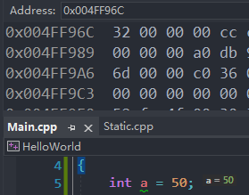
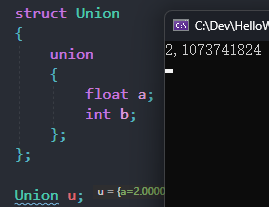
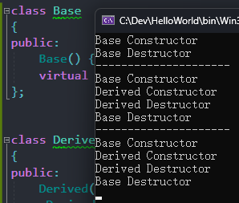
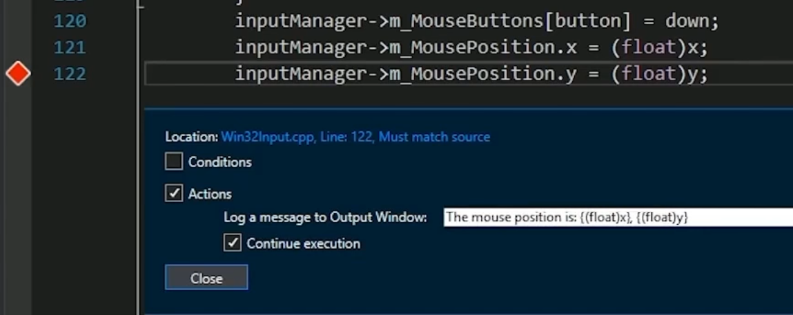
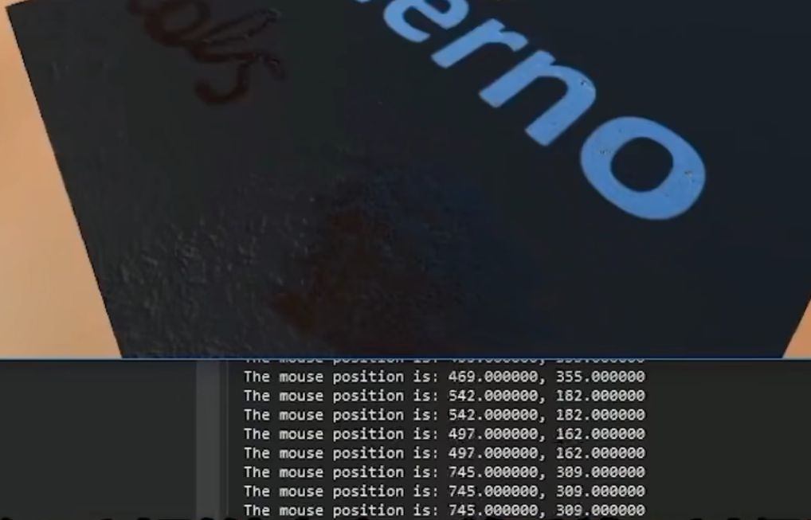

# 66 Type Punning in C++

## 1. 类型系统

_Type punning_（类型双关）只是一个花哨的术语，用来在 C++中绕过类型系统。C++是强类型语言，也就是说它有一个类型系统，不像 JavaScript 那样创建变量不需要声明变量类型，但 C++中你创建变量时必须声明整数、双精度数、结构体等等类型。然而这种类型系统并不像 Java 中那么“强制”，C++中虽然类型是由编译器强制执行的，但你可以直接访问内存，所以可以很容易地绕过类型系统，你是否要这么做取决于你的实际需求。在某些情况下，你绝对不应该规避类型系统，因为类型系统存在是有原因的，除非你有充分的理由，否则你不会想过多地使用它。 ^4d9dfe

假设我有一个简单的类，现在想把它写成一个字节流，就可以重新解释它的整个结构，将它作为一个字节数组然后用字节流输出出来。很多情况下这这是非常有用的，这是一种原始的、底层的访问，这就是为什么 C++效率高，应用程序性能好的原因了。

```cpp
#include <iostream>

int main()
{
	int a = 50;
	double value = a;

	std::cout << value << std::endl;


	std::cin.get();
}
```

内存中查看 a：


内存中查看 value：


这个例子中是一个隐式转换，显式转换只需要改为: ^f3904d

```cpp
double value = (double)a;
```

那如何取 a 的那段内存，让这段地址被当做`double`来看待呢？

```cpp
double value = *(double*)&a; //原始方法：对a取地址，此时变为int指针，将类型修改为double指针后解引用
```


查看 value 的地址，因为 double 有 8 个字节，所以剩下的是未初始化的内存。


导致发生的原因是我们在上面的类型转换做的很糟糕，因为它们的大小不同，我们取了一个 4 字节的 int，然后定为 double。我们在这里做的是先把一个 int 型指针转换为了一个 double 型指针，再解引用，它实际上是在我们的 int 后继续了 4 个字节然后获取了这部分内存，它并不是我们用来存放 a 的内存。这很糟糕，在某些情况下甚至会导致崩溃。
这里的意思是我们已经把内存复制到了一个新的 double 块中操作是安全的，但是读取了不属于我们的内存是不好的。

如果你不想新创建一个变量，只是想把这个 int 当做 double 来访问，只需要再 double 后加一个`&`，引用而不拷贝，这样你就可以编辑 int 的内存，这是很危险的，因为 double 需要 8 个字节而我们的空间只有 4 个字节，这可能会导致程序崩溃。

## 1. 结构体类型转换

```cpp
struct Entity
{
	int x, y;
};

int main()
{
	Entity e = { 5,8 };
	std::cin.get();
}
```

在内存中，这个结构体其实就是由 2 个 int 组成的，就是这两个整数 x,y。


结构体本身不包含任何类型的填充，任何类型的数据，如果是一个空的结构体，那么它至少是 1 个字节，因为我们需要对这段内存进行寻址，但如果结构体中有变量，比如这个 int x 和 y，那它就只有这两个整数。因此我们可以将 Entity 结构体看成一个 int 数组，并且不用 e.x，e.y 这种方法读取这些整数。

```cpp
int* position = (int*)&e;
std::cout << position[0] << "," << position[1] << std::endl;
```

因为我们将其转换成了数组，所以可以像访问数组那样访问它。


同理的更疯狂的操作：

可以看出 C++是一种强大的语言的一个重要原因就是它可以自如地操纵内存。


# 67 Unions in C++


## 1. 联合体

_Union_ （联合体）有点像 class 类型或者 struct 类型，只不过它一次只能占用一个成员的内存。
通常如果我们有一个结构体，我们在里面声明 4 个浮点数，就可以有 4x4 个字节在这个结构体中，总共是 16 个字节。
但一个联合体只能有一个成员，所以如果我要声明 4 个浮点数，比如 abcd，联合体的大小仍然是 4 个字节，当我尝试去处理它们，比如将 a 设为 5，它们的内存是一样的，d 的值也会是 5，这就是联合体的工作方式。

你可以像使用结构体或类一样使用它们，也可以给它添加静态函数或者普通函数、方法等。然而你不能使用虚方法，还有一些其它限制，但通常人们用联合体来做的事，是和[类型双关](66%20Type%20Punning%20in%20C++.md)紧密相关的。当你想给同一个变量取两个不同的名字时，它真的很好用。

通常`union`是匿名使用的，但匿名 union 不能含有成员函数。

## 1. 使用案例

我们这里有两种不同的方法来处理相同的内存：

### a. 解引用指针

```cpp
struct Union
{
	union
	{
		float a;
		int b;
	};
};

Union u;
u.a = 2.0f;
std::cout << u.a << "," << u.b << std::endl;

```

得到 2 和一串数，其实这个 107...是浮点数形式的 2 的字节表示，就好像我们取了组成浮点数的内存，然后把它解释成一个整型，这样就是类型双关了。



看一个更有用的例子：

```cpp
struct Vector2
{
	float x, y;
};

struct Vector4
{
	float x, y, z, w;
};

void PrintVector(const Vector2& vector)
{
	std::cout << vector.x << "," << vector.y << std::endl;
}
```

可以发现 Vector4 实际上是两个 Vector2，我们可以把 x 的内存地址转换为 Vector2 再解引用：

```cpp
struct Vector4
{
	float x, y, z, w;

	Vector2& GetA()
	{
		return *(Vector2*)&x;
	}
};

int main()
{
	Vector4 e={1,2,3,4};
	std::cout << e.GetA().y << std::endl;  // 2
	std::cin.get();
}
```

### b. union

还有另外一种方法，就是使用`union`：

```cpp
struct Vector4
{
	union
	{
		struct
		{
			float x, y, z, w;
		};
	};
};
// 这里还可以正常访问Vector4.x，因为我们没有给结构体起名，它是匿名的，只是一种数据结构
```

再加入一个结构体成员：

```cpp
struct Vector4
{
	union
	{
		struct
		{
			float x, y, z, w;
		};

		struct
		{
			Vector2 a, b;
		};
	};
};
```

这里 a 和 x，y 的内存是一样的，b 和 z，w 的内存相同，这里有两种方法可以读取：

```cpp
int main()
{
	Vector4 vector = { 1.0f,2.0f,3.0f,4.0f };
	PrintVector(vector.a);

	PrintVector(vector.b);
	vector.z = 500.f;
	PrintVector(vector.b);

	std::cin.get();
}
```


这里并没有设置 b.x=500，而是设置的 vecor.z，这个 z 变量对应于 b.x，因为它占用了相同的内存，所以 z 对应 Vector2 的 x。

## 3. 总结

当你想做这样的事情时，`union`真的很有用：当你想用多种方法来处理相同的数据时。
你也可以用类型双关或者其它方法，但是通常`union`的可读性更强。


# 68 Virtual Destructors in C++

前情提要：[26 Destructors in C++](26%20Destructors%20in%20C++.md)，[27 Inheritance in C++](27%20Inheritance%20in%20C++.md).[28 Virtual Functions in C++](28%20Virtual%20Functions%20in%20C++.md)

虚析构函数可以想象为虚函数和析构函数的组合。
虚析构函数对于处理多态非常重要，换句话说，如果我有一系列的子类和所有的继承：有一个类 A，然后一个类 B 派生于 A，你想把类 B 引用为类 A，但它实际上是类 B，然后你决定删除 A 或者它以某种方式删除了，然后你还是希望运行 B 的析构函数，而不是运行 A 的析构函数，这就是所谓的虚析构函数以及它的作用。

简单理解下就直接看代码吧：

```cpp
#include <iostream>

class Base
{
public:
	Base() { std::cout << "Base Constructor\n"; }
	~Base() { std::cout << "Base Destructor\n"; }
};


class Derived : public Base
{
public:
	Derived() { std::cout << "Derived Constructor\n"; }
	~Derived() { std::cout << "Derived Destructor\n"; }
};

int main()
{
	Base* base = new Base();
	delete base;
	std::cout << "---------------------\n";
	Derived* derived = new Derived();
	delete derived;

	std::cin.get();
}
```

很可能已经猜到运行结果了：
创建和删除 Base 类时只会调用 Base 类的构造和析构函数;
对于 Derived 类，首先调用了基类的构造函数，然后是 Derived 类的构造函数，当我们删除时先调用 Derived 类的析构函数，再调用基类 Base 类的析构函数。


新加入一个多态类型：

```cpp
std::cout << "---------------------\n";
Base* poly = new Derived(); // 创建一个Derived实例，但是把它赋值给Base类
delete poly;
```


这里只有基类的析构函数被调用了，而派生类的析构函数没有被调用。
这点很重要，因为这会造成内存泄漏。
`delete` poly 时，它不知道这个调用的析构函数可能有另一个析构函数，因为它（~Base）没有被标记为虚函数。

标记为*virtual*，意味着 C++知道在层次结构下可能有某种重写的方法，这个方法就可以被覆写。
而*virtual destructor*（虚析构函数）的意思不是覆写析构函数，而是**加上一个**析构函数。换句话说如果我把积累的析构函数改为虚函数，它实际会先调用派生类析构函数，然后在层次结构中向上，调用基类析构函数。

举一个例子来说明为什么这会造成内存泄漏：

```cpp
// 给派生类加一个数组成员
class Derived : public Base
{
public:
	Derived() { m_Array = new int[5]; std::cout << "Derived Constructor\n"; }
	~Derived() { delete[] m_Array; std::cout << "Derived Destructor\n"; }
private:
	int* m_Array;
};
```

再回想一下刚才运行程序的结果，很明显这里并没有调用派生类的析构函数，因此给数组分配的 20 字节内存没有被释放，造成了内存泄漏。

那如何解决呢？
很简单，给基类的析构函数加上`virtual`即可：

```cpp
class Base
{
public:
	Base() { std::cout << "Base Constructor\n"; }
	virtual ~Base() { std::cout << "Base Destructor\n"; }
};
```

这意味着这个类有可能拓展出子类，可能还有一个析构函数也需要被调用：



很好，现在有了和第二个例子完全一样的结果，意味着即使我们把它当做多态类型处理（或者说是当做基类类型处理），基类和派生类的析构函数都调用了，那个数组也得到了清理。

所以当你在写一个要拓展的类或者子类时，只要你允许一个类拥有子类，你 100%需要声明你的析构函数为虚函数，否则无法安全地拓展这个类。


# 69 Casting in C++

尽管之前实际上使用过类型转换，但没有讨论过这一点，这是一种需要联系并通过经验来学习的东西，而不是别人告诉你它是如何运作的，在这个主题上只有理论而没有实践对你的帮助不会多大。

## 1. 什么是 casting

这里的*casting*（转换）是指类型转换，或者说是必须在 C++可用类型系统中进行的类型转换。

C++是一门强类型语言，意味着存在一个类型系统，而且类型是强制的。（见[66 课：类型双关](66%20Type%20Punning%20in%20C++.md#^4d9dfe)）
如果我把某物设为 int，那就不能突然把它当做 double 或者 float，反过来也一样。我必须坚持原有的类型，除非有一个简单的**隐式转换**（[见 40 课：隐式和显式](40%20Implicit%20Conversion%20and%20the%20Explicit%20Keyword%20in%20C++.md#^cde452)），这意味着 C++知道如何在这两种类型之间转换，并且没有数据损失，这就是隐式转换；或者是有一个**显示转换**（[见 66 课：类型双关](66%20Type%20Punning%20in%20C++.md#^f3904d)），告诉 C++你需要把这个类型转换成目标类型，本章将正是介绍**强制转换**的含义，并了解如何使用它。

## 2. 类型转换

我们执行类型转换的方法，特别是显式类型转换，分为两种方式（个人理解），有 C 语言风格和 C++风格的。

### C 语言风格类型转换

```cpp
int a = 5;
double value = a; // 这是一种隐式转换，很容易做到而且没有数据丢失

double value = 5.25;
int a = value;  // 这也被视为是隐式转换，因为不需要具体说明要把这个类型转换成哪个类型

// 要想显式转换，可以像下行一样

int a = (int)value; // 当然这种情况下它可以隐式地做到，但是我们正在讨论强制转换，所以先这样写
```

举一个更好的例子：

```cpp
int main()
{
	double value = 5.25;
	double a = value + 5.3;
	std::cout << a << std::endl;   // 显然，这里输出10.55

	std::cin.get();
}
```

如果我们将 value 转换成`int`类型，那就会省去小数部分，最后就变成 $5+5.3=10.3$ 了：

```cpp
double a = int(value) + 5.3;  // 10.3 而不是 10.55
```

这里使用的技术叫做**C 语言风格类型转换**，因为它在圆括号中指定了要强制转换的类型，然后是我们要强制转换的变量。
还可以整个括起来，截取整体的整数部分：

```cpp
double a = int(value + 5.3);  // 10
```

### C++风格类型转换

#### 1. static_cast

用 C++的方式做这个，要使用 C++的`cast`：

```cpp
double s = static_cast<int>(value) + 5.3;
```

C++风格的转换有多种，一个是`static_cast`，还有`reinterpret_cast`、`dynamic_cast`、`const_cast`，共这四种主要的 cast。它们并不能做任何 C 风格类型转换做不到的事情，这并不是添加新功能，只是添加了一些*syntax sugar*。

比如`dynamic_cast`，它会实际执行一个检查，如果转换不成功返回 NULL，所以这做了额外的事情，会降低运行速度。但在大多数情况下，C++风格类型转换并不做额外的事情，它们只是一些代码中的英文单词。
例如`static_cast`，意思是静态类型转换，在静态类型转换的情况下，还会做一些其它的编译时检查，检查这种转换是否可能。
`reinterpret_cast`也是一样，就像是把我们说过的**类型双关**用英语表达出来一样，意思就是我要把这段内存重新解释成其它东西.
`const_cast`，移除或者添加变量的 const 限定。

##### 所以为什么要搞这么多 cast ？

是因为除了可能收到上面说的那些编译时的检查外，还可以方便我们从代码库中搜索它们。如果我想看到我的类型转换都在哪儿，也许我有性能问题而不想用`dynamic_cast`，我可以直接搜索这个词，如果用的是 C 语言风格的 cast，就很难去搜索它，所以它对程序员的阅读和编写代码都有帮助。
而且它也能帮助我们减少在尝试强制转换时，可能意外犯下的错误，比如类型不兼容。

```cpp
class AnotherClass
{
public:
	AnotherClass(){}
	~AnotherClass(){}
};

int main()
{
	double value = 5.25;
	double a = int(value) + 5.3;

	double s = static_cast<AnotherClass*>(value);
	std::cout << a << std::endl;
	std::cin.get();
}
```

可以看到这是一个无效的类型转换


对于类型双关，可以用`interpret_cast`，这里我们将 value 指针处的数据重新解释为 AnotherClass 实例的数据：

```cpp
double s = reinterpret_cast<AnotherClass*>(&value);
```

但是关键是用`static_cast`增加了编译时检查，如果你用 C 风格的转换它会默认地做`interpret_cast`会做的事情。

实际学习这些的最好方法就是实践，尝试构建一个使用这些 cast 的示例。

#### 2. dynamic_cast

```cpp
class Base
{
public:
	Base() {}
	virtual ~Base(){}
};

class Derived : public Base
{
public:
	Derived() {}
	~Derived() {}
};

class AnotherClass : public Base
{
public:
	AnotherClass(){}
	~AnotherClass(){}
};

int main()
{
	Derived* derived = new Derived();
	Base* base = derived;   // 将derived转换成Base类型

	std::cin.get();
}
```

有一个问题：这里我有一个 Base 指针，它是一个 Derived 类的实例呢还是 AnotherClass 类的实例呢？它们两个都是从 Base 类拓展来的。

```cpp
AnotherClass* ac = dynamic_cast<AnotherClass*>(base);
```

如果我用`dynamic_cast`，它不仅是问这个问题，而且它会尝试转换，如果转换失败还会做一些事情。


这里的`dynamic_cast`试图将基类指针`base`转换为`AnotherClass`指针。然而，原始的`base`指针实际上是指向一个`Derived`对象的，而非`AnotherClass`对象。这两个类（`Derived`和`AnotherClass`）都是从`Base`类派生的，但它们是完全不同的类，无法互相转换。

`dynamic_cast`在运行时执行类型检查。如果类型转换是安全的，那么它就执行转换，否则它返回 null。在这个例子中，因为`base`指针实际上是指向`Derived`对象，而不是`AnotherClass`对象，所以`dynamic_cast`判断这个转换是不安全的，于是返回 null。

这种类型检查的能力是`dynamic_cast`的一个重要特性，它可以在运行时保护我们免于执行不安全的类型转换。这就是为什么`ac`是 null 的原因。

改为 Derived 类后，这个指针就是有效的了，因为这个转换是成功的。


这与运行时类型信息*RTTI*(runtime type information)紧密联系。

你需要知道这些类型转换操作符对你来说是一种简化类型转换的方法，可能会让转换更可靠，因为它会做编译时检查，而`dynamic_cast`会做运行时检查。通过使用这样的强制转换操作符，你会得到更坚实的代码。


# 70 Conditional and Action Breakpoints in C++


本讲内容是一个简单的 VS 开发和调试的技巧，不过不仅仅是断点，而是关于条件与操作应用在断点上。

## 1. 条件断点 Condition

通过条件或条件断点，我们可以告诉调试器想在这里放置一个断点，但我希望断点在特定条件下触发，比如内存中的某些东西满足了条件就触发这个断点。

## 2. 操作断点 Action

操作断点是允许我们采取某种动作，一般是在碰到断点时打印一些东西到控制台。

这里有两种类型的操作断点：

- 一是让你在打印你想要的东西时继续执行，比如你想记录鼠标位置，每次鼠标移动，移动事件（打印鼠标位置）就会发生，可以让那个断点打印一些东西到控制台但保持程序运行；
- 二是打印一些东西，但仍然中断程序，暂停程序的执行，这样我们就可以检查内存中的其它东西。

## 3. 现实中的用法

右键设置的断点，选择 Conditions 或者 Actions（可以一起使用，打开哪个都可以设置另一个），这里先测试 _Action breakpoint_：



要将变量名写在`{}`内，还可以做类型转换或者加一些文本（如示例）



你当然也可以通过在源代码中添加代码的方式来打印这些内容，但这里最酷的事情是，你**不需要终止你的应用，不需要重新编译代码**，只是在初始引用程序运行时设法打印了额外的数据到控制台（Output Window），提升了效率。
另一种方式就是打普通断点，然后看中断的程序再找变量，这样很耗时。

再测试一下*Condition breakpoint*：


这里的条件可以是任何布尔语句。

条件断点也是非常有用的，比如你想在一个循环中找到一个特殊的条件对于普通断点来说是基本不可能的，比如只想在一个特定编号的敌人的节点（出问题的实体）那里中断程序，如果要手工完成你得一直按多次 F5。尽管会降低性能，但是这只是一个调试工具罢了。