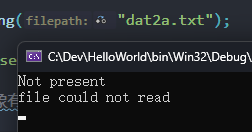
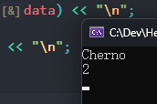
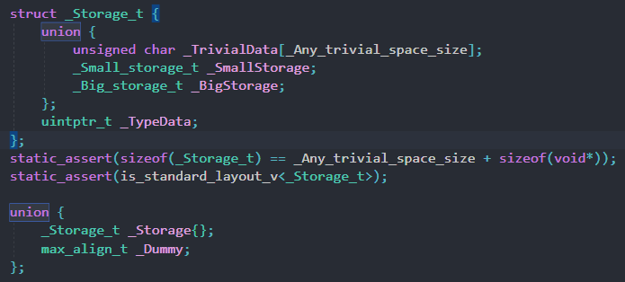
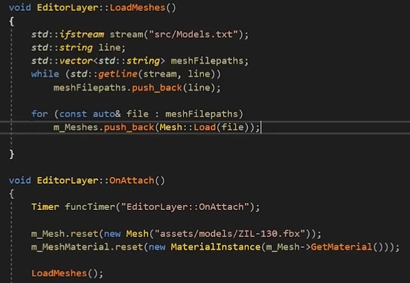
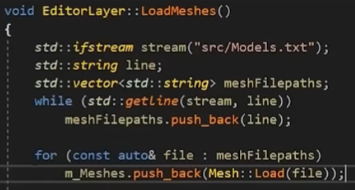
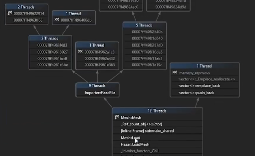
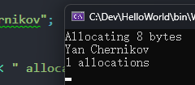
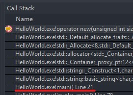
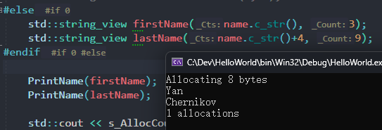

# 76 How to Deal with OPTIONAL Data in C++


#将不同类型的数据存储在单变量中系列 1/3

很多时候，我们有一个返回数据的函数，比方说我们正在读取一个文件，但是如果这个文件不能被读取会发生什么？它可能不存在，或者是数据不是我们期望的格式，我们仍然需要从函数中返回一些东西。在这个特定的情况下，可能只会返回一个空字符串，但这没有多大意义。意思是，如果读取文件是空的， 我们应该有办法看到数据是否存在。

这就是要用到`std::optional`的地方了，这是 C++17 标准的新东西。

```cpp
#include <fstream>

std::string ReadFileAsString(const std::string& filepath)
{
	std::ifstream stream(filepath);
	if(stream)
	{
		std::string result;
		// Read file
		stream.close();
		return result;
	}
	return std::string();

}

int main()
{
	std::string data = ReadFileAsString("data.txt");
	if(data!="")
	{
		// 但这种检查是否打开成功的方式不是很好
	}
}
```

我们更喜欢的应该是能够知道数据是否被成功读取的方法：

```cpp
std::string ReadFileAsString(const std::string& filepath,bool& outSuccess) // 判断读取成功的参数
{
	std::ifstream stream(filepath);
	if(stream)
	{
		std::string result;
		// Read file
		stream.close();
		outSuccess = true;   // 读取成功赋值
		return result;
	}
	outSuccess = false;  // 读取失败赋值
	return std::string();

}

int main()
{
	bool fileOpenSuccessfully;
	std::string data = ReadFileAsString("data.txt",fileOpenSuccessfully);
	if(fileOpenSuccessfully)
	{

	}
}
```

这显然比判断空字符串好得多，但仍然不够好。
这就要用到`std::optional`了，它在头文件`<optional`中。

```cpp
#include <fstream>
#include <optional>

std::optional <std::string> ReadFileAsString(const std::string& filepath)
{
	std::ifstream stream(filepath);
	if(stream)
	{
		std::string result;
		// Read file
		stream.close();
		return result;
	}
	return {};

}

int main()
{
	std::optional<std::string> data = ReadFileAsString("data.txt"); // 可以auto
	if(data)// 本来可以写data.has_value()，但是data对象有一个bool运算符，所以这样写更简洁
	{
		std::cout << "file read successfully\n";
	}
	else
	{
		std::cout << "file could not read\n";
	}
	std::cin.get();
}
```

可以在 sln 文件的同目录下创建一个 data.txt 文档，里面写点东西后运行代码，可以得到读取成功提示。


还可以通过`value_or`来实现存储值不存在时返回传入的默认值：

```cpp
std::string value = data.value_or("Not present");
std::cout << value << "\n";
```



`std::optional::value_or` 是一个成员函数，它返回存储的值或者在存储的值不存在时返回传入的默认值。在你的例子中，如果 `data` 存在值（即文件成功读取），`value_or` 就返回文件的内容；否则，它返回 "Not present"。


# 77 Multiple TYPES of Data in a SINGLE VARIABLE in C++


#将不同类型的数据存储在单变量中系列 2/3

本节要讲的是如何在一个变量中存储多种类型的数据，这是 C++17 新标准库中给我们的类。

## 1. std::variant

这个和`std::optional`很像，它的作用是让我们不用担心处理的确切数据类型， 只有一个变量放在那儿，我们之后再去考虑它的具体类型。它允许你列出所有可能的类型，然后你可以决定它将是什么，如果你想的话可以把它重新赋值给任意类型，这也是你创建可能有多个类型的变量的一种方式。

```cpp
#include <variant>

int main()
{
	std::variant<std::string, int> data;
	data = "Cherno";
	std::cout << std::get<std::string>(data) << "\n";
	data = 2;
	std::cout << std::get<int>(data) << "\n";

	std::cin.get();
}
```



如果我们用错误的类型访问它会发生什么？、


`std::get`函数会抛出一个 bad variant acess 异常，可以用`try catch`来处理这个异常，不过还有其它方法而完全不使用异常就可以判断数据类型是否和我们想的一样。

首先是`index`函数：

```cpp
if(data.index()=0) // 索引是否为0，即是否是类型中的第一个std::string
```

一个更好的方法，就是使用`get_if`函数：

```cpp
if (auto value = std::get_if<std::string>(&data))
{
	std::string& v = *value;
}
else // 或else if来处理另一种类型
{

}
```

在这里的代码中，`std::get_if` 是一个用于访问 `std::variant` 的成员的函数。它会尝试以 `std::string` 的类型来访问 `data` 的值。如果 `data` 的当前类型是 `std::string`，那么 `get_if` 将返回一个指向该值的指针，否则它将返回 `nullptr`。然后 `if` 语句会检查 `value` 是否为 `nullptr`。如果 `value` 是 `nullptr`，那么 `if` 语句的条件将评估为 `false`，所以 `if` 语句块内的代码将不会执行，反而会跳转到 `else` 语句块中去执行。

## 2. 和 union 对比

可参考[67 Unions in C++](67%20Unions%20in%20C++.md)

现在有很多关于`variant`的讨论说它本质上就像类型安全的*union*（联合体），但其实它们是非常不同的。

```cpp
std::variant<std::string, int> data;
std::cout << sizeof(data) << std::endl;
```

如果 data 是一个`union`的话，它的大小就会是其中最大的类型的大小。
而`varaint`只是将所有可能的数据类型存储为单独的变量作为单独的成员：


它相当于为你创建了一个结构体或者类，只是将这两种数据类型存储为那个结构体或类中的成员。
因此，从技术上讲，`union`仍然是效率更高的更好的选择。
`varaint`则是更加类型安全，不会造成未定义行为，除非你从事的是底层优化要把内存大小保持在一个较低的位置，比如 CPU 处理，否则你应该使用它。
比如说你在桌面平台上开发，你可以自由地使用更多的内存和更多处理能力，那么`std::variant`在技术上更安全。

## 3. 其它作用

enums 相关知识见[24 枚举类型](24%20ENUMS%20in%20C++.md)

根据上节课，`optional`一般用来表示数据可能存在或不存在，而`variant`可以使函数返回不同类型的值，让我们读取文件时可以不仅仅返回一个空的可选值，而是可以发现哪里出现问题，并以这种方式来处理它：

```cpp
enum class ErrorCode
{
	None = 0, NotFound = 1, NoAccess = 2
};

std::variant<std::string,ErrorCode> ReadFileAsString()
{
	if (error_occurred)
	{
		return ErrorCode::NotFound; // 返回 ErrorCode...
	}
	else
	{
		return "File contents"; // 返回文件内容
	}
}

```

这是另一个使用`variant`的好例子，比返回一个布尔值更详细一些，可以给我们更多的信息。


# 78 How to store ANY data in C++


#将不同类型的数据存储在单变量中系列 3/3

本节会讲如何在单个变量中存储任意类型的数据。
你可以用`void*`来处理，然而这里要讲的是一个更好、更安全的方式，它是 C++17 标准带来的全新处理方式。

## 1. std::any

它的用法很简单，我们主要要思考的是：为什么会有这个东西，什么时候要用到它，为什么要用`std::any`而不是`std::variant`，这些才是本节最精彩的内容。

```cpp
#include <any>

int main()
{
	std::any data;
	data = 2;   // int
	data = "Cherno";   // const char
	data = std::string("Cherno"); // string

	// 如果想提取数据
	std::string string = std::any_cast<std::string>(data);

	std::cin.get();
}
```

如果`std::any`对象包含的值类型与`std::any_cast`的目标类型相匹配，那么`std::any_cast`将返回该值。否则，如果类型不匹配，`std::any_cast`将抛出`std::bad_any_cast`异常。

看起来和`std::variant`很像，它们确实有些类似，可以存储任何类型，有人可能觉得：`std::variant`要求我们列出所有的类型而很糟糕，而在`std::any`这里根本就不需要担心类型。但其实恰恰相反，这才是绝大多数情况下，`std::variant`比`std::any`更好的地方。

事实上，`std::variant`要求列出所有这些类型是很好的，会使得类型安全：

```cpp
data = "Cherno";   // 比如忘记显式地写出这是一个字符串
// 然后下行代码会很合理，但试着提取时就遇到问题了：data 是一个 const char*
std::string string = std::any_cast<std::string>(data);

// 而用std::variant的话，就可以正常工作了，因为限定了类型

#include <variant>

std::variant<int, std::string> data;
data = 2;
data = "Cherno";
std::string string = std::any_cast<std::string>(data);
```

那除了`std::variant`需要列出类型之外，`std::any`和它相比还有什么区别吗？

## 2. std::any 和 std::variant 的区别

当然有，这和它们的存储方式有关。

`std::variant`只是一个类型安全的`union`，意思是它把所有的数据都存储在一个[联合体](67%20Unions%20in%20C++.md)中。

那`std::any`的存储方式呢？让我们进入它的头文件：

> Storage 这个似乎用来存储东西的变量实际上是一个 Union
> 

> 最后深入，发现 Small_storage 是一个 aligned_union_t，发现它是 aligned_union 的所有类型。
> 

所以`std::any`到底做了什么？其实很聪明，对于 _small types_ （小类型），它只是把它门存储为一个`union`，这意味着对于小类型来说，它的工作方式和`std::variant`完全相同。

而如果你有一个大类型，它会带你进入大存储空间的`void*`，在这种情况下它会动态分配内存，而动态分配内存不利于性能。

如果你需要更多而存储空间（这里可以看到是>32)，`std:any`会动态分配，但是`std::variant`不会。


所以换句话说，除了更加类型安全和有一点限制性，`std::variant`在处理较大数据时也会执行得更快，或是你的数据又需要避免动态内存分配。

另一个提高性能的技巧是不要复制数据，之前代码中有字符串的复制，可以换成通过引用返回：

```cpp
// 在std::get()中可以直接加一个引用符，但std::any_cast中需要把引用插入到模板参数中，才能很好地优化
std::string& string = std::any_cast<std::string&>(data); // 注意这里模板参数中也要用引用
```

目前的情况下，我们不会得到除了那个 string 的内存分配，可以简单测试一下：

```cpp
void* operator new(size_t size) // 这不是new操作符的很好的实现，因此不要在任何生产代码中使用它
{
	return malloc(size); // 打上断点
}
```


> 可以看到我们确实得到了一个内存分配，来源是 std::string，std::basic_string 进入 allocator 分配器。any 实际上只做了一个\_Construct_in_place 转发所有这些参数，basic_string 在做再一次的内存分配，它就是这个程序中全部的内存分配了，这个情况下 std::any 实际没有分配任何东西。

```cpp
struct CustomClass
{
	std::string s0, s1;  // 一个是28(x86)
};

int main()
{
	std::any data;
	data = 2;   // int
	data = CustomClass();
//	std::string& string = std::any_cast<std::string&>(data);

	std::cin.get();
}

```


> 在 Emplace 的过程中，你会看到这是一个大的存储过程，所以会调用 new，所以要知道 std::any 会在需要时进行分配。在这种情况下（>32Bytes)，它会调用 new 和动态内存分配，这里可能编译器把过程抽象了，没得到和视频中一样的效果。

## 3. any 和 variant 分别什么时候用？

这是一个比较棘手的问题。

如果希望在一个变量中存储多个数据类型，请使用`std::variant`，因为它基本上是`std::any`的类型安全版本，这意味着你不能随意设置它的类型。而且它还不会动态分配内存，这样性能会更好。

如果你需要能够在单个变量中存储任何数据类型，也许你需要重新考虑程序的设计，Cherno 的意思是他真的想不出来一个有效用例（就不该用到它），如果你有像缓冲区的数据，不知道这些数据的类型，只是想指向它们，那你可以用 `void*` 。就目前的情况，Cherno 不认为它和`std::optional`以及`std::variant`一样有用，你应该明确意识到`std::any`可能不是你应该经常使用的东西。（观点发表于视频录制的 2019 年）。

# 79 How to make C++ run FASTER (with std-async) (copy)


本节会深入到一个项目中讨论如何通过多线程来提高性能。（可复习[62 C++线程](62%20Threads%20in%20C++.md)）

现代的硬件是能够并行处理的，这是为它们而设计的。如果你检查你使用的任何硬件，不管是手机电脑或者类似的东西，你会发现它们有不止一个CPU核心。这意味着你可以在同一时间并行执行指令，而不需要等待上一条指令完成后再执行下一条CPU指令，你可以在同一时间把事情做完，这整个的程序调度、多线程、并行化的过程是一个非常庞大的主题。

来看看如何通过充分利用我们的多核架构将一个现实世界开发的游戏引擎加载速度提高10倍。

## 1. 多线程

随着C++11的引入，我们在标准库中得到了许多有用的东西，这些东西可以帮助我们实现程序的多线程化，特别是我们将要讨论并了解的一个叫`std::asnyc`的东西，以及`futures`，它们是相互关联的。

做并行运行最难的是要找出彼此的依赖关系，并想清楚在不同的线程中放什么。因为你不能拿起来程序就说，每个程序都会在不同的线程上调用，一切都会很好——这并不是它真正的工作方式，在你的程序中，有一些东西能够被放在一个不同的线程中，这叫做 *worker thread*（**工作线程**），它可以独立地完成，而它什么时候开始、什么时候结束并不重要。但当它完成时，你可以得到一些反馈或者一些加载的新资源。

下面给出的例子中，你不需要对游戏引擎很熟悉，因为这适用于任何事务，但是游戏引擎是一个很好的游戏案例，因为它必须处理大量数据，而处理大量数据时，你需要去考虑策略或方法来减轻对CPU处理时间的影响。因为如果你能更好地控制所有的数据处理，你就能更聪明地使用它，你就能把它转换成线程处理，转换成你的CPU核心处理，把你的计算机作为一个整体来使用。（如果需要的话，你甚至可以使用你的GPU或类似的东西进行大规模的并行处理）

你做的越多，一切就会越快，这意味着你可以处理更多数据。一个现实中很好的例子就是：很多游戏有很长的加载时间， 因为有很多游戏资源要载入。而载入的过程不只是从光盘上读取文件，还可能涉及到解压缩，还可能涉及到把它发送到GPU，还可能涉及到在特定的环境下发生任何类型的转换。但其实每一个资源、纹理模型通常是**独立于彼此**的，这意味着它们都是很好的多线程候选场景。

每次我们加载模型的时候，就不需要等待上一个模型加载完成，再一个接一个地加载了，我们可以把它发送到一堆工作线程，并让它 *asynchronously* （异步)地发生。 这里的美妙之处在于你可以将所有的数据流化，你可以开始渲染你的关卡和世界的同时，在后台加载内容，有些内容甚至还没有完成加载，但玩家已经能够进入游戏世界行走。

## 2. 如何用std::async来分割

Cherno用自己开发的Hazel引擎示范，其中有一个LoadMeshes函数是用于导入模型的，负责整个程序初始化的OnAttach函数启动后，会调用模型导入函数LoadMeshes，这个函数完成我们就可以开始渲染了。

我们对实际的应用程序启动，到在屏幕上渲染帧需要多长时间。于是这里使用了一个Timer（见[63 Timing in C++](63%20Timing%20in%20C++.md)）来测量这个OnAttach函数的时间：



启动后，可以看到用时6.3s左右：


这是相当长的一段时间，可以通过使用`std::async`来做得更好。

如果我们回去看看需要做什么来实现多线程，感兴趣的地方应该是这部分for循环：



> 它会遍历每一个mesh的文件路径，它所做的只是加载网格，显然是非常独立的，并不依赖于之前加载的网格或类似的东西。

所以我们可以把它变成一个并行的for循环：

```cpp
#include <future>

	for(const auto& file : meshFilepaths)
	{
		m_Future.push_back(std::async(std::launch::async, LoadMesh, m_Meshes,file));
	}
// 第一个参数：这是什么类型的job,设置启动类型为async很重要；
// 第二个参数：某种实际异步运行的函数
```

当你尝试多线程的时候，某些资源不能被同时访问，你必须锁定资源来做你想要做的事情，比如修改它然后解锁它，这样另一个线程才能访问它。方法是使用 *mutex* （互斥量），后面会提到。



优化后启动快了十倍。

可以看到，这种多线程对你的程序来说是非常有意的，可以充分利用你的硬件来提高速度。很多性能方面的优化都是关于充分利用你正在使用的硬件的，了解你在什么平台上发布代码，了解你的程序将在什么硬件上运行，然后利用这些优势。我们要处理的都是多核机器，利用这些线程可以让你的程序不只是顺序地执行一条条指令，而是把一些东西，推迟或分派到不同的线程，让计算机能够更快地处理这些东西。

# 80 How to make your STRINGS faster

当然处理字符串时，很多人没有意识到字符串对程序性能的影响，而程序中还经常有很多字符串操作。我们能做一件非常简单的事情，能让我们的字符串以及字符串的操作更快速。

## 1. std::string 的内存分配

`std::string`的主要问题之一，可能就是字符串格式化以及字符串操作，因为它们要分配内存。堆上分配内存是不可能避免的，但应该尽量避免，因为它会降低程序的速度，而`std::string`和它的很多函数都喜欢分配。

```cpp
static uint32_t s_AllocCount = 0;

// 可以通过重载new操作符来实现跟踪内存分配
void* operator new(size_t size)
{
	s_AllocCount++;
	std::cout << "Allocating " << size << " bytes\n";
	return malloc(size);
}


void PrintName(const std::string& name)
{
	std::cout << name << std::endl;
}

int main()
{
	std::string name = "Yan Chernikov";
	PrintName(name);

	std::cout << s_AllocCount << " allocations" << std::endl;
	std::cin.get();
}

```



在分配内存的位置设断点，可以看到发生在创建字符串的这一行，是这个时候导致了堆分配。



如果我们去掉这个字符串，只是复制粘贴 const char 数据到 PrintName 函数中呢，这是否分配了内存？

```cpp
//std::string name = "Yan Chernikov";
PrintName("Yan Chernikov");
```

结果显然是也会分配，因为虽然函数接受的是 const 引用，但是它仍然需要为我们构造一个 std::string，构造仍然需要分配内存。

现在稍微复杂一点：

```cpp
std::string name = "Yan Chernikov";

std::string firstName = name.substr(0, 3);

std::string lastName = name.substr(4, 9);
PrintName(firstName);
```


这样简单的操作都会造成三次分配，可以想象这样的事情会在你的程序中经常发生，如果你有一些实时运行的程序，比如游戏，如果你每帧都在做这种事情，它会堆积起来，损害你的帧速率。

怎么能让这一切变得更好呢？

有一种很简单的方法，可以修改现有代码，将分配减少到一个。在本节最后会删除所有分配，也就是会有 0 个分配。

首先来看这段代码，你想要做什么，往往这样就知道优化的方向了。这里你真正需要的是这个字符串的视图，而不需要复制数据创建这么多新字符串。

这就是`string_view`发挥作用的地方了：

## 2. std::string_view

`std::string_view`是 C++17 中的一个新类，它本质上只是一个指向现有内存的指针，换句话说，就是一个 const char 指针，指向它人拥有的现有的字符串，再加上一个*size*（大小）。

它的工作方式类似于创建一个窗口，进入现有内存的小视图，而不是分配一个新的字符串，这样就没有内存分配，按值传递字符串视图是非常轻量级的，因为它只是一个指针和一个大小。

将之前的 substr 重写：

```cpp
void PrintName(std::string_view name) // 这里就不用引用传递了，类型改为string_view
{
	std::cout << name << std::endl;
}

int main()
{
	std::string name = "Yan Chernikov";

#if 0
	std::string firstName = name.substr(0, 3);

	std::string lastName = name.substr(4, 9);
#else
	std::string_view firstName(name.c_str(), 3);
	std::string_view lastName(name.c_str()+4, 9);
#endif

	PrintName(firstName);

	std::cout << s_AllocCount << " allocations" << std::endl;
	std::cin.get();
}

```



现在只有一次分配了，但其实是完全可以去掉所有的分配的，通过完全不使用`std::string`来实现：


> 由于这里就是个静态字符串，没必要非得用 std::string 来实现，所以可以这么做。

如果字符串是来自某个文件或以某种方式生成的，在这种情况下，让它是一个`std::string`可能是更现实的情况


