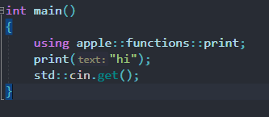
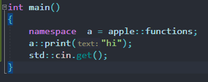
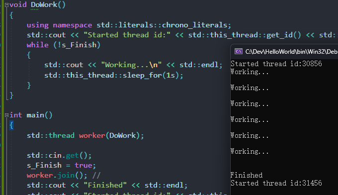
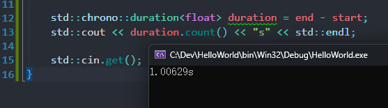
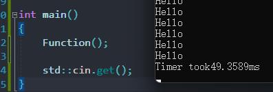
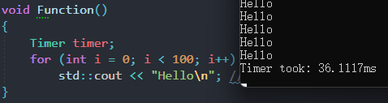
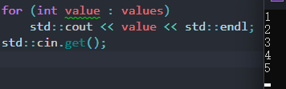
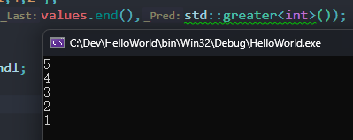
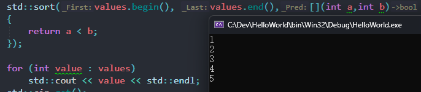
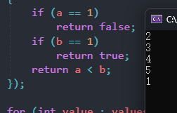

# 61 Namespaces in C++

## 1. 为什么要使用 namespace

```cpp
void print(const char* text)
{
	std::cout << text << std::endl;
}

void print(const char* text)
{
	std::string temp = text;
	std::reverse(temp.begin(),temp.end());
	std::cout << temp << std::endl;
}
```

这里有两个函数签名一样的函数，这两个的*symbol*（符号)是相同的，如果放在一个文件里的话会产生链接错误、编译错误。那如果我们确实想要两个 print 函数，或者使用另一个已经定义了 print 函数的库，但是我们想有自己的 print 函数。
C 语言没有 namespace，比如使用 GLFW 库（C 语言的 OpenGL 库），调用的每个函数名都是用 GLFW 开头的。
所以*namespace*（名称空间）的主要目的就是避免命名冲突。

可以把命名空间放在一行，这样多层嵌套时观感会好些：

```cpp
namespace apple { namespace functions {

	void print(const char* text)
	{
		std::cout << text << std::endl;
	}
} }
```

`::`是命名空间的操作符，类也是一种命名空间，这就是为什么访问另一个类内部的类等成员时也用`::`来调用

还可以单独引入函数：


还可以给命名空间起别名：


尽量将 namepace 限制在一个小的作用域下，一定不要加在头文件里。


# 62 Threads in C++

本节课讲的是*threads*（线程），也就是讲我们如何进行*parallelization*（并行化）。现在大多数计算机或处理器等设备都有不止一个逻辑处理线程，当我们进入更复杂的项目时，将某些工作移动到两个不同的执行线程会对我们非常有益。不仅仅是为了提高性能，也是我们还能用它做些什么事。

比如，我们用`std::cin.get()`请求用户的输入，但是我们在等待输入的时候什么都做不了，直到用户按下 Enter，我们的线程就像被阻塞了一样，但如果我们可以做些其它事情呢？比如向控制台打印一些东西等等。

## 1. 用线程实现

```cpp
#include <iostream>
#include <thread>

static bool s_Finish = false;

void DoWork()
{
	using namespace std::literals::chrono_literals; //引入chrono库的字面量。它使得程序能够更方便地表示时间单位。
	std::cout << "Started thread id:" << std::this_thread::get_id() << std::endl;
	while (!s_Finish)
	{
		std::cout << "Working...\n" << std::endl;
		std::this_thread::sleep_for(1s); // 这里直接用1s表示一秒
	}
}

int main()
{
	std::thread worker(DoWork);

	std::cin.get();
	s_Finish = true;
//	worker.join(); //
	std::cout << "Finished" << std::endl;
	std::cout << "Started thread id:" << std::this_thread::get_id() << std::endl;
	std::cin.get();
}
```



这就是一个简单的 C++多线程例子。代码的主要工作流程如下：

1. 全局的`s_Finish`标记声明为`static`，以限制其在当前源文件中的作用范围。

2. `DoWork`函数是一个线程例程。它进入一个无限循环，每秒打印一次"Working..."，直到`s_Finish`标志被设置为`true`。

3. 在`main`函数中，创建了一个名为`worker`的新线程。`DoWork`函数被作为参数传递给线程的构造函数，表示应在新创建的线程中运行此函数。

4. `std::cin.get();`语句是一个阻塞调用，它等待用户按回车键。

5. 一旦按下回车键，`s_Finish`标志被设置为`true`，这导致`DoWork`函数跳出其循环并返回。

6. `worker.join();`语句用于等待线程完成其执行，然后程序才能继续。确保线程在主线程（在这种情况下，是程序）结束之前完成执行是至关重要的。如果程序在`worker`线程仍在运行时结束，那么它将被突然终止，这可能导致各种问题，如资源未被正确释放。

线程很重要，它们对于加速程序非常有用，主要目的是优化，还可以做例如上面例子中这些事情。


# 63 Timing in C++


我们如何计算完成某个操作或者执行某个代码所需要的时间呢？

计时对很多事情都很有用，不论你是希望某些事情在特定时间发生，还是只是评估性能或做基准测试，看你的代码运行得有多快，你需要知道应用程序实际运行的时间。

有几种方法可以实现这一点，C++11 之后我们有了“chrono”，它是 C++库的一部分，不需要去使用操作系统库。但在有 chrono 之前，如果你想要高分辨率的时间，你想要一个非常精确的计时器，那你就需要用到操作系统库了。例如在 Windows 中有一个叫做“QueryPerformanceCounter”的东西，我们仍然可以使用那些东西。事实上如果你想要更多地控制即使，控制 CPU 的计时能力，那么你可能会使用平台特定的库。不过本节只会看一看和平台无关的 C++标准库方法（chrono 库的一部分），它可以计算出执行代码时，代码之间经过了多长时间。

## 1. 独立平台的方法

记录 sleep_for 的用时：

```cpp
#include <iostream>
#include <chrono>
#include <thread>

int main()
{
	using namespace std::literals::chrono_literals;

	auto start = std::chrono::high_resolution_clock::now();
	std::this_thread::sleep_for(1s);
	auto end = std::chrono::high_resolution_clock::now();

	std::chrono::duration<float> duration = end - start;
	std::cout << duration.count() << "s" << std::endl;

	std::cin.get();
}
```



chrono 库非常好，可以高精度计时，几乎适用于所有平台，所以非常建议使用这个方法来满足你所有的计时需求，除非你在做一些特定的底层的事情。

## 2. 一个更聪明的方法

你想要给 Function 计时：

```cpp
void Funtion()
{
	for (int i = 0; i < 100; i++)
		std::cout << "Hello" << std::endl; //想要计算这些cout代码运行需要的时间
}
```

设置一个简单的结构体：

```cpp
struct Timer
{
	std::chrono::time_point<std::chrono::steady_clock> start, end;
	std::chrono::duration<float> duration;
	Timer()
	{
		start = std::chrono::high_resolution_clock::now();
	}
	~Timer()
	{
		end = std::chrono::high_resolution_clock::now();
		duration = end - start;
			float ms = duration.count() * 1000.0f;
		std::cout << "Timer took" << ms << "ms" << std::endl;
	}
};

void Function()
{
	Timer timer;c  // 利用构造和析构函数来计时
	for (int i = 0; i < 100; i++)
		std::cout << "Hello" << std::endl; //想要计算这些cout代码运行需要的时间
}

int main()
{
	Function();

	std::cin.get();
}
```



可以将 endl 换为“\\n”优化性能。


# 64 Multidimensional Arrays in C++ (2D arrays)

今天讲的是多维数组，请务必了解[31 Arrays in C++](31%20Arrays%20in%20C++.md)和[16 POINTERS in C++](16%20POINTERS%20in%20C++.md)，因为处理任何类型的数组时，指针都是非常重要的（因为数组就是内存块，处理内存的简单方法就是使用指针）

## 1. 多维数组与常规数组的不同之处

从二维数组开始作为一个例子，实际上它只是**数组的数组**（三维数组就是数组的数组的数组.....），就是数组的集合。
我们考虑处理数组的一种策略就是使用指针，我们有一个指针，指向数组在内存中的开头位置。可以想象一下有一个指针的数组，最终你会得到一个内存块，里面包含的是连续的指针，每个指针都指向内存中的某个数组，所以得到的是指向数组的指针的集合，也就是数组的数组。

```cpp
#include <iostream>

int main()
{
	int* array = new int[50];

	int** a2d = new int*[50]; // 这里存储的是一个指针对象的缓冲区

	std::cin.get();
}
```

这里只是分配了一个可以存储200字节指针的内存块，并没有初始化。
然后我们可以遍历并设置每个指针指向一个数组，这样就能得到一个包含50个数组的内存位置的数组

```cpp
for (int i = 0; i < 50; i++)
		a2d[i] = new int[50];
```

三维数组（了解即可）：

```cpp
int*** a3d = new int**[50]; 

for (int i = 0; i < 50; i++)
{
	a3d[i] = new int*[50];
	for (int j = 0; j < 50; j++)
		a3d[i][j] = new int[50];  // 两次解引用
	//	int** ptr = a3d[i];
	//	ptr[j] = new int[50];
}
a3d[0][0][0] = 0;
```

还是回到二维数组：

```cpp
int** a2d = new int*[50]; // 这里存储的是一个指针对象的缓冲区

for (int i = 0; i < 50; i++)
	a2d[i] = new int[50];

a2d[0][0] = 0;
a2d[0][1] = 0;
a2d[0][2] = 0;
```

要注意的是，第一列是指针的索引，而不是整数的索引，处理的其实是

```cpp
int** a2d = new int*[50]; // 这里存储的是一个指针对象的缓冲区
```

而右边的第二列才是在处理内部数据。

因为是[堆分配](54%20Stack%20vs%20Heap%20Memory%20in%20C++.md#^77312c)的，所以需要`delete[]`来释放内存。但是要注意的是，`delete[] a2d`只是一个保存实际整型数组的指针的数组，如果删除了会造成存储实际数组的那50个数组的200字节内存空间泄漏，因为我们无法访问到它们了。所以需要：

```cpp
for(int i = 0;i < 50;i++)
	delete[] a2d[i];
delete[] a2d;
```

## 2. 缓存不命中

```cpp
int** a2d = new int*[5]; //创建一个5*5的二维数组

for (int i = 0; i < 5; i++)
	a2d[i] = new int[5];
```

按上面的方法处理数组的数组会造成*memory fragmentation*（内存碎片）问题，我们不是在一个连续的内存缓冲区，即在一行中保存这25个整数，实际上是创建了5个单独的缓冲区，每个缓冲区有5个整数，除非你采取某些自定义分配方式或者采用内存池分配，它们会被分配到内存中完全随机的位置。所以我们读取完一行要跳到下一行读取数组内容时会导致*cache miss*（缓存不命中），这意味着我们会浪费时间从RAM中获取数据。实际上用这种方式遍历这25个整数要比我们只分配一个一维数组要慢得多（一维数组内存分配都在一行），最重要的一点是当你在编程和优化时，你可以优化的最重要的事情之一就是优化你的内存访问。所以如果你能将要访问的内存存储在一起，那么你在定位数据时会有更多的*cache hits*（缓存命中）以及更少的*cache miss* ，你的程序会更快。

你能想出一个更好的方法来存储25个整数吗？

你可以把它们存储在一个一维数组里：

```cpp
int* array = new int[5 * 5];
for(int y=0;y<5;y++)
	for(int x=0;x<5;x++)
	{
		array[x + y * 5] = 2;  // y维每+1，就向前跳5个数，相当于网格中跳一行
	}
```


# 65 Sorting in C++


数据结构决定了存储数据的方式，而数据在 C++编程中非常重要。
假设我有一个整数向量或者一个整数数组，我想让它们按照值大小或者某种谓词排序，怎么让 C++帮我来做呢？
显然你可以自己写算法，比如冒泡排序、快速排序等等，或者任何一种遍历列表并对元素排序的算法，让其按照你希望的排序方式。但有些情况下，比如在你处理 C++的内置集合类型，如`std::vector`，你没有必要自己写一个算法，你可以让 C++库帮你排序，所以这里我们关心的是`std::sort`。

## 1. std::sort

这是 C++内置的排序函数，它可以为你提供给它的任何类型的迭代器执行排序。

```cpp
#include <iostream>
#include <vector>
#include <algorithm>

int main()
{
	std::vector<int> values = { 3,5,1,4,2 };
	std::sort(values.begin(), values.end());  // 如果我们不提供任何类型的谓词，即不给它提供一个用来排序的函数，对于整数它就会按升序排序

	for (int value : values)
		std::cout << value << std::endl;
	std::cin.get();
}
```



## 2. 使用 lambda

如果你想要让它按照特定的方式排序，你可以传入一个函数，它既可以是一个你创建的结构体内的函数，也可以是一个[Lambda](59%20Lambdas%20in%20C++.md)，也可以是内置函数。

```cpp
#include <functional>

int main()
{
	std::vector<int> values = { 3,5,1,4,2 };
	std::sort(values.begin(), values.end(),std::greater<int>()); // 从大到小排序

	for (int value : values)
		std::cout << value << std::endl;
	std::cin.get();
}
```



`std::sort`函数的比较函数（`Compare`）需要返回一个 `bool` 类型的值，用于指示两个元素之间的大小关系，第一个元素在前的话为 true。

```cpp
std::sort(values.begin(), values.end(),[](int a,int b)
{
	return a < b;  // 小的排前面，从小到大
});
```



修改为`return a > b`则反过来，从大到小排序。

如果想将 1 排在最后，则可以：

```cpp
std::sort(values.begin(), values.end(),[](int a,int b)
{
	if (a == 1)
		return false;
	if (b == 1)
		return true;
	return a < b;
});
```



排序是非常有用的，你可以对所有类型进行排序，不一定必须是整数，你可以用 string，可以用自定义的类。因此这里的*Predicate*（谓词）也就是 lambda，是非常有用的，因为这意味着我们可以设置规则，不依赖于只在内置类型或类似的东西上工作，