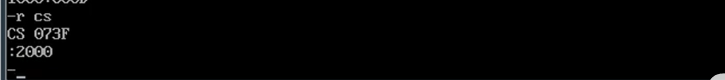
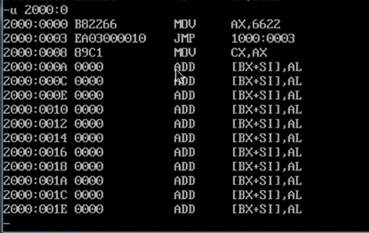
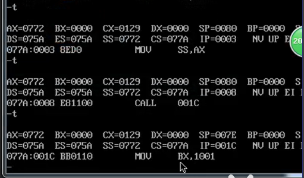
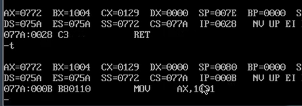
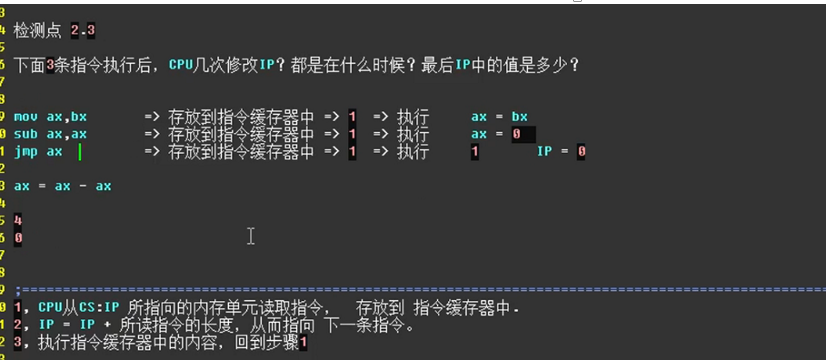
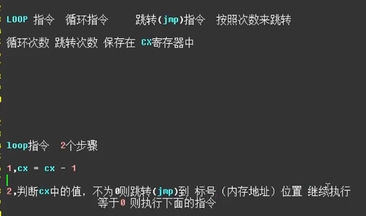
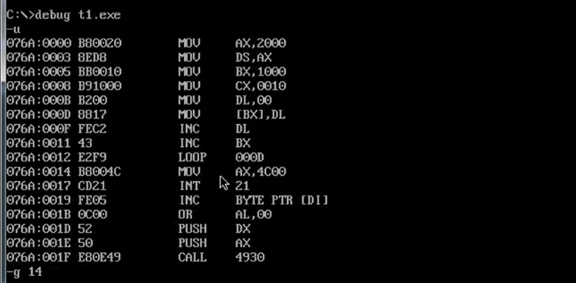
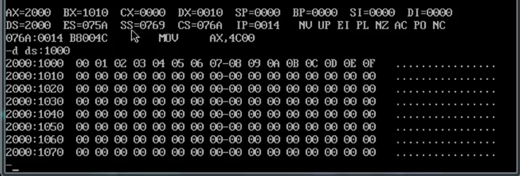

==-a + 地址==
是先显示该地址
然后在这个地址后面写指令
可以将指令写入该地址

==-a==是显示此时的地址

==-r==是显示各个寄存器

==-r + 寄存器名==
显示 寄存器名 + 寄存器中的数据
：
在冒号后输入值，可以对原有值进行修改

==-u + 地址==
可以显示当前地址以及之后一系列地址所对应的指令
主要的偏移地址寄存器发生改变

==-call指令==
：转移指令
例如 call 001C
执行到call指令后会先将call 001C存放到指令缓存器中
然后IP指向下一条指令

call指令会将IP指向的地址给保存起来(保存在内存中)

然后将地址跳转到 001C

再之后会由一个与call相对的转移指令
==-ret==
会将原来call保存到内存中的IP取出
并且跳转到这个IP地址

==-sub指令==
减法指令
Sub ax，bx
让左边的值减去右边的值
ax = ax -bx

Inc
是increase的缩写，是增加的意思

LOOP指令

当执行到LOOP时用-P指令进行执行，那么可以一次执行完循环结果

-g指令
-g后面加上要执行到的指令的地址，那么该地址前的指令会一次被执行完毕

Start: 可以告诉编译器，指令从哪儿开始往后是指令。

start作用：将程序入口的地址信息记录在最终的exe文件中的描述信息中

系统在加载exe文件的时候，会根据描述信息中的入口地址在哪里，
对CS和IP这两个寄存器进行设置

==段(segment)==

