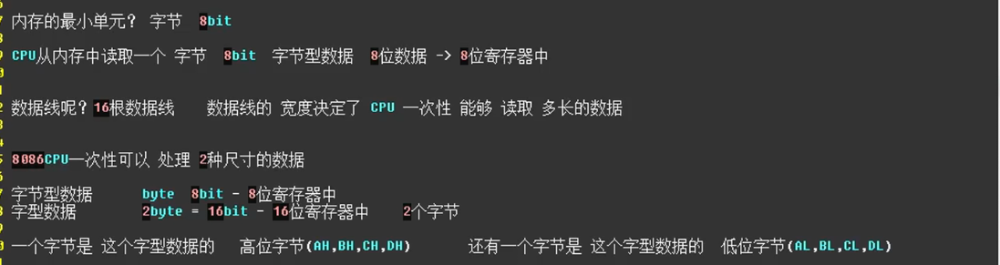
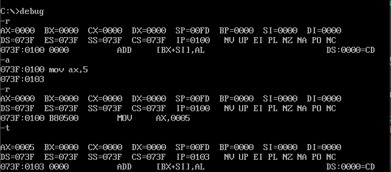
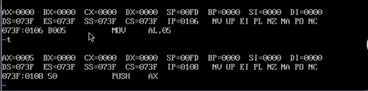
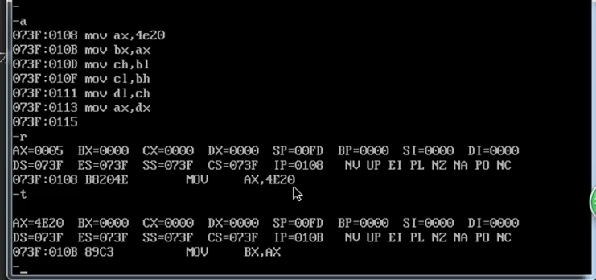
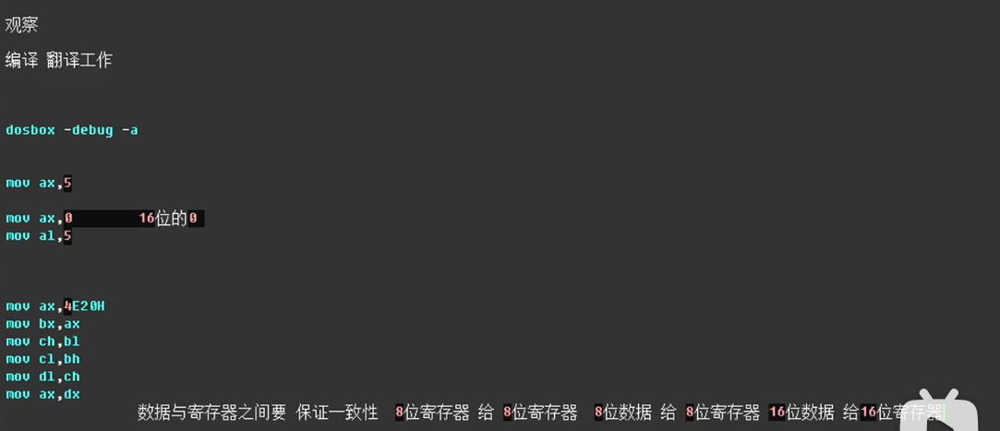
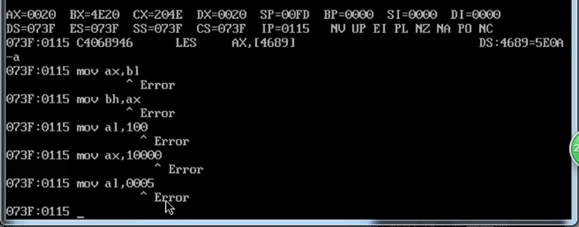

AX = AH+AL
BX = BH+BL
CX = CH+CL
DX = DH+DL

Mov AX,5是将AX左边的数移动到AX中
而后来显示的是 AX,0005是16进制位
代表了16bit，AX是16位寄存器，保证了
位数的一致性

而这里使用的是高位字节AL，所以是8位字节

4E20是字型数据，4E是高位字节 20 是低位字节

debug中只认识16进制，不认识十进制

