前面讲的时数据寄存器

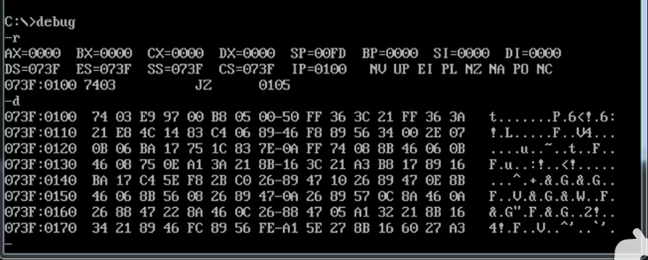

左边的是内存地址
冒号左边 段地址 -\>段地址寄存器
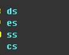
冒号右边 偏移地址-\>偏移地址寄存器
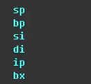
Bx虽然是数据寄存器，但是地址信息也可以当作一种数据

这些寄存器都是16位的
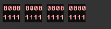

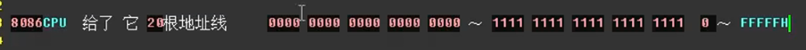

同样设计的计算位数，也决定了寻址能力
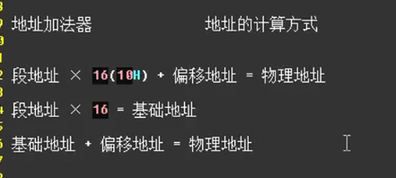

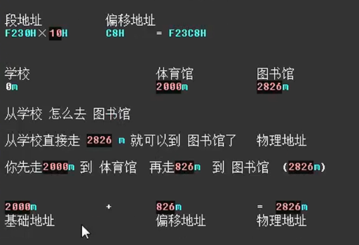

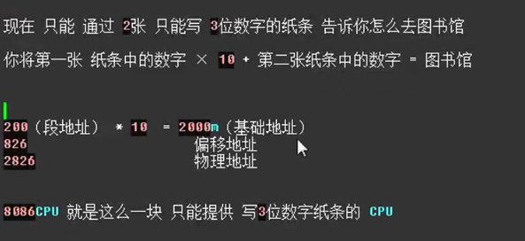

巩固题目

使用段地址会产生的问题
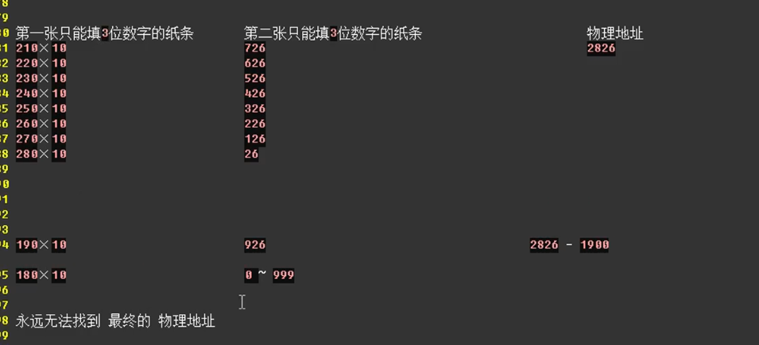

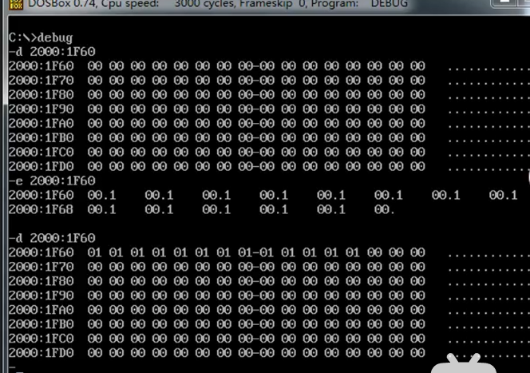
C:\\debug

-d 2000:1F60
//查看 2000:1F60 地址的值

-e 2000：1F60
//修改2000:1F60 的值

-d //再查看

下图是由不同的段地址与偏移地址组合成 物理地址 2000:1F60
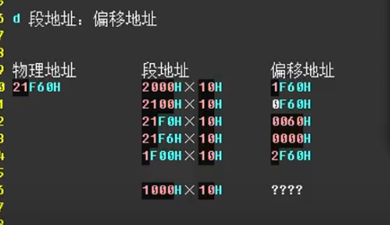

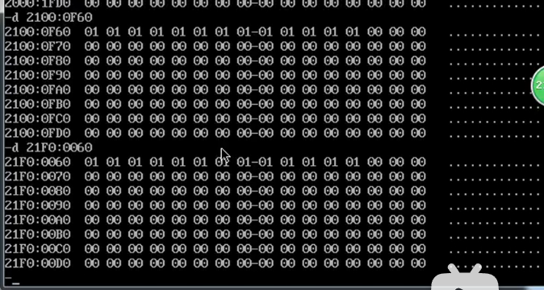

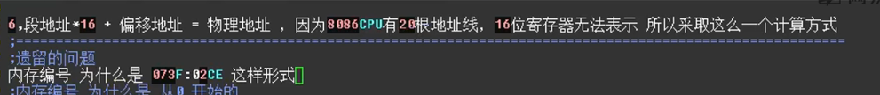

因为cpu的地址线数，即实际可存储的位置数，大于软件设计的
所以用段地址+偏移地址 可以很好的表示地址范围

