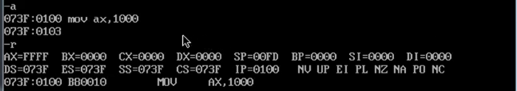

==-r将cs：ip所指向的机器码翻译成汇编指令==
-r修改寄存器中的内容

==-d==
左边显示内存地址
中间显示内存地址中相应的内容
右边是ASCII编码

可以查看某一个地址开始向后的128个字节

如果在后面再加一个数字(H),可以确定查看范围

2FH = 47

也可与仅仅只修改偏移地址的起始位置到后面的128个字节

同理

==-u==
从当前地址开始将后面地址的机器码翻译成汇编指令

从指定位置开始

从指定位置开始，并确定范围

==-a==
向一段地址中写入一段汇编指令
可以修改掉原来的指令

实际上修改的是机器码

在固定的内存中修改汇编指令

-t
将cs：ip地址指向的机器码执行

-e
可以修改内存中的内容

显示的是该地址开始的第一个内容，但是修改时会将第一个内容一起修改
修改时直接 空格 + 输入 即可

-e指令和ASCII码有关的指令
修改某指令后面的ASCII码
顺带修改该地址指向的机器码内容

中间时ASSCII码
右边时ASCII码在计算机语言中对应的字符

