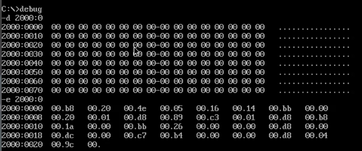

-d查看 2000 : 0
-e修改 2000 : 0输入
-d再查看 2000 : 0
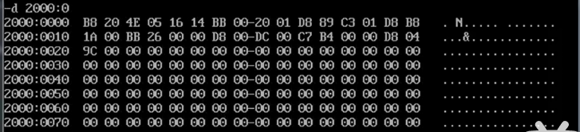

这一块存储在内存中

-u进行查看 2000 : 0

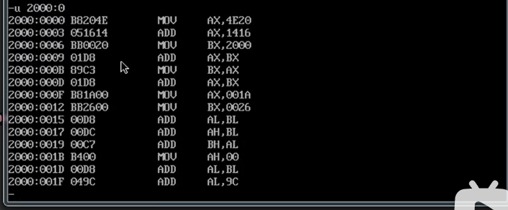

这里也是对应了内存，只是将我们之前输入到 2000 : 0的机器码给
翻译成了汇编指令

-r查看指令

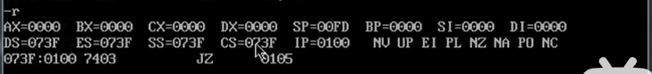
此处cs：ip指向的是 073F:0100
那么该如何将之前输入的机器码当作指令来执行你呢？
如下：
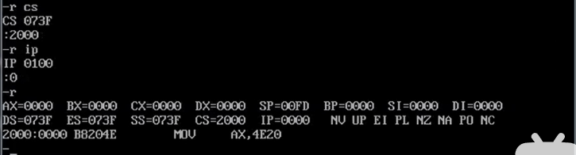
此处指向了2000：0000位置，那么前面输入的机器码就会被当作指令来执行
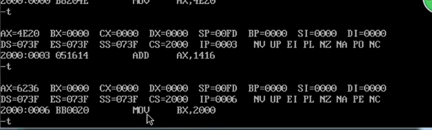

cpu中的cs 段地址寄存器 和 ip 偏移地址寄存器 组合的时候，从中读取的内容，来当作指令来执行
cs与ip决定了cpu从哪里开始读取
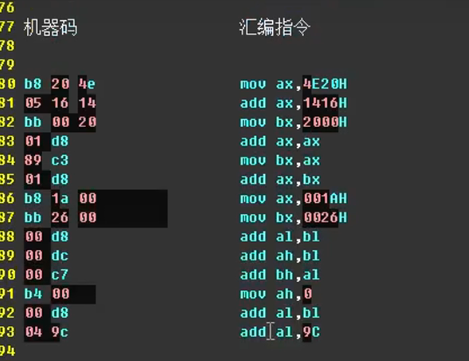

上一节课补充

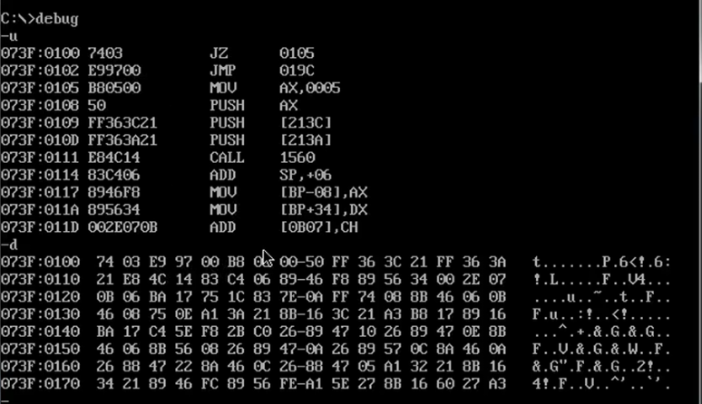

-d将某内存地址 开始的字节 全部当作数据
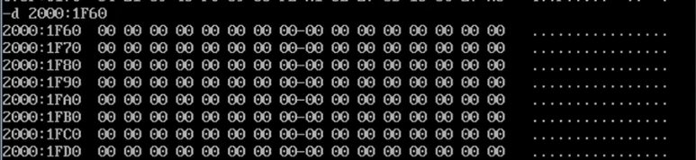

-u将某内存地址 开始的字节 全部当作指令
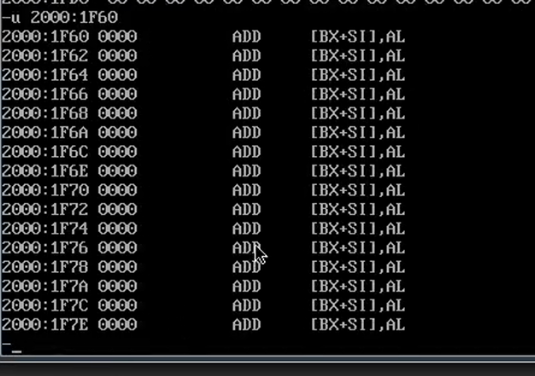

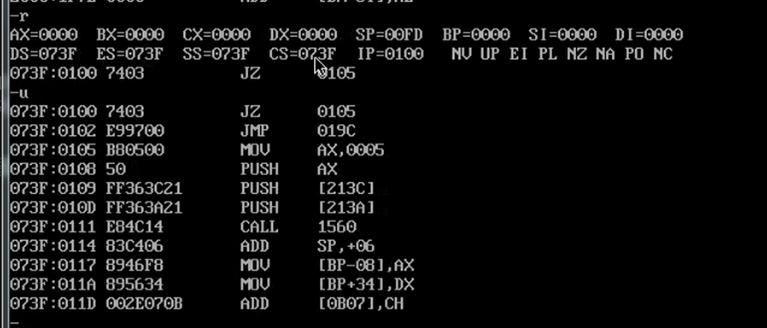
-ds -es -ss -cs 全部都是段地址寄存器
-IP -SP -BP -SI -DI -BX 全部都是偏移地址寄存器
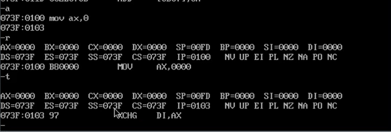

输入指令后 IP寄存器发生改变
所以得出结论：IP寄存器和指令有关

之后分别尝试修改
-ds -es -ss -cs
结过只有修改-cs后段地址寄存器发生改变
得出结论：

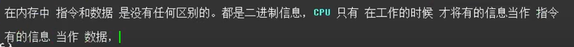

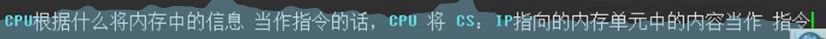

