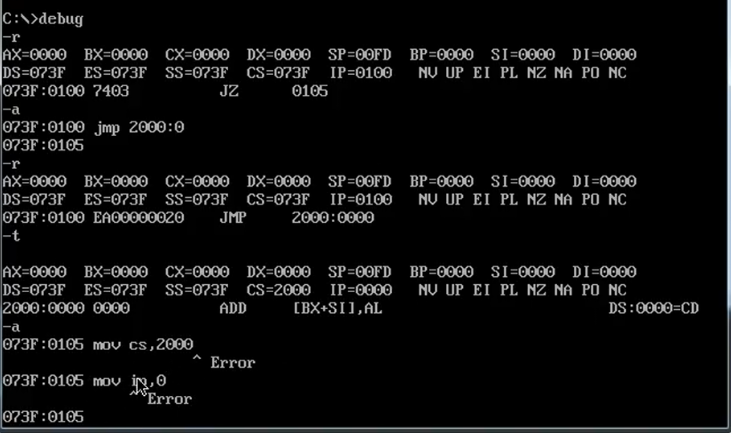
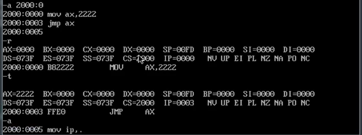
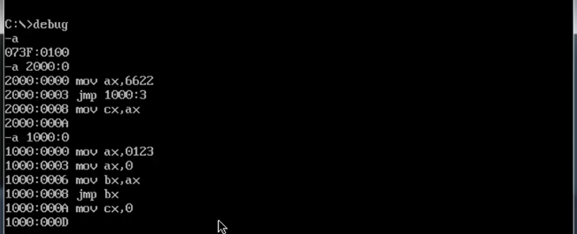
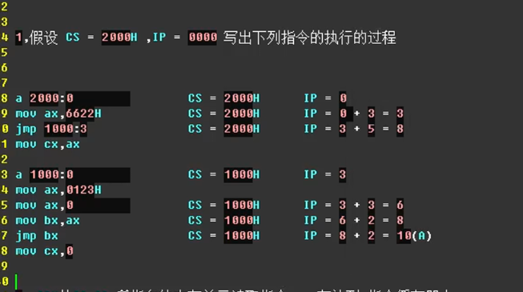
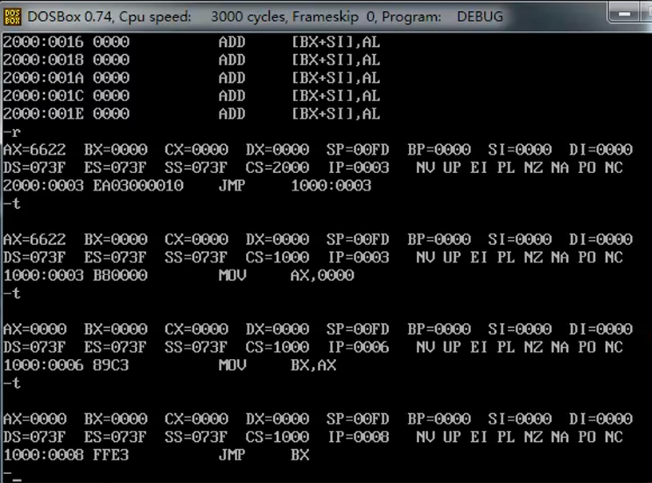

-a + 地址
是先显示该地址
然后在这个地址后面写指令
可以将指令写入该地址

-a是显示此时的地址

题目

-t
1、cpu先将指令放入指令缓存器中
2、然后IP加上所读取的指令字长，指向下一条指令
3、执行指令缓存器的内容，回到步骤1

修改段地址CS与偏移地址IP

修改偏移地址IP

直接由2000：3 跳转到 1000：3
Mov cx，ax会被IP指向但是不会被执行
同理 mov ax，0123H既不会被指向也
不会被执行

