思考：
cpu如何区分指令和数据

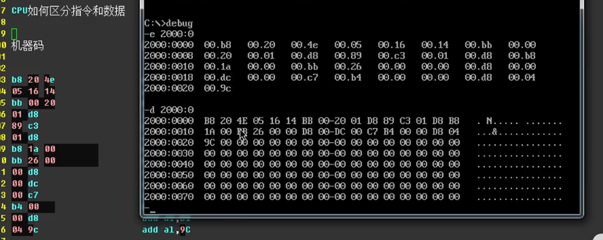

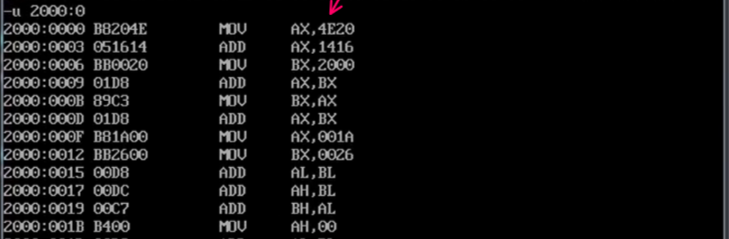
此时这些指令还无法被使用，因为cs：ip还没有指向这个地址

所以执行一段跳转指令

-a
在此时地址中写入 跳转指令 然后执行
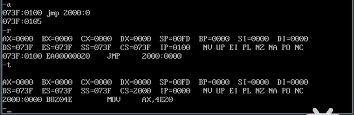
然后依次执行提前写好的指令

AL八位寄存器，超出位数省去
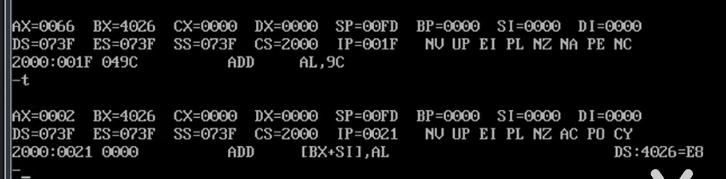

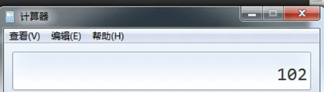

编程的两种方式
1、使用机器码 如上
2、使用便于人类理解的编程语言 如下
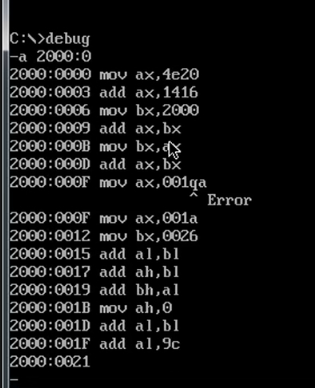

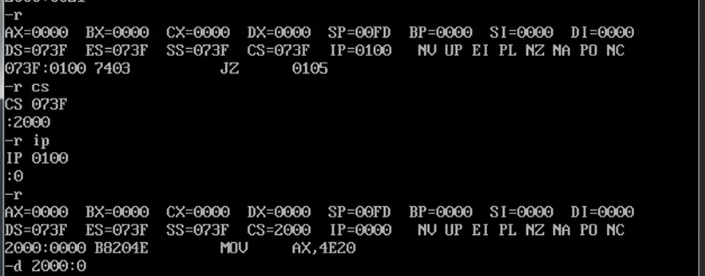

只有cs：ip地址指向写入机器码指令的地址之后
才可以执行指令
否则，这些指令只是一堆数据

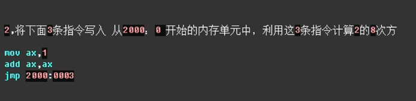
2的8次方转化为2进制为100

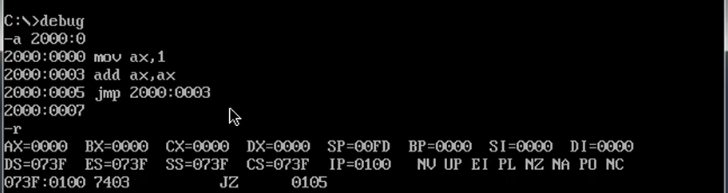

指向下一条指令开头

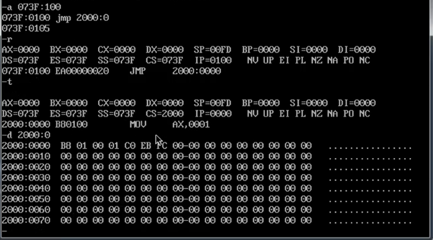
第二条与第三条指令实现了循环跳转
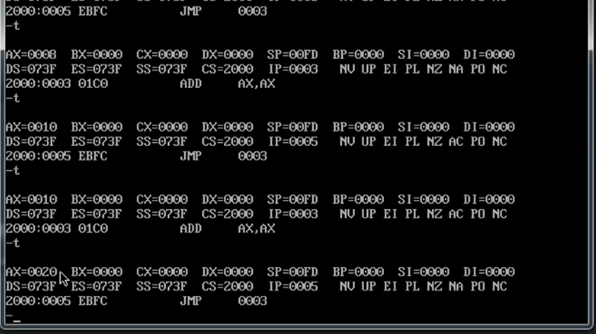

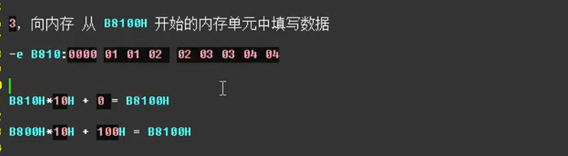

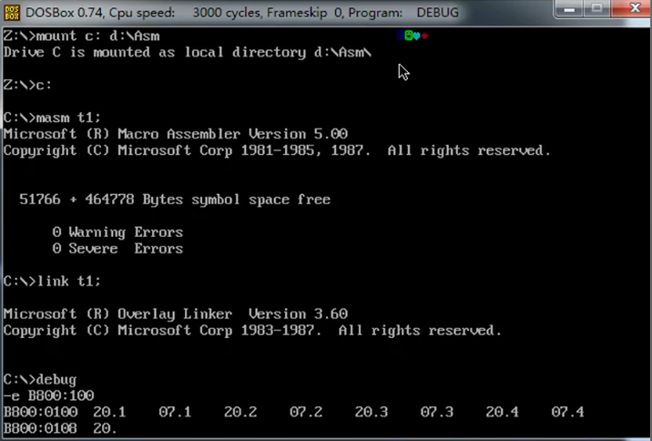

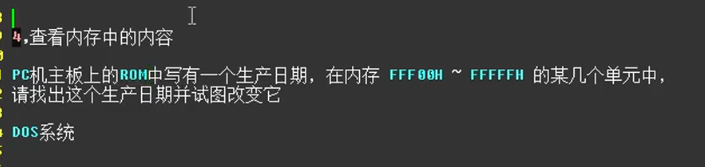
提前说明ROM内存是不能写入东西的
所以在这个范围内找的内存无法被修改
只允许的读取 如下：
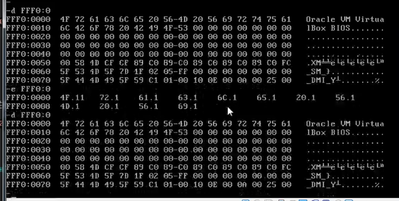

