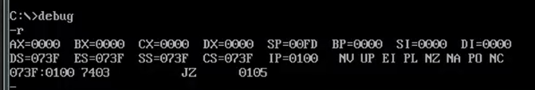
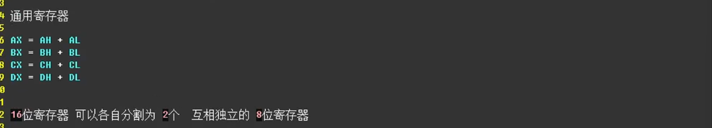
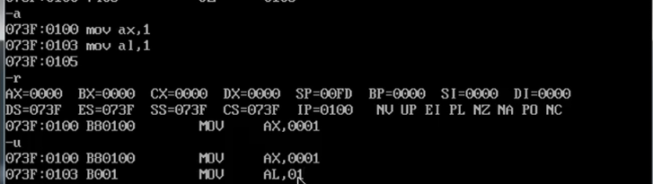
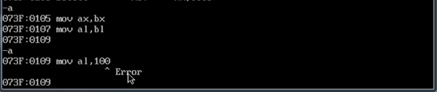
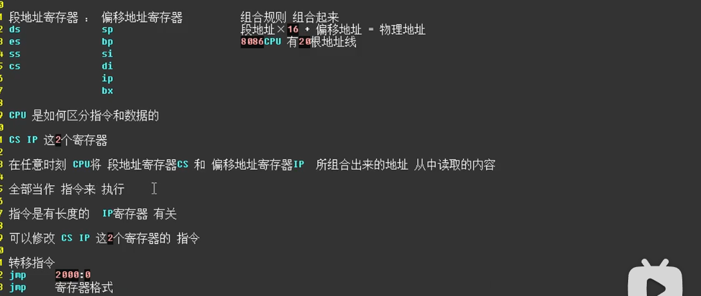
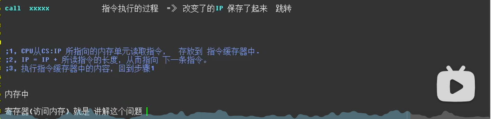

寄存器

==数据寄存器==
AX
DX ax与dx 用来处理数据
BX 也可以被当作 偏移地址寄存器
CX cx也有其他作用
以上四个寄存器 也被成为：通用寄存器

==地址寄存器==：段地址寄存器 偏移地址寄存器

==标志位寄存器==

AX是16位的 AL是8位的
保证了数据与寄存器之间的 位数 一致

==那么翻译软件是通过什么来判断 这两个到底是几位的1==
其实是通过寄存器来判断的

寄存器与寄存器之间，还有寄存器与数之间要遵循位数一致

上面的是mov指令
而add指令与mov指令类似，都要遵守位数一致

==add运算时如果超过了寄存器最大表示值，多出来的会被存放到其他内==存中

寄存器之间是相互独立的

==地址寄存器==

指令和数据 存放在内存中是没有任何区别的
需要程序员 通过修改 寄存器的内容 地址寄存器
告诉cpu 数据在哪里 指令在哪里
