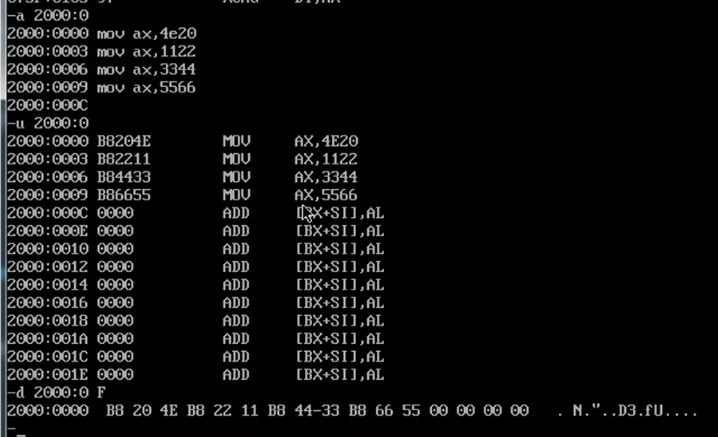
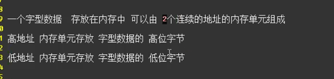
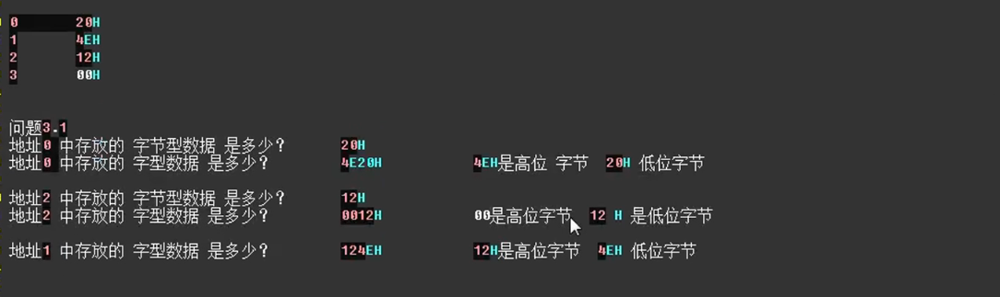

第三章 寄存器(内存的访问)

问题:

Call 指令 将(IP 000B)保存到哪里(内存的哪里)
Ret 可以拿回

数据长度
字节型数据
字型数据 ：2Byte

==三条指令的共同点==：
1、每一条内容 在内存中 都用B8分隔开
2、而且每一个字型数据都别分成了 两部分，因为本身就是由两个Byte组成的
3、但是在机器码中 高位字节与地位字节发生了位置对调

==重要结论==

高位地址(序号数大的字节)存放高位字节
低位地址(序号数小的字节)存放低位字节

由下面的题目可以知道
字节型数据是1Byte
字型数据是2Byte

