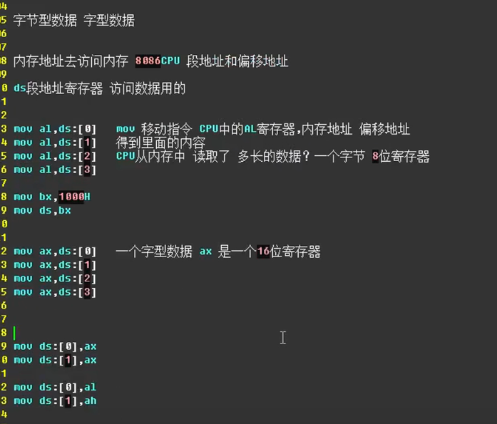
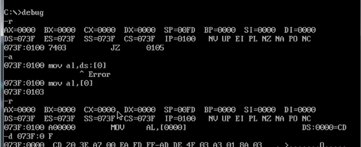
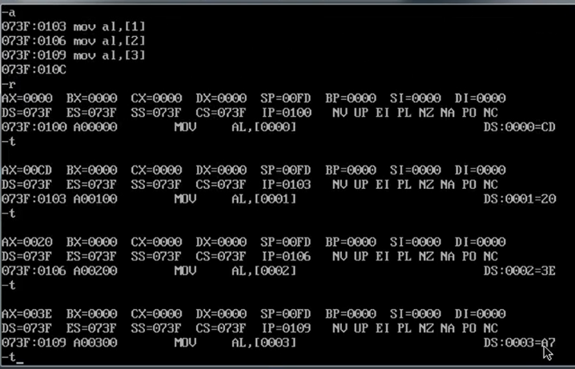
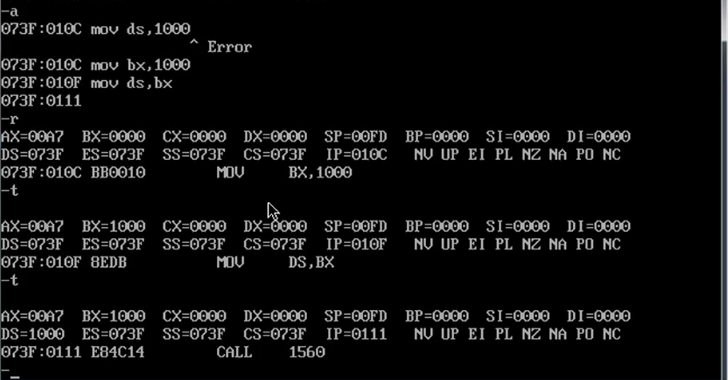
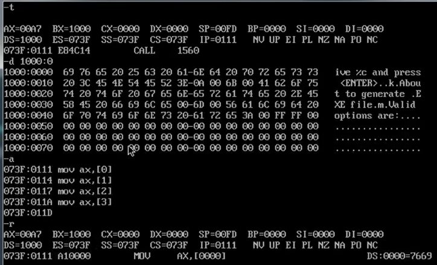
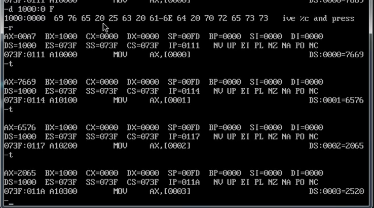
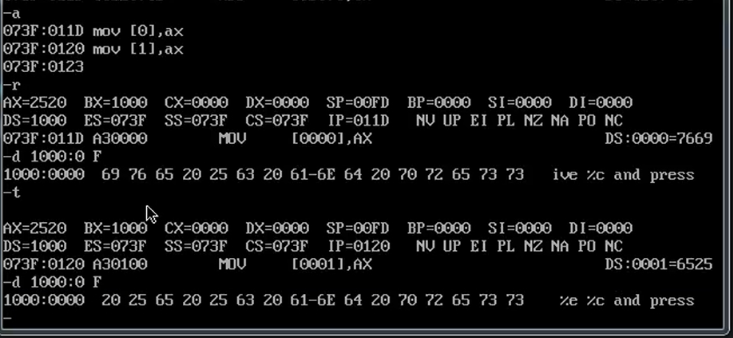
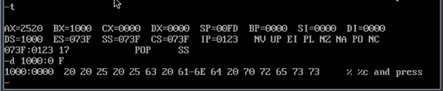

\[ \]表示获得ds里面几号地址的内容

Mov al，ds : \[0\] 在debug中不受支持
用mov al ，\[0\] 来表示

**将ds : 里面存储的字节元素相继存入al中，因为是al所以是字节存入**

**Mov ds，1000不合法，先将数据输入一个寄存器，然后再将寄存器里的内容输入ds**

将字型数据相继移入ax
高位地址(序号数大的字节)存放高位字节
低位地址(序号数小的字节)存放低位字节

