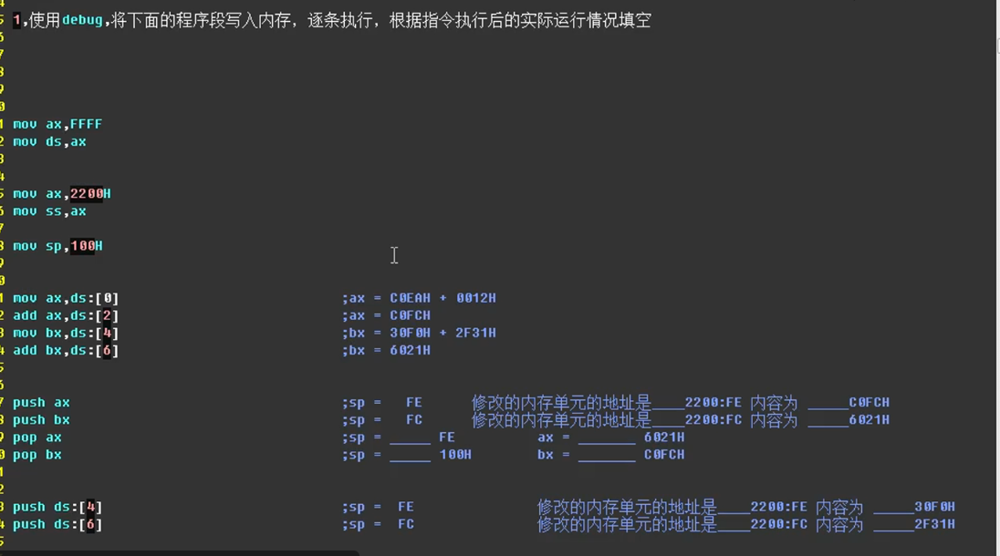
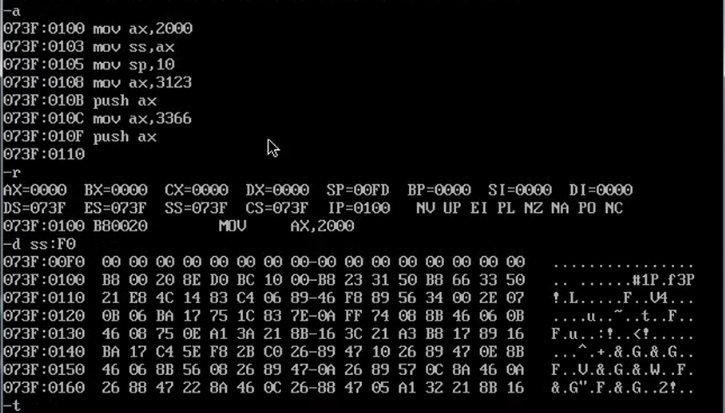
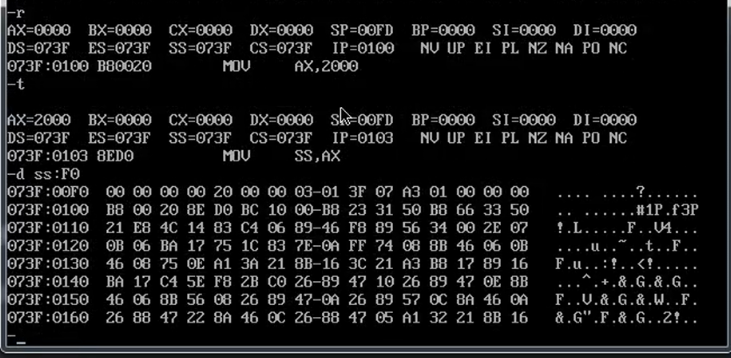
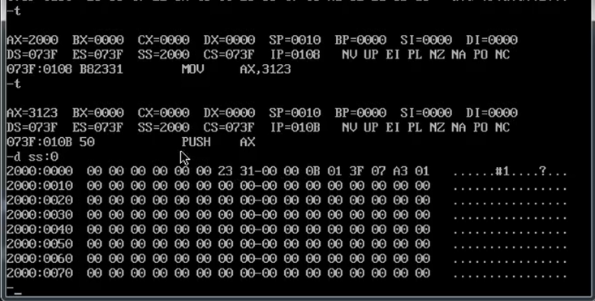
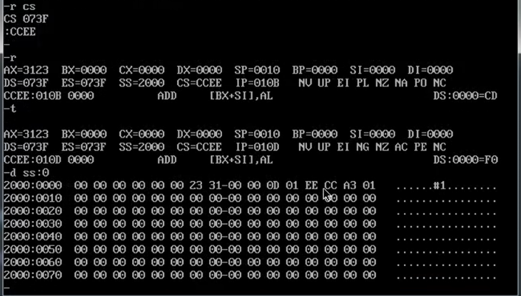
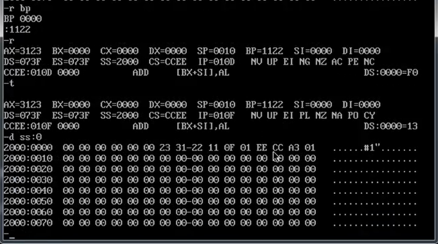
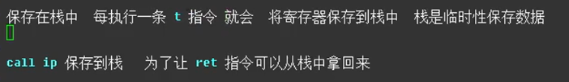

执行第一个mov指令，栈中的内容发生了改变

push指令还没有执行，只是执行了 mov AX，3123 栈中数字就发生了改变

此处的
073F是CS寄存器
010B是IP寄存器

证明如下：

此处是AX寄存器中的内容
中间椭圆中的两个0是BP寄存器中的内容

call指令是将下一条指令的IP保存到栈中
为了让ret指令可以将该IP从栈中拿回
以上的寄存器中的值被临时性的保存到栈中也是为了之后可以拿回

初始时栈的内容

