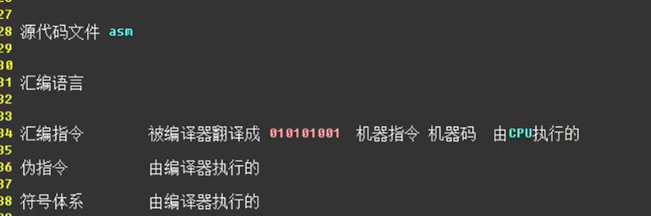
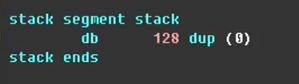
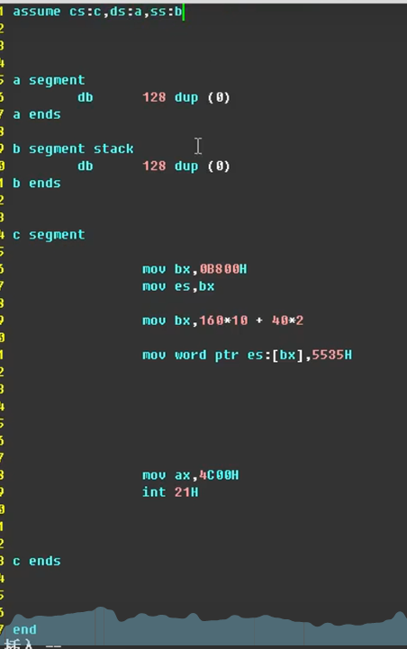
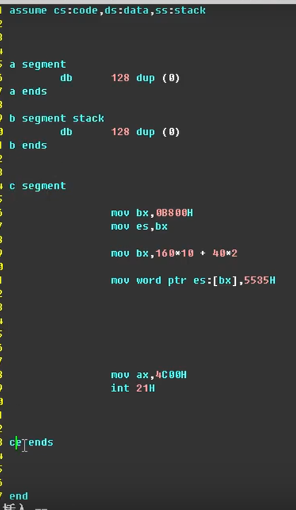
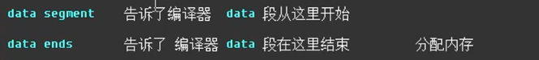
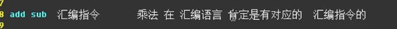
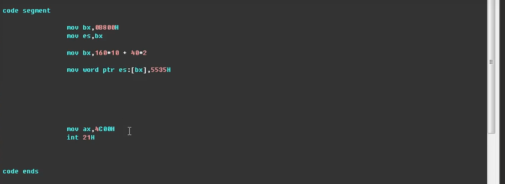
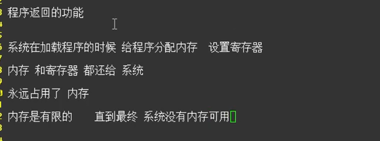

Assume 假设
Segment 段
Code segment 段名

Data segment 与
Data ends 都是成对出现的

Stack segment 与
Stack ends 也是成对出现的

还有
Code segments 与
Code ends 也是成对出现的

此处的stack 是告诉编译器这里是栈段

名字可以随意起，但是一般都要方便阅读

告诉编译器，汇编指令已经结束了

汇编指令由CPU执行的

符号体系 是由编译器执行的

