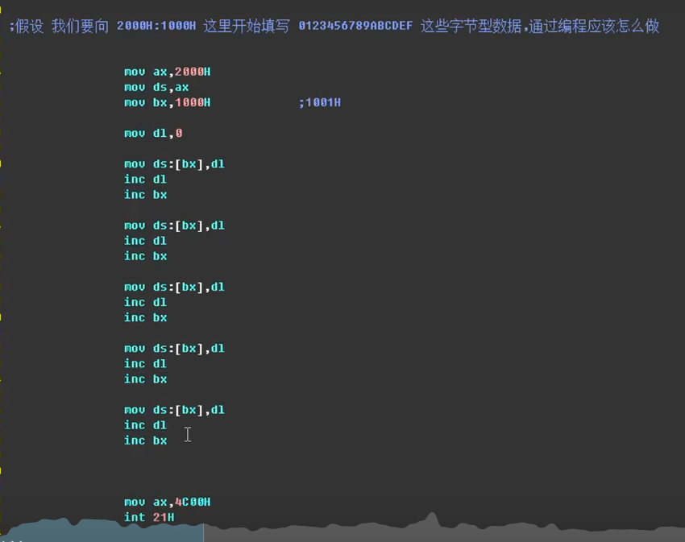

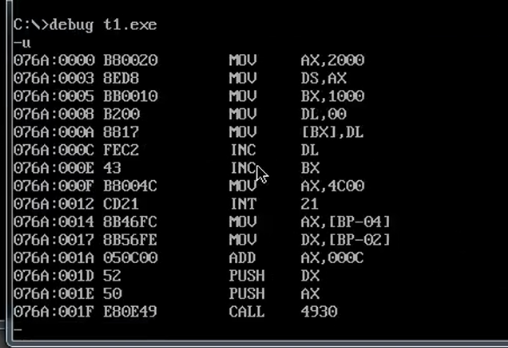

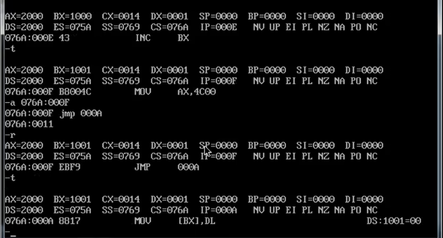

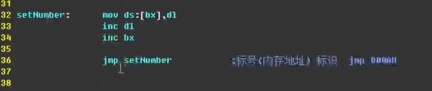

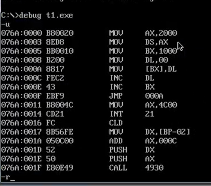
当源文件中插入新的指令时，受到影响的指令的地址会
发生变化
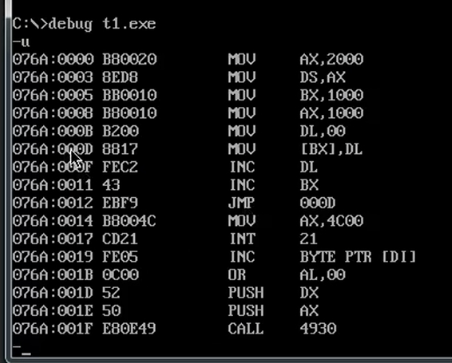

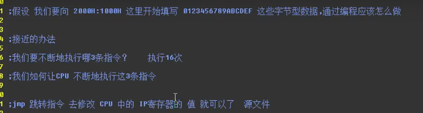

LOOP指令
如果使用jmp指令那么按照上面的设计会无限跳转
但是如果用LOOP那么可以限制跳转次数、
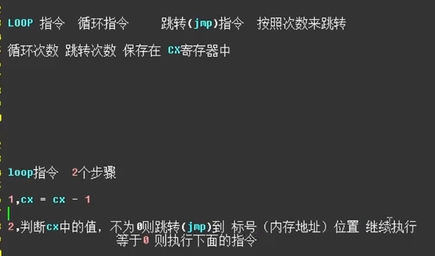

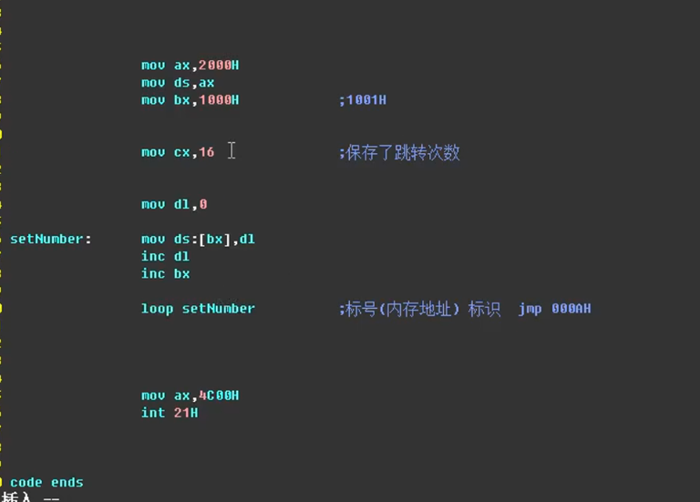
CX寄存器里的值会依次减一
如果减一后的结果是0，那么就会执行下面的指令

当执行到LOOP时用-P指令进行执行，那么可以一次执行完循环结果
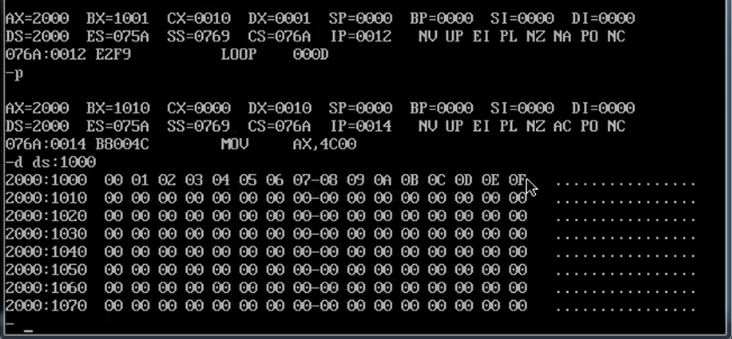

-g指令
-g后面加上要执行到的指令的地址，那么该地址前的指令会一次被执行完毕

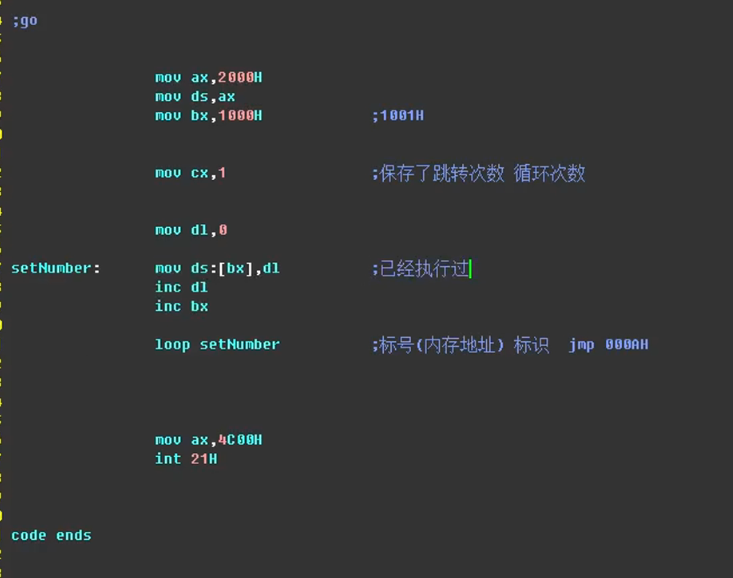

但是当此处的数值设置为0时，就会产生越界问题
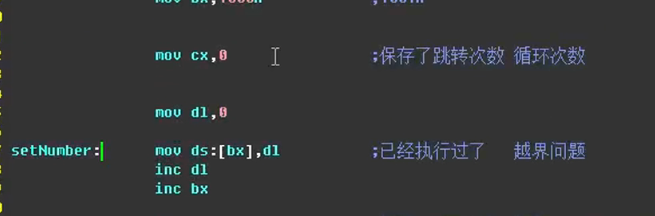

LOOP例题

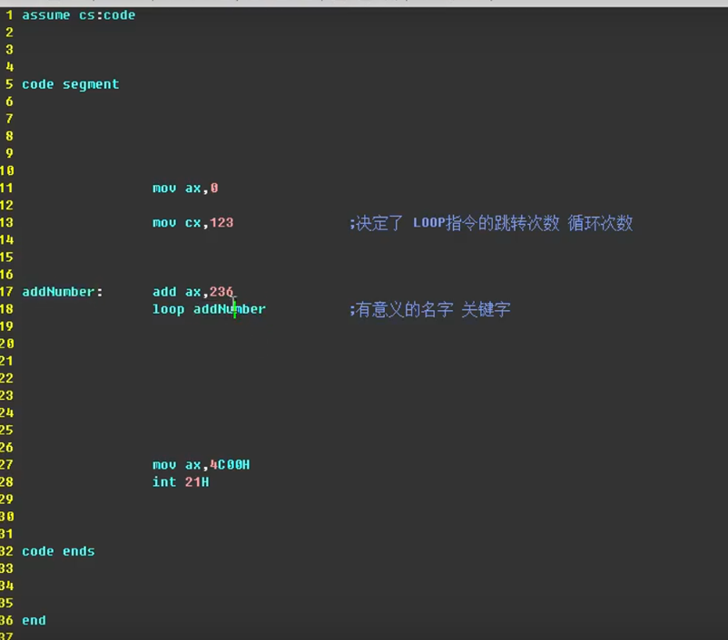

指令 mov \[BX\]，DL 的指令的地址是
CS:IP 076A:000A

在debug中可以使用 jum ，这样又可以跳回原来的指令执行

这里的数字是几，LOOP中的指令就会执行几次

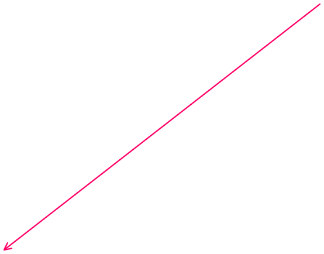
不可以用关键字：例如bx 来命名

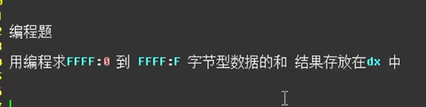

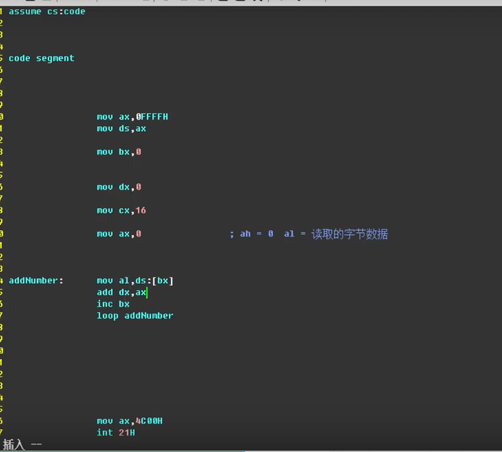
虽然有些内存中的初始值为0
但是在试验时最好进行设置，这一步在编程中叫做初始化
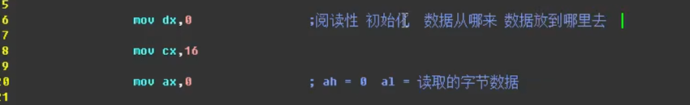
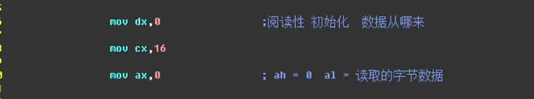

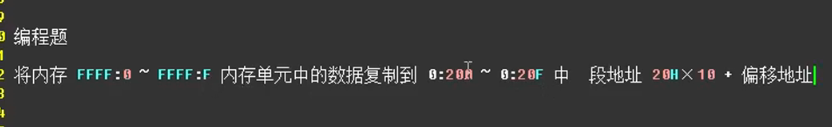

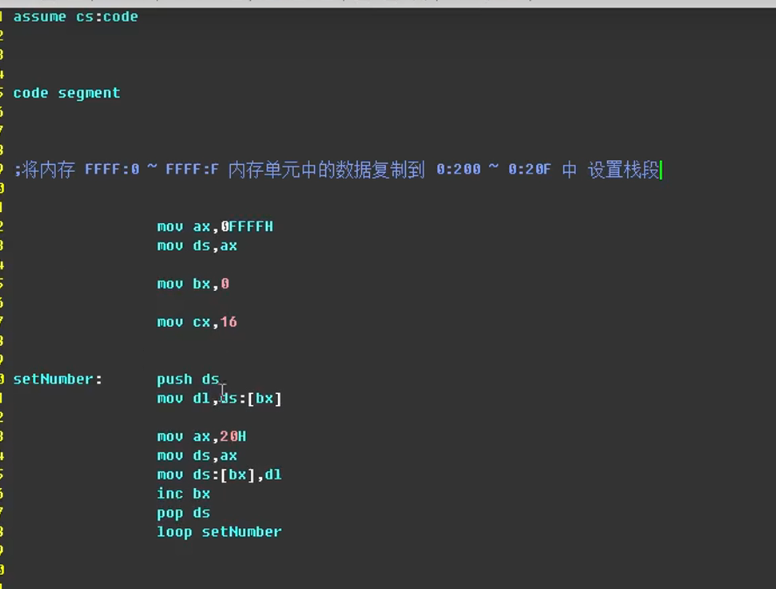

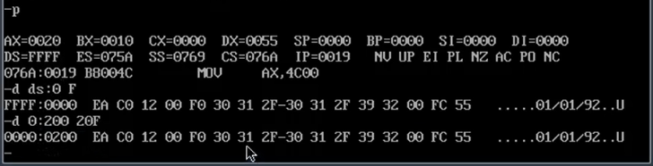

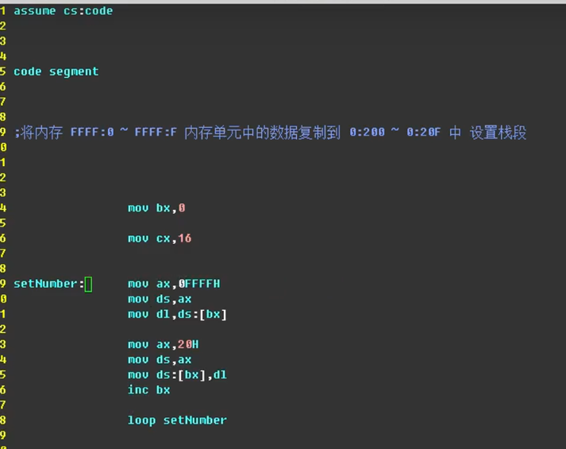

上述两个代码都没有设置栈段，有一定的危险

上面的代码来回操作ds
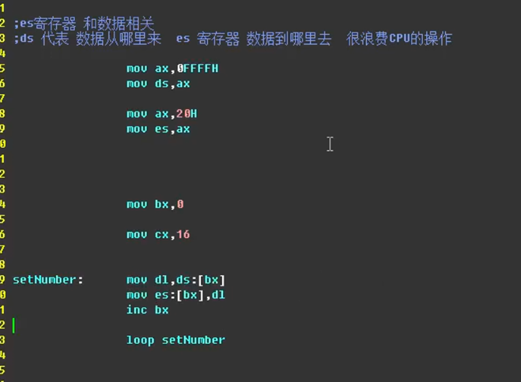

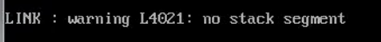
警告没有设置栈段

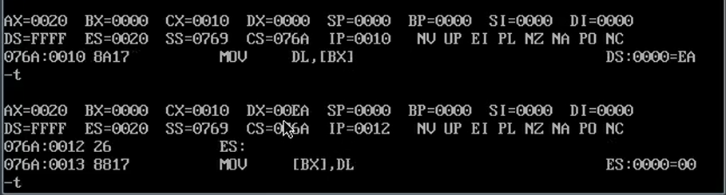

上一题代码优化：
将dl寄存器修改为dx寄存器
然后loop循环次数减半
被复制的数据由字节型数据变成了字型数据
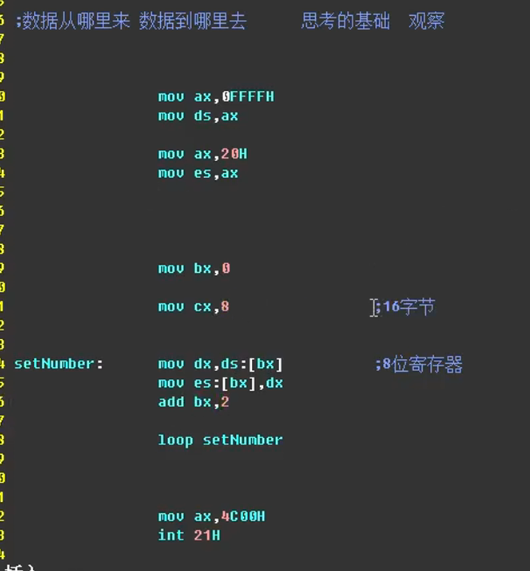

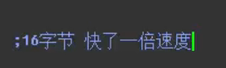

提升速度并且节省寄存器的方法
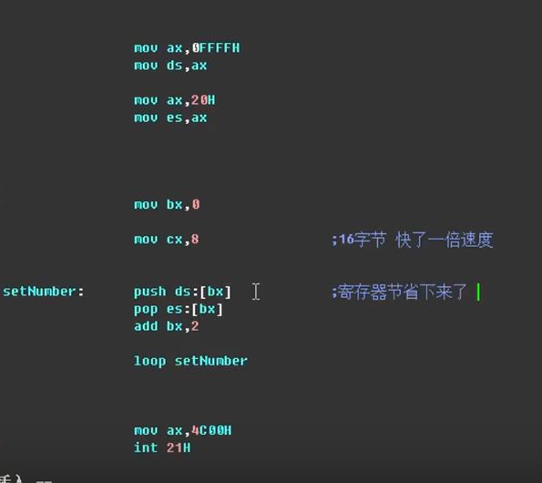

