利用提前编写好的程序
系统自动分配内存
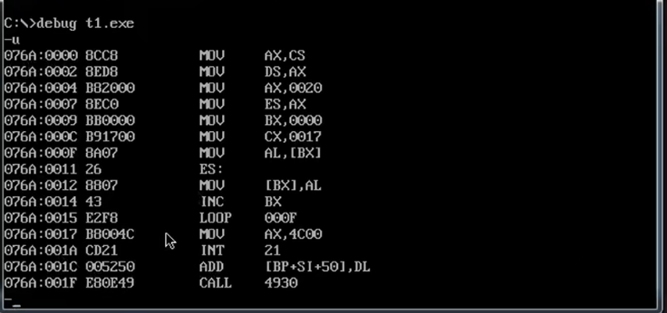

最开始我们安排指令的方式是
先在某地址处写上命令
然后再用cs:ip指向这个地址即可
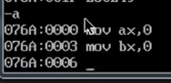
而上一节中，只需要在源文件中写上这些指令
然后经过编译与链接，系统去加载最后链接
出来的exe文件，就可以了

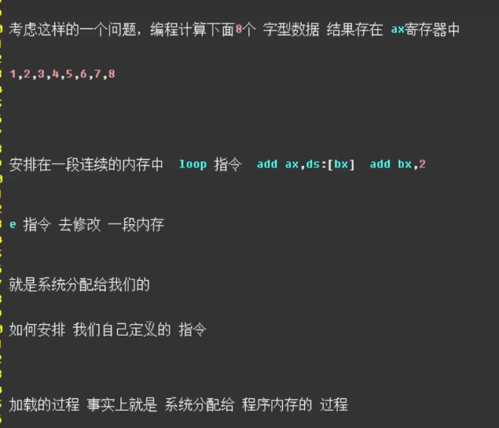

那么该如何定义自己的数据呢？

只需要将其写入源文件中即可

d —\>define 定义
W —\>word 字型数据

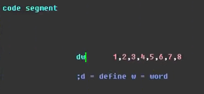

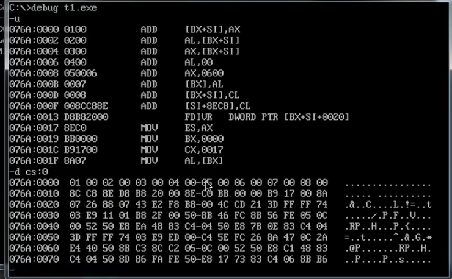
是不是因为，这些写入源文件的数据都默认为指令，所以这些数据才会被写入cs寄存器？？？

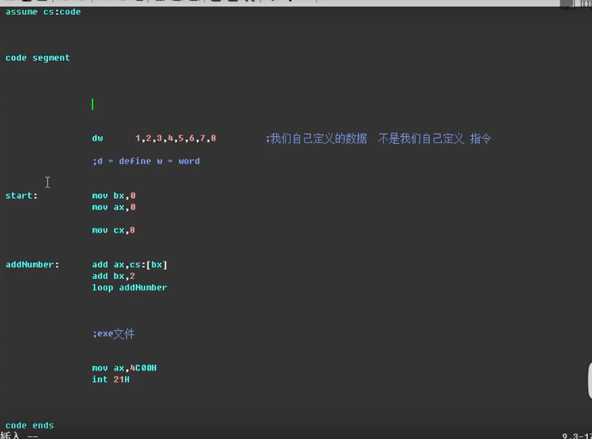
Start: 可以告诉编译器，指令从哪儿开始往后是指令。
结尾用
End start 来结束
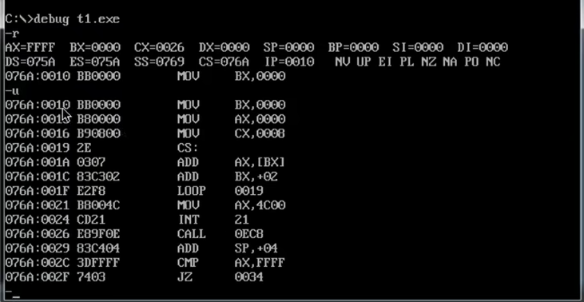

前面16个字节就是自己定义的数据，再往后就是指令开始的地址
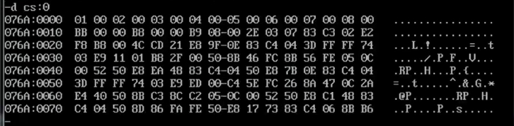

Jmp begin 同样有start的作用
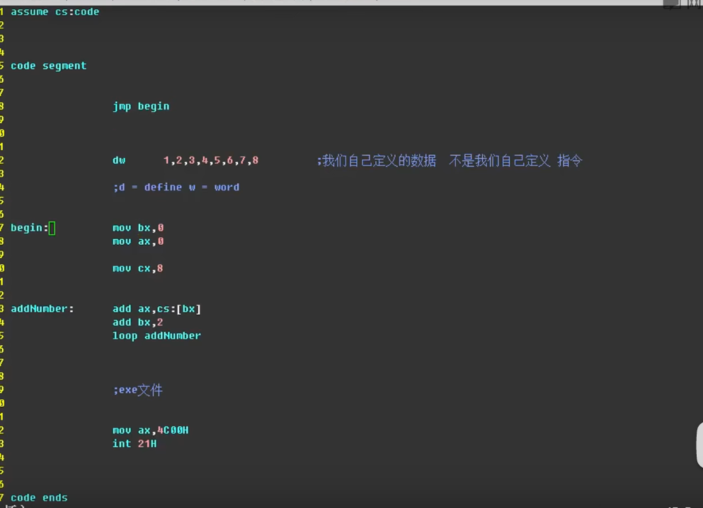
如下：第一条执行的是跳转指令
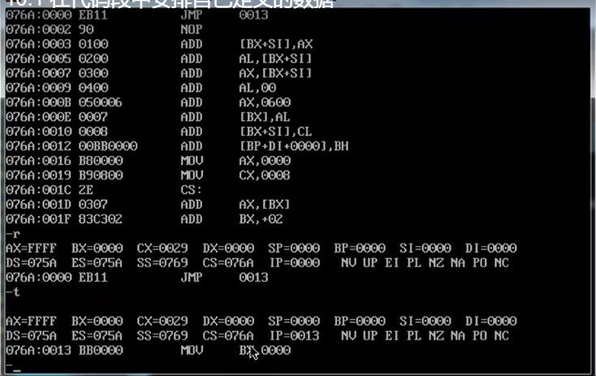

但是修改指令后，数据存储顺序会发生一定的变化
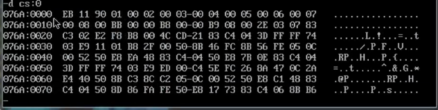
此时01是从索引3开始的

