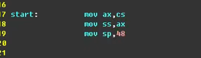
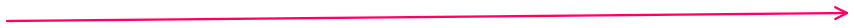

但是上面的做法是不安全的

如果在源代码中编写

还没有创建栈时

在电脑中这写指令只是一些提前设置好的数据

此处是设置了栈空间

cs：地址 48对应了30H

补充：上面设置的数据都是一些字型数据

但是不同的操作系统debug后其cs：地址都不同
所以可以修改为

此时

至于第三行的数据，可能是因为栈的设置导致的

将数据push到栈中

将数据存入栈中
==将cs：bx地址的数据依次push到==
==设置好的栈的栈底==

将数据从栈中pop出去
==循环过后bx变成了初始值==
==将从栈顶开始向第一次被push的地址==
==pop数据并覆盖==

从栈的视角看数据

从cs的视角看数据

循环过后bx变成了初始值

原来数据中的第一个数据
被栈顶数据覆盖

