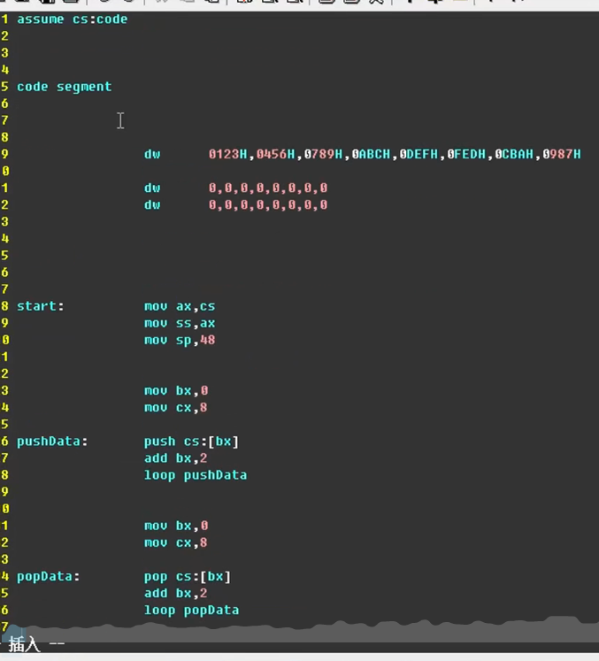
问题一：
将这些数据都放在同一个段 code segment 中会显得非常混乱

问题二：  

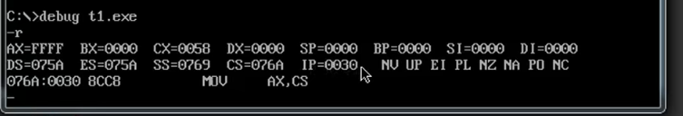
IP是从0030H开始的
是因为 start：是从这个位置开始
即CS:IP 指令就从这个地方开始

也就是说start前面的数据占用了IP偏移地址寄存器里的内容
也就是减少了指令的数量
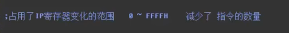

解决办法：  

在没有加上start伪指令之前
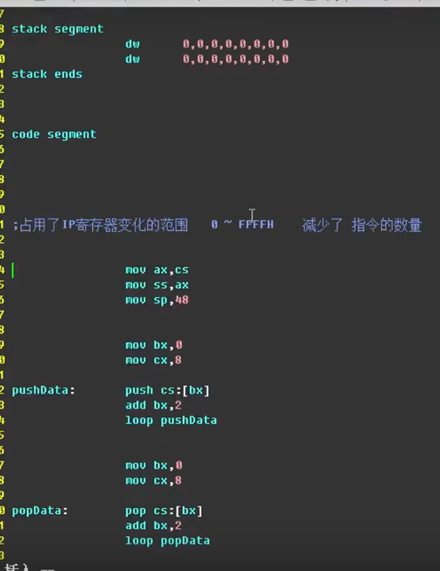
IP确实是从0H开始
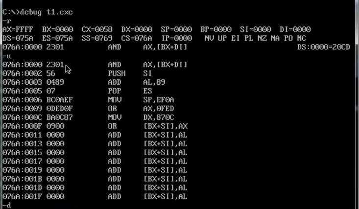
但是cs：IP寄存器中的前面用于存储数据，指令还是在数据后面
是不过是IP开始的位置提到了最前面
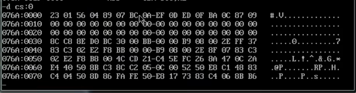

所以start伪指令还是要加上的

start作用：将程序入口的地址信息记录在最终的exe文件中的描述信息中

系统在加载exe文件的时候，会根据描述信息中的入口地址在哪里，
对CS和IP这两个寄存器进行设置

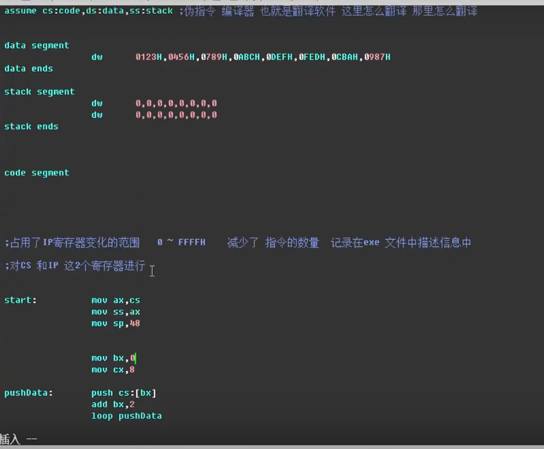

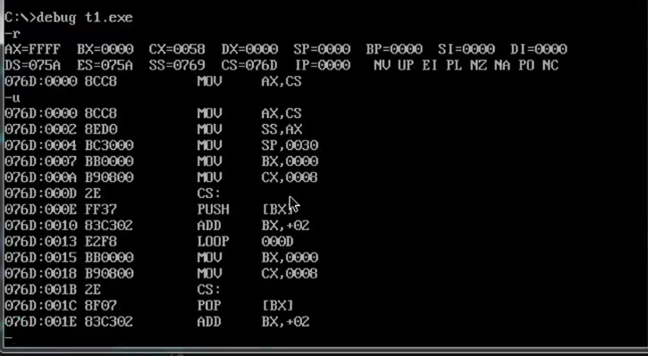
==修改后IP从0H开始，同时 指令的数据也是从0H开始==

数据段

栈段

代码段

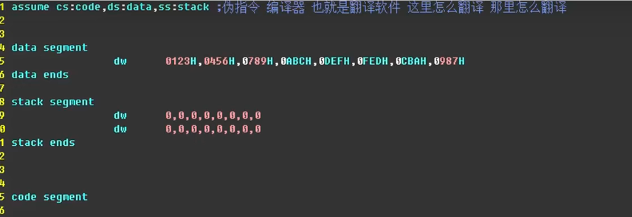
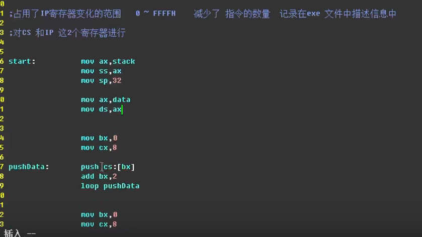

前三条指令：对栈进行设置
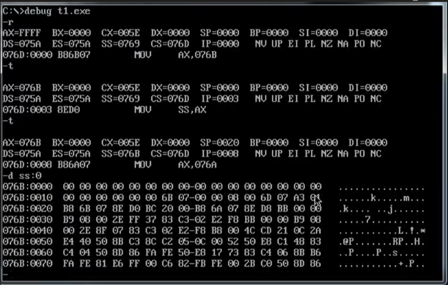

之后对data进行设置
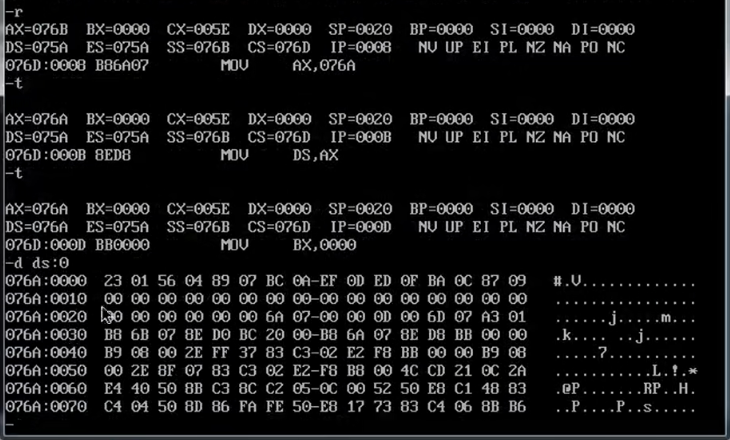

造成右边情况的原因
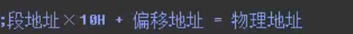
指令地址的计算结果，刚好等于数据地址在指令数据处利用数据地址进行计算的结果

也就是这些数据在内存中是按照源文件中的顺序先后存储，
只是不同的寄存器，的计算方式不同，但是最后的计算结果
都是指向相同的位置 (大致是这个意思)

警告没有栈段
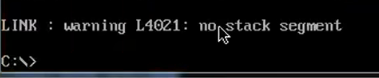
加上stack即可解决
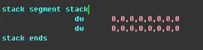

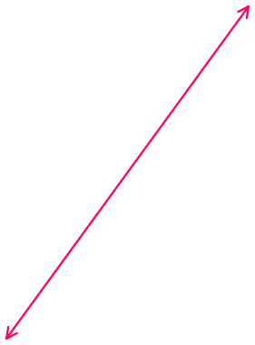

对栈进行设置

对数据进行设置

==1、上面是data数据==
==2、下面是栈空间==
==3、再下面就是代码段==
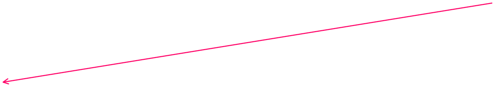

