编写调试据有多个段的程序
==段(segment)==

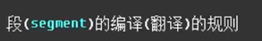
会影响到

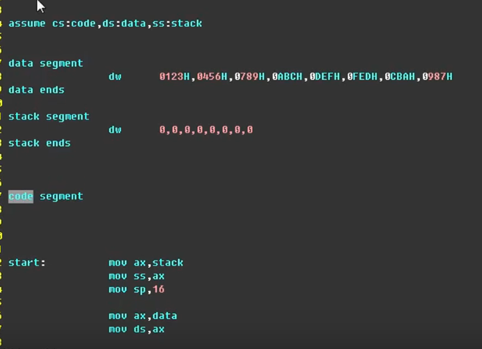

在实验时

以下是代码：  

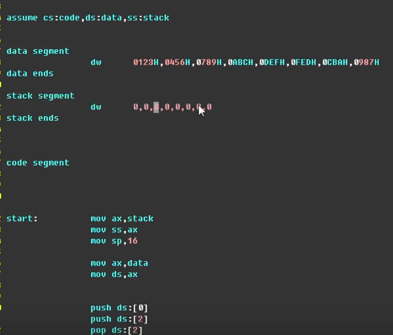

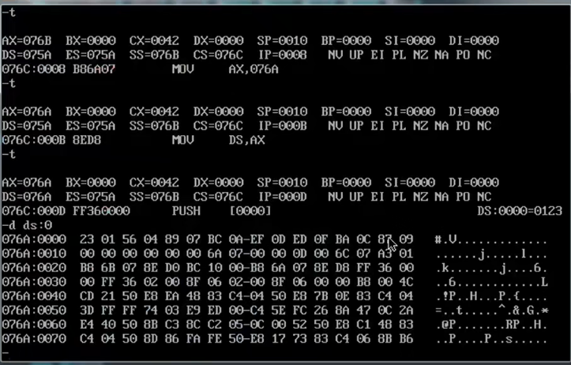

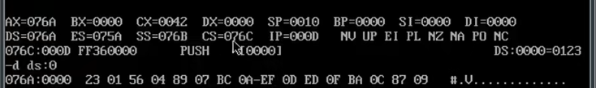

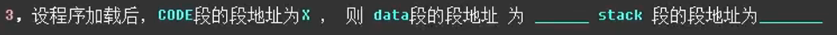
Code段的段地址，即CS：所指的地址
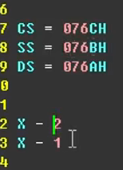

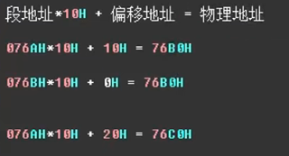

数据从哪里来

栈段在哪里

代码段在哪里

8个字型数据
占16个字节

8个字型数据
占16个字节

自己安排的栈空间，然后下面是代码段

此处的减2，是段地址减2
也就是地址之间查理 2\*10H
即32个字节

第二题
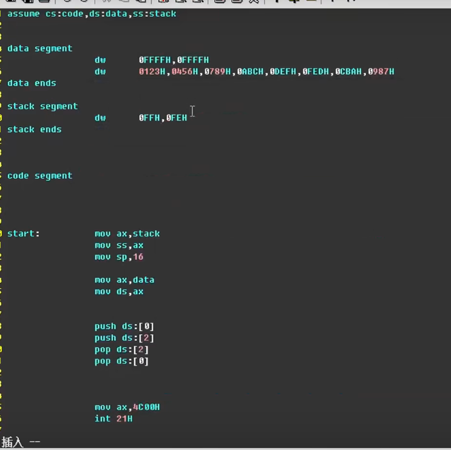

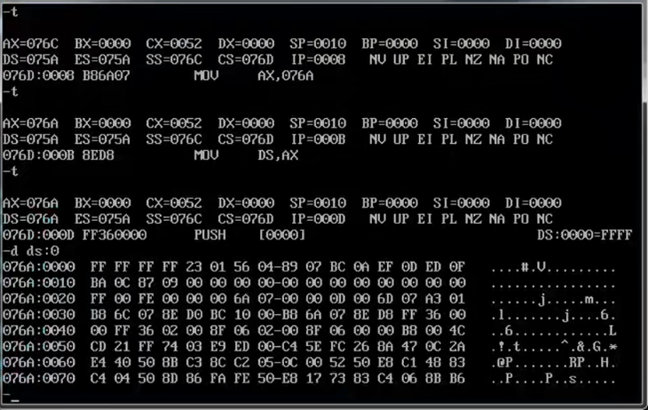

应该占用10个字，即20个字节
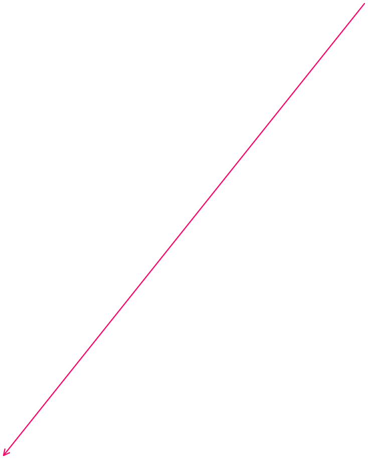

然而实际占据了32个字节，两行的数据

当code段放到前面后
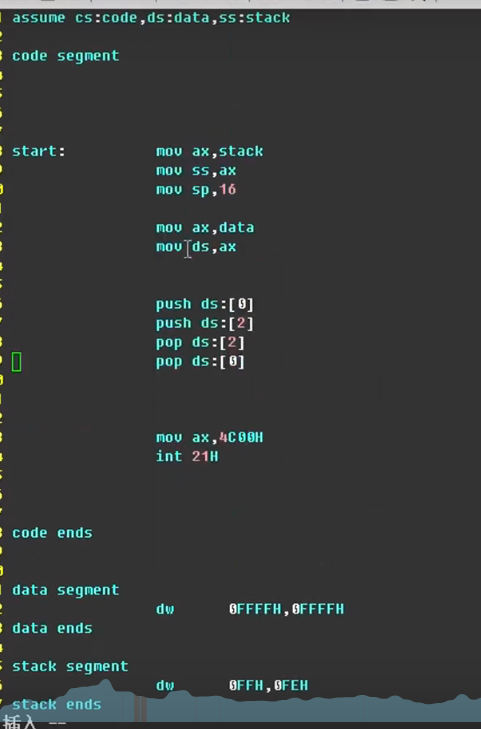

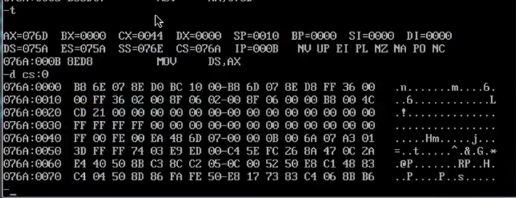
查看21 CDH指令
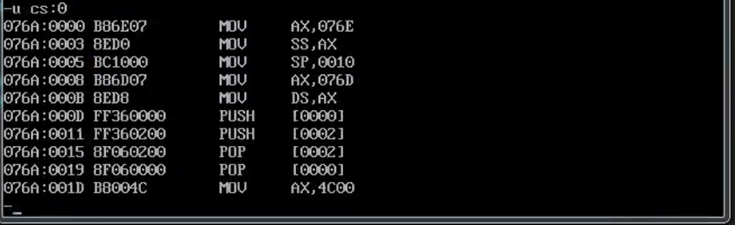
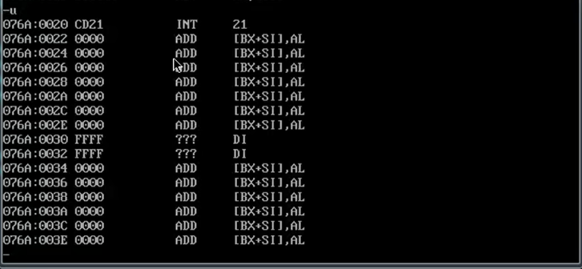

再看CS：0
发现代码段占了48个字节

重要问 题：

解答：
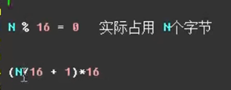

重点：

最后一个指令的地址：21 CDH

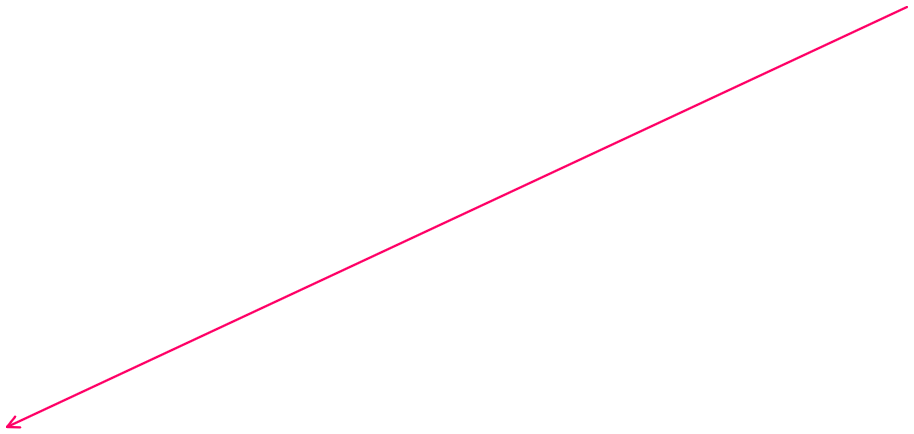
这里是数据段

