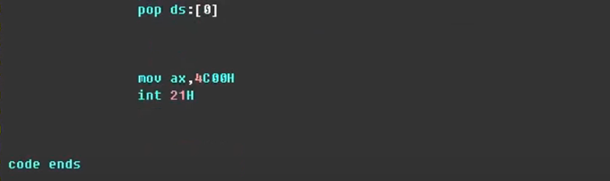
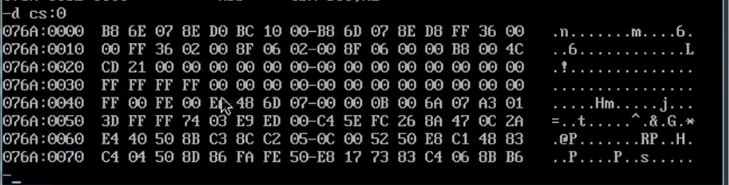

编写调试据有多个段的程序
==段(segment)==

会影响到

在实验时

以下是代码：  

Code段的段地址，即CS：所指的地址

数据从哪里来

栈段在哪里

代码段在哪里

8个字型数据
占16个字节

8个字型数据
占16个字节

自己安排的栈空间，然后下面是代码段

此处的减2，是段地址减2
也就是地址之间查理 2\*10H
即32个字节

第二题

应该占用10个字，即20个字节

然而实际占据了32个字节，两行的数据

当code段放到前面后

查看21 CDH指令

再看CS：0
发现代码段占了48个字节

重要问 题：

解答：

重点：

最后一个指令的地址：21 CDH

这里是数据段

