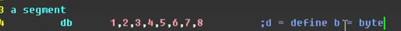
db即定义字节型数据

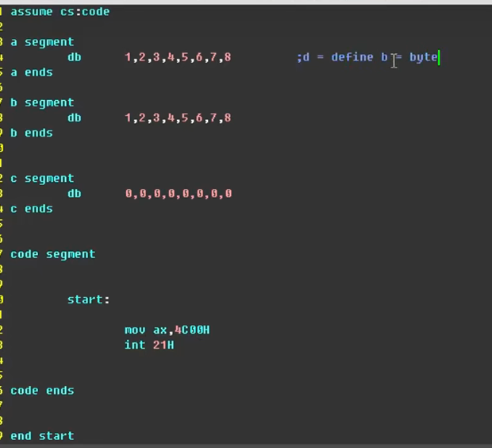

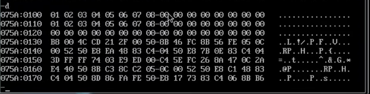

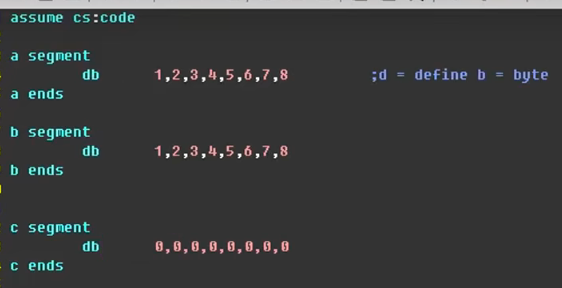
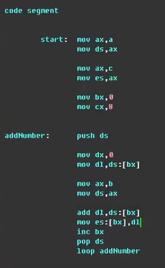

首先看数据从哪里来

在mov AX，c后，c是一组segment的0，（用表明栈）
Mov ES，AX
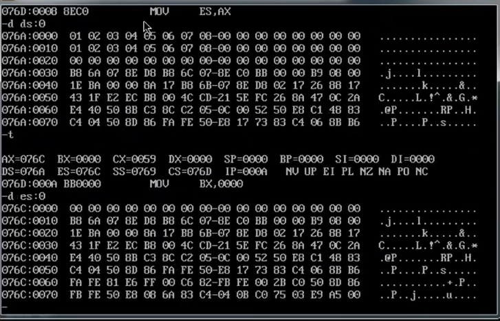
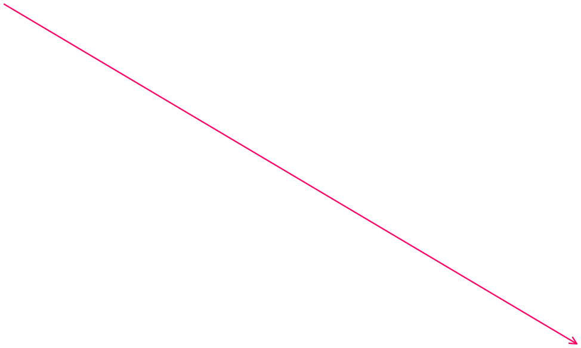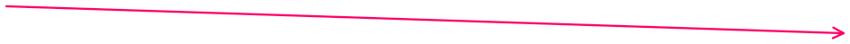
都是字节型数据

1、将a段的数据存入ax寄存器
2、让ds段地址寄存器指向a段

1、先将ds的地址存储起来
2、将dx寄存器的值置为0
3、将ds:\[0\]的值放入dl寄存器
4、将b段数据放入ax寄存器
5、让ds指向b段数据
6、将b段数据的ds:\[0\]与dl相加，并将结果放入dl寄存器
7、将bl寄存器的值放入类似于栈的es:\[0\]
8、bx寄存器中的值加1
9、通过pop ds，让ds寄存器指向初始位置
10、循环

==如果以es所在段为第一行==
==那么段地址指向 076C==

==076A\*10+10 = 076B==
==076A\*10+20 = 076C==

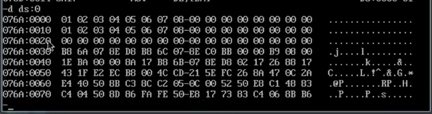

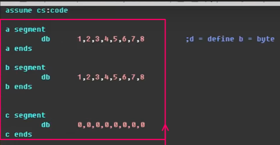
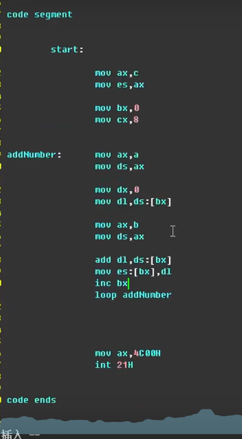

如果是pop出来那么最后循环结束之后，ds是最初设置的值

如果是上述循环，那么最后循环结束后，ds的值发生变化
如要查看最初的值，那么需要命令
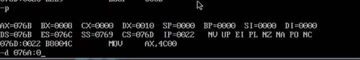

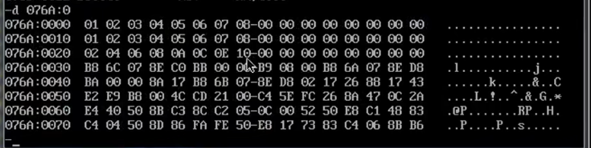

==如果以es所在段为第一行==
==那么段地址指向 076C==

==076A\*10+10 = 076B==
==076A\*10+20 = 076C==

每一次题目开始前，都要看一下内存的分配？？？

第二题
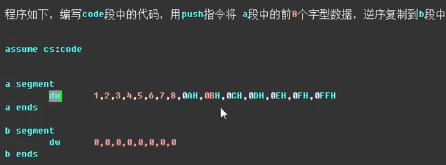

每一次题目开始前，都要看一下内存的分配？？？

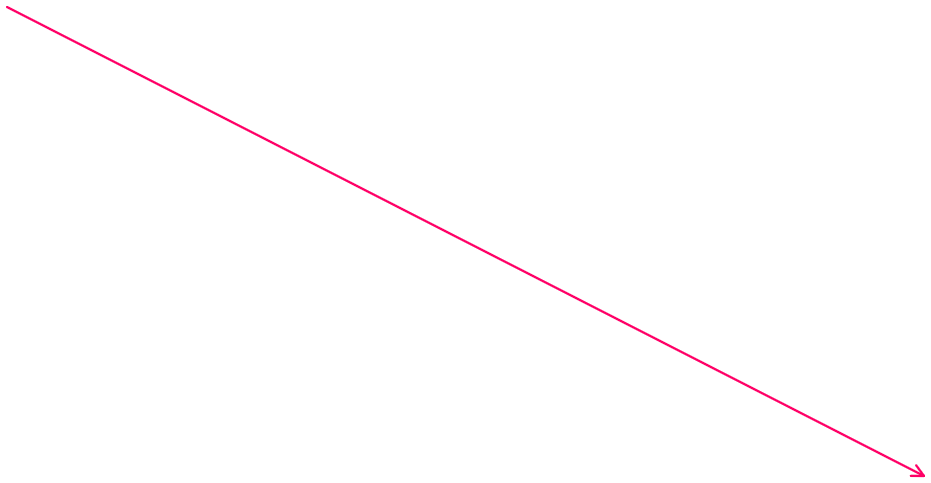
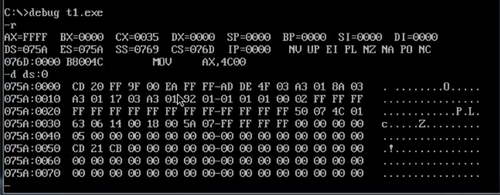
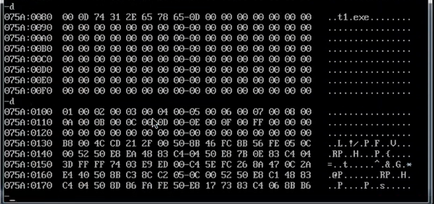

此处将数据分配到了 DS:\[100\] 的位置

代码如下：

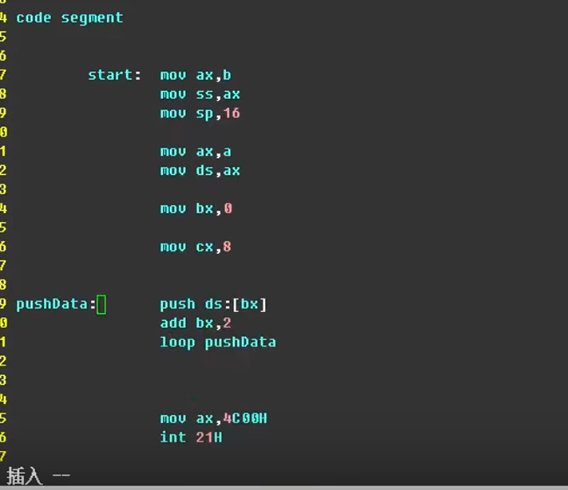

栈的数据
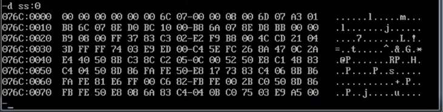

运行结果：用ds寄存器查看
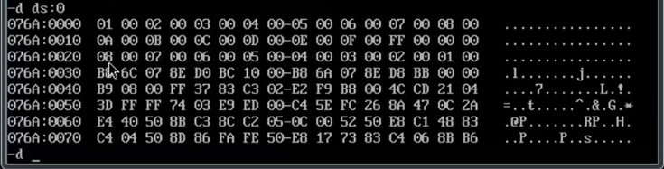

运行结果：用ss寄存器查看
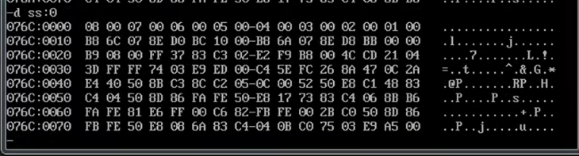

综上：  
076A\*10H + 20H = 076C\*10H + 0H

栈的设置

让ds:\[0\] 变为数据的开始位置
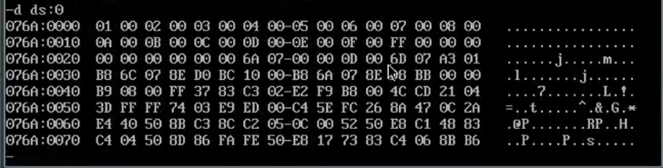

数据从栈底开始存储，即从右下角开始存储

