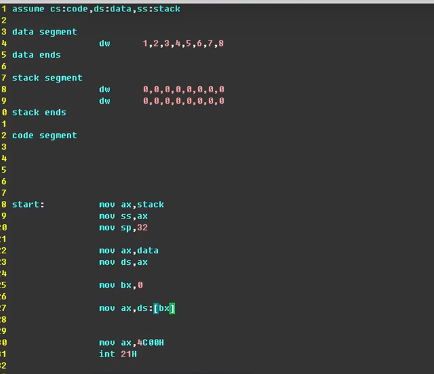

编译(masm)与链接(link)
会得到exe文件
系统根据exe文件中的一些描述信息 进行内存分配

1、简单数据访问

2、设置自己的栈

==由SS:10开始是栈设置的初始位置==

以上的代码，都占用了IP寄存器变化的范围，间接的减少了指令的数目

所以引入 数据段 与 栈段

在debug中的变化似乎并不怎么大

==很重要的一点：==

==还有很重要的一点是==
==段再怎么变化都是16 的倍数==

存放在cs的起始位置，或者说这样写的都存放在cs的起始位置

访问数据这种格式比较好

然后start是程序指令的入口
CS:IP中的IP由start指出的位置开始

因为内存是连续的
为栈开辟的内存空间是在第一行数据之后的
所以栈的大小要设置成48，每行16个字节

Db是按照字节型数据存储
dw是按照字型数据存储

==还有很重要的一点是==
==段再怎么变化都是16 的倍数==

因为栈单独开辟了一个数据段
所以需要多少申请多少即可

此处是让ds寄存器的开始位置指向自己设置的data数据

貌似这里的data 与 stack、
都是一些变量名，可以随意设置
只是便于阅读更好一些

