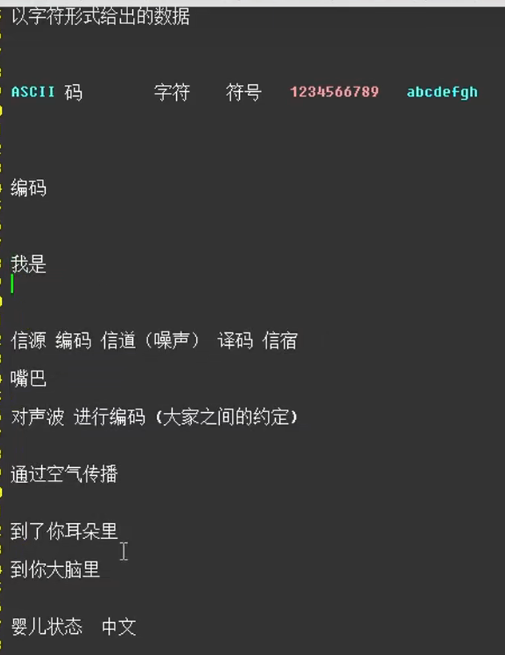
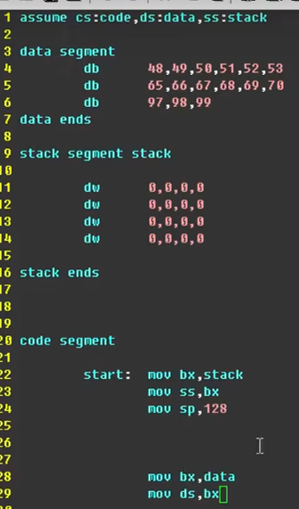
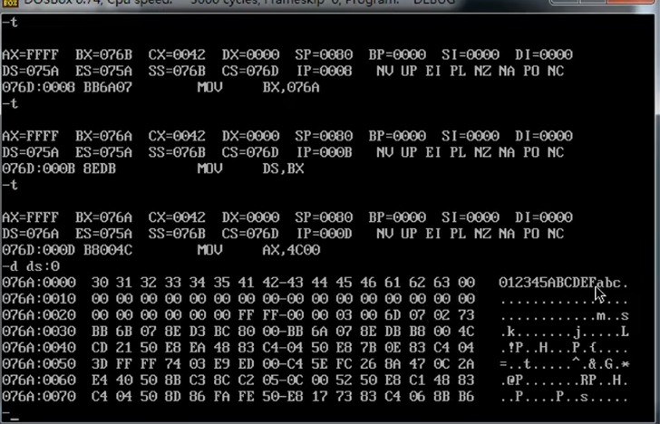
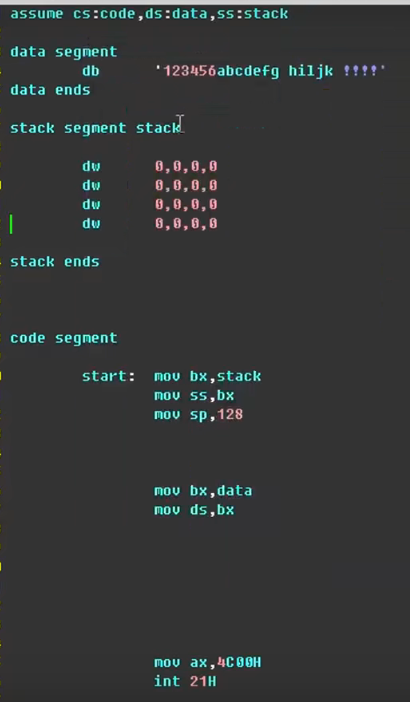
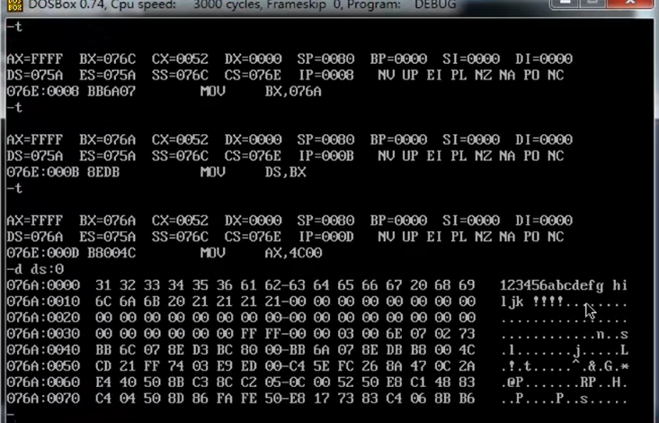
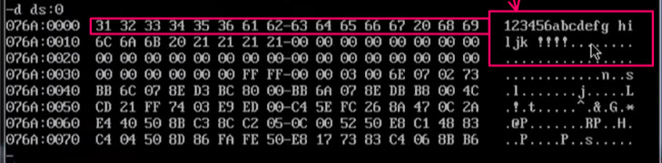
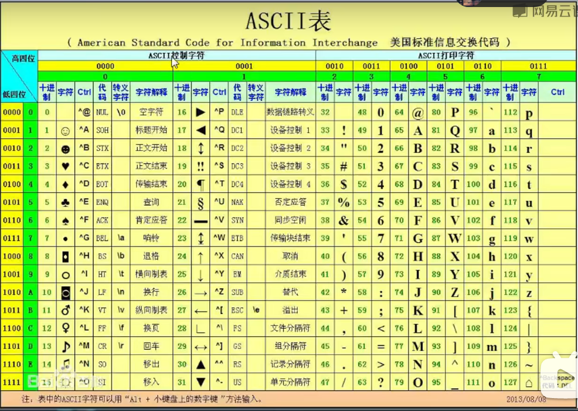
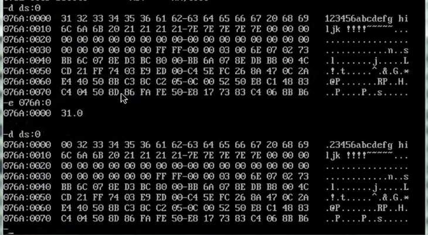
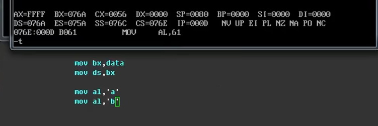
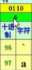

ASXII码应用实例

不使用数字进行转换
直接输入字符串，但是这里要使用单引号

但是没有高明白这里ds寄存器里面的值的变化

一堆数据 一堆数据对应的ASCII码

黄色图框里是二进制
绿色图框里是十六进制
浅黄色的绿色数字是十进制

ASCII控制字符不可以在debug中显示出来
ASCII控制字符可以在debug中显示出来

如下

如下当输入的是向某一个寄存器中输入ASCII码时，在数据中显示的是对应的数字数据

十六进制的61对应的是
十进制的97

