利用内存的排列的规律，节省内存空间
通过如下方式访问内存
段地址+【偏移地址+数字】
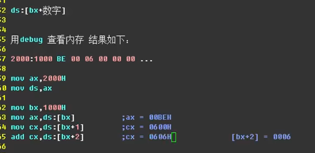

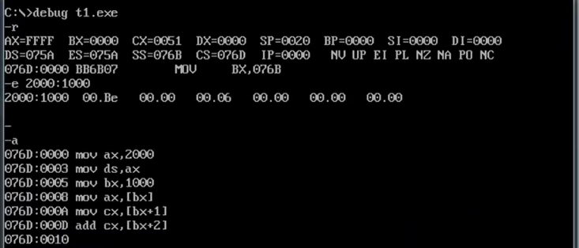

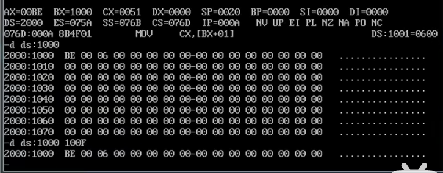

偏移位分别位1000 1001 1002 1003
00BE 0600 0006 0000

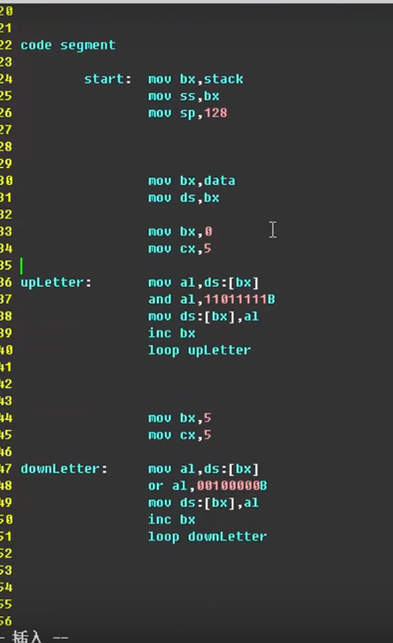
如下代码段是占用内存空间的，用一种方法减少占用

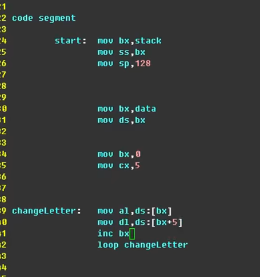
修改过后，可以直接访问第一行的某一个字母
以及这个字母所对应的字母

修改后的完整代码
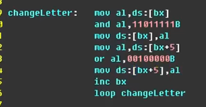

前面题目的优化
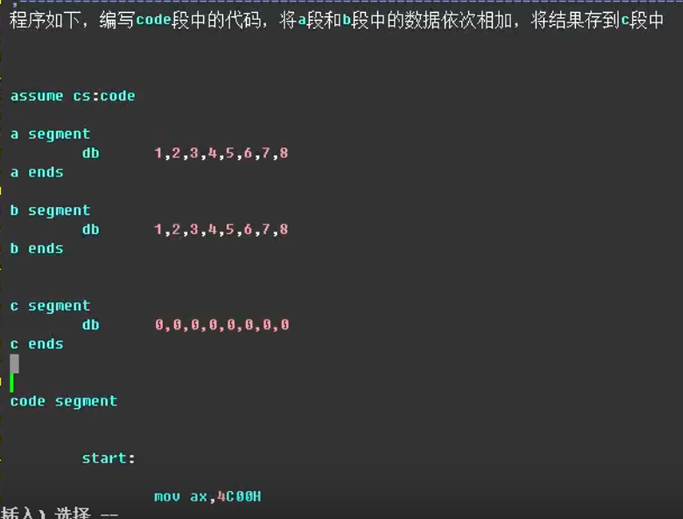

观察内存分配
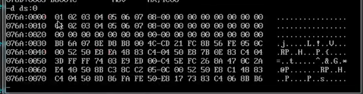

节约了很多内存
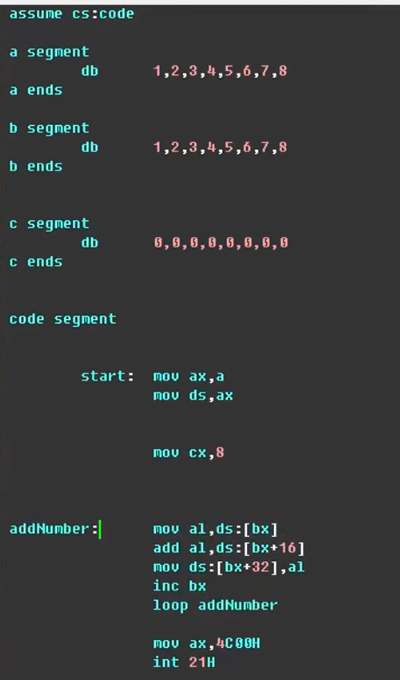

==再一次观察内存分配==
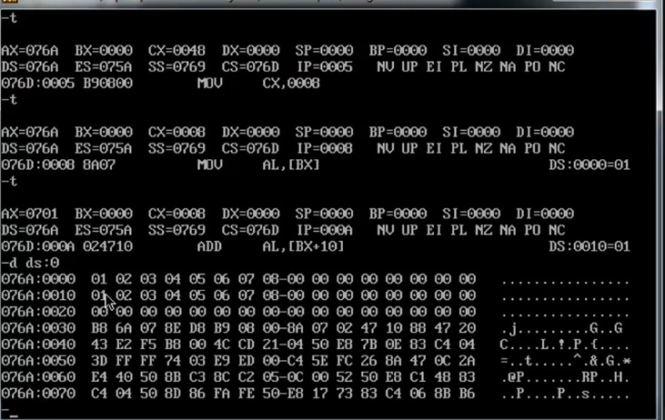

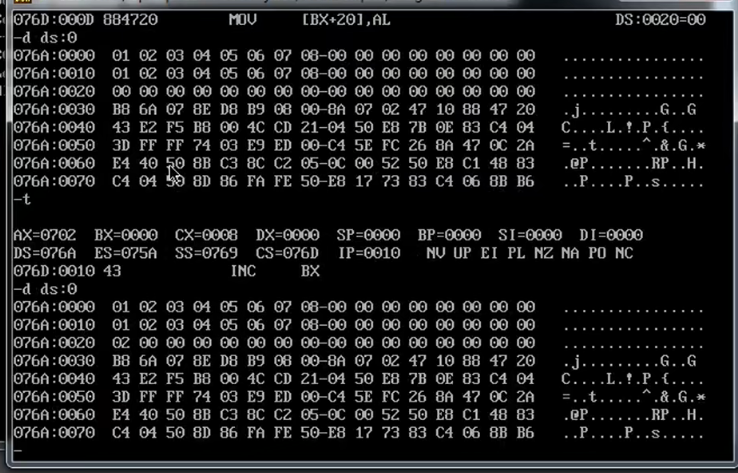

每一段都要占用16个字节

